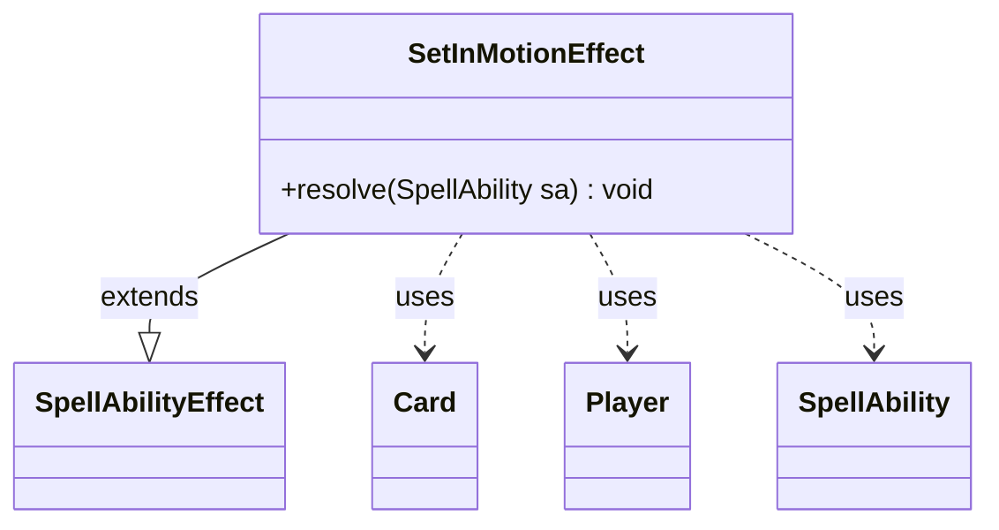

---
aliases:
  - SetInMotionEffect
tags:
  - java/class
  - module/forge-game
  - pkg/forge/game/ability/effects
fqn: forge.game.ability.effects.SetInMotionEffect
package: forge.game.ability.effects
module: forge-game
kind: Class
---

# SetInMotionEffect

**Package:** `forge.game.ability.effects` &nbsp; **Module:** `forge-game` &nbsp; **Kind:** Class



## Relationships
**Extends:**
- [[forge.game.ability.SpellAbilityEffect|SpellAbilityEffect]]
**Uses:**
- [[forge.game.card.Card|Card]]
- [[forge.game.player.Player|Player]]
- [[forge.game.spellability.SpellAbility|SpellAbility]]

## Design Description

SetInMotionEffect implements the resolution logic for spell abilities that activate an Archenemy scheme card, extending `SpellAbilityEffect` to plug into Forge's ability-resolution framework via its overridden `resolve(SpellAbility)` method. It reads the host `Card` to determine the controlling `Player`, then delegates the scheme-activation mechanics to that player.

The class supports two optional parameters that make it data-driven rather than hard-coded: `RepeatNum` (resolved through `AbilityUtils.calculateAmount` to allow dynamic counts) loops the activation, while `Again` distinguishes setting a fresh scheme in motion from re-triggering the player's current active scheme via `setSchemeInMotion`. This keeps the effect a thin, declarative adapter that defers all state changes to the `Player` model, consistent with the effect-class pattern used throughout the package.

## Source
`forge-game/src/main/java/forge/game/ability/effects/SetInMotionEffect.java`

```java
package forge.game.ability.effects;

import forge.game.ability.AbilityUtils;
import forge.game.ability.SpellAbilityEffect;
import forge.game.card.Card;
import forge.game.player.Player;
import forge.game.spellability.SpellAbility;

public class SetInMotionEffect extends SpellAbilityEffect {

    /* (non-Javadoc)
     * @see forge.card.abilityfactory.SpellEffect#resolve(java.util.Map, forge.card.spellability.SpellAbility)
     */
    @Override
    public void resolve(SpellAbility sa) {
        Card source = sa.getHostCard();
        Player controller = source.getController();
        boolean again = sa.hasParam("Again");

        int repeats = 1;
        if (sa.hasParam("RepeatNum")) {
            repeats = AbilityUtils.calculateAmount(source, sa.getParam("RepeatNum"), sa);
        }

        for (int i = 0; i < repeats; i++) {
            if (again) {
                controller.setSchemeInMotion(sa, controller.getActiveScheme());
            } else {
                controller.setSchemeInMotion(sa);
            }
        }
    }

}
```
