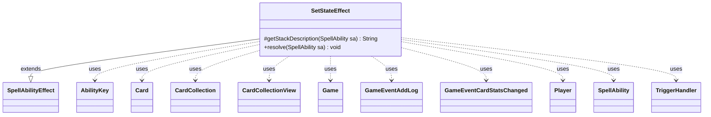

---
aliases:
  - SetStateEffect
tags:
  - java/class
  - module/forge-game
  - pkg/forge/game/ability/effects
fqn: forge.game.ability.effects.SetStateEffect
package: forge.game.ability.effects
module: forge-game
kind: Class
---

# SetStateEffect

**Package:** `forge.game.ability.effects`   **Module:** `forge-game`   **Kind:** Class



## Relationships
**Extends:**
- [[forge.game.ability.SpellAbilityEffect|SpellAbilityEffect]]
**Uses:**
- [[forge.game.Game|Game]]
- [[forge.game.ability.AbilityKey|AbilityKey]]
- [[forge.game.card.Card|Card]]
- [[forge.game.card.CardCollection|CardCollection]]
- [[forge.game.card.CardCollectionView|CardCollectionView]]
- [[forge.game.event.GameEventAddLog|GameEventAddLog]]
- [[forge.game.event.GameEventCardStatsChanged|GameEventCardStatsChanged]]
- [[forge.game.player.Player|Player]]
- [[forge.game.spellability.SpellAbility|SpellAbility]]
- [[forge.game.trigger.TriggerHandler|TriggerHandler]]

## Design Description

`SetStateEffect` is a `SpellAbilityEffect` subclass that resolves abilities which change a card's face or state — transforming, flipping, turning face up/down, morphing/manifesting/disguising/cloaking, and specializing/unspecializing. It overrides `getStackDescription` to build the on-stack text and `resolve` to perform the state change on each affected `Card`.

For every target (either explicitly targeted cards or a `CardCollection` chosen via the controller), it validates that the card is still the same game object, is in a legal zone, and can legally change state, applying mode-specific guards for face-down permanents, merged cards, and self-transform alignment. On success it delegates to the card's own state-change methods, fires `GameEventCardStatsChanged`/`GameEventAddLog` for UI and log feedback, optionally remembers changed cards, and runs `Specializes` triggers through the `TriggerHandler`. The design centralizes all card-state transitions behind a single data-driven `Mode` parameter rather than separate effect classes.

## Source
`forge-game/src/main/java/forge/game/ability/effects/SetStateEffect.java`

```java
package forge.game.ability.effects;

import forge.card.CardStateName;
import forge.game.Game;
import forge.game.GameLogEntryType;
import forge.game.ability.AbilityKey;
import forge.game.ability.AbilityUtils;
import forge.game.ability.SpellAbilityEffect;
import forge.game.card.*;
import forge.game.event.GameEventAddLog;
import forge.game.event.GameEventCardStatsChanged;
import forge.game.keyword.Keyword;
import forge.game.player.Player;
import forge.game.player.PlayerActionConfirmMode;
import forge.game.trigger.TriggerHandler;
import forge.game.trigger.TriggerType;
import forge.game.spellability.SpellAbility;
import forge.game.zone.ZoneType;
import forge.util.Lang;
import forge.util.Localizer;
import forge.util.TextUtil;

import java.util.Map;

public class SetStateEffect extends SpellAbilityEffect {

    @Override
    protected String getStackDescription(final SpellAbility sa) {
        final Card host = sa.getHostCard();
        final StringBuilder sb = new StringBuilder();
        boolean specialize = sa.getParam("Mode").equals("Specialize");

        if (sa.hasParam("Flip")) {
            sb.append("Flip ");
        } else if (specialize) { // verb will come later
        } else {
            sb.append("Transform ");
        }

        sb.append(Lang.joinHomogenous(getTargetCards(sa)));
        if (specialize) {
            sb.append(" perpetually specializes into ");
            sb.append(host.hasChosenColor() ? host.getChosenColor() : "the chosen color");
        }
        sb.append(".");
        return sb.toString();
    }

    @Override
    public void resolve(final SpellAbility sa) {
        final Player p = sa.getActivatingPlayer();
        final String mode = sa.getParam("Mode");
        final Card host = sa.getHostCard();
        final Game game = host.getGame();

        final boolean remChanged = sa.hasParam("RememberChanged");
        final boolean optional = sa.hasParam("Optional");
        final CardCollection transformedCards = new CardCollection();

        CardCollectionView cardsToTransform;
        if (sa.hasParam("Choices")) {
            CardCollectionView choices = CardLists.getValidCards(game.getCardsIn(ZoneType.Battlefield), sa.getParam("Choices"), p, host, sa);

            final int validAmount = AbilityUtils.calculateAmount(host, sa.getParamOrDefault("Amount", "1"), sa);
            final int minAmount = sa.hasParam("MinAmount") ? Integer.parseInt(sa.getParam("MinAmount")) : validAmount;

            if (validAmount <= 0) {
                return;
            }

            String title = sa.hasParam("ChoiceTitle") ? sa.getParam("ChoiceTitle") :
                    Localizer.getInstance().getMessage("lblChooseaCard") + " ";
            cardsToTransform = p.getController().chooseCardsForEffect(choices, sa, title, minAmount, validAmount,
                    !sa.hasParam("Mandatory"), null);
        } else {
            cardsToTransform = getTargetCards(sa);
        }

        for (final Card tgtCard : cardsToTransform) {
            // check if the object is still in game or if it was moved
            Card gameCard = game.getCardState(tgtCard, null);
            // gameCard is LKI in that case, the card is not in game anymore
            // or the timestamp did change
            // this should check Self too
            if (gameCard == null || !tgtCard.equalsWithGameTimestamp(gameCard)) {
                continue;
            }

            // Cards which are not on the battlefield should not be able to transform.
            // TurnFace should be allowed in other zones like Exile too
            // Specialize and Unspecialize are allowed in other zones
            if (!"TurnFaceUp".equals(mode) && !"TurnFaceDown".equals(mode) && !"Unspecialize".equals(mode) && !"Specialize".equals(mode)
                    && !gameCard.isInPlay() && !sa.hasParam("ETB")) {
                continue;
            }

            if (sa.hasParam("RevealFirst")) {
                Card lki = CardCopyService.getLKICopy(tgtCard);
                lki.forceTurnFaceUp();
                game.getAction().reveal(new CardCollection(lki), lki.getOwner(), true, Localizer.getInstance().getMessage("lblRevealFaceDownCards"));
                if (sa.hasParam("ValidNewFace") && !lki.isValid(sa.getParam("ValidNewFace").split(","), p, host, sa)) {
                    continue;
                }
            }

            // facedown cards that are not Permanent, can't turn faceup there
            if ("TurnFaceUp".equals(mode) && gameCard.isFaceDown() && gameCard.isInPlay()) {
                if (gameCard.hasMergedCard()) {
                    boolean hasNonPermanent = false;
                    Card nonPermanentCard = null;
                    for (final Card c : gameCard.getMergedCards()) {
                        if (!c.getState(CardStateName.Original).getType().isPermanent()) {
                            hasNonPermanent = true;
                            nonPermanentCard = c;
                            break;
                        }
                    }
                    if (hasNonPermanent) {
                        Card lki = CardCopyService.getLKICopy(nonPermanentCard);
                        lki.forceTurnFaceUp();
                        game.getAction().reveal(new CardCollection(lki), lki.getOwner(), true, Localizer.getInstance().getMessage("lblFaceDownCardCantTurnFaceUp"));
                        continue;
                    }
                } else if (!gameCard.getState(CardStateName.Original).getType().isPermanent()) {
                    Card lki = CardCopyService.getLKICopy(gameCard);
                    lki.forceTurnFaceUp();
                    game.getAction().reveal(new CardCollection(lki), lki.getOwner(), true, Localizer.getInstance().getMessage("lblFaceDownCardCantTurnFaceUp"));
                    continue;
                }
            }

            // Merged faceup permanent that have double faced cards can't turn face down
            if ("TurnFaceDown".equals(mode) && !gameCard.isFaceDown() && gameCard.isInPlay()
                    && gameCard.hasMergedCard()) {
                boolean hasBackSide = false;
                for (final Card c : gameCard.getMergedCards()) {
                    if (c.isDoubleFaced()) {
                        hasBackSide = true;
                        break;
                    }
                }
                if (hasBackSide) {
                    continue;
                }
            }

            // for reasons it can't transform, skip
            if ("Transform".equals(mode) && !gameCard.canTransform(sa)) {
                continue;
            }

            if ("Transform".equals(mode) && gameCard.equals(host) && sa.hasSVar("StoredTransform")) {
                // If want to Transform, and host is trying to transform self, skip if not in alignment
                boolean skip = gameCard.getTransformedTimestamp() != Long.parseLong(sa.getSVar("StoredTransform"));
                // Clear SVar from SA so it doesn't get reused accidentally
                sa.removeSVar("StoredTransform");
                if (skip) {
                    continue;
                }
            }

            if (optional) {
                String message = TextUtil.concatWithSpace("Transform", gameCard.getDisplayName(), "?");
                if (!p.getController().confirmAction(sa, PlayerActionConfirmMode.Random, message, null)) {
                    return;
                }
            }

            boolean hasTransformed = false;
            if (sa.isTurnFaceUp()) {
                hasTransformed = gameCard.turnFaceUp(sa);
            } else if ("Specialize".equals(mode)) {
                hasTransformed = gameCard.changeCardState(mode, host.getChosenColor(), sa);
                host.setChosenColors(null);
            } else {
                hasTransformed = gameCard.changeCardState(mode, sa.getParam("NewState"), sa);
                if (hasTransformed && (sa.hasParam("FaceDownPower") || sa.hasParam("FaceDownToughness")
                        || sa.hasParam("FaceDownSetType"))) {
                    CardFactoryUtil.setFaceDownState(gameCard, sa);
                }
            }
            if (hasTransformed) {
                if (sa.isMorphUp()) {
                    String sb = p + " has unmorphed " + gameCard.getDisplayName();
                    game.fireEvent(new GameEventAddLog(GameLogEntryType.STACK_RESOLVE, sb));
                } else if (sa.isManifestUp()) {
                    String sb = p + " has unmanifested " + gameCard.getDisplayName();
                    game.fireEvent(new GameEventAddLog(GameLogEntryType.STACK_RESOLVE, sb));
                } else if (sa.isDisguiseUp()) {
                    String sb = p + " has undisguised " + gameCard.getDisplayName();
                    game.fireEvent(new GameEventAddLog(GameLogEntryType.STACK_RESOLVE, sb));
                } else if (sa.isCloakUp()) {
                    String sb = p + " has uncloaked " + gameCard.getDisplayName();
                    game.fireEvent(new GameEventAddLog(GameLogEntryType.STACK_RESOLVE, sb));
                } else if (sa.isKeyword(Keyword.DOUBLE_AGENDA)) {
                    String sb = p + " has revealed " + gameCard.getDisplayName() + " with the chosen names: " + gameCard.getNamedCards();
                    game.fireEvent(new GameEventAddLog(GameLogEntryType.STACK_RESOLVE, sb));
                } else if (sa.isKeyword(Keyword.HIDDEN_AGENDA)) {
                    String sb = p + " has revealed " + gameCard.getDisplayName() + " with the chosen name " + gameCard.getNamedCard();
                    game.fireEvent(new GameEventAddLog(GameLogEntryType.STACK_RESOLVE, sb));
                }
                game.fireEvent(new GameEventCardStatsChanged(gameCard));
                if (remChanged) {
                    host.addRemembered(gameCard);
                }
                if (!gameCard.isTransformable())
                    transformedCards.add(gameCard);
                if ("Specialize".equals(mode)) {
                    gameCard.setSpecialized(true);
                    //run Specializes trigger
                    final TriggerHandler th = game.getTriggerHandler();
                    th.clearActiveTriggers(gameCard, null);
                    th.registerActiveTrigger(gameCard, false);
                    final Map<AbilityKey, Object> runParams = AbilityKey.mapFromCard(gameCard);
                    th.runTrigger(TriggerType.Specializes, runParams, false);
                } else if ("Unspecialize".equals(mode)) {
                    gameCard.setSpecialized(false);
                }
            }
        }
        if (!transformedCards.isEmpty()) {
            game.getAction().reveal(transformedCards, p, true, "Transformed cards in ");
        }
    }
}
```

## Python
`forge/game/ability/effects/SetStateEffect.py`

```python
from forge.card.CardStateName import CardStateName
from forge.game.Game import Game
from forge.game.GameLogEntryType import GameLogEntryType
from forge.game.ability.AbilityKey import AbilityKey
from forge.game.ability.AbilityUtils import AbilityUtils
from forge.game.ability.SpellAbilityEffect import SpellAbilityEffect
from forge.game.card.Card import Card
from forge.game.card.CardCollection import CardCollection
from forge.game.card.CardCollectionView import CardCollectionView
from forge.game.card.CardLists import CardLists
from forge.game.card.CardCopyService import CardCopyService
from forge.game.card.CardFactoryUtil import CardFactoryUtil
from forge.game.event.GameEventAddLog import GameEventAddLog
from forge.game.event.GameEventCardStatsChanged import GameEventCardStatsChanged
from forge.game.keyword.Keyword import Keyword
from forge.game.player.Player import Player
from forge.game.player.PlayerActionConfirmMode import PlayerActionConfirmMode
from forge.game.trigger.TriggerHandler import TriggerHandler
from forge.game.trigger.TriggerType import TriggerType
from forge.game.spellability.SpellAbility import SpellAbility
from forge.game.zone.ZoneType import ZoneType
from forge.util.Lang import Lang
from forge.util.Localizer import Localizer
from forge.util.TextUtil import TextUtil


class SetStateEffect(SpellAbilityEffect):

    def getStackDescription(self, sa: SpellAbility) -> str:
        host = sa.getHostCard()
        sb = []
        specialize = sa.getParam("Mode") == "Specialize"

        if sa.hasParam("Flip"):
            sb.append("Flip ")
        elif specialize:  # verb will come later
            pass
        else:
            sb.append("Transform ")

        sb.append(Lang.joinHomogenous(self.getTargetCards(sa)))
        if specialize:
            sb.append(" perpetually specializes into ")
            sb.append(host.getChosenColor() if host.hasChosenColor() else "the chosen color")
        sb.append(".")
        return "".join(str(x) for x in sb)

    def resolve(self, sa: SpellAbility) -> None:
        p = sa.getActivatingPlayer()
        mode = sa.getParam("Mode")
        host = sa.getHostCard()
        game = host.getGame()

        remChanged = sa.hasParam("RememberChanged")
        optional = sa.hasParam("Optional")
        transformedCards = CardCollection()

        if sa.hasParam("Choices"):
            choices = CardLists.getValidCards(game.getCardsIn(ZoneType.Battlefield), sa.getParam("Choices"), p, host, sa)

            validAmount = AbilityUtils.calculateAmount(host, sa.getParamOrDefault("Amount", "1"), sa)
            minAmount = int(sa.getParam("MinAmount")) if sa.hasParam("MinAmount") else validAmount

            if validAmount <= 0:
                return

            title = sa.getParam("ChoiceTitle") if sa.hasParam("ChoiceTitle") else \
                Localizer.getInstance().getMessage("lblChooseaCard") + " "
            cardsToTransform = p.getController().chooseCardsForEffect(choices, sa, title, minAmount, validAmount,
                    not sa.hasParam("Mandatory"), None)
        else:
            cardsToTransform = self.getTargetCards(sa)

        for tgtCard in cardsToTransform:
            # check if the object is still in game or if it was moved
            gameCard = game.getCardState(tgtCard, None)
            # gameCard is LKI in that case, the card is not in game anymore
            # or the timestamp did change
            # this should check Self too
            if gameCard is None or not tgtCard.equalsWithGameTimestamp(gameCard):
                continue

            # Cards which are not on the battlefield should not be able to transform.
            # TurnFace should be allowed in other zones like Exile too
            # Specialize and Unspecialize are allowed in other zones
            if mode != "TurnFaceUp" and mode != "TurnFaceDown" and mode != "Unspecialize" and mode != "Specialize" \
                    and not gameCard.isInPlay() and not sa.hasParam("ETB"):
                continue

            if sa.hasParam("RevealFirst"):
                lki = CardCopyService.getLKICopy(tgtCard)
                lki.forceTurnFaceUp()
                game.getAction().reveal(CardCollection(lki), lki.getOwner(), True, Localizer.getInstance().getMessage("lblRevealFaceDownCards"))
                if sa.hasParam("ValidNewFace") and not lki.isValid(sa.getParam("ValidNewFace").split(","), p, host, sa):
                    continue

            # facedown cards that are not Permanent, can't turn faceup there
            if mode == "TurnFaceUp" and gameCard.isFaceDown() and gameCard.isInPlay():
                if gameCard.hasMergedCard():
                    hasNonPermanent = False
                    nonPermanentCard = None
                    for c in gameCard.getMergedCards():
                        if not c.getState(CardStateName.Original).getType().isPermanent():
                            hasNonPermanent = True
                            nonPermanentCard = c
                            break
                    if hasNonPermanent:
                        lki = CardCopyService.getLKICopy(nonPermanentCard)
                        lki.forceTurnFaceUp()
                        game.getAction().reveal(CardCollection(lki), lki.getOwner(), True, Localizer.getInstance().getMessage("lblFaceDownCardCantTurnFaceUp"))
                        continue
                elif not gameCard.getState(CardStateName.Original).getType().isPermanent():
                    lki = CardCopyService.getLKICopy(gameCard)
                    lki.forceTurnFaceUp()
                    game.getAction().reveal(CardCollection(lki), lki.getOwner(), True, Localizer.getInstance().getMessage("lblFaceDownCardCantTurnFaceUp"))
                    continue

            # Merged faceup permanent that have double faced cards can't turn face down
            if mode == "TurnFaceDown" and not gameCard.isFaceDown() and gameCard.isInPlay() \
                    and gameCard.hasMergedCard():
                hasBackSide = False
                for c in gameCard.getMergedCards():
                    if c.isDoubleFaced():
                        hasBackSide = True
                        break
                if hasBackSide:
                    continue

            # for reasons it can't transform, skip
            if mode == "Transform" and not gameCard.canTransform(sa):
                continue

            if mode == "Transform" and gameCard == host and sa.hasSVar("StoredTransform"):
                # If want to Transform, and host is trying to transform self, skip if not in alignment
                skip = gameCard.getTransformedTimestamp() != int(sa.getSVar("StoredTransform"))
                # Clear SVar from SA so it doesn't get reused accidentally
                sa.removeSVar("StoredTransform")
                if skip:
                    continue

            if optional:
                message = TextUtil.concatWithSpace("Transform", gameCard.getDisplayName(), "?")
                if not p.getController().confirmAction(sa, PlayerActionConfirmMode.Random, message, None):
                    return

            hasTransformed = False
            if sa.isTurnFaceUp():
                hasTransformed = gameCard.turnFaceUp(sa)
            elif mode == "Specialize":
                hasTransformed = gameCard.changeCardState(mode, host.getChosenColor(), sa)
                host.setChosenColors(None)
            else:
                hasTransformed = gameCard.changeCardState(mode, sa.getParam("NewState"), sa)
                if hasTransformed and (sa.hasParam("FaceDownPower") or sa.hasParam("FaceDownToughness")
                        or sa.hasParam("FaceDownSetType")):
                    CardFactoryUtil.setFaceDownState(gameCard, sa)
            if hasTransformed:
                if sa.isMorphUp():
                    sb = str(p) + " has unmorphed " + gameCard.getDisplayName()
                    game.fireEvent(GameEventAddLog(GameLogEntryType.STACK_RESOLVE, sb))
                elif sa.isManifestUp():
                    sb = str(p) + " has unmanifested " + gameCard.getDisplayName()
                    game.fireEvent(GameEventAddLog(GameLogEntryType.STACK_RESOLVE, sb))
                elif sa.isDisguiseUp():
                    sb = str(p) + " has undisguised " + gameCard.getDisplayName()
                    game.fireEvent(GameEventAddLog(GameLogEntryType.STACK_RESOLVE, sb))
                elif sa.isCloakUp():
                    sb = str(p) + " has uncloaked " + gameCard.getDisplayName()
                    game.fireEvent(GameEventAddLog(GameLogEntryType.STACK_RESOLVE, sb))
                elif sa.isKeyword(Keyword.DOUBLE_AGENDA):
                    sb = str(p) + " has revealed " + gameCard.getDisplayName() + " with the chosen names: " + str(gameCard.getNamedCards())
                    game.fireEvent(GameEventAddLog(GameLogEntryType.STACK_RESOLVE, sb))
                elif sa.isKeyword(Keyword.HIDDEN_AGENDA):
                    sb = str(p) + " has revealed " + gameCard.getDisplayName() + " with the chosen name " + str(gameCard.getNamedCard())
                    game.fireEvent(GameEventAddLog(GameLogEntryType.STACK_RESOLVE, sb))
                game.fireEvent(GameEventCardStatsChanged(gameCard))
                if remChanged:
                    host.addRemembered(gameCard)
                if not gameCard.isTransformable():
                    transformedCards.add(gameCard)
                if mode == "Specialize":
                    gameCard.setSpecialized(True)
                    # run Specializes trigger
                    th = game.getTriggerHandler()
                    th.clearActiveTriggers(gameCard, None)
                    th.registerActiveTrigger(gameCard, False)
                    runParams = AbilityKey.mapFromCard(gameCard)
                    th.runTrigger(TriggerType.Specializes, runParams, False)
                elif mode == "Unspecialize":
                    gameCard.setSpecialized(False)
        if not transformedCards.isEmpty():
            game.getAction().reveal(transformedCards, p, True, "Transformed cards in ")
```
