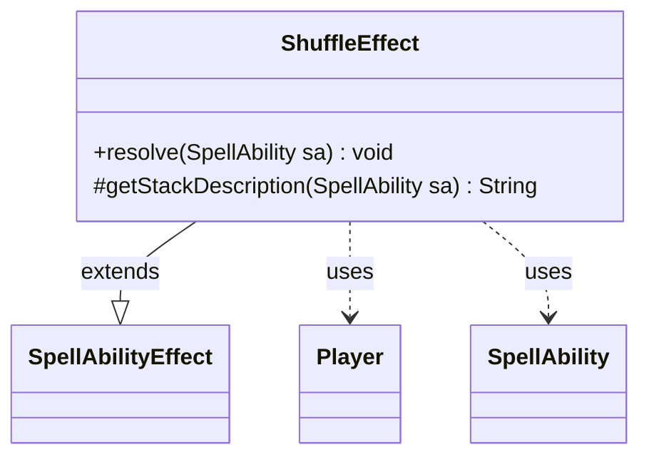

---
aliases:
  - ShuffleEffect
tags:
  - java/class
  - module/forge-game
  - pkg/forge/game/ability/effects
fqn: forge.game.ability.effects.ShuffleEffect
package: forge.game.ability.effects
module: forge-game
kind: Class
---

# ShuffleEffect

**Package:** `forge.game.ability.effects` &nbsp; **Module:** `forge-game` &nbsp; **Kind:** Class



## Relationships
**Extends:**
- [[forge.game.ability.SpellAbilityEffect|SpellAbilityEffect]]
**Uses:**
- [[forge.game.player.Player|Player]]
- [[forge.game.spellability.SpellAbility|SpellAbility]]

## Design Description

ShuffleEffect implements the resolution logic for spell and ability effects that shuffle one or more players' libraries. As a concrete subclass of `SpellAbilityEffect`, it overrides `resolve` to carry out the game action and `getStackDescription` to produce the human-readable stack text. During resolution it iterates over the effect's target players, skips any no longer in the game, and—when the effect is marked `Optional`—asks the activating player's controller to confirm before invoking `Player.shuffle`. It collaborates chiefly with `SpellAbility`, the carrier of parameters and targeting context, and `Player`, the entity acted upon. The design follows the engine's effect-handler pattern: each game keyword maps to a stateless, parameter-driven effect class, with optional-confirmation and localized prompts kept in the resolution path rather than in the shared base type.

## Source
`forge-game/src/main/java/forge/game/ability/effects/ShuffleEffect.java`

```java
package forge.game.ability.effects;

import java.util.Iterator;
import java.util.List;

import forge.game.ability.SpellAbilityEffect;
import forge.game.player.Player;
import forge.game.spellability.SpellAbility;
import forge.util.Localizer;

public class ShuffleEffect extends SpellAbilityEffect {

    @Override
    public void resolve(SpellAbility sa) {
        final boolean optional = sa.hasParam("Optional");

        for (final Player p : getTargetPlayers(sa)) {
            if (!p.isInGame()) {
                continue;
            }
            boolean mustShuffle = !optional || sa.getActivatingPlayer().getController().confirmAction(sa, null, Localizer.getInstance().getMessage("lblHaveTargetShuffle", p.getName()), null);
            if (mustShuffle)
                p.shuffle(sa);
        }
    }

    @Override
    protected String getStackDescription(SpellAbility sa) {
        final StringBuilder sb = new StringBuilder();

        final List<Player> tgtPlayers = getTargetPlayers(sa);

        if (tgtPlayers.size() > 0) {
            final Iterator<Player> it = tgtPlayers.iterator();
            while (it.hasNext()) {
                sb.append(it.next().getName());
                if (it.hasNext()) {
                    sb.append(" and ");
                }
            }
        } else {
            sb.append("Error - no target players for Shuffle. ");
        }
        sb.append(" shuffle");
        if (tgtPlayers.size() > 1) {
            sb.append(" their libraries");
        } else {
            sb.append("s their library");
        }
        sb.append(".");

        return sb.toString();
    }

}
```
