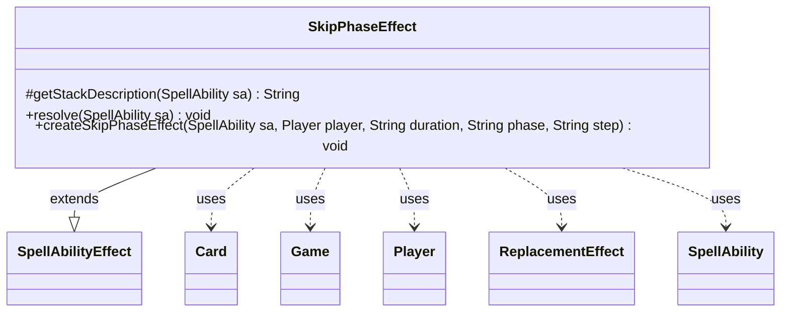

---
aliases:
  - SkipPhaseEffect
tags:
  - java/class
  - module/forge-game
  - pkg/forge/game/ability/effects
fqn: forge.game.ability.effects.SkipPhaseEffect
package: forge.game.ability.effects
module: forge-game
kind: Class
---

# SkipPhaseEffect

**Package:** `forge.game.ability.effects`   **Module:** `forge-game`   **Kind:** Class



## Relationships
**Extends:**
- [[forge.game.ability.SpellAbilityEffect|SpellAbilityEffect]]
**Uses:**
- [[forge.game.Game|Game]]
- [[forge.game.card.Card|Card]]
- [[forge.game.player.Player|Player]]
- [[forge.game.replacement.ReplacementEffect|ReplacementEffect]]
- [[forge.game.spellability.SpellAbility|SpellAbility]]

## Design Description

SkipPhaseEffect is a concrete `SpellAbilityEffect` implementing the game logic for abilities that cause a player to skip an upcoming phase or step (e.g. "skip your next combat phase"). It overrides `getStackDescription` to render a human-readable summary and `resolve` to apply the effect to each targeted player, delegating to the static `createSkipPhaseEffect` factory so the behavior can be reused by other callers.

The factory builds a command-zone effect Card on the host's `Game` and attaches a generated `BeginPhase` `ReplacementEffect` parsed from a script string, deliberately set to the `Control` layer so it precedes default "would begin your phase/step" replacements. It handles three duration modes — a one-shot skip that exiles itself after firing, a "this turn" variant, and a lasting effect cleaned up via an until-command — and optionally defers installation to the player's upkeep when `Start` is set, reflecting careful timing control over when and how long the skip applies.

## Source
`forge-game/src/main/java/forge/game/ability/effects/SkipPhaseEffect.java`

```java
package forge.game.ability.effects;

import forge.game.Game;
import forge.game.ability.AbilityFactory;
import forge.game.ability.SpellAbilityEffect;
import forge.game.card.Card;
import forge.game.player.Player;
import forge.game.replacement.ReplacementEffect;
import forge.game.replacement.ReplacementHandler;
import forge.game.replacement.ReplacementLayer;
import forge.game.spellability.SpellAbility;

public class SkipPhaseEffect extends SpellAbilityEffect {

    @Override
    protected String getStackDescription(SpellAbility sa) {
        final StringBuilder sb = new StringBuilder();
        final String duration = sa.getParam("Duration");
        final String phase = sa.getParam("Phase");
        final String step = sa.getParam("Step");

        for (final Player player : getTargetPlayers(sa)) {
            sb.append(player).append(" ");
            sb.append("skips their ");
            if (duration == null) {
                sb.append("next ");
            }
            if (phase != null) {
                sb.append(phase.toLowerCase()).append(" phase.");
            } else {
                sb.append(step.toLowerCase()).append(" step.");
            }
        }

        return sb.toString();
    }

    @Override
    public void resolve(SpellAbility sa) {
        final String duration = sa.getParam("Duration");
        final String phase = sa.getParam("Phase");
        final String step = sa.getParam("Step");

        for (final Player player : getTargetPlayers(sa)) {
            createSkipPhaseEffect(sa, player, duration, phase, step);
        }
    }

    public static void createSkipPhaseEffect(SpellAbility sa, final Player player,
            final String duration, final String phase, final String step) {
        final Card hostCard = sa.getHostCard();
        final Game game = hostCard.getGame();
        final String name = hostCard + "'s Effect";
        final String image = hostCard.getImageKey();
        final boolean isNextThisTurn = duration != null && duration.equals("NextThisTurn");

        final Card eff = createEffect(sa, player, name, image);

        final StringBuilder sb = new StringBuilder();
        sb.append("Event$ BeginPhase | ActiveZones$ Command | ValidPlayer$ You | Phase$ ");
        sb.append(phase != null ? phase : step);
        if (duration != null && !isNextThisTurn) {
            sb.append(" | Skip$ True");
        }
        sb.append("| Description$ Skip ");
        if (duration == null || isNextThisTurn) {
            sb.append("your next ");
        } else {
            sb.append("each ");
        }
        if (phase != null) {
            sb.append(phase.toLowerCase()).append(" phase");
        } else {
            sb.append(step.toLowerCase()).append(" step");
        }
        if (duration == null) {
            sb.append(".");
        } else {
            if (game.getPhaseHandler().getPlayerTurn().equals(player)) {
                sb.append(" of this turn.");
            } else {
                sb.append(" of your next turn.");
            }
        }

        final String repeffstr = sb.toString();
        ReplacementEffect re = ReplacementHandler.parseReplacement(repeffstr, eff, true);
        // Set to layer to Control so it will be applied before "would begin your X phase/step" replacement effects
        // (Any layer before Other is OK, since default layer is Other.)
        re.setLayer(ReplacementLayer.Control);
        if (duration == null || isNextThisTurn) {
            String exilestr = "DB$ ChangeZone | Defined$ Self | Origin$ Command | Destination$ Exile";
            SpellAbility exile = AbilityFactory.getAbility(exilestr, eff);
            re.setOverridingAbility(exile);
        }
        if (duration != null) {
            addUntilCommand(sa, () -> game.getAction().exileEffect(eff));
        }
        eff.addReplacementEffect(re);

        if (sa.hasParam("Start")) {
            game.getUpkeep().addUntil(player, () -> game.getAction().moveToCommand(eff, sa));
        } else {
            game.getAction().moveToCommand(eff, sa);
        }
    }
}
```

## Python
`forge/game/ability/effects/SkipPhaseEffect.py`

```python
from forge.game.Game import Game
from forge.game.ability.AbilityFactory import AbilityFactory
from forge.game.ability.SpellAbilityEffect import SpellAbilityEffect
from forge.game.card.Card import Card
from forge.game.player.Player import Player
from forge.game.replacement.ReplacementEffect import ReplacementEffect
from forge.game.replacement.ReplacementHandler import ReplacementHandler
from forge.game.replacement.ReplacementLayer import ReplacementLayer
from forge.game.spellability.SpellAbility import SpellAbility


class SkipPhaseEffect(SpellAbilityEffect):

    def getStackDescription(self, sa: SpellAbility) -> str:
        sb = []
        duration = sa.getParam("Duration")
        phase = sa.getParam("Phase")
        step = sa.getParam("Step")

        for player in self.getTargetPlayers(sa):
            sb.append(str(player))
            sb.append(" ")
            sb.append("skips their ")
            if duration is None:
                sb.append("next ")
            if phase is not None:
                sb.append(phase.lower())
                sb.append(" phase.")
            else:
                sb.append(step.lower())
                sb.append(" step.")

        return "".join(sb)

    def resolve(self, sa: SpellAbility) -> None:
        duration = sa.getParam("Duration")
        phase = sa.getParam("Phase")
        step = sa.getParam("Step")

        for player in self.getTargetPlayers(sa):
            SkipPhaseEffect.createSkipPhaseEffect(sa, player, duration, phase, step)

    @staticmethod
    def createSkipPhaseEffect(sa: SpellAbility, player: Player,
            duration: str, phase: str, step: str) -> None:
        hostCard = sa.getHostCard()
        game = hostCard.getGame()
        name = str(hostCard) + "'s Effect"
        image = hostCard.getImageKey()
        isNextThisTurn = duration is not None and duration == "NextThisTurn"

        eff = SkipPhaseEffect.createEffect(sa, player, name, image)

        sb = []
        sb.append("Event$ BeginPhase | ActiveZones$ Command | ValidPlayer$ You | Phase$ ")
        sb.append(phase if phase is not None else step)
        if duration is not None and not isNextThisTurn:
            sb.append(" | Skip$ True")
        sb.append("| Description$ Skip ")
        if duration is None or isNextThisTurn:
            sb.append("your next ")
        else:
            sb.append("each ")
        if phase is not None:
            sb.append(phase.lower())
            sb.append(" phase")
        else:
            sb.append(step.lower())
            sb.append(" step")
        if duration is None:
            sb.append(".")
        else:
            if game.getPhaseHandler().getPlayerTurn() == player:
                sb.append(" of this turn.")
            else:
                sb.append(" of your next turn.")

        repeffstr = "".join(sb)
        re = ReplacementHandler.parseReplacement(repeffstr, eff, True)
        # Set to layer to Control so it will be applied before "would begin your X phase/step" replacement effects
        # (Any layer before Other is OK, since default layer is Other.)
        re.setLayer(ReplacementLayer.Control)
        if duration is None or isNextThisTurn:
            exilestr = "DB$ ChangeZone | Defined$ Self | Origin$ Command | Destination$ Exile"
            exile = AbilityFactory.getAbility(exilestr, eff)
            re.setOverridingAbility(exile)
        if duration is not None:
            SkipPhaseEffect.addUntilCommand(sa, lambda: game.getAction().exileEffect(eff))
        eff.addReplacementEffect(re)

        if sa.hasParam("Start"):
            game.getUpkeep().addUntil(player, lambda: game.getAction().moveToCommand(eff, sa))
        else:
            game.getAction().moveToCommand(eff, sa)
```
