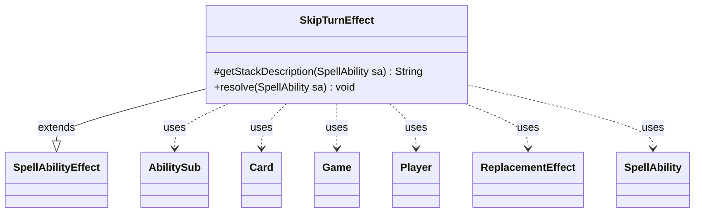

---
aliases:
  - SkipTurnEffect
tags:
  - java/class
  - module/forge-game
  - pkg/forge/game/ability/effects
fqn: forge.game.ability.effects.SkipTurnEffect
package: forge.game.ability.effects
module: forge-game
kind: Class
---

# SkipTurnEffect

**Package:** `forge.game.ability.effects` &nbsp; **Module:** `forge-game` &nbsp; **Kind:** Class



## Relationships
**Extends:**
- [[forge.game.ability.SpellAbilityEffect|SpellAbilityEffect]]
**Uses:**
- [[forge.game.Game|Game]]
- [[forge.game.card.Card|Card]]
- [[forge.game.player.Player|Player]]
- [[forge.game.replacement.ReplacementEffect|ReplacementEffect]]
- [[forge.game.spellability.AbilitySub|AbilitySub]]
- [[forge.game.spellability.SpellAbility|SpellAbility]]

## Design Description

SkipTurnEffect is a concrete spell-ability effect that causes one or more targeted players to skip their upcoming turns. Extending `SpellAbilityEffect`, it supplies a human-readable stack description and overrides `resolve` to enact the skip. Rather than mutating turn state directly, it expresses the behavior declaratively: for each target player it creates a Command-zone effect card carrying a `NumTurns` counter and a `BeginTurn` `ReplacementEffect` that intercepts and cancels turns. A subability decrements the counter each turn and exiles the effect once it reaches zero, giving the skip a self-limiting lifespan. Notably, the replacement is pinned to the `Control` layer so it applies ahead of other "would begin your turn" replacements. The design leans on Forge's script-string ability and replacement machinery, collaborating with `Game`, `Card`, `Player`, `AbilitySub`, and `ReplacementEffect` to integrate cleanly with the engine's resolution and replacement systems.

## Source
`forge-game/src/main/java/forge/game/ability/effects/SkipTurnEffect.java`

```java
package forge.game.ability.effects;

import forge.game.Game;
import forge.game.ability.AbilityFactory;
import forge.game.ability.AbilityUtils;
import forge.game.ability.SpellAbilityEffect;
import forge.game.card.Card;
import forge.game.player.Player;
import forge.game.replacement.ReplacementEffect;
import forge.game.replacement.ReplacementHandler;
import forge.game.replacement.ReplacementLayer;
import forge.game.spellability.AbilitySub;
import forge.game.spellability.SpellAbility;
import forge.util.Lang;

public class SkipTurnEffect extends SpellAbilityEffect {

    @Override
    protected String getStackDescription(SpellAbility sa) {
        final StringBuilder sb = new StringBuilder();
        final int numTurns = AbilityUtils.calculateAmount(sa.getHostCard(), sa.getParam("NumTurns"), sa);

        for (final Player player : getTargetPlayers(sa)) {
            sb.append(player).append(" ");
        }

        sb.append("skips his/her next ").append(numTurns).append(" turn(s).");
        return sb.toString();
    }

    @Override
    public void resolve(SpellAbility sa) {
        final Card hostCard = sa.getHostCard();
        final Game game = hostCard.getGame();
        final String name = hostCard + "'s Effect";
        final String image = hostCard.getImageKey();
        final int numTurns = AbilityUtils.calculateAmount(hostCard, sa.getParam("NumTurns"), sa);
        String repeffstr = "Event$ BeginTurn | ActiveZones$ Command | ValidPlayer$ You " +
        "| Description$ Skip your next " + (numTurns > 1 ? Lang.getNumeral(numTurns) + " turns." : "turn.");
        String effect = "DB$ StoreSVar | SVar$ NumTurns | Type$ CountSVar | Expression$ NumTurns/Minus.1";
        String exile = "DB$ ChangeZone | Defined$ Self | Origin$ Command | Destination$ Exile " +
        "| ConditionCheckSVar$ NumTurns | ConditionSVarCompare$ EQ0";

        for (final Player player : getTargetPlayers(sa)) {
            final Card eff = createEffect(sa, player, name, image);
            eff.setSVar("NumTurns", "Number$" + numTurns);
            SpellAbility calcTurn = AbilityFactory.getAbility(effect, eff);
            calcTurn.setSubAbility((AbilitySub) AbilityFactory.getAbility(exile, eff));

            ReplacementEffect re = ReplacementHandler.parseReplacement(repeffstr, eff, true);
            // Set to layer to Control so it will be applied before "would begin your turn" replacement effects
            // (Any layer before Other is OK, since default layer is Other.)
            re.setLayer(ReplacementLayer.Control);
            re.setOverridingAbility(calcTurn);
            eff.addReplacementEffect(re);

            game.getAction().moveToCommand(eff, sa);
        }
    }
}
```
