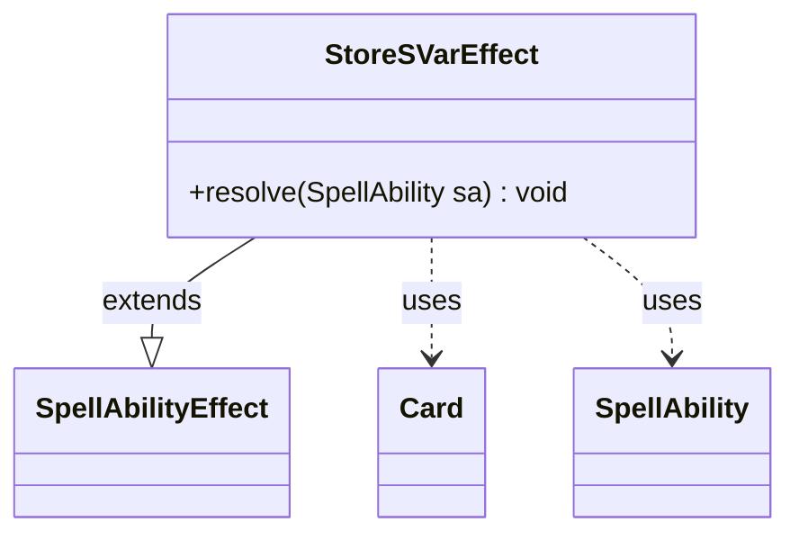

---
aliases:
  - StoreSVarEffect
tags:
  - java/class
  - module/forge-game
  - pkg/forge/game/ability/effects
fqn: forge.game.ability.effects.StoreSVarEffect
package: forge.game.ability.effects
module: forge-game
kind: Class
---

# StoreSVarEffect

**Package:** `forge.game.ability.effects` &nbsp; **Module:** `forge-game` &nbsp; **Kind:** Class



## Relationships
**Extends:**
- [[forge.game.ability.SpellAbilityEffect|SpellAbilityEffect]]
**Uses:**
- [[forge.game.card.Card|Card]]
- [[forge.game.spellability.SpellAbility|SpellAbility]]

## Design Description

StoreSVarEffect is a concrete ability-resolution handler that implements the engine's `SVar$` script keyword, computing an integer value and persisting it as a named storage variable (SVar) on the host card. Extending `SpellAbilityEffect`, it overrides `resolve(SpellAbility)` to read the `SVar`, `Type`, and `Expression` parameters from the resolving ability, validating that all three are present before proceeding. The `Type` parameter selects a calculation strategy—`Count`, `Number`, `CountSVar`, `Targeted`, `Triggered`, `Calculate`, or the accumulating `AdditiveForEach`—each delegating to `AbilityUtils` for the actual arithmetic over the source `Card`.

Notable design intent: the computed value is written back not only to the host card but propagated up the entire `SpellAbility` chain via `getRootAbility()` and `getSubAbility()`, ensuring the stored value is visible to sibling and parent abilities during a multi-step resolution. The strategy dispatch is an open `if/else` ladder with a TODO marking it as extensible for future types.

## Source
`forge-game/src/main/java/forge/game/ability/effects/StoreSVarEffect.java`

```java
package forge.game.ability.effects;

import forge.game.ability.AbilityKey;
import forge.game.ability.AbilityUtils;
import forge.game.ability.SpellAbilityEffect;
import forge.game.card.Card;
import forge.game.spellability.SpellAbility;
import forge.util.TextUtil;

public class StoreSVarEffect extends SpellAbilityEffect {

    @Override
    public void resolve(SpellAbility sa) {
        //SVar$ OldToughness | Type$ Count | Expression$ CardToughness
        Card source = sa.getHostCard();

        String key = null;
        String type = null;
        String expr = null;

        if (sa.hasParam("SVar")) {
            key = sa.getParam("SVar").equals("EachPlayer") ?
                    AbilityUtils.getDefinedPlayers(source, "Remembered", sa).get(0).toString() :
                    sa.getParam("SVar");
        }

        if (sa.hasParam("Type")) {
            type = sa.getParam("Type");
        }

        if (sa.hasParam("Expression")) {
            expr = sa.getParam("Expression");
        }

        if (key == null || type == null || expr == null) {
            System.out.println("SVar, Type and Expression parameters required for StoreSVar. They are missing for " + source.getName());
            return;
        }

        int value = 0;

        if (type.equals("Count")) {
            value = AbilityUtils.xCount(source, expr, sa);
        }
        else if (type.equals("Number")) {
            value = Integer.parseInt(expr);
        }
        else if (type.equals("CountSVar")) {
            if (expr.contains("/")) {
                final String exprMathVar = expr.split("\\/")[1].split("\\.")[1];
                int exprMath = AbilityUtils.calculateAmount(source, exprMathVar, sa);
                expr = TextUtil.fastReplace(expr, exprMathVar, Integer.toString(exprMath));
            }
            value = AbilityUtils.xCount(source, "SVar$" + expr, sa);
        } else if (type.equals("Targeted")) {
            value = AbilityUtils.handlePaid(sa.findTargetedCards(), expr, source, sa);
        } else if (type.equals("Triggered")) {
            Card trigCard = (Card)sa.getTriggeringObject(AbilityKey.Card);
            value = AbilityUtils.xCount(trigCard, expr, sa);
        } else if (type.equals("Calculate")) {
            value = AbilityUtils.calculateAmount(source, expr, sa);
        } else if (type.startsWith("AdditiveForEach")) {
            int current = source.hasSVar(key) ? AbilityUtils.calculateAmount(source, source.getSVar(key), sa) : 0;
            int toAdd = AbilityUtils.calculateAmount(source, expr, sa);
            value = current + toAdd;
        }
        //TODO For other types call a different function

        StringBuilder numBuilder = new StringBuilder();
        numBuilder.append("Number$");
        numBuilder.append(value);

        source.setSVar(key, numBuilder.toString());

        SpellAbility root = sa.getRootAbility();
        while (root != null) {
            root.setSVar(key, numBuilder.toString());
            root = root.getSubAbility();
        }
    }
}
```
