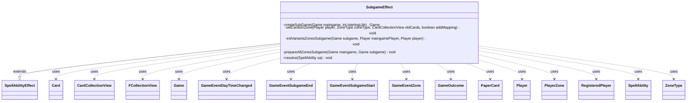

---
aliases:
  - SubgameEffect
tags:
  - java/class
  - module/forge-game
  - pkg/forge/game/ability/effects
fqn: forge.game.ability.effects.SubgameEffect
package: forge.game.ability.effects
module: forge-game
kind: Class
---

# SubgameEffect

**Package:** `forge.game.ability.effects` &nbsp; **Module:** `forge-game` &nbsp; **Kind:** Class



## Relationships
**Extends:**
- [[forge.game.ability.SpellAbilityEffect|SpellAbilityEffect]]
**Uses:**
- [[forge.game.Game|Game]]
- [[forge.game.GameOutcome|GameOutcome]]
- [[forge.game.card.Card|Card]]
- [[forge.game.card.CardCollectionView|CardCollectionView]]
- [[forge.game.event.GameEventDayTimeChanged|GameEventDayTimeChanged]]
- [[forge.game.event.GameEventSubgameEnd|GameEventSubgameEnd]]
- [[forge.game.event.GameEventSubgameStart|GameEventSubgameStart]]
- [[forge.game.event.GameEventZone|GameEventZone]]
- [[forge.game.player.Player|Player]]
- [[forge.game.player.RegisteredPlayer|RegisteredPlayer]]
- [[forge.game.spellability.SpellAbility|SpellAbility]]
- [[forge.game.zone.PlayerZone|PlayerZone]]
- [[forge.game.zone.ZoneType|ZoneType]]
- [[forge.item.PaperCard|PaperCard]]
- [[forge.util.collect.FCollectionView|FCollectionView]]

## Design Description

SubgameEffect implements the resolution of a spell or ability that plays out an entire nested game of Magic (a "subgame," per rule 720) inside an ongoing main game. As a concrete `SpellAbilityEffect` subclass, it overrides `resolve` to construct a fresh `Game` that reuses the main game's rules, match, and registered players, then mirrors each player's decks and variant zones (library, sideboard, schemes, planes, attractions, contraptions, Vanguard avatars, and commanders) into the subgame before starting it.

Its private helpers encode the rule-driven plumbing: cards are recreated from their `PaperCard` identities, a main-game-to-subgame mapping is retained so Wish-style effects can pull cards back, and tokens and copied spells are deliberately skipped. After the subgame ends, it determines winners, optionally records them via `RememberPlayers`, restores moved cards and displaced commanders to the main game's library, reshuffles, and fires `GameEventSubgameStart`/`End` and zone-refresh events so the UI stays consistent.

## Source
`forge-game/src/main/java/forge/game/ability/effects/SubgameEffect.java`

```java
package forge.game.ability.effects;

import java.util.Arrays;
import java.util.List;

import com.google.common.collect.Lists;

import forge.game.Game;
import forge.game.GameOutcome;
import forge.game.ability.AbilityKey;
import forge.game.ability.SpellAbilityEffect;
import forge.game.card.Card;
import forge.game.card.CardCollectionView;
import forge.game.event.EventValueChangeType;
import forge.game.event.GameEventDayTimeChanged;
import forge.game.event.GameEventSubgameEnd;
import forge.game.event.GameEventSubgameStart;
import forge.game.event.GameEventZone;
import forge.game.player.Player;
import forge.game.player.RegisteredPlayer;
import forge.game.spellability.SpellAbility;
import forge.game.zone.PlayerZone;
import forge.game.zone.ZoneType;
import forge.item.PaperCard;
import forge.util.Localizer;
import forge.util.collect.FCollectionView;

public class SubgameEffect extends SpellAbilityEffect {

    private Game createSubGame(Game maingame, int startingLife) {
        List<RegisteredPlayer> players = Lists.newArrayList();

        // Add remaining players to subgame
        for (Player p : maingame.getPlayers()) {
            players.add(p.getRegisteredPlayer());
        }

        return new Game(players, maingame.getRules(), maingame.getMatch(), maingame, startingLife);
    }

    private void setCardsInZone(Player player, final ZoneType zoneType, final CardCollectionView oldCards, boolean addMapping) {
        PlayerZone zone = player.getZone(zoneType);
        List<Card> newCards = Lists.newArrayList();
        for (final Card card : oldCards) {
            if (card.isToken() || card.isCopiedSpell()) continue;
            Card newCard = Card.fromPaperCard(card.getPaperCard(), player);
            newCards.add(newCard);
            if (addMapping) {
                // Build mapping between maingame cards and subgame cards,
                // so when subgame pick a card from maingame (like Wish effects),
                // The maingame card will also be moved.
                // (Will be move to Subgame zone, which will be added back to library after subgame ends.)
                player.addMaingameCardMapping(newCard, card);
            }
        }
        zone.setCards(newCards);
    }

    private void initVariantsZonesSubgame(final Game subgame, final Player maingamePlayer, final Player player) {
        PlayerZone com = player.getZone(ZoneType.Command);
        RegisteredPlayer registeredPlayer = player.getRegisteredPlayer();

        // Vanguard
        if (registeredPlayer.getVanguardAvatars() != null) {
            for(PaperCard avatar:registeredPlayer.getVanguardAvatars()) {
                com.add(Card.fromPaperCard(avatar, player));
            }
        }

        // Commander
        final CardCollectionView commandCards = maingamePlayer.getCardsIn(ZoneType.Command);
        for (final Card card : commandCards) {
            if (card.isCommander()) {
                Card cmd = Card.fromPaperCard(card.getPaperCard(), player);
                player.initCommanderColor(cmd);
                com.add(cmd);
                player.addCommander(cmd);
            }
        }

        // Conspiracies
        // 720.2 doesn't mention Conspiracy cards so I guess they don't move
    }

    private void prepareAllZonesSubgame(final Game maingame, final Game subgame) {
        final FCollectionView<Player> players = subgame.getPlayers();
        final FCollectionView<Player> maingamePlayers = maingame.getPlayers();
        final List<ZoneType> outsideZones = Arrays.asList(ZoneType.Hand, ZoneType.Battlefield,
                ZoneType.Graveyard, ZoneType.Exile, ZoneType.Stack, ZoneType.Sideboard, ZoneType.Ante, ZoneType.Merged);

        for (int i = 0; i < players.size(); i++) {
            final Player player = players.get(i);
            final Player maingamePlayer = maingamePlayers.get(i);

            // Library
            setCardsInZone(player, ZoneType.Library, maingamePlayer.getCardsIn(ZoneType.Library), false);

            // Sideboard
            // 720.4
            final CardCollectionView outsideCards = maingame.getCardsInOwnedBy(outsideZones, maingamePlayer);
            if (!outsideCards.isEmpty()) {
                setCardsInZone(player, ZoneType.Sideboard, outsideCards, true);
                // Update card view so it shows the origin zone in text.
                for (Card c : player.getCardsIn(ZoneType.Sideboard)) {
                    c.updateStateForView();
                }

                player.assignCompanion(subgame, player.getController());
            }

            // Schemes
            setCardsInZone(player, ZoneType.SchemeDeck, maingamePlayer.getCardsIn(ZoneType.SchemeDeck), false);

            // Planes
            setCardsInZone(player, ZoneType.PlanarDeck, maingamePlayer.getCardsIn(ZoneType.PlanarDeck), false);

            // Attractions
            setCardsInZone(player, ZoneType.AttractionDeck, maingamePlayer.getCardsIn(ZoneType.AttractionDeck), false);

            // Contraptions
            setCardsInZone(player, ZoneType.ContraptionDeck, maingamePlayer.getCardsIn(ZoneType.ContraptionDeck), false);

            // Vanguard and Commanders
            initVariantsZonesSubgame(subgame, maingamePlayer, player);

            player.shuffle(null);
            player.getZone(ZoneType.SchemeDeck).shuffle();
            player.getZone(ZoneType.PlanarDeck).shuffle();
            player.getZone(ZoneType.AttractionDeck).shuffle();
            player.getZone(ZoneType.ContraptionDeck).shuffle();
        }
    }

    @Override
    public void resolve(SpellAbility sa) {
        final Card hostCard = sa.getHostCard();
        final Game maingame = hostCard.getGame();

        int startingLife = -1;
        if (sa.hasParam("StartingLife")) {
            startingLife = Integer.parseInt(sa.getParam("StartingLife"));
        }
        Game subgame = createSubGame(maingame, startingLife);

        String startMessage = Localizer.getInstance().getMessage("lblSubgameStart", hostCard.getTranslatedName());
        maingame.getMatch().fireEvent(new GameEventSubgameStart(subgame, startMessage));

        prepareAllZonesSubgame(maingame, subgame);
        subgame.getAction().startGame(null, null);
        subgame.clearCaches();

        // Find out winners and losers
        final GameOutcome outcome = subgame.getOutcome();
        List<Player> winPlayers = Lists.newArrayList();
        List<Player> notWinPlayers = Lists.newArrayList();
        StringBuilder sbWinners = new StringBuilder();
        StringBuilder sbLosers = new StringBuilder();
        for (Player p : maingame.getPlayers()) {
            if (outcome.isWinner(p.getRegisteredPlayer())) {
                if (!winPlayers.isEmpty()) {
                    sbWinners.append(", ");
                }
                sbWinners.append(p.getName());
                winPlayers.add(p);
            } else {
                if (!notWinPlayers.isEmpty()) {
                    sbLosers.append(", ");
                }
                sbLosers.append(p.getName());
                notWinPlayers.add(p);
            }
        }

        if (sa.hasParam("RememberPlayers")) {
            final String param = sa.getParam("RememberPlayers");
            if (param.equals("Win")) {
                hostCard.addRemembered(winPlayers);
            } else if (param.equals("NotWin")) {
                hostCard.addRemembered(notWinPlayers);
            }
        }

        String endMessage = outcome.isDraw() ? Localizer.getInstance().getMessage("lblSubgameEndDraw") :
                Localizer.getInstance().getMessage("lblSubgameEnd", sbWinners.toString(), sbLosers.toString());
        maingame.getMatch().fireEvent(new GameEventSubgameEnd(maingame, endMessage));
        if (maingame.getDayTime() != null) {
            maingame.fireEvent(new GameEventDayTimeChanged(maingame.getDayTime()));
        }
        // only mobile seems to need this
        for (Player p : maingame.getPlayers()) {
            maingame.fireEvent(new GameEventZone(ZoneType.Battlefield, p, EventValueChangeType.ComplexUpdate, null));
            maingame.fireEvent(new GameEventZone(ZoneType.Hand, p, EventValueChangeType.ComplexUpdate, null));
            maingame.fireEvent(new GameEventZone(ZoneType.Graveyard, p, EventValueChangeType.ComplexUpdate, null));
            maingame.fireEvent(new GameEventZone(ZoneType.Exile, p, EventValueChangeType.ComplexUpdate, null));
            maingame.fireEvent(new GameEventZone(ZoneType.Command, p, EventValueChangeType.ComplexUpdate, null));
        }

        // Setup maingame library
        final FCollectionView<Player> subgamePlayers = subgame.getRegisteredPlayers();
        final FCollectionView<Player> players = maingame.getPlayers();
        for (int i = 0; i < players.size(); i++) {
            final Player subgamePlayer = subgamePlayers.get(i);
            final Player player = players.get(i);

            // All cards moved to Subgame Zone will be put into library when subgame ends.
            // 720.5
            final CardCollectionView movedCards = player.getCardsIn(ZoneType.Subgame);
            PlayerZone library = player.getZone(ZoneType.Library);
            for (final Card card : movedCards) {
                library.add(card);
            }
            player.getZone(ZoneType.Subgame).removeAllCards(true);

            // Move commander if it is no longer in subgame's commander zone
            // 720.5c
            List<Card> subgameCommanders = Lists.newArrayList();
            List<Card> movedCommanders = Lists.newArrayList();
            for (final Card card : subgamePlayer.getCardsIn(ZoneType.Command)) {
                if (card.isCommander()) {
                    subgameCommanders.add(card);
                }
            }
            for (final Card card : player.getCardsIn(ZoneType.Command)) {
                if (card.isCommander()) {
                    boolean isInSubgameCommand = false;
                    for (final Card subCard : subgameCommanders) {
                        if (card.getName().equals(subCard.getName())) {
                            isInSubgameCommand = true;
                        }
                    }
                    if (!isInSubgameCommand) {
                        movedCommanders.add(card);
                    }
                }
            }
            for (final Card card : movedCommanders) {
                maingame.getAction().moveTo(ZoneType.Library, card, null, AbilityKey.newMap());
            }

            player.shuffle(sa);
            player.getZone(ZoneType.SchemeDeck).shuffle();
            player.getZone(ZoneType.PlanarDeck).shuffle();
            player.getZone(ZoneType.AttractionDeck).shuffle();
            player.getZone(ZoneType.ContraptionDeck).shuffle();
        }
    }

}
```

## Python
`forge/game/ability/effects/SubgameEffect.py`

```python
from typing import List

from forge.game.Game import Game
from forge.game.GameOutcome import GameOutcome
from forge.game.ability.AbilityKey import AbilityKey
from forge.game.ability.SpellAbilityEffect import SpellAbilityEffect
from forge.game.card.Card import Card
from forge.game.card.CardCollectionView import CardCollectionView
from forge.game.event.EventValueChangeType import EventValueChangeType
from forge.game.event.GameEventDayTimeChanged import GameEventDayTimeChanged
from forge.game.event.GameEventSubgameEnd import GameEventSubgameEnd
from forge.game.event.GameEventSubgameStart import GameEventSubgameStart
from forge.game.event.GameEventZone import GameEventZone
from forge.game.player.Player import Player
from forge.game.player.RegisteredPlayer import RegisteredPlayer
from forge.game.spellability.SpellAbility import SpellAbility
from forge.game.zone.PlayerZone import PlayerZone
from forge.game.zone.ZoneType import ZoneType
from forge.item.PaperCard import PaperCard
from forge.util.Localizer import Localizer
from forge.util.collect.FCollectionView import FCollectionView


class SubgameEffect(SpellAbilityEffect):

    def createSubGame(self, maingame: Game, startingLife: int) -> Game:
        players: List[RegisteredPlayer] = []

        # Add remaining players to subgame
        for p in maingame.getPlayers():
            players.append(p.getRegisteredPlayer())

        return Game(players, maingame.getRules(), maingame.getMatch(), maingame, startingLife)

    def setCardsInZone(self, player: Player, zoneType: ZoneType, oldCards: CardCollectionView, addMapping: bool) -> None:
        zone: PlayerZone = player.getZone(zoneType)
        newCards: List[Card] = []
        for card in oldCards:
            if card.isToken() or card.isCopiedSpell():
                continue
            newCard = Card.fromPaperCard(card.getPaperCard(), player)
            newCards.append(newCard)
            if addMapping:
                # Build mapping between maingame cards and subgame cards,
                # so when subgame pick a card from maingame (like Wish effects),
                # The maingame card will also be moved.
                # (Will be move to Subgame zone, which will be added back to library after subgame ends.)
                player.addMaingameCardMapping(newCard, card)
        zone.setCards(newCards)

    def initVariantsZonesSubgame(self, subgame: Game, maingamePlayer: Player, player: Player) -> None:
        com: PlayerZone = player.getZone(ZoneType.Command)
        registeredPlayer: RegisteredPlayer = player.getRegisteredPlayer()

        # Vanguard
        if registeredPlayer.getVanguardAvatars() is not None:
            for avatar in registeredPlayer.getVanguardAvatars():
                com.add(Card.fromPaperCard(avatar, player))

        # Commander
        commandCards: CardCollectionView = maingamePlayer.getCardsIn(ZoneType.Command)
        for card in commandCards:
            if card.isCommander():
                cmd = Card.fromPaperCard(card.getPaperCard(), player)
                player.initCommanderColor(cmd)
                com.add(cmd)
                player.addCommander(cmd)

        # Conspiracies
        # 720.2 doesn't mention Conspiracy cards so I guess they don't move

    def prepareAllZonesSubgame(self, maingame: Game, subgame: Game) -> None:
        players: FCollectionView[Player] = subgame.getPlayers()
        maingamePlayers: FCollectionView[Player] = maingame.getPlayers()
        outsideZones: List[ZoneType] = [ZoneType.Hand, ZoneType.Battlefield,
                ZoneType.Graveyard, ZoneType.Exile, ZoneType.Stack, ZoneType.Sideboard, ZoneType.Ante, ZoneType.Merged]

        for i in range(players.size()):
            player: Player = players.get(i)
            maingamePlayer: Player = maingamePlayers.get(i)

            # Library
            self.setCardsInZone(player, ZoneType.Library, maingamePlayer.getCardsIn(ZoneType.Library), False)

            # Sideboard
            # 720.4
            outsideCards: CardCollectionView = maingame.getCardsInOwnedBy(outsideZones, maingamePlayer)
            if not outsideCards.isEmpty():
                self.setCardsInZone(player, ZoneType.Sideboard, outsideCards, True)
                # Update card view so it shows the origin zone in text.
                for c in player.getCardsIn(ZoneType.Sideboard):
                    c.updateStateForView()

                player.assignCompanion(subgame, player.getController())

            # Schemes
            self.setCardsInZone(player, ZoneType.SchemeDeck, maingamePlayer.getCardsIn(ZoneType.SchemeDeck), False)

            # Planes
            self.setCardsInZone(player, ZoneType.PlanarDeck, maingamePlayer.getCardsIn(ZoneType.PlanarDeck), False)

            # Attractions
            self.setCardsInZone(player, ZoneType.AttractionDeck, maingamePlayer.getCardsIn(ZoneType.AttractionDeck), False)

            # Contraptions
            self.setCardsInZone(player, ZoneType.ContraptionDeck, maingamePlayer.getCardsIn(ZoneType.ContraptionDeck), False)

            # Vanguard and Commanders
            self.initVariantsZonesSubgame(subgame, maingamePlayer, player)

            player.shuffle(None)
            player.getZone(ZoneType.SchemeDeck).shuffle()
            player.getZone(ZoneType.PlanarDeck).shuffle()
            player.getZone(ZoneType.AttractionDeck).shuffle()
            player.getZone(ZoneType.ContraptionDeck).shuffle()

    def resolve(self, sa: SpellAbility) -> None:
        hostCard: Card = sa.getHostCard()
        maingame: Game = hostCard.getGame()

        startingLife = -1
        if sa.hasParam("StartingLife"):
            startingLife = int(sa.getParam("StartingLife"))
        subgame: Game = self.createSubGame(maingame, startingLife)

        startMessage = Localizer.getInstance().getMessage("lblSubgameStart", hostCard.getTranslatedName())
        maingame.getMatch().fireEvent(GameEventSubgameStart(subgame, startMessage))

        self.prepareAllZonesSubgame(maingame, subgame)
        subgame.getAction().startGame(None, None)
        subgame.clearCaches()

        # Find out winners and losers
        outcome: GameOutcome = subgame.getOutcome()
        winPlayers: List[Player] = []
        notWinPlayers: List[Player] = []
        sbWinners = []
        sbLosers = []
        for p in maingame.getPlayers():
            if outcome.isWinner(p.getRegisteredPlayer()):
                if winPlayers:
                    sbWinners.append(", ")
                sbWinners.append(p.getName())
                winPlayers.append(p)
            else:
                if notWinPlayers:
                    sbLosers.append(", ")
                sbLosers.append(p.getName())
                notWinPlayers.append(p)

        if sa.hasParam("RememberPlayers"):
            param = sa.getParam("RememberPlayers")
            if param == "Win":
                hostCard.addRemembered(winPlayers)
            elif param == "NotWin":
                hostCard.addRemembered(notWinPlayers)

        endMessage = Localizer.getInstance().getMessage("lblSubgameEndDraw") if outcome.isDraw() else \
                Localizer.getInstance().getMessage("lblSubgameEnd", "".join(sbWinners), "".join(sbLosers))
        maingame.getMatch().fireEvent(GameEventSubgameEnd(maingame, endMessage))
        if maingame.getDayTime() is not None:
            maingame.fireEvent(GameEventDayTimeChanged(maingame.getDayTime()))
        # only mobile seems to need this
        for p in maingame.getPlayers():
            maingame.fireEvent(GameEventZone(ZoneType.Battlefield, p, EventValueChangeType.ComplexUpdate, None))
            maingame.fireEvent(GameEventZone(ZoneType.Hand, p, EventValueChangeType.ComplexUpdate, None))
            maingame.fireEvent(GameEventZone(ZoneType.Graveyard, p, EventValueChangeType.ComplexUpdate, None))
            maingame.fireEvent(GameEventZone(ZoneType.Exile, p, EventValueChangeType.ComplexUpdate, None))
            maingame.fireEvent(GameEventZone(ZoneType.Command, p, EventValueChangeType.ComplexUpdate, None))

        # Setup maingame library
        subgamePlayers: FCollectionView[Player] = subgame.getRegisteredPlayers()
        players: FCollectionView[Player] = maingame.getPlayers()
        for i in range(players.size()):
            subgamePlayer: Player = subgamePlayers.get(i)
            player: Player = players.get(i)

            # All cards moved to Subgame Zone will be put into library when subgame ends.
            # 720.5
            movedCards: CardCollectionView = player.getCardsIn(ZoneType.Subgame)
            library: PlayerZone = player.getZone(ZoneType.Library)
            for card in movedCards:
                library.add(card)
            player.getZone(ZoneType.Subgame).removeAllCards(True)

            # Move commander if it is no longer in subgame's commander zone
            # 720.5c
            subgameCommanders: List[Card] = []
            movedCommanders: List[Card] = []
            for card in subgamePlayer.getCardsIn(ZoneType.Command):
                if card.isCommander():
                    subgameCommanders.append(card)
            for card in player.getCardsIn(ZoneType.Command):
                if card.isCommander():
                    isInSubgameCommand = False
                    for subCard in subgameCommanders:
                        if card.getName() == subCard.getName():
                            isInSubgameCommand = True
                    if not isInSubgameCommand:
                        movedCommanders.append(card)
            for card in movedCommanders:
                maingame.getAction().moveTo(ZoneType.Library, card, None, AbilityKey.newMap())

            player.shuffle(sa)
            player.getZone(ZoneType.SchemeDeck).shuffle()
            player.getZone(ZoneType.PlanarDeck).shuffle()
            player.getZone(ZoneType.AttractionDeck).shuffle()
            player.getZone(ZoneType.ContraptionDeck).shuffle()
```
