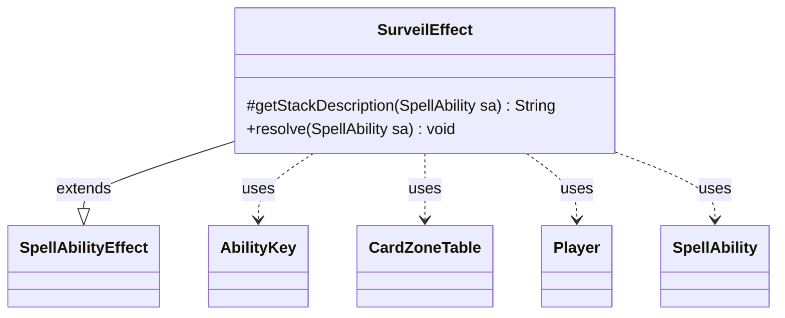

---
aliases:
  - SurveilEffect
tags:
  - java/class
  - module/forge-game
  - pkg/forge/game/ability/effects
fqn: forge.game.ability.effects.SurveilEffect
package: forge.game.ability.effects
module: forge-game
kind: Class
---

# SurveilEffect

**Package:** `forge.game.ability.effects` &nbsp; **Module:** `forge-game` &nbsp; **Kind:** Class



## Relationships
**Extends:**
- [[forge.game.ability.SpellAbilityEffect|SpellAbilityEffect]]
**Uses:**
- [[forge.game.ability.AbilityKey|AbilityKey]]
- [[forge.game.card.CardZoneTable|CardZoneTable]]
- [[forge.game.player.Player|Player]]
- [[forge.game.spellability.SpellAbility|SpellAbility]]

## Design Description

SurveilEffect implements the resolution logic for the Magic "surveil" keyword action, extending `SpellAbilityEffect` to plug into Forge's ability-effect framework. Its `resolve` method computes the surveil count from the optional `Amount` parameter, honors an `Optional` flag by prompting each player for confirmation, and delegates the actual look-and-sort-the-library work to `Player.surveil`. The protected `getStackDescription` override produces the human-readable stack text (e.g., "Alice surveils (2).").

Design intent is visible in its delegation and bookkeeping: rather than manipulating zones directly, it builds an `AbilityKey` parameter map carrying a shared `CardZoneTable`, passes that through to each target `Player`, and finally calls `triggerChangesZoneAll` so all resulting zone changes fire their triggers together. It guards against zero counts and out-of-game players, keeping the effect a thin, framework-conformant orchestrator over collaborating game-state types.

## Source
`forge-game/src/main/java/forge/game/ability/effects/SurveilEffect.java`

```java
package forge.game.ability.effects;

import java.util.Map;

import forge.game.ability.AbilityKey;
import forge.game.ability.AbilityUtils;
import forge.game.ability.SpellAbilityEffect;
import forge.game.card.CardZoneTable;
import forge.game.player.Player;
import forge.game.spellability.SpellAbility;
import forge.util.Lang;
import forge.util.Localizer;

public class SurveilEffect extends SpellAbilityEffect {
    @Override
    protected String getStackDescription(SpellAbility sa) {
        final StringBuilder sb = new StringBuilder();

        sb.append(Lang.joinHomogenous(getTargetPlayers(sa)));

        int num = 1;
        if (sa.hasParam("Amount")) {
            num = AbilityUtils.calculateAmount(sa.getHostCard(), sa.getParam("Amount"), sa);
        }

        sb.append(" surveils (").append(num).append(").");
        return sb.toString();
    }

    @Override
    public void resolve(SpellAbility sa) {
        int num = 1;
        if (sa.hasParam("Amount")) {
            num = AbilityUtils.calculateAmount(sa.getHostCard(), sa.getParam("Amount"), sa);
        }
        if (num == 0) {
            return;
        }

        boolean optional = sa.hasParam("Optional");

        Map<AbilityKey, Object> moveParams = AbilityKey.newMap();
        final CardZoneTable table = AbilityKey.addCardZoneTableParams(moveParams, sa);

        for (final Player p : getTargetPlayers(sa)) {
            if (!p.isInGame()) {
                continue;
            }
            if (optional && !p.getController().confirmAction(sa, null, Localizer.getInstance().getMessage("lblDoYouWantSurveil"), null)) {
                continue;
            }

            p.surveil(num, sa, moveParams);
        }
        table.triggerChangesZoneAll(sa.getHostCard().getGame(), sa);
    }

}
```
