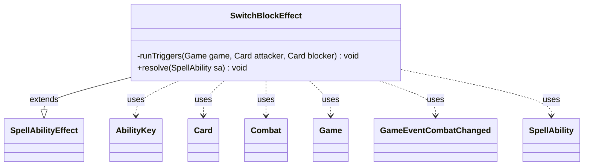

---
aliases:
  - SwitchBlockEffect
tags:
  - java/class
  - module/forge-game
  - pkg/forge/game/ability/effects
fqn: forge.game.ability.effects.SwitchBlockEffect
package: forge.game.ability.effects
module: forge-game
kind: Class
---

# SwitchBlockEffect

**Package:** `forge.game.ability.effects` &nbsp; **Module:** `forge-game` &nbsp; **Kind:** Class



## Relationships
**Extends:**
- [[forge.game.ability.SpellAbilityEffect|SpellAbilityEffect]]
**Uses:**
- [[forge.game.Game|Game]]
- [[forge.game.ability.AbilityKey|AbilityKey]]
- [[forge.game.card.Card|Card]]
- [[forge.game.combat.Combat|Combat]]
- [[forge.game.event.GameEventCombatChanged|GameEventCombatChanged]]
- [[forge.game.spellability.SpellAbility|SpellAbility]]

## Design Description

SwitchBlockEffect is a `SpellAbilityEffect` subclass that resolves abilities which reassign combat blocking assignments, implementing cards such as General Jarkeld and Sorrow's Path. Its `resolve` method reads `DefinedAttacker`/`DefinedBlocker` parameters to gather the attackers and blockers currently in combat, then operates in one of two symmetric modes: swapping which of two attackers each blocker is assigned to, or swapping which of two blockers covers each attacker.

Working through the game's `Combat` object, it first validates legality (band membership, `CombatUtil.canBlock` checks, and additional-block capacity) and fizzles when a switch is impossible or redundant. It encodes each creature's prior assignment as bitmask state, removes participants from combat, re-adds them against the swapped target, and re-orders blockers for damage assignment per rule 509.6. When `RemoveFromCombat` is set, it fires `AttackerBlockedByCreature` and `Blocks` triggers via `AbilityKey` params, and finally refreshes the view and broadcasts a `GameEventCombatChanged`.

## Source
`forge-game/src/main/java/forge/game/ability/effects/SwitchBlockEffect.java`

```java
package forge.game.ability.effects;

import java.util.ArrayList;
import java.util.List;
import java.util.Map;

import forge.game.Game;
import forge.game.ability.AbilityKey;
import forge.game.ability.AbilityUtils;
import forge.game.ability.SpellAbilityEffect;
import forge.game.card.Card;
import forge.game.combat.Combat;
import forge.game.combat.CombatUtil;
import forge.game.event.GameEventCombatChanged;
import forge.game.spellability.SpellAbility;
import forge.game.trigger.TriggerType;

public class SwitchBlockEffect extends SpellAbilityEffect {

    private void runTriggers(final Game game, final Card attacker, final Card blocker) {
        final Map<AbilityKey, Object> runParams = AbilityKey.newMap();
        runParams.put(AbilityKey.Attacker, attacker);
        runParams.put(AbilityKey.Blocker, blocker);
        game.getTriggerHandler().runTrigger(TriggerType.AttackerBlockedByCreature, runParams, false);
        game.getTriggerHandler().runTrigger(TriggerType.Blocks, runParams, false);
    }

    @Override
    public void resolve(SpellAbility sa) {
        final Card host = sa.getHostCard();
        final Game game = host.getGame();
        final Combat combat = game.getPhaseHandler().getCombat();
        boolean isTargetingAttacker = false;

        List<Card> attackers = new ArrayList<>();
        if (sa.hasParam("DefinedAttacker")) {
            final String definedAttacker = sa.getParam("DefinedAttacker");
            if (definedAttacker.equals("Targeted")) {
                isTargetingAttacker = true;
            }
            for (final Card attacker : AbilityUtils.getDefinedCards(host, definedAttacker, sa)) {
                if (combat.isAttacking(attacker))
                    attackers.add(attacker);
            }
        }

        List<Card> blockers = new ArrayList<>();
        if (sa.hasParam("DefinedBlocker")) {
            final String definedBlocker = sa.getParam("DefinedBlocker");
            if (definedBlocker.equals("Targeted")) {
                isTargetingAttacker = false;
            }
            for (final Card blocker : AbilityUtils.getDefinedCards(host, definedBlocker, sa)) {
                if (combat.isBlocking(blocker))
                    blockers.add(blocker);
            }
        }

        if (attackers.isEmpty() || blockers.isEmpty()) return;

        // Check if blockers can be switched, then switch them.
        boolean isReblock = sa.hasParam("RemoveFromCombat");
        if (isTargetingAttacker) { // For General Jarkeld
            // If targeting attackers but only one remains, this fizzles.
            if (attackers.size() == 1) return;

            final Card attacker1 = attackers.get(0);
            final Card attacker2 = attackers.get(1);

            // If both attackers are in the same attacking band, no need to switch
            if (combat.getBandOfAttacker(attacker1) == combat.getBandOfAttacker(attacker2)) return;

            for (final Card blocker : blockers) {
                if (combat.isBlocking(blocker, attacker1) && !CombatUtil.canBlock(attacker2, blocker) ||
                    combat.isBlocking(blocker, attacker2) && !CombatUtil.canBlock(attacker1, blocker)) {
                    return;
                }
            }

            // Switch blockers
            int blockingStates[] = new int[blockers.size()];
            // Remove all blockers first
            for (int i = 0; i < blockers.size(); i++) {
                final Card blocker = blockers.get(i);
                final boolean blocking1 = combat.isBlocking(blocker, attacker1);
                final boolean blocking2 = combat.isBlocking(blocker, attacker2);
                blockingStates[i] = (blocking1 ? 1 : 0) + (blocking2 ? 2 : 0);
                combat.removeFromCombat(blocker);
            }
            // Unregister so it won't ask for damage assignment order when adding each blocker
            combat.unregisterAttacker(attacker1, combat.getBandOfAttacker(attacker1));
            combat.unregisterAttacker(attacker2, combat.getBandOfAttacker(attacker2));
            // Add blockers back to block the other attacker
            for (int i = 0; i < blockers.size(); i++) {
                final Card blocker = blockers.get(i);
                if ((blockingStates[i] & 1) == 1) {
                    combat.addBlocker(attacker2, blocker);
                    if (isReblock) {
                        runTriggers(game, attacker2, blocker);
                    }
                }
                if((blockingStates[i] & 2) == 2) {
                    combat.addBlocker(attacker1, blocker);
                    if (isReblock) {
                        runTriggers(game, attacker1, blocker);
                    }
                }
                blocker.updateBlockingForView();
            }
            // 509.6
            combat.orderBlockersForDamageAssignment(attacker1, combat.getBlockers(attacker1));
            combat.orderBlockersForDamageAssignment(attacker2, combat.getBlockers(attacker2));
            for (final Card blocker : blockers) {
                combat.orderAttackersForDamageAssignment(blocker);
            }
        } else { // For Sorrow's Path
            // If targeting blockers but only one remains, this fizzles.
            if (blockers.size() == 1) return;

            final Card blocker1 = blockers.get(0);
            final Card blocker2 = blockers.get(1);

            // If one blocker is currently blocking more creatures than the other blocker could possibly block, can't switch
            if (combat.getAttackersBlockedBy(blocker1).size() > blocker2.canBlockAdditional() + 1 ||
                combat.getAttackersBlockedBy(blocker2).size() > blocker1.canBlockAdditional() + 1) {
                return;
            } else {
                for (final Card attacker : attackers) {
                    if (combat.isBlocking(blocker1, attacker) && !CombatUtil.canBlock(attacker, blocker2) ||
                        combat.isBlocking(blocker2, attacker) && !CombatUtil.canBlock(attacker, blocker1)) {
                        return;
                    }
                }
            }

            // Switch blockers
            int blockingStates[] = new int[attackers.size()];
            // Remove all blockers first
            for (int i = 0; i < attackers.size(); i++) {
                final Card attacker = attackers.get(i);
                final boolean blocking1 = combat.isBlocking(blocker1, attacker);
                final boolean blocking2 = combat.isBlocking(blocker2, attacker);
                blockingStates[i] = (blocking1 ? 1 : 0) + (blocking2 ? 2 : 0);
            }
            combat.removeFromCombat(blocker1);
            combat.removeFromCombat(blocker2);
            // Add blockers back to block the other attacker
            for (int i = 0; i < attackers.size(); i++) {
                final Card attacker = attackers.get(i);
                if ((blockingStates[i] & 1) == 1) {
                    combat.addBlocker(attacker, blocker2);
                    if (isReblock) {
                        runTriggers(game, attacker, blocker2);
                    }
                }
                if ((blockingStates[i] & 2) == 2) {
                    combat.addBlocker(attacker, blocker1);
                    if (isReblock) {
                        runTriggers(game, attacker, blocker1);
                    }
                }
            }
            combat.orderAttackersForDamageAssignment(blocker1);
            combat.orderAttackersForDamageAssignment(blocker2);
        }

        game.updateCombatForView();
        game.fireEvent(new GameEventCombatChanged());
    }
}
```

## Python
`forge/game/ability/effects/SwitchBlockEffect.py`

```python
package forge.game.ability.effects

from typing import List, Dict

from forge.game.Game import Game
from forge.game.ability.AbilityKey import AbilityKey
from forge.game.ability.AbilityUtils import AbilityUtils
from forge.game.ability.SpellAbilityEffect import SpellAbilityEffect
from forge.game.card.Card import Card
from forge.game.combat.Combat import Combat
from forge.game.combat.CombatUtil import CombatUtil
from forge.game.event.GameEventCombatChanged import GameEventCombatChanged
from forge.game.spellability.SpellAbility import SpellAbility
from forge.game.trigger.TriggerType import TriggerType


class SwitchBlockEffect(SpellAbilityEffect):

    def runTriggers(self, game: Game, attacker: Card, blocker: Card) -> None:
        runParams: Dict[AbilityKey, object] = AbilityKey.newMap()
        runParams[AbilityKey.Attacker] = attacker
        runParams[AbilityKey.Blocker] = blocker
        game.getTriggerHandler().runTrigger(TriggerType.AttackerBlockedByCreature, runParams, False)
        game.getTriggerHandler().runTrigger(TriggerType.Blocks, runParams, False)

    def resolve(self, sa: SpellAbility) -> None:
        host = sa.getHostCard()
        game = host.getGame()
        combat = game.getPhaseHandler().getCombat()
        isTargetingAttacker = False

        attackers: List[Card] = []
        if sa.hasParam("DefinedAttacker"):
            definedAttacker = sa.getParam("DefinedAttacker")
            if definedAttacker == "Targeted":
                isTargetingAttacker = True
            for attacker in AbilityUtils.getDefinedCards(host, definedAttacker, sa):
                if combat.isAttacking(attacker):
                    attackers.append(attacker)

        blockers: List[Card] = []
        if sa.hasParam("DefinedBlocker"):
            definedBlocker = sa.getParam("DefinedBlocker")
            if definedBlocker == "Targeted":
                isTargetingAttacker = False
            for blocker in AbilityUtils.getDefinedCards(host, definedBlocker, sa):
                if combat.isBlocking(blocker):
                    blockers.append(blocker)

        if not attackers or not blockers:
            return

        # Check if blockers can be switched, then switch them.
        isReblock = sa.hasParam("RemoveFromCombat")
        if isTargetingAttacker:  # For General Jarkeld
            # If targeting attackers but only one remains, this fizzles.
            if len(attackers) == 1:
                return

            attacker1 = attackers[0]
            attacker2 = attackers[1]

            # If both attackers are in the same attacking band, no need to switch
            if combat.getBandOfAttacker(attacker1) == combat.getBandOfAttacker(attacker2):
                return

            for blocker in blockers:
                if (combat.isBlocking(blocker, attacker1) and not CombatUtil.canBlock(attacker2, blocker)) or \
                   (combat.isBlocking(blocker, attacker2) and not CombatUtil.canBlock(attacker1, blocker)):
                    return

            # Switch blockers
            blockingStates = [0] * len(blockers)
            # Remove all blockers first
            for i in range(len(blockers)):
                blocker = blockers[i]
                blocking1 = combat.isBlocking(blocker, attacker1)
                blocking2 = combat.isBlocking(blocker, attacker2)
                blockingStates[i] = (1 if blocking1 else 0) + (2 if blocking2 else 0)
                combat.removeFromCombat(blocker)
            # Unregister so it won't ask for damage assignment order when adding each blocker
            combat.unregisterAttacker(attacker1, combat.getBandOfAttacker(attacker1))
            combat.unregisterAttacker(attacker2, combat.getBandOfAttacker(attacker2))
            # Add blockers back to block the other attacker
            for i in range(len(blockers)):
                blocker = blockers[i]
                if (blockingStates[i] & 1) == 1:
                    combat.addBlocker(attacker2, blocker)
                    if isReblock:
                        self.runTriggers(game, attacker2, blocker)
                if (blockingStates[i] & 2) == 2:
                    combat.addBlocker(attacker1, blocker)
                    if isReblock:
                        self.runTriggers(game, attacker1, blocker)
                blocker.updateBlockingForView()
            # 509.6
            combat.orderBlockersForDamageAssignment(attacker1, combat.getBlockers(attacker1))
            combat.orderBlockersForDamageAssignment(attacker2, combat.getBlockers(attacker2))
            for blocker in blockers:
                combat.orderAttackersForDamageAssignment(blocker)
        else:  # For Sorrow's Path
            # If targeting blockers but only one remains, this fizzles.
            if len(blockers) == 1:
                return

            blocker1 = blockers[0]
            blocker2 = blockers[1]

            # If one blocker is currently blocking more creatures than the other blocker could possibly block, can't switch
            if combat.getAttackersBlockedBy(blocker1).size() > blocker2.canBlockAdditional() + 1 or \
               combat.getAttackersBlockedBy(blocker2).size() > blocker1.canBlockAdditional() + 1:
                return
            else:
                for attacker in attackers:
                    if (combat.isBlocking(blocker1, attacker) and not CombatUtil.canBlock(attacker, blocker2)) or \
                       (combat.isBlocking(blocker2, attacker) and not CombatUtil.canBlock(attacker, blocker1)):
                        return

            # Switch blockers
            blockingStates = [0] * len(attackers)
            # Remove all blockers first
            for i in range(len(attackers)):
                attacker = attackers[i]
                blocking1 = combat.isBlocking(blocker1, attacker)
                blocking2 = combat.isBlocking(blocker2, attacker)
                blockingStates[i] = (1 if blocking1 else 0) + (2 if blocking2 else 0)
            combat.removeFromCombat(blocker1)
            combat.removeFromCombat(blocker2)
            # Add blockers back to block the other attacker
            for i in range(len(attackers)):
                attacker = attackers[i]
                if (blockingStates[i] & 1) == 1:
                    combat.addBlocker(attacker, blocker2)
                    if isReblock:
                        self.runTriggers(game, attacker, blocker2)
                if (blockingStates[i] & 2) == 2:
                    combat.addBlocker(attacker, blocker1)
                    if isReblock:
                        self.runTriggers(game, attacker, blocker1)
            combat.orderAttackersForDamageAssignment(blocker1)
            combat.orderAttackersForDamageAssignment(blocker2)

        game.updateCombatForView()
        game.fireEvent(GameEventCombatChanged())
```
