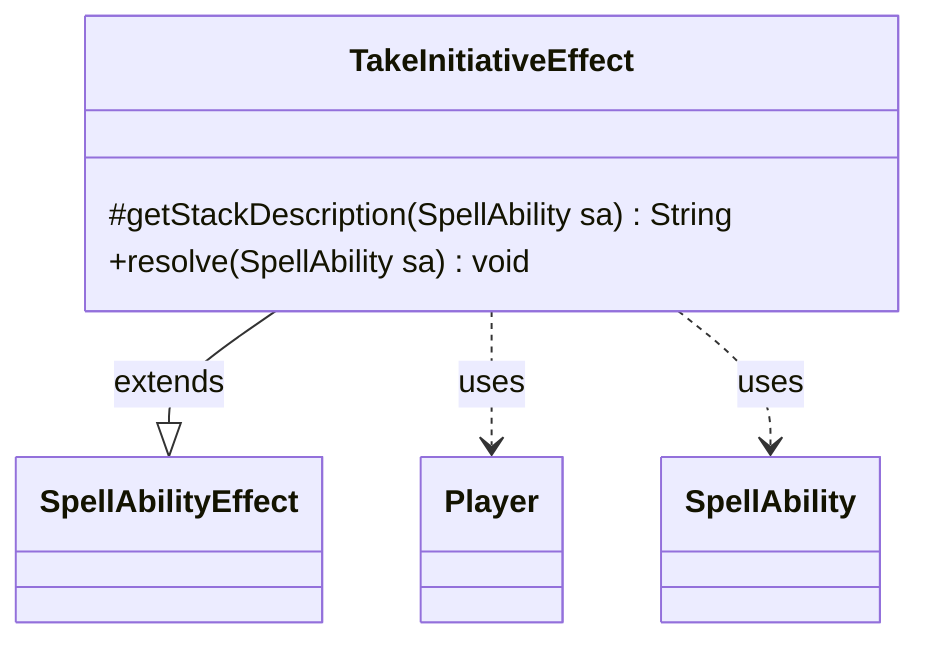

---
aliases:
  - TakeInitiativeEffect
tags:
  - java/class
  - module/forge-game
  - pkg/forge/game/ability/effects
fqn: forge.game.ability.effects.TakeInitiativeEffect
package: forge.game.ability.effects
module: forge-game
kind: Class
---

# TakeInitiativeEffect

**Package:** `forge.game.ability.effects` &nbsp; **Module:** `forge-game` &nbsp; **Kind:** Class



## Relationships
**Extends:**
- [[forge.game.ability.SpellAbilityEffect|SpellAbilityEffect]]
**Uses:**
- [[forge.game.player.Player|Player]]
- [[forge.game.spellability.SpellAbility|SpellAbility]]

## Design Description

TakeInitiativeEffect implements the resolution behavior for spell abilities that grant the "initiative" mechanic to one or more players. As a concrete subclass of SpellAbilityEffect, it plugs into Forge's effect-resolution framework: it overrides `getStackDescription` to render a grammatically correct, human-readable stack message (pluralizing "takes"/"take" via `Lang.joinHomogenous`), and `resolve` to apply the game action itself.

During resolution it reads the originating card's set code from the SpellAbility's host, then iterates the targeted Players, skipping any no longer in the game, and delegates to each player's game action layer (`getAction().takeInitiative`). This delegation keeps the effect a thin adapter between the ability data and the authoritative game-state logic, collaborating with Player and SpellAbility rather than mutating state directly. A TODO flags the AI handling and edge cases as still incomplete.

## Source
`forge-game/src/main/java/forge/game/ability/effects/TakeInitiativeEffect.java`

```java
package forge.game.ability.effects;

import java.util.List;

import forge.game.ability.SpellAbilityEffect;
import forge.game.player.Player;
import forge.game.spellability.SpellAbility;
import forge.util.Lang;

public class TakeInitiativeEffect extends SpellAbilityEffect {

    @Override
    protected String getStackDescription(SpellAbility sa) {
        final StringBuilder sb = new StringBuilder();

        final List<Player> tgtPlayers = getTargetPlayers(sa);

        sb.append(Lang.joinHomogenous(tgtPlayers)).append(tgtPlayers.size() == 1 ? " takes" : " take");
        sb.append(" the initiative.");

        return sb.toString();
    }

    @Override
    public void resolve(SpellAbility sa) {
        // TODO: improve ai and fix corner cases
        final String set = sa.getOriginalHost().getSetCode();

        for (final Player p : getTargetPlayers(sa)) {
            if (!p.isInGame()) {
                continue;
            }

            p.getGame().getAction().takeInitiative(p, set);
        }
    }
}
```

## Python
`forge/game/ability/effects/TakeInitiativeEffect.py`

```python
from typing import List

from forge.game.ability.SpellAbilityEffect import SpellAbilityEffect
from forge.game.player.Player import Player
from forge.game.spellability.SpellAbility import SpellAbility
from forge.util.Lang import Lang


class TakeInitiativeEffect(SpellAbilityEffect):

    def getStackDescription(self, sa: SpellAbility) -> str:
        sb = []

        tgtPlayers: List[Player] = self.getTargetPlayers(sa)

        sb.append(Lang.joinHomogenous(tgtPlayers))
        sb.append(" takes" if len(tgtPlayers) == 1 else " take")
        sb.append(" the initiative.")

        return "".join(sb)

    def resolve(self, sa: SpellAbility) -> None:
        # TODO: improve ai and fix corner cases
        set = sa.getOriginalHost().getSetCode()

        for p in self.getTargetPlayers(sa):
            if not p.isInGame():
                continue

            p.getGame().getAction().takeInitiative(p, set)
```
