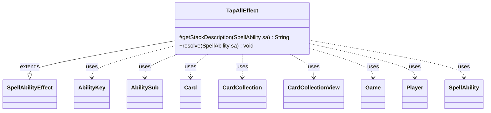

---
aliases:
  - TapAllEffect
tags:
  - java/class
  - module/forge-game
  - pkg/forge/game/ability/effects
fqn: forge.game.ability.effects.TapAllEffect
package: forge.game.ability.effects
module: forge-game
kind: Class
---

# TapAllEffect

**Package:** `forge.game.ability.effects`   **Module:** `forge-game`   **Kind:** Class



## Relationships
**Extends:**
- [[forge.game.ability.SpellAbilityEffect|SpellAbilityEffect]]
**Uses:**
- [[forge.game.Game|Game]]
- [[forge.game.ability.AbilityKey|AbilityKey]]
- [[forge.game.card.Card|Card]]
- [[forge.game.card.CardCollection|CardCollection]]
- [[forge.game.card.CardCollectionView|CardCollectionView]]
- [[forge.game.player.Player|Player]]
- [[forge.game.spellability.AbilitySub|AbilitySub]]
- [[forge.game.spellability.SpellAbility|SpellAbility]]

## Design Description

Tap all valid cards on the battlefield (or those controlled by targeted players) as the resolution behavior for a tap-all spell or ability. As a concrete `SpellAbilityEffect` subclass, it plugs into Forge's data-driven ability framework by overriding `getStackDescription` to produce human-readable text and `resolve` to enact the game-state change, dispatching on script parameters (`ValidCards`, `Defined`, `RememberTapped`, `TapperController`) rather than hardcoded logic.

It collaborates with the `Game` to query the battlefield, uses `AbilityUtils` to filter candidate `Card`s, and taps each through the host `Card`'s controller or each card's own controller. Tapped cards are accumulated in a `CardCollection` and, if non-empty, fed via an `AbilityKey` parameter map to the `TriggerHandler` to fire a `TapAll` trigger — reflecting Forge's event-driven design where state changes propagate to dependent triggered abilities.

## Source
`forge-game/src/main/java/forge/game/ability/effects/TapAllEffect.java`

```java
package forge.game.ability.effects;

import forge.game.Game;
import forge.game.ability.AbilityKey;
import forge.game.ability.AbilityUtils;
import forge.game.ability.SpellAbilityEffect;
import forge.game.card.Card;
import forge.game.card.CardCollection;
import forge.game.card.CardCollectionView;
import forge.game.player.Player;
import forge.game.spellability.AbilitySub;
import forge.game.spellability.SpellAbility;
import forge.game.trigger.TriggerType;
import forge.game.zone.ZoneType;

import java.util.Map;

public class TapAllEffect extends SpellAbilityEffect {
    @Override
    protected String getStackDescription(SpellAbility sa) {
        if (sa instanceof AbilitySub) {
            return "Tap all valid cards.";
        } else {
            return sa.getParam("SpellDescription");
        }
    }

    @Override
    public void resolve(SpellAbility sa) {
        final Player activator = sa.getActivatingPlayer();
        final Game game = activator.getGame();
        final Card card = sa.getHostCard();
        final boolean remTapped = sa.hasParam("RememberTapped");
        if (remTapped) {
            card.clearRemembered();
        }

        CardCollectionView cards;
        if (!sa.usesTargeting() && !sa.hasParam("Defined")) {
            cards = game.getCardsIn(ZoneType.Battlefield);
        } else {
            cards = getTargetPlayers(sa).getCardsIn(ZoneType.Battlefield);
        }

        cards = AbilityUtils.filterListByType(cards, sa.getParam("ValidCards"), sa);

        Player tapper = activator;

        CardCollection tapped = new CardCollection();
        for (final Card c : cards) {
            if (remTapped) {
                card.addRemembered(c);
            }
            if (sa.hasParam("TapperController")) {
                tapper = c.getController();
            }
            if (c.tap(true, sa, tapper)) tapped.add(c);
        }
        if (!tapped.isEmpty()) {
            final Map<AbilityKey, Object> runParams = AbilityKey.newMap();
            runParams.put(AbilityKey.Cards, tapped);
            game.getTriggerHandler().runTrigger(TriggerType.TapAll, runParams, false);
        }
    }

}
```

## Python
`forge/game/ability/effects/TapAllEffect.py`

```python
from forge.game.Game import Game
from forge.game.ability.AbilityKey import AbilityKey
from forge.game.ability.AbilityUtils import AbilityUtils
from forge.game.ability.SpellAbilityEffect import SpellAbilityEffect
from forge.game.card.Card import Card
from forge.game.card.CardCollection import CardCollection
from forge.game.card.CardCollectionView import CardCollectionView
from forge.game.player.Player import Player
from forge.game.spellability.AbilitySub import AbilitySub
from forge.game.spellability.SpellAbility import SpellAbility
from forge.game.trigger.TriggerType import TriggerType
from forge.game.zone.ZoneType import ZoneType


class TapAllEffect(SpellAbilityEffect):
    def getStackDescription(self, sa: SpellAbility) -> str:
        if isinstance(sa, AbilitySub):
            return "Tap all valid cards."
        else:
            return sa.getParam("SpellDescription")

    def resolve(self, sa: SpellAbility) -> None:
        activator = sa.getActivatingPlayer()
        game = activator.getGame()
        card = sa.getHostCard()
        remTapped = sa.hasParam("RememberTapped")
        if remTapped:
            card.clearRemembered()

        if not sa.usesTargeting() and not sa.hasParam("Defined"):
            cards = game.getCardsIn(ZoneType.Battlefield)
        else:
            cards = self.getTargetPlayers(sa).getCardsIn(ZoneType.Battlefield)

        cards = AbilityUtils.filterListByType(cards, sa.getParam("ValidCards"), sa)

        tapper = activator

        tapped = CardCollection()
        for c in cards:
            if remTapped:
                card.addRemembered(c)
            if sa.hasParam("TapperController"):
                tapper = c.getController()
            if c.tap(True, sa, tapper):
                tapped.add(c)
        if not tapped.isEmpty():
            runParams = AbilityKey.newMap()
            runParams[AbilityKey.Cards] = tapped
            game.getTriggerHandler().runTrigger(TriggerType.TapAll, runParams, False)
```
