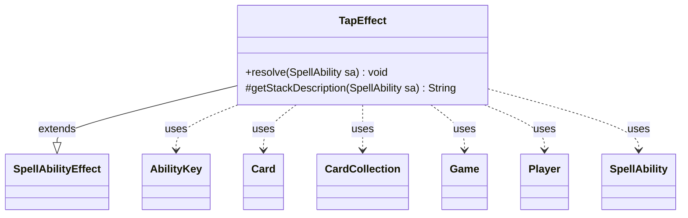

---
aliases:
  - TapEffect
tags:
  - java/class
  - module/forge-game
  - pkg/forge/game/ability/effects
fqn: forge.game.ability.effects.TapEffect
package: forge.game.ability.effects
module: forge-game
kind: Class
---

# TapEffect

**Package:** `forge.game.ability.effects`   **Module:** `forge-game`   **Kind:** Class



## Relationships
**Extends:**
- [[forge.game.ability.SpellAbilityEffect|SpellAbilityEffect]]
**Uses:**
- [[forge.game.Game|Game]]
- [[forge.game.ability.AbilityKey|AbilityKey]]
- [[forge.game.card.Card|Card]]
- [[forge.game.card.CardCollection|CardCollection]]
- [[forge.game.player.Player|Player]]
- [[forge.game.spellability.SpellAbility|SpellAbility]]

## Design Description

TapEffect is a concrete spell-ability effect that taps permanents on the battlefield as the resolution of an ability. Extending SpellAbilityEffect, it overrides `resolve` to perform the tap and `getStackDescription` to render the human-readable stack text. It determines its targets either from the ability's defined/targeted cards or by prompting the activating Player's controller to choose from valid CardChoices, then taps each surviving Card—guarding against phased-out cards and objects no longer in their original game state. It supports flags such as RememberTapped, AlwaysRemember, a distinct Tapper, and ETB (which sets tapped without firing triggers). After tapping, it collects the affected cards into a CardCollection and fires a TapAll trigger via the Game's trigger handler, collaborating with AbilityKey to pass run parameters.

## Source
`forge-game/src/main/java/forge/game/ability/effects/TapEffect.java`

```java
package forge.game.ability.effects;

import forge.game.ability.AbilityKey;
import forge.game.ability.AbilityUtils;
import forge.game.Game;
import forge.game.ability.SpellAbilityEffect;
import forge.game.card.Card;
import forge.game.card.CardCollection;
import forge.game.card.CardLists;
import forge.game.player.Player;
import forge.game.spellability.SpellAbility;
import forge.game.trigger.TriggerType;
import forge.game.zone.ZoneType;
import forge.util.Lang;
import forge.util.Localizer;

import java.util.Map;

public class TapEffect extends SpellAbilityEffect {

    /* (non-Javadoc)
     * @see forge.card.abilityfactory.SpellEffect#resolve(java.util.Map, forge.card.spellability.SpellAbility)
     */
    @Override
    public void resolve(SpellAbility sa) {
        final Player activator = sa.getActivatingPlayer();
        final Card card = sa.getHostCard();
        final Game game = card.getGame();
        final boolean remTapped = sa.hasParam("RememberTapped");
        final boolean alwaysRem = sa.hasParam("AlwaysRemember");
        if (remTapped) {
            card.clearRemembered();
        }

        Iterable<Card> toTap;

        if (sa.hasParam("CardChoices")) { // choosing outside Defined/Targeted
            CardCollection choices = CardLists.getValidCards(card.getGame().getCardsIn(ZoneType.Battlefield), sa.getParam("CardChoices"), activator, card, sa);
            int n = sa.hasParam("ChoiceAmount") ?
                    AbilityUtils.calculateAmount(card, sa.getParam("ChoiceAmount"), sa) : 1;
            int min = sa.hasParam("AnyNumber") ? 0 : n;
            final String prompt = sa.hasParam("ChoicePrompt") ? sa.getParam("ChoicePrompt") :
                    Localizer.getInstance().getMessage("lblChoosePermanentstoTap");
            toTap = activator.getController().chooseEntitiesForEffect(choices, min, n, null, sa, prompt, null, null);
        } else {
            toTap = getTargetCards(sa);
        }

        Player tapper = activator;
        if (sa.hasParam("Tapper")) {
            tapper = AbilityUtils.getDefinedPlayers(card, sa.getParam("Tapper"), sa).getFirst();
        }

        CardCollection tapped = new CardCollection();
        for (final Card tgtC : toTap) {
            if (tgtC.isPhasedOut()) {
                continue;
            }

            // check if the object is still in game or if it was moved
            Card gameCard = game.getCardState(tgtC, null);
            // gameCard is LKI in that case, the card is not in game anymore
            // or the timestamp did change
            // this should check Self too
            if (gameCard == null || !tgtC.equalsWithGameTimestamp(gameCard)) {
                continue;
            }
            if (gameCard.isInPlay()) {
                if (gameCard.isUntapped() && remTapped || alwaysRem) {
                    card.addRemembered(gameCard);
                }
                if (gameCard.tap(true, sa, tapper)) tapped.add(gameCard);
            }
            if (sa.hasParam("ETB")) {
                // do not fire Taps triggers
                tgtC.setTapped(true);
            }
        }
        if (!tapped.isEmpty()) {
            final Map<AbilityKey, Object> runParams = AbilityKey.newMap();
            runParams.put(AbilityKey.Cards, tapped);
            activator.getGame().getTriggerHandler().runTrigger(TriggerType.TapAll, runParams, false);
        }
    }

    @Override
    protected String getStackDescription(SpellAbility sa) {
        final StringBuilder sb = new StringBuilder();

        sb.append("Tap ");
        sb.append(Lang.joinHomogenous(getTargetCards(sa)));
        sb.append(".");
        return sb.toString();
    }

}
```

## Python
`forge/game/ability/effects/TapEffect.py`

```python
from forge.game.ability.AbilityKey import AbilityKey
from forge.game.ability.AbilityUtils import AbilityUtils
from forge.game.Game import Game
from forge.game.ability.SpellAbilityEffect import SpellAbilityEffect
from forge.game.card.Card import Card
from forge.game.card.CardCollection import CardCollection
from forge.game.card.CardLists import CardLists
from forge.game.player.Player import Player
from forge.game.spellability.SpellAbility import SpellAbility
from forge.game.trigger.TriggerType import TriggerType
from forge.game.zone.ZoneType import ZoneType
from forge.util.Lang import Lang
from forge.util.Localizer import Localizer


class TapEffect(SpellAbilityEffect):

    # (non-Javadoc)
    # @see forge.card.abilityfactory.SpellEffect#resolve(java.util.Map, forge.card.spellability.SpellAbility)
    def resolve(self, sa: SpellAbility) -> None:
        activator = sa.getActivatingPlayer()
        card = sa.getHostCard()
        game = card.getGame()
        remTapped = sa.hasParam("RememberTapped")
        alwaysRem = sa.hasParam("AlwaysRemember")
        if remTapped:
            card.clearRemembered()

        toTap = None

        if sa.hasParam("CardChoices"):  # choosing outside Defined/Targeted
            choices = CardLists.getValidCards(card.getGame().getCardsIn(ZoneType.Battlefield), sa.getParam("CardChoices"), activator, card, sa)
            n = AbilityUtils.calculateAmount(card, sa.getParam("ChoiceAmount"), sa) if sa.hasParam("ChoiceAmount") else 1
            min = 0 if sa.hasParam("AnyNumber") else n
            prompt = sa.getParam("ChoicePrompt") if sa.hasParam("ChoicePrompt") else \
                Localizer.getInstance().getMessage("lblChoosePermanentstoTap")
            toTap = activator.getController().chooseEntitiesForEffect(choices, min, n, None, sa, prompt, None, None)
        else:
            toTap = self.getTargetCards(sa)

        tapper = activator
        if sa.hasParam("Tapper"):
            tapper = AbilityUtils.getDefinedPlayers(card, sa.getParam("Tapper"), sa).getFirst()

        tapped = CardCollection()
        for tgtC in toTap:
            if tgtC.isPhasedOut():
                continue

            # check if the object is still in game or if it was moved
            gameCard = game.getCardState(tgtC, None)
            # gameCard is LKI in that case, the card is not in game anymore
            # or the timestamp did change
            # this should check Self too
            if gameCard is None or not tgtC.equalsWithGameTimestamp(gameCard):
                continue
            if gameCard.isInPlay():
                if gameCard.isUntapped() and remTapped or alwaysRem:
                    card.addRemembered(gameCard)
                if gameCard.tap(True, sa, tapper):
                    tapped.add(gameCard)
            if sa.hasParam("ETB"):
                # do not fire Taps triggers
                tgtC.setTapped(True)
        if not tapped.isEmpty():
            runParams = AbilityKey.newMap()
            runParams.put(AbilityKey.Cards, tapped)
            activator.getGame().getTriggerHandler().runTrigger(TriggerType.TapAll, runParams, False)

    def getStackDescription(self, sa: SpellAbility) -> str:
        sb = []

        sb.append("Tap ")
        sb.append(Lang.joinHomogenous(self.getTargetCards(sa)))
        sb.append(".")
        return "".join(sb)
```
