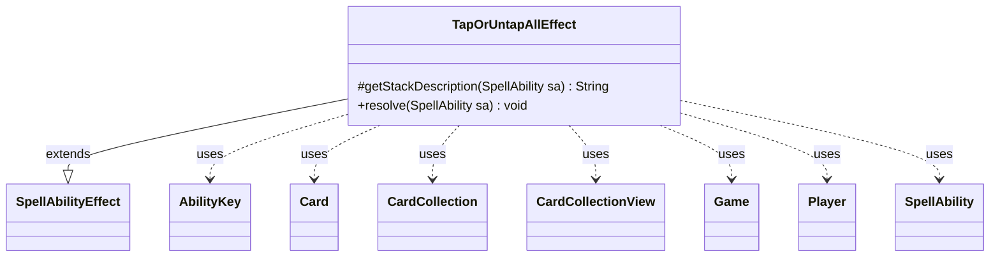

---
aliases:
  - TapOrUntapAllEffect
tags:
  - java/class
  - module/forge-game
  - pkg/forge/game/ability/effects
fqn: forge.game.ability.effects.TapOrUntapAllEffect
package: forge.game.ability.effects
module: forge-game
kind: Class
---

# TapOrUntapAllEffect

**Package:** `forge.game.ability.effects` &nbsp; **Module:** `forge-game` &nbsp; **Kind:** Class



## Relationships
**Extends:**
- [[forge.game.ability.SpellAbilityEffect|SpellAbilityEffect]]
**Uses:**
- [[forge.game.Game|Game]]
- [[forge.game.ability.AbilityKey|AbilityKey]]
- [[forge.game.card.Card|Card]]
- [[forge.game.card.CardCollection|CardCollection]]
- [[forge.game.card.CardCollectionView|CardCollectionView]]
- [[forge.game.player.Player|Player]]
- [[forge.game.spellability.SpellAbility|SpellAbility]]

## Design Description

TapOrUntapAllEffect is a concrete resolution handler for "tap or untap" abilities, extending `SpellAbilityEffect` and implementing its `resolve` and `getStackDescription` hooks. Its responsibility is to gather a set of affected permanents — either an explicit `ValidCards` filter over the battlefield or the ability's targeted/defined cards — let the activating player choose a single direction (tap vs. untap) via a binary controller prompt, and then apply that one choice uniformly to every valid card.

The design reflects the engine's resolution conventions: it resolves cards through `Game.getCardState` and a game-timestamp check to skip permanents that have left play or changed identity, accumulates the actually-affected cards into separate tapped/untapped `CardCollection`s, and fires the corresponding `TapAll`/`UntapAll` triggers via the trigger handler. Collaboration with `SpellAbility`, `Player`, `Game`, and `AbilityKey` keeps it a thin, data-driven effect whose behavior is fully parameterized by the ability's script.

## Source
`forge-game/src/main/java/forge/game/ability/effects/TapOrUntapAllEffect.java`

```java
package forge.game.ability.effects;

import com.google.common.collect.Maps;

import forge.game.Game;
import forge.game.ability.AbilityKey;
import forge.game.ability.AbilityUtils;
import forge.game.ability.SpellAbilityEffect;
import forge.game.card.Card;
import forge.game.card.CardCollection;
import forge.game.card.CardCollectionView;
import forge.game.card.CardLists;
import forge.game.player.Player;
import forge.game.player.PlayerController;
import forge.game.spellability.SpellAbility;
import forge.game.trigger.TriggerType;
import forge.game.zone.ZoneType;
import forge.util.Lang;
import forge.util.Localizer;

import java.util.Map;

public class TapOrUntapAllEffect extends SpellAbilityEffect {

    @Override
    protected String getStackDescription(SpellAbility sa) {
        // when getStackDesc is called, just build exactly what is happening
        final StringBuilder sb = new StringBuilder();
        sb.append("Tap or untap ");

        if (sa.hasParam("ValidMessage")) {
            sb.append(sa.getParam("ValidMessage"));
        } else {
            sb.append(Lang.joinHomogenous(getTargetCards(sa)));
        }
        sb.append(".");
        return sb.toString();
    }

    @Override
    public void resolve(SpellAbility sa) {
        final Player activator = sa.getActivatingPlayer();
        final Game game = activator.getGame();

        CardCollectionView validCards;
        if (sa.hasParam("ValidCards")) {
            validCards = AbilityUtils.filterListByType(game.getCardsIn(ZoneType.Battlefield), sa.getParam("ValidCards"), sa);
        } else {
            validCards = getTargetCards(sa);
        }

        if (sa.usesTargeting() || sa.hasParam("Defined")) {
            validCards = CardLists.filterControlledBy(validCards, getTargetPlayers(sa));
        }

        StringBuilder sb = new StringBuilder(Localizer.getInstance().getMessage("lblTapOrUntapTarget") + " ");
        if (sa.hasParam("ValidMessage")) {
            sb.append(sa.getParam("ValidMessage"));
        } else {
            sb.append(Localizer.getInstance().getMessage("lblPermanents"));
        }
        sb.append("?");

        boolean toTap = activator.getController().chooseBinary(sa, sb.toString(), PlayerController.BinaryChoiceType.TapOrUntap);

        CardCollection tapped = new CardCollection();
        CardCollection untapped = new CardCollection();
        for (final Card tgtC : validCards) {
            if (!tgtC.isInPlay()) {
                continue;
            }

            // check if the object is still in game or if it was moved
            Card gameCard = game.getCardState(tgtC, null);
            // gameCard is LKI in that case, the card is not in game anymore
            // or the timestamp did change
            // this should check Self too
            if (gameCard == null || !tgtC.equalsWithGameTimestamp(gameCard)) {
                continue;
            }
            if (toTap) {
                if (gameCard.tap(true, sa, activator)) tapped.add(gameCard);
            } else {
                if (gameCard.untap()) untapped.add(gameCard);
            }
        }
        if (!tapped.isEmpty()) {
            final Map<AbilityKey, Object> runParams = AbilityKey.newMap();
            runParams.put(AbilityKey.Cards, tapped);
            game.getTriggerHandler().runTrigger(TriggerType.TapAll, runParams, false);
        }
        if (!untapped.isEmpty()) {
            final Map<AbilityKey, Object> runParams = AbilityKey.newMap();
            final Map<Player, CardCollection> map = Maps.newHashMap();
            map.put(activator, untapped);
            runParams.put(AbilityKey.Map, map);
            game.getTriggerHandler().runTrigger(TriggerType.UntapAll, runParams, false);
        }
    }

}
```
