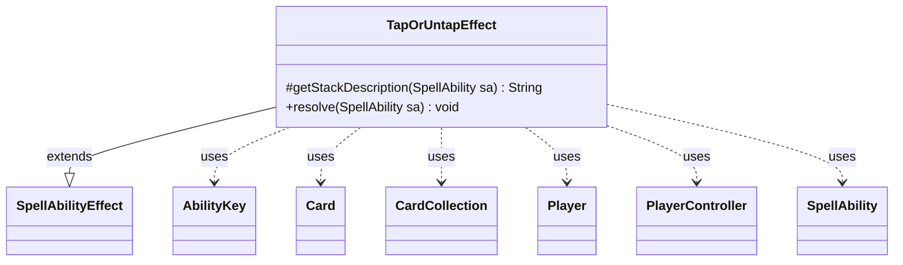

---
aliases:
  - TapOrUntapEffect
tags:
  - java/class
  - module/forge-game
  - pkg/forge/game/ability/effects
fqn: forge.game.ability.effects.TapOrUntapEffect
package: forge.game.ability.effects
module: forge-game
kind: Class
---

# TapOrUntapEffect

**Package:** `forge.game.ability.effects` &nbsp; **Module:** `forge-game` &nbsp; **Kind:** Class



## Relationships
**Extends:**
- [[forge.game.ability.SpellAbilityEffect|SpellAbilityEffect]]
**Uses:**
- [[forge.game.ability.AbilityKey|AbilityKey]]
- [[forge.game.card.Card|Card]]
- [[forge.game.card.CardCollection|CardCollection]]
- [[forge.game.player.Player|Player]]
- [[forge.game.player.PlayerController|PlayerController]]
- [[forge.game.spellability.SpellAbility|SpellAbility]]

## Design Description

TapOrUntapEffect implements the resolution logic for spell or ability effects that tap or untap a set of target permanents. As a concrete subclass of `SpellAbilityEffect`, it overrides `getStackDescription` to render a human-readable summary and `resolve` to apply the effect, delegating the tap/untap decision to the activating (or `Tapper`-defined) `Player`'s `PlayerController` via a binary choice, or flipping each card's state directly when the `Toggle` parameter is set.

Notably, the code defends against stale references: it skips targets that have left play, phased out, or whose game-state `Card` no longer matches by timestamp (LKI), ensuring only valid in-game permanents are affected. After processing, it aggregates untapped cards per player and tapped cards into collections, firing `UntapAll` and `TapAll` triggers through the game's trigger handler so dependent abilities react correctly.

## Source
`forge-game/src/main/java/forge/game/ability/effects/TapOrUntapEffect.java`

```java
package forge.game.ability.effects;

import com.google.common.collect.Maps;

import forge.game.ability.AbilityKey;
import forge.game.ability.AbilityUtils;
import forge.game.ability.SpellAbilityEffect;
import forge.game.card.Card;
import forge.game.card.CardCollection;
import forge.game.player.Player;
import forge.game.player.PlayerController;
import forge.game.spellability.SpellAbility;
import forge.game.trigger.TriggerType;
import forge.util.Lang;
import forge.util.Localizer;

import java.util.Map;

public class TapOrUntapEffect extends SpellAbilityEffect {

    /* (non-Javadoc)
     * @see forge.card.abilityfactory.SpellEffect#getStackDescription(java.util.Map, forge.card.spellability.SpellAbility)
     */
    @Override
    protected String getStackDescription(SpellAbility sa) {
        // when getStackDesc is called, just build exactly what is happening
        final StringBuilder sb = new StringBuilder();

        sb.append("Tap or untap ");

        sb.append(Lang.joinHomogenous(getTargetCards(sa)));
        sb.append(".");
        return sb.toString();
    }

    @Override
    public void resolve(SpellAbility sa) {
        Player tapper = sa.getActivatingPlayer();
        if (sa.hasParam("Tapper")) {
            tapper = AbilityUtils.getDefinedPlayers(sa.getHostCard(), sa.getParam("Tapper"), sa).getFirst();
        }
        PlayerController pc = tapper.getController();
        boolean toggle = sa.hasParam("Toggle");

        CardCollection tapped = new CardCollection();
        final Map<Player, CardCollection> untapMap = Maps.newHashMap();
        for (final Card tgtC : getTargetCards(sa)) {
            if (!tgtC.isInPlay()) {
                continue;
            }
            if (tgtC.isPhasedOut()) {
                continue;
            }

            // check if the object is still in game or if it was moved
            Card gameCard = tapper.getGame().getCardState(tgtC, null);
            // gameCard is LKI in that case, the card is not in game anymore
            // or the timestamp did change
            // this should check Self too
            if (gameCard == null || !tgtC.equalsWithGameTimestamp(gameCard)) {
                continue;
            }
            // If the effected card is controlled by the same controller of the SA, default to untap.
            boolean tap;
            if (toggle) {
                tap = !gameCard.isTapped();
            } else {
                // all cards using this are optional, so don't need to worry about impossible choice
                tap = pc.chooseBinary(sa, Localizer.getInstance().getMessage("lblTapOrUntapTarget", gameCard.getTranslatedName()), PlayerController.BinaryChoiceType.TapOrUntap,
                        !gameCard.getController().equals(tapper));
            }
            if (tap) {
                if (gameCard.tap(true, sa, tapper)) tapped.add(gameCard);
            } else if (gameCard.untap()) {
                untapMap.computeIfAbsent(tapper, i -> new CardCollection()).add(gameCard);
            }
        }
        if (!untapMap.isEmpty()) {
            final Map<AbilityKey, Object> runParams = AbilityKey.newMap();
            runParams.put(AbilityKey.Map, untapMap);
            tapper.getGame().getTriggerHandler().runTrigger(TriggerType.UntapAll, runParams, false);
        }
        if (!tapped.isEmpty()) {
            final Map<AbilityKey, Object> runParams = AbilityKey.newMap();
            runParams.put(AbilityKey.Cards, tapped);
            tapper.getGame().getTriggerHandler().runTrigger(TriggerType.TapAll, runParams, false);
        }
    }
}
```
