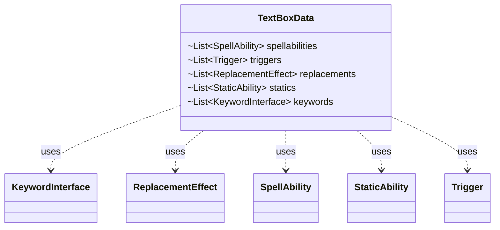

---
aliases:
  - TextBoxData
tags:
  - java/class
  - module/forge-game
  - pkg/forge/game/ability/effects
fqn: forge.game.ability.effects.TextBoxExchangeEffect.TextBoxData
package: forge.game.ability.effects
module: forge-game
kind: Class
---

# TextBoxData

**Package:** `forge.game.ability.effects`   **Module:** `forge-game`   **Kind:** Class



## Relationships
**Uses:**
- [[forge.game.keyword.KeywordInterface|KeywordInterface]]
- [[forge.game.replacement.ReplacementEffect|ReplacementEffect]]
- [[forge.game.spellability.SpellAbility|SpellAbility]]
- [[forge.game.staticability.StaticAbility|StaticAbility]]
- [[forge.game.trigger.Trigger|Trigger]]

## Design Description

TextBoxData is a private static helper class that captures a snapshot of a card's text-box characteristics for use by the enclosing TextBoxExchangeEffect. It bundles the five categories of definitions that constitute a card's printed text: its spell abilities, triggered abilities, replacement effects, static abilities, and keywords. By collecting these collaborating game-object types into a single container, it lets the effect detach one card's text-box contents and swap them with another's as a coherent unit.

As a plain data-holder it declares only package-private list fields with no behavior, encapsulation, or constructor—a deliberately minimal value object whose sole purpose is to transport grouped state within the exchange logic. Its private static scope signals it is an implementation detail of the exchange effect rather than a reusable public abstraction.

## Source
`forge-game/src/main/java/forge/game/ability/effects/TextBoxExchangeEffect.java` — declaration excerpt

```java
    private static class TextBoxData {
        List<SpellAbility> spellabilities;
        List<Trigger> triggers;
        List<ReplacementEffect> replacements;
        List<StaticAbility> statics;
        List<KeywordInterface> keywords;
    }
```

## Python
`forge/game/ability/effects/TextBoxExchangeEffect/TextBoxData.py`

```python
from forge.game.keyword.KeywordInterface import KeywordInterface
from forge.game.replacement.ReplacementEffect import ReplacementEffect
from forge.game.spellability.SpellAbility import SpellAbility
from forge.game.staticability.StaticAbility import StaticAbility
from forge.game.trigger.Trigger import Trigger


class TextBoxData:
    spellabilities: list[SpellAbility]
    triggers: list[Trigger]
    replacements: list[ReplacementEffect]
    statics: list[StaticAbility]
    keywords: list[KeywordInterface]
```
