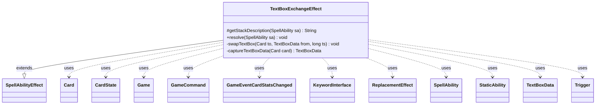

---
aliases:
  - TextBoxExchangeEffect
tags:
  - java/class
  - module/forge-game
  - pkg/forge/game/ability/effects
fqn: forge.game.ability.effects.TextBoxExchangeEffect
package: forge.game.ability.effects
module: forge-game
kind: Class
---

# TextBoxExchangeEffect

**Package:** `forge.game.ability.effects`   **Module:** `forge-game`   **Kind:** Class



## Relationships
**Extends:**
- [[forge.game.ability.SpellAbilityEffect|SpellAbilityEffect]]
**Uses:**
- [[forge.GameCommand|GameCommand]]
- [[forge.game.Game|Game]]
- [[forge.game.ability.effects.TextBoxExchangeEffect.TextBoxData|TextBoxData]]
- [[forge.game.card.Card|Card]]
- [[forge.game.card.CardState|CardState]]
- [[forge.game.event.GameEventCardStatsChanged|GameEventCardStatsChanged]]
- [[forge.game.keyword.KeywordInterface|KeywordInterface]]
- [[forge.game.replacement.ReplacementEffect|ReplacementEffect]]
- [[forge.game.spellability.SpellAbility|SpellAbility]]
- [[forge.game.staticability.StaticAbility|StaticAbility]]
- [[forge.game.trigger.Trigger|Trigger]]

## Design Description

TextBoxExchangeEffect is a resolution handler that swaps the rules text (text boxes) between two creatures, implementing cards like Spy Network's text-box exchange. As a concrete `SpellAbilityEffect` subclass, it overrides `getStackDescription` to phrase the exchange and `resolve` to perform it: it first snapshots each card's intrinsic, non-keyword traits—spell abilities, triggers, replacement effects, static abilities, and keywords—into a private `TextBoxData` record, then applies each card's captured traits to the other under a shared `Game` timestamp via `addChangedCardTraitsByText`/`addChangedCardKeywordsByText`.

The design favors immutable capture before mutation so the two swaps don't interfere, and it preserves prior text-change effects by replaying `changeTextIntrinsic` on each copied trait. For timed exchanges, it registers a `GameCommand` that reverts the changes by timestamp once the duration expires, guarding against the cards having left their original game state. Throughout it fires `GameEventCardStatsChanged` to keep the view synchronized.

## Source
`forge-game/src/main/java/forge/game/ability/effects/TextBoxExchangeEffect.java`

```java
package forge.game.ability.effects;

import com.google.common.collect.Lists;

import forge.GameCommand;
import forge.game.Game;
import forge.game.ability.SpellAbilityEffect;
import forge.game.card.Card;
import forge.game.card.CardState;
import forge.game.event.GameEventCardStatsChanged;
import forge.game.keyword.KeywordInterface;
import forge.game.replacement.ReplacementEffect;
import forge.game.spellability.SpellAbility;
import forge.game.staticability.StaticAbility;
import forge.game.trigger.Trigger;

import java.util.List;

/**
 * Exchanges text boxes between two creatures.
 */
public class TextBoxExchangeEffect extends SpellAbilityEffect {
    @Override
    protected String getStackDescription(final SpellAbility sa) {
        final List<Card> tgtCards = getTargetCards(sa);
        Card c1;
        Card c2;
        if (tgtCards.size() == 1) {
            c1 = sa.getHostCard();
            c2 = tgtCards.get(0);
        } else {
            c1 = tgtCards.get(0);
            c2 = tgtCards.get(1);
        }
        return c1 + " exchanges text box with " + c2 + ".";
    }

    @Override
    public void resolve(final SpellAbility sa) {
        if (!checkValidDuration(sa.getParam("Duration"), sa)) {
            return;
        }
        
        final List<Card> tgtCards = getTargetCards(sa);
        if (tgtCards.size() < 2) {
            return;
        }

        final Card c1 = tgtCards.get(0);
        final Card c2 = tgtCards.get(1);

        // snapshot the original text boxes before modifying
        final TextBoxData data1 = captureTextBoxData(c1);
        final TextBoxData data2 = captureTextBoxData(c2);

        final Card host = sa.getHostCard();
        final Game game = host.getGame();
        final long ts = game.getNextTimestamp();

        swapTextBox(c1, data2, ts);
        swapTextBox(c2, data1, ts);

        if (sa.hasParam("Duration")) {
            final GameCommand revertTextExchange = new GameCommand() {
                private static final long serialVersionUID = 5331255714437747836L;

                @Override
                public void run() {
                    // Check if the cards are still there
                    Card card1 = game.getCardState(c1, null);
                    Card card2 = game.getCardState(c2, null);

                    if (card1 != null && c1.equalsWithGameTimestamp(card1)) {
                        card1.removeChangedCardTraitsByText(ts, 0);
                        card1.removeChangedCardKeywords(ts, 0, false);
                        card1.updateChangedText();
                        card1.updateStateForView();
                        game.fireEvent(new GameEventCardStatsChanged(card1));
                    }

                    if (card2 != null && c2.equalsWithGameTimestamp(card2)) {
                        card2.removeChangedCardTraitsByText(ts, 0);
                        card2.removeChangedCardKeywords(ts, 0, false);
                        card2.updateChangedText();
                        card2.updateStateForView();
                        game.fireEvent(new GameEventCardStatsChanged(card2));
                    }
                }
            };

            addUntilCommand(sa, revertTextExchange);
        }

        game.fireEvent(new GameEventCardStatsChanged(c1));
        game.fireEvent(new GameEventCardStatsChanged(c2));
    }

    private static void swapTextBox(final Card to, final TextBoxData from, final long ts) {
        List<SpellAbility> spellabilities = Lists.newArrayList();
        for (SpellAbility sa : from.spellabilities) {
            SpellAbility copy = sa.copy(to, false, true);
            // need to persist any previous word changes
            copy.changeTextIntrinsic(copy.getChangedTextColors(), copy.getChangedTextTypes());
            spellabilities.add(copy);
        }
        List<Trigger> triggers = Lists.newArrayList();
        for (Trigger tr : from.triggers) {
            Trigger copy = tr.copy(to, false, true);
            copy.changeTextIntrinsic(copy.getChangedTextColors(), copy.getChangedTextTypes());
            triggers.add(copy);
        }
        List<ReplacementEffect> reps = Lists.newArrayList();
        for (ReplacementEffect re : from.replacements) {
            ReplacementEffect copy = re.copy(to, false, true);
            copy.changeTextIntrinsic(copy.getChangedTextColors(), copy.getChangedTextTypes());
            reps.add(copy);
        }
        List<StaticAbility> statics = Lists.newArrayList();
        for (StaticAbility st : from.statics) {
            StaticAbility copy = st.copy(to, false, true);
            copy.changeTextIntrinsic(copy.getChangedTextColors(), copy.getChangedTextTypes());
            statics.add(copy);
        }
        to.addChangedCardTraitsByText(spellabilities, triggers, reps, statics, ts, 0);

        List<KeywordInterface> kws = Lists.newArrayList();
        for (KeywordInterface kw : from.keywords) {
            kws.add(kw.copy(to, false));
        }
        to.addChangedCardKeywordsByText(kws, ts, 0, false);

        to.updateChangedText();
        to.updateStateForView();
    }

    private static TextBoxData captureTextBoxData(final Card card) {
        TextBoxData data = new TextBoxData();
        CardState state = card.getCurrentState();

        data.spellabilities = Lists.newArrayList();
        for (SpellAbility sa : state.getSpellAbilities()) {
            if (sa.isIntrinsic() && sa.getKeyword() == null) {
                data.spellabilities.add(sa);
            }
        }
        data.triggers = Lists.newArrayList();
        for (Trigger tr : state.getTriggers()) {
            if (tr.isIntrinsic() && tr.getKeyword() == null) {
                data.triggers.add(tr);
            }
        }
        data.replacements = Lists.newArrayList();
        for (ReplacementEffect re : state.getReplacementEffects()) {
            if (re.isIntrinsic() && re.getKeyword() == null) {
                data.replacements.add(re);
            }
        }
        data.statics = Lists.newArrayList();
        for (StaticAbility st : state.getStaticAbilities()) {
            if (st.isIntrinsic() && st.getKeyword() == null) {
                data.statics.add(st);
            }
        }

        data.keywords = Lists.newArrayList();
        for (KeywordInterface ki : card.getKeywords()) {
            if (ki.isIntrinsic()) {
                data.keywords.add(ki);
            }
        }

        return data;
    }

    private static class TextBoxData {
        List<SpellAbility> spellabilities;
        List<Trigger> triggers;
        List<ReplacementEffect> replacements;
        List<StaticAbility> statics;
        List<KeywordInterface> keywords;
    }
}
```

## Python
`forge/game/ability/effects/TextBoxExchangeEffect.py`

```python
from forge.GameCommand import GameCommand
from forge.game.Game import Game
from forge.game.ability.SpellAbilityEffect import SpellAbilityEffect
from forge.game.card.Card import Card
from forge.game.card.CardState import CardState
from forge.game.event.GameEventCardStatsChanged import GameEventCardStatsChanged
from forge.game.keyword.KeywordInterface import KeywordInterface
from forge.game.replacement.ReplacementEffect import ReplacementEffect
from forge.game.spellability.SpellAbility import SpellAbility
from forge.game.staticability.StaticAbility import StaticAbility
from forge.game.trigger.Trigger import Trigger


class TextBoxExchangeEffect(SpellAbilityEffect):
    """
    Exchanges text boxes between two creatures.
    """

    def getStackDescription(self, sa: SpellAbility) -> str:
        tgtCards = self.getTargetCards(sa)
        if len(tgtCards) == 1:
            c1 = sa.getHostCard()
            c2 = tgtCards[0]
        else:
            c1 = tgtCards[0]
            c2 = tgtCards[1]
        return str(c1) + " exchanges text box with " + str(c2) + "."

    def resolve(self, sa: SpellAbility) -> None:
        if not self.checkValidDuration(sa.getParam("Duration"), sa):
            return

        tgtCards = self.getTargetCards(sa)
        if len(tgtCards) < 2:
            return

        c1 = tgtCards[0]
        c2 = tgtCards[1]

        # snapshot the original text boxes before modifying
        data1 = TextBoxExchangeEffect.captureTextBoxData(c1)
        data2 = TextBoxExchangeEffect.captureTextBoxData(c2)

        host = sa.getHostCard()
        game = host.getGame()
        ts = game.getNextTimestamp()

        TextBoxExchangeEffect.swapTextBox(c1, data2, ts)
        TextBoxExchangeEffect.swapTextBox(c2, data1, ts)

        if sa.hasParam("Duration"):
            class revertTextExchange(GameCommand):
                serialVersionUID = 5331255714437747836

                def run(self):
                    # Check if the cards are still there
                    card1 = game.getCardState(c1, None)
                    card2 = game.getCardState(c2, None)

                    if card1 is not None and c1.equalsWithGameTimestamp(card1):
                        card1.removeChangedCardTraitsByText(ts, 0)
                        card1.removeChangedCardKeywords(ts, 0, False)
                        card1.updateChangedText()
                        card1.updateStateForView()
                        game.fireEvent(GameEventCardStatsChanged(card1))

                    if card2 is not None and c2.equalsWithGameTimestamp(card2):
                        card2.removeChangedCardTraitsByText(ts, 0)
                        card2.removeChangedCardKeywords(ts, 0, False)
                        card2.updateChangedText()
                        card2.updateStateForView()
                        game.fireEvent(GameEventCardStatsChanged(card2))

            self.addUntilCommand(sa, revertTextExchange())

        game.fireEvent(GameEventCardStatsChanged(c1))
        game.fireEvent(GameEventCardStatsChanged(c2))

    @staticmethod
    def swapTextBox(to: Card, from_: "TextBoxData", ts: int) -> None:
        spellabilities = []
        for sa in from_.spellabilities:
            copy = sa.copy(to, False, True)
            # need to persist any previous word changes
            copy.changeTextIntrinsic(copy.getChangedTextColors(), copy.getChangedTextTypes())
            spellabilities.append(copy)
        triggers = []
        for tr in from_.triggers:
            copy = tr.copy(to, False, True)
            copy.changeTextIntrinsic(copy.getChangedTextColors(), copy.getChangedTextTypes())
            triggers.append(copy)
        reps = []
        for re in from_.replacements:
            copy = re.copy(to, False, True)
            copy.changeTextIntrinsic(copy.getChangedTextColors(), copy.getChangedTextTypes())
            reps.append(copy)
        statics = []
        for st in from_.statics:
            copy = st.copy(to, False, True)
            copy.changeTextIntrinsic(copy.getChangedTextColors(), copy.getChangedTextTypes())
            statics.append(copy)
        to.addChangedCardTraitsByText(spellabilities, triggers, reps, statics, ts, 0)

        kws = []
        for kw in from_.keywords:
            kws.append(kw.copy(to, False))
        to.addChangedCardKeywordsByText(kws, ts, 0, False)

        to.updateChangedText()
        to.updateStateForView()

    @staticmethod
    def captureTextBoxData(card: Card) -> "TextBoxData":
        data = TextBoxData()
        state = card.getCurrentState()

        data.spellabilities = []
        for sa in state.getSpellAbilities():
            if sa.isIntrinsic() and sa.getKeyword() is None:
                data.spellabilities.append(sa)
        data.triggers = []
        for tr in state.getTriggers():
            if tr.isIntrinsic() and tr.getKeyword() is None:
                data.triggers.append(tr)
        data.replacements = []
        for re in state.getReplacementEffects():
            if re.isIntrinsic() and re.getKeyword() is None:
                data.replacements.append(re)
        data.statics = []
        for st in state.getStaticAbilities():
            if st.isIntrinsic() and st.getKeyword() is None:
                data.statics.append(st)

        data.keywords = []
        for ki in card.getKeywords():
            if ki.isIntrinsic():
                data.keywords.append(ki)

        return data


class TextBoxData:
    spellabilities: list[SpellAbility]
    triggers: list[Trigger]
    replacements: list[ReplacementEffect]
    statics: list[StaticAbility]
    keywords: list[KeywordInterface]
```
