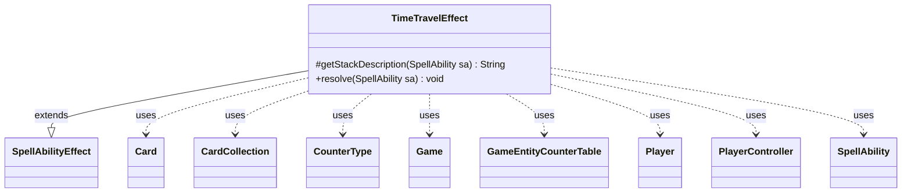

---
aliases:
  - TimeTravelEffect
tags:
  - java/class
  - module/forge-game
  - pkg/forge/game/ability/effects
fqn: forge.game.ability.effects.TimeTravelEffect
package: forge.game.ability.effects
module: forge-game
kind: Class
---

# TimeTravelEffect

**Package:** `forge.game.ability.effects` &nbsp; **Module:** `forge-game` &nbsp; **Kind:** Class



## Relationships
**Extends:**
- [[forge.game.ability.SpellAbilityEffect|SpellAbilityEffect]]
**Uses:**
- [[forge.game.Game|Game]]
- [[forge.game.GameEntityCounterTable|GameEntityCounterTable]]
- [[forge.game.card.Card|Card]]
- [[forge.game.card.CardCollection|CardCollection]]
- [[forge.game.card.CounterType|CounterType]]
- [[forge.game.player.Player|Player]]
- [[forge.game.player.PlayerController|PlayerController]]
- [[forge.game.spellability.SpellAbility|SpellAbility]]

## Design Description

TimeTravelEffect implements the resolution logic for Magic's "time travel" keyword action as a concrete `SpellAbilityEffect` subclass, plugging into Forge's data-driven ability framework. It overrides `getStackDescription` to supply the player-facing reminder text and `resolve` to perform the effect: for a configurable `Amount` of iterations (default one), it gathers the activator's suspended exiled cards and battlefield permanents bearing time counters, then prompts the controlling `PlayerController` to choose any subset and, per card, decide via a binary Add/Remove choice whether to place or strip a single time counter.

Its responsibility is confined to game-state mutation and player interaction; it delegates counting to `AbilityUtils`, card filtering to `CardLists`/`CardPredicates`, and batches additions through a `GameEntityCounterTable` so replacement effects resolve together via `replaceCounterEffect`. Localized prompts and the controller abstraction keep UI concerns decoupled from rules logic.

## Source
`forge-game/src/main/java/forge/game/ability/effects/TimeTravelEffect.java`

```java
package forge.game.ability.effects;

import java.util.Map;

import com.google.common.collect.Maps;

import forge.game.Game;
import forge.game.GameEntityCounterTable;
import forge.game.ability.AbilityUtils;
import forge.game.ability.SpellAbilityEffect;
import forge.game.card.Card;
import forge.game.card.CardCollection;
import forge.game.card.CardLists;
import forge.game.card.CardPredicates;
import forge.game.card.CounterType;
import forge.game.card.CounterEnumType;
import forge.game.player.Player;
import forge.game.player.PlayerController;
import forge.game.player.PlayerController.BinaryChoiceType;
import forge.game.spellability.SpellAbility;
import forge.game.zone.ZoneType;
import forge.util.Localizer;

public class TimeTravelEffect extends SpellAbilityEffect {

    @Override
    protected String getStackDescription(SpellAbility sa) {
        return "Time travel. (For each suspended card you own and each permanent you control with a time counter on it, you may add or remove a time counter.)";
    }

    @Override
    public void resolve(SpellAbility sa) {
        final Player activator = sa.getActivatingPlayer();
        final Card host = sa.getHostCard();
        final Game game = host.getGame();
        int num = sa.hasParam("Amount") ? AbilityUtils.calculateAmount(host, sa.getParam("Amount"), sa) : 1;

        PlayerController pc = activator.getController();

        final CounterType counterType = CounterEnumType.TIME;

        for (int i = 0; i < num; i++) {
            // card you own that is suspended
            CardCollection list = CardLists.filter(activator.getCardsIn(ZoneType.Exile), Card::hasSuspend);
            // permanent you control with time counter
            list.addAll(CardLists.filter(activator.getCardsIn(ZoneType.Battlefield), CardPredicates.hasCounter(counterType)));

            GameEntityCounterTable table = new GameEntityCounterTable();

            String prompt = Localizer.getInstance().getMessage("lblChooseaCard");
            for (Card c : pc.chooseEntitiesForEffect(list, 0, list.size(), null, sa, prompt, activator, null)) {
                Map<String, Object> params = Maps.newHashMap();
                params.put("Target", c);
                params.put("CounterType", counterType);
                prompt = Localizer.getInstance().getMessage("lblWhatToDoWithTargetCounter", counterType.getName(), c.getTranslatedName()) + " ";
                boolean putCounter = pc.chooseBinary(sa, prompt, BinaryChoiceType.AddOrRemove, params);

                if (putCounter) {
                    c.addCounter(counterType, 1, activator, table);
                } else {
                    c.subtractCounter(counterType, 1, activator);
                }
            }
            table.replaceCounterEffect(game, sa);
        }
    }

}
```
