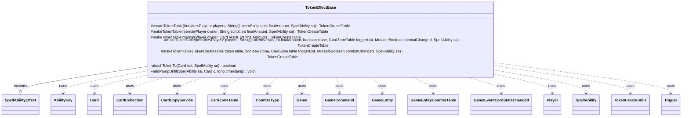

---
aliases:
  - TokenEffectBase
tags:
  - java/class
  - module/forge-game
  - pkg/forge/game/ability/effects
fqn: forge.game.ability.effects.TokenEffectBase
package: forge.game.ability.effects
module: forge-game
kind: Class
---

# TokenEffectBase

**Package:** `forge.game.ability.effects`   **Module:** `forge-game`   **Kind:** Class



## Relationships
**Extends:**
- [[forge.game.ability.SpellAbilityEffect|SpellAbilityEffect]]
**Uses:**
- [[forge.GameCommand|GameCommand]]
- [[forge.game.Game|Game]]
- [[forge.game.GameEntity|GameEntity]]
- [[forge.game.GameEntityCounterTable|GameEntityCounterTable]]
- [[forge.game.ability.AbilityKey|AbilityKey]]
- [[forge.game.card.Card|Card]]
- [[forge.game.card.CardCollection|CardCollection]]
- [[forge.game.card.CardCopyService|CardCopyService]]
- [[forge.game.card.CardZoneTable|CardZoneTable]]
- [[forge.game.card.CounterType|CounterType]]
- [[forge.game.card.TokenCreateTable|TokenCreateTable]]
- [[forge.game.event.GameEventCardStatsChanged|GameEventCardStatsChanged]]
- [[forge.game.player.Player|Player]]
- [[forge.game.spellability.SpellAbility|SpellAbility]]
- [[forge.game.trigger.Trigger|Trigger]]

## Design Description

`TokenEffectBase` is an abstract base class for spell-ability effects that create card tokens, extending `SpellAbilityEffect` and shared by concrete token-producing effects. It centralizes the logic of turning token scripts into prototype `Card`s, organizing them into a `TokenCreateTable` keyed by owner and amount, and then materializing each token onto the battlefield. The core `makeTokenTable` method copies prototypes via `CardCopyService`, applies the creating spell's parameters—tapping, counters via `GameEntityCounterTable`, inherited triggers, attachment, combat entry, pump keywords, and remembering/imprinting—and routes creation through the game's replacement and move-to-play machinery.

Its design intent is to consolidate the rules-correct, parameter-driven token-creation pipeline (including CR-referenced edge cases like aura attachment and per-turn token tracking) in one reusable place, so subclasses need only supply players, scripts, and amounts. Helper methods like `attachTokenTo` and the static `addPumpUntil` encapsulate static-ability checking and duration-bounded keyword pumps.

## Source
`forge-game/src/main/java/forge/game/ability/effects/TokenEffectBase.java`

```java
package forge.game.ability.effects;

import java.util.Arrays;
import java.util.List;
import java.util.Map;
import java.util.Set;

import com.google.common.collect.Iterables;
import forge.card.GamePieceType;
import forge.game.card.*;
import org.apache.commons.lang3.mutable.MutableBoolean;

import com.google.common.collect.Lists;
import com.google.common.collect.Sets;
import com.google.common.collect.Table;

import forge.GameCommand;
import forge.game.Game;
import forge.game.GameEntity;
import forge.game.GameEntityCounterTable;
import forge.game.ability.AbilityKey;
import forge.game.ability.AbilityUtils;
import forge.game.ability.SpellAbilityEffect;
import forge.game.card.token.TokenInfo;
import forge.game.event.GameEventCardStatsChanged;
import forge.game.player.Player;
import forge.game.replacement.ReplacementType;
import forge.game.spellability.SpellAbility;
import forge.game.trigger.Trigger;
import forge.game.zone.ZoneType;

public abstract class TokenEffectBase extends SpellAbilityEffect {

    protected TokenCreateTable createTokenTable(Iterable<Player> players, String[] tokenScripts, final int finalAmount, final SpellAbility sa) {
        TokenCreateTable tokenTable = new TokenCreateTable();
        for (final Player owner : players) {
            if (!owner.isInGame()) {
                continue;
            }
            for (String script : tokenScripts) {
                final Card result = TokenInfo.getProtoType(script, sa, owner);

                if (result == null) {
                    throw new RuntimeException("don't find Token for TokenScript: " + script);
                }
                result.setTokenSpawningAbility(sa);
                tokenTable.put(owner, result, finalAmount);
            }
        }
        return tokenTable;
    }

    protected TokenCreateTable makeTokenTableInternal(Player owner, String script, final int finalAmount, final SpellAbility sa) {
        final Card result = TokenInfo.getProtoType(script, sa, owner, false);

        if (result == null) {
            throw new RuntimeException("don't find Token for TokenScript: " + script);
        }
        result.setTokenSpawningAbility(sa);
        return makeTokenTableInternal(owner, result, finalAmount);
    }

    protected TokenCreateTable makeTokenTableInternal(Player owner, Card result, final int finalAmount) {
        TokenCreateTable tokenTable = new TokenCreateTable();
        tokenTable.put(owner, result, finalAmount);
        return tokenTable;
    }

    protected TokenCreateTable makeTokenTable(Iterable<Player> players, String[] tokenScripts, final int finalAmount, final boolean clone,
            CardZoneTable triggerList, MutableBoolean combatChanged, final SpellAbility sa) {
        return makeTokenTable(createTokenTable(players, tokenScripts, finalAmount, sa), clone, triggerList, combatChanged, sa);
    }

    protected TokenCreateTable makeTokenTable(TokenCreateTable tokenTable, final boolean clone, CardZoneTable triggerList, MutableBoolean combatChanged, final SpellAbility sa) {
        final Card host = sa.getHostCard();
        final Game game = host.getGame();
        long timestamp = game.getNextTimestamp();
        Set<Card> originalTokens = Sets.newHashSet(tokenTable.columnKeySet());

        // support PlayerCollection for affected
        Set<Player> toRemove = Sets.newHashSet();
        for (Player p : Lists.newArrayList(tokenTable.rowKeySet())) {
            final Map<AbilityKey, Object> repParams = AbilityKey.mapFromAffected(p);
            repParams.put(AbilityKey.Token, tokenTable);
            repParams.put(AbilityKey.Cause, sa);
            repParams.put(AbilityKey.EffectOnly, true); // currently only effects can create tokens?

            switch (game.getReplacementHandler().run(ReplacementType.CreateToken, repParams)) {
            case NotReplaced:
                break;
            case Updated: {
                tokenTable = (TokenCreateTable) repParams.get(AbilityKey.Token);
                break;
            }
            default:
                toRemove.add(p);
            }
        }
        tokenTable.rowKeySet().removeAll(toRemove);

        final List<String> pumpKeywords = Lists.newArrayList();
        if (sa.hasParam("PumpKeywords")) {
            pumpKeywords.addAll(Arrays.asList(sa.getParam("PumpKeywords").split(" & ")));
        }
        List<Card> allTokens = Lists.newArrayList();

        Map<AbilityKey, Object> moveParams = AbilityKey.newMap();
        moveParams.put(AbilityKey.LastStateBattlefield, game.copyLastStateBattlefield());
        moveParams.put(AbilityKey.LastStateGraveyard, game.copyLastStateGraveyard());

        for (final Table.Cell<Player, Card, Integer> c : tokenTable.cellSet()) {
            Card prototype = c.getColumnKey();
            Player creator = c.getRowKey();
            Player controller = prototype.getController();
            int cellAmount = c.getValue();

            for (int i = 0; i < cellAmount; i++) {
                Card tok = new CardCopyService(prototype).copyCard(true);
                // disconnect from prototype
                tok.getStates().forEach(cs -> tok.getState(cs).resetOriginalHost(prototype));
                // Crafty Cutpurse would change under which control it does enter,
                // but it shouldn't change who creates the token
                tok.setOwner(creator);
                if (creator != controller) {
                    tok.setController(controller, timestamp);
                }
                tok.setGameTimestamp(timestamp);
                tok.setGamePieceType(GamePieceType.TOKEN);

                // do effect stuff with the token
                if (sa.hasParam("TokenTapped")) {
                    tok.setTapped(true);
                }

                // CR 303.4i
                if (!sa.hasParam("AttachAfter") && sa.hasParam("AttachedTo") && !attachTokenTo(tok, sa) && tok.isAura()) {
                    continue;
                }

                if (sa.hasParam("WithCountersType")) {
                    CounterType cType = CounterType.getType(sa.getParam("WithCountersType"));
                    int cAmount = AbilityUtils.calculateAmount(host, sa.getParamOrDefault("WithCountersAmount", "1"), sa);
                    GameEntityCounterTable table = new GameEntityCounterTable();
                    table.put(creator, tok, cType, cAmount);
                    moveParams.put(AbilityKey.CounterTable, table);
                }

                if (sa.hasParam("AddTriggersFrom")) {
                    final List<Card> cards = AbilityUtils.getDefinedCards(host, sa.getParam("AddTriggersFrom"), sa);
                    for (final Card card : cards) {
                        for (final Trigger trig : card.getTriggers()) {
                            tok.addTrigger(trig.copy(tok, false));
                        }
                    }
                }

                if (clone || prototype.getCopiedPermanent() != null) {
                    tok.setCopiedPermanent(prototype);
                }

                Card lki = CardCopyService.getLKICopy(tok);
                moveParams.put(AbilityKey.CardLKI, lki);

                Card moved = game.getAction().moveToPlay(tok, sa, moveParams);
                if (moved == null || moved.getZone() == null) {
                    // in case token can't enter the battlefield, it isn't created
                    triggerList.put(ZoneType.None, ZoneType.None, moved);
                    continue;
                }
                triggerList.put(ZoneType.None, moved.getZone().getZoneType(), moved);

                triggerList.addToken(lki, creator.getNumTokenCreatedThisTurn() == 0);
                creator.addTokensCreatedThisTurn(lki);

                if (clone) {
                    moved.setCloneOrigin(host);
                }

                if (!pumpKeywords.isEmpty()) {
                    moved.addChangedCardKeywords(pumpKeywords, Lists.newArrayList(), false, timestamp, null);
                    addPumpUntil(sa, moved, timestamp);
                }

                if (sa.hasParam("AtEOTTrig")) {
                    addSelfTrigger(sa, sa.getParam("AtEOTTrig"), moved);
                }

                if (addToCombat(moved, sa, "TokenAttacking", "TokenBlocking")) {
                    combatChanged.setTrue();
                }

                if (sa.hasParam("AttachAfter") && sa.hasParam("AttachedTo")) {
                    attachTokenTo(tok, sa);
                }

                moved.updateStateForView();

                if (sa.hasParam("RememberTokens")) {
                    host.addRemembered(moved);
                }
                // used for some reflexive trigger
                if (sa.hasParam("RememberOriginalTokens") && originalTokens.contains(prototype)) {
                    host.addRemembered(moved);
                }
                if (sa.hasParam("ImprintTokens")) {
                    host.addImprintedCard(moved);
                }
                if (sa.hasParam("RememberSource")) {
                    moved.addRemembered(host);
                }
                if (sa.hasParam("TokenRemembered")) {
                    moved.addRemembered(AbilityUtils.getDefinedObjects(host, sa.getParam("TokenRemembered"), sa));
                }
                allTokens.add(moved);

                if (sa.hasParam("CleanupForEach")) {
                    moved.removeRemembered(prototype.getRemembered());
                }
            }
        }

        if (sa.hasParam("AtEOT")) {
            registerDelayedTrigger(sa, sa.getParam("AtEOT"), allTokens);
        }
        return tokenTable;
    }

    private boolean attachTokenTo(Card tok, SpellAbility sa) {
        final Card host = sa.getHostCard();
        final Game game = host.getGame();

        GameEntity aTo = Iterables.getFirst(
                AbilityUtils.getDefinedEntities(host, sa.getParam("AttachedTo"), sa), null);

        if (aTo != null) {
            // check what the token would be on the battlefield
            Card lki = CardCopyService.getLKICopy(tok);

            lki.setLastKnownZone(tok.getController().getZone(ZoneType.Battlefield));

            // double freeze tracker, so it doesn't update view
            game.getTracker().freeze();
            CardCollection preList = new CardCollection(lki);
            game.getAction().checkStaticAbilities(false, Sets.newHashSet(lki), preList);

            boolean canAttach = lki.isAttachment();

            if (canAttach && !aTo.canBeAttached(lki, sa)) {
                canAttach = false;
            }

            // reset static abilities
            game.getAction().checkStaticAbilities(false);
            // clear delayed changes, this check should not have updated the view
            game.getTracker().clearDelayed();
            // need to unfreeze tracker
            game.getTracker().unfreeze();

            if (!canAttach) {
                // Token can't attach to it
                return false;
            }

            tok.attachToEntity(aTo, sa);
            return true;
        }
        // not a GameEntity, can't be attach
        return false;
    }

    public static void addPumpUntil(SpellAbility sa, final Card c, long timestamp) {
        if (!sa.hasParam("PumpDuration")) {
            return;
        }
        final String duration = sa.getParam("PumpDuration");
        final Card host = sa.getHostCard();
        final Game game = host.getGame();
        final GameCommand untilEOT = new GameCommand() {
            private static final long serialVersionUID = -42244224L;

            @Override
            public void run() {
                c.removeChangedCardKeywords(timestamp, 0);
                game.fireEvent(new GameEventCardStatsChanged(c));
            }
        };

        if ("UntilYourNextTurn".equals(duration)) {
            game.getCleanup().addUntil(sa.getActivatingPlayer(), untilEOT);
        } else {
            game.getEndOfTurn().addUntil(untilEOT);
        }
    }
}
```

## Python
`forge/game/ability/effects/TokenEffectBase.py`

```python
from forge.GameCommand import GameCommand
from forge.game.Game import Game
from forge.game.GameEntity import GameEntity
from forge.game.GameEntityCounterTable import GameEntityCounterTable
from forge.game.ability.AbilityKey import AbilityKey
from forge.game.ability.AbilityUtils import AbilityUtils
from forge.game.ability.SpellAbilityEffect import SpellAbilityEffect
from forge.game.card.Card import Card
from forge.game.card.CardCollection import CardCollection
from forge.game.card.CardCopyService import CardCopyService
from forge.game.card.CardZoneTable import CardZoneTable
from forge.game.card.CounterType import CounterType
from forge.game.card.TokenCreateTable import TokenCreateTable
from forge.game.card.token.TokenInfo import TokenInfo
from forge.game.event.GameEventCardStatsChanged import GameEventCardStatsChanged
from forge.game.player.Player import Player
from forge.game.replacement.ReplacementType import ReplacementType
from forge.game.spellability.SpellAbility import SpellAbility
from forge.game.trigger.Trigger import Trigger
from forge.game.zone.ZoneType import ZoneType
from forge.card.GamePieceType import GamePieceType


class TokenEffectBase(SpellAbilityEffect):

    def createTokenTable(self, players, tokenScripts, finalAmount, sa):
        tokenTable = TokenCreateTable()
        for owner in players:
            if not owner.isInGame():
                continue
            for script in tokenScripts:
                result = TokenInfo.getProtoType(script, sa, owner)

                if result is None:
                    raise RuntimeError("don't find Token for TokenScript: " + script)
                result.setTokenSpawningAbility(sa)
                tokenTable.put(owner, result, finalAmount)
        return tokenTable

    def makeTokenTableInternal(self, owner, script, finalAmount, sa):
        result = TokenInfo.getProtoType(script, sa, owner, False)

        if result is None:
            raise RuntimeError("don't find Token for TokenScript: " + script)
        result.setTokenSpawningAbility(sa)
        return self.makeTokenTableInternal(owner, result, finalAmount)

    def makeTokenTableInternal(self, owner, result, finalAmount):
        tokenTable = TokenCreateTable()
        tokenTable.put(owner, result, finalAmount)
        return tokenTable

    def makeTokenTable(self, players, tokenScripts, finalAmount, clone, triggerList, combatChanged, sa):
        return self.makeTokenTable(self.createTokenTable(players, tokenScripts, finalAmount, sa), clone, triggerList, combatChanged, sa)

    def makeTokenTable(self, tokenTable, clone, triggerList, combatChanged, sa):
        host = sa.getHostCard()
        game = host.getGame()
        timestamp = game.getNextTimestamp()
        originalTokens = set(tokenTable.columnKeySet())

        # support PlayerCollection for affected
        toRemove = set()
        for p in list(tokenTable.rowKeySet()):
            repParams = AbilityKey.mapFromAffected(p)
            repParams[AbilityKey.Token] = tokenTable
            repParams[AbilityKey.Cause] = sa
            repParams[AbilityKey.EffectOnly] = True  # currently only effects can create tokens?

            result = game.getReplacementHandler().run(ReplacementType.CreateToken, repParams)
            if result == ReplacementResult.NotReplaced:
                pass
            elif result == ReplacementResult.Updated:
                tokenTable = repParams.get(AbilityKey.Token)
            else:
                toRemove.add(p)
        tokenTable.rowKeySet().removeAll(toRemove)

        pumpKeywords = []
        if sa.hasParam("PumpKeywords"):
            pumpKeywords.extend(sa.getParam("PumpKeywords").split(" & "))
        allTokens = []

        moveParams = AbilityKey.newMap()
        moveParams[AbilityKey.LastStateBattlefield] = game.copyLastStateBattlefield()
        moveParams[AbilityKey.LastStateGraveyard] = game.copyLastStateGraveyard()

        for c in tokenTable.cellSet():
            prototype = c.getColumnKey()
            creator = c.getRowKey()
            controller = prototype.getController()
            cellAmount = c.getValue()

            for i in range(cellAmount):
                tok = CardCopyService(prototype).copyCard(True)
                # disconnect from prototype
                for cs in tok.getStates():
                    tok.getState(cs).resetOriginalHost(prototype)
                # Crafty Cutpurse would change under which control it does enter,
                # but it shouldn't change who creates the token
                tok.setOwner(creator)
                if creator != controller:
                    tok.setController(controller, timestamp)
                tok.setGameTimestamp(timestamp)
                tok.setGamePieceType(GamePieceType.TOKEN)

                # do effect stuff with the token
                if sa.hasParam("TokenTapped"):
                    tok.setTapped(True)

                # CR 303.4i
                if not sa.hasParam("AttachAfter") and sa.hasParam("AttachedTo") and not self.attachTokenTo(tok, sa) and tok.isAura():
                    continue

                if sa.hasParam("WithCountersType"):
                    cType = CounterType.getType(sa.getParam("WithCountersType"))
                    cAmount = AbilityUtils.calculateAmount(host, sa.getParamOrDefault("WithCountersAmount", "1"), sa)
                    table = GameEntityCounterTable()
                    table.put(creator, tok, cType, cAmount)
                    moveParams[AbilityKey.CounterTable] = table

                if sa.hasParam("AddTriggersFrom"):
                    cards = AbilityUtils.getDefinedCards(host, sa.getParam("AddTriggersFrom"), sa)
                    for card in cards:
                        for trig in card.getTriggers():
                            tok.addTrigger(trig.copy(tok, False))

                if clone or prototype.getCopiedPermanent() is not None:
                    tok.setCopiedPermanent(prototype)

                lki = CardCopyService.getLKICopy(tok)
                moveParams[AbilityKey.CardLKI] = lki

                moved = game.getAction().moveToPlay(tok, sa, moveParams)
                if moved is None or moved.getZone() is None:
                    # in case token can't enter the battlefield, it isn't created
                    triggerList.put(ZoneType.None, ZoneType.None, moved)
                    continue
                triggerList.put(ZoneType.None, moved.getZone().getZoneType(), moved)

                triggerList.addToken(lki, creator.getNumTokenCreatedThisTurn() == 0)
                creator.addTokensCreatedThisTurn(lki)

                if clone:
                    moved.setCloneOrigin(host)

                if pumpKeywords:
                    moved.addChangedCardKeywords(pumpKeywords, [], False, timestamp, None)
                    self.addPumpUntil(sa, moved, timestamp)

                if sa.hasParam("AtEOTTrig"):
                    self.addSelfTrigger(sa, sa.getParam("AtEOTTrig"), moved)

                if self.addToCombat(moved, sa, "TokenAttacking", "TokenBlocking"):
                    combatChanged.setTrue()

                if sa.hasParam("AttachAfter") and sa.hasParam("AttachedTo"):
                    self.attachTokenTo(tok, sa)

                moved.updateStateForView()

                if sa.hasParam("RememberTokens"):
                    host.addRemembered(moved)
                # used for some reflexive trigger
                if sa.hasParam("RememberOriginalTokens") and prototype in originalTokens:
                    host.addRemembered(moved)
                if sa.hasParam("ImprintTokens"):
                    host.addImprintedCard(moved)
                if sa.hasParam("RememberSource"):
                    moved.addRemembered(host)
                if sa.hasParam("TokenRemembered"):
                    moved.addRemembered(AbilityUtils.getDefinedObjects(host, sa.getParam("TokenRemembered"), sa))
                allTokens.append(moved)

                if sa.hasParam("CleanupForEach"):
                    moved.removeRemembered(prototype.getRemembered())

        if sa.hasParam("AtEOT"):
            self.registerDelayedTrigger(sa, sa.getParam("AtEOT"), allTokens)
        return tokenTable

    def attachTokenTo(self, tok, sa):
        host = sa.getHostCard()
        game = host.getGame()

        aTo = Iterables.getFirst(
            AbilityUtils.getDefinedEntities(host, sa.getParam("AttachedTo"), sa), None)

        if aTo is not None:
            # check what the token would be on the battlefield
            lki = CardCopyService.getLKICopy(tok)

            lki.setLastKnownZone(tok.getController().getZone(ZoneType.Battlefield))

            # double freeze tracker, so it doesn't update view
            game.getTracker().freeze()
            preList = CardCollection(lki)
            game.getAction().checkStaticAbilities(False, {lki}, preList)

            canAttach = lki.isAttachment()

            if canAttach and not aTo.canBeAttached(lki, sa):
                canAttach = False

            # reset static abilities
            game.getAction().checkStaticAbilities(False)
            # clear delayed changes, this check should not have updated the view
            game.getTracker().clearDelayed()
            # need to unfreeze tracker
            game.getTracker().unfreeze()

            if not canAttach:
                # Token can't attach to it
                return False

            tok.attachToEntity(aTo, sa)
            return True
        # not a GameEntity, can't be attach
        return False

    @staticmethod
    def addPumpUntil(sa, c, timestamp):
        if not sa.hasParam("PumpDuration"):
            return
        duration = sa.getParam("PumpDuration")
        host = sa.getHostCard()
        game = host.getGame()

        class _UntilEOT(GameCommand):
            serialVersionUID = -42244224

            def run(self):
                c.removeChangedCardKeywords(timestamp, 0)
                game.fireEvent(GameEventCardStatsChanged(c))

        untilEOT = _UntilEOT()

        if duration == "UntilYourNextTurn":
            game.getCleanup().addUntil(sa.getActivatingPlayer(), untilEOT)
        else:
            game.getEndOfTurn().addUntil(untilEOT)
```
