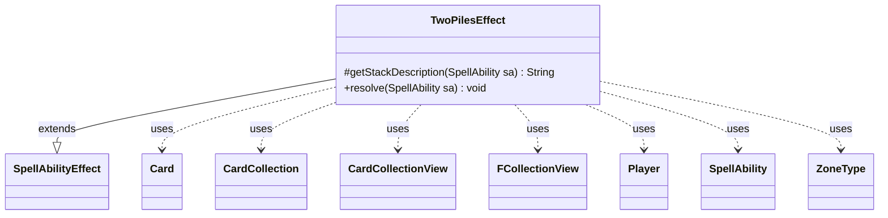

---
aliases:
  - TwoPilesEffect
tags:
  - java/class
  - module/forge-game
  - pkg/forge/game/ability/effects
fqn: forge.game.ability.effects.TwoPilesEffect
package: forge.game.ability.effects
module: forge-game
kind: Class
---

# TwoPilesEffect

**Package:** `forge.game.ability.effects` &nbsp; **Module:** `forge-game` &nbsp; **Kind:** Class



## Relationships
**Extends:**
- [[forge.game.ability.SpellAbilityEffect|SpellAbilityEffect]]
**Uses:**
- [[forge.game.card.Card|Card]]
- [[forge.game.card.CardCollection|CardCollection]]
- [[forge.game.card.CardCollectionView|CardCollectionView]]
- [[forge.game.player.Player|Player]]
- [[forge.game.spellability.SpellAbility|SpellAbility]]
- [[forge.game.zone.ZoneType|ZoneType]]
- [[forge.util.collect.FCollectionView|FCollectionView]]

## Design Description

TwoPilesEffect implements the "separate into two piles" mechanic common to Magic cards, executing as a concrete `SpellAbilityEffect` subclass within the ability-effects framework. It overrides `getStackDescription` to render a human-readable summary and `resolve` to carry out the partitioning: for each target Player it gathers a valid `CardCollection` from a configured `ZoneType` (or explicitly defined cards), has a separator player divide them into two piles, and lets a chooser select one—supporting left/right and face-down variants driven by `SpellAbility` parameters.

The design is heavily data-driven, deriving behavior entirely from script parameters (Separator, Chooser, DefinedPiles, ChosenPile/UnchosenPile, RememberChosen) rather than subtyping. It collaborates with `AbilityUtils` to resolve defined players/cards and dispatch additional sub-abilities against each pile, using the host `Card`'s remembered-object list as a transient hand-off channel—carefully saving and restoring prior remembered state to keep the two sub-resolutions isolated and backward-compatible.

## Source
`forge-game/src/main/java/forge/game/ability/effects/TwoPilesEffect.java`

```java
package forge.game.ability.effects;

import java.util.List;

import com.google.common.collect.Lists;
import forge.game.ability.AbilityUtils;
import forge.game.ability.SpellAbilityEffect;
import forge.game.card.Card;
import forge.game.card.CardCollection;
import forge.game.card.CardCollectionView;
import forge.game.card.CardLists;
import forge.game.player.Player;
import forge.game.spellability.SpellAbility;
import forge.game.zone.ZoneType;
import forge.util.Lang;
import forge.util.Localizer;
import forge.util.collect.FCollectionView;

public class TwoPilesEffect extends SpellAbilityEffect {

    /* (non-Javadoc)
     * @see forge.card.abilityfactory.SpellEffect#getStackDescription(java.util.Map, forge.card.spellability.SpellAbility)
     */
    @Override
    protected String getStackDescription(SpellAbility sa) {
        final StringBuilder sb = new StringBuilder();

        final String valid = sa.getParamOrDefault("ValidCards", "");

        sb.append("Separate all ").append(valid).append(" cards ");

        sb.append(Lang.joinHomogenous(getTargetPlayers(sa)));
        sb.append(" controls into two piles.");
        return sb.toString();
    }

    /* (non-Javadoc)
     * @see forge.card.abilityfactory.SpellEffect#resolve(java.util.Map, forge.card.spellability.SpellAbility)
     */
    @Override
    public void resolve(SpellAbility sa) {
        final Card source = sa.getHostCard();
        ZoneType zone = null;
        boolean pile1WasChosen = true;
        boolean isLeftRightPile = sa.hasParam("LeftRightPile");

        if (sa.hasParam("Zone")) {
            zone = ZoneType.smartValueOf(sa.getParam("Zone"));
        }

        final String valid = sa.getParamOrDefault("ValidCards", "Card");

        final List<Player> tgtPlayers = getTargetPlayers(sa);

        Player separator = source.getController();
        if (sa.hasParam("Separator")) {
            final FCollectionView<Player> choosers = AbilityUtils.getDefinedPlayers(source, sa.getParam("Separator"), sa);
            if (!choosers.isEmpty()) {
                separator = sa.getActivatingPlayer().getController().chooseSingleEntityForEffect(choosers, null, sa, Localizer.getInstance().getMessage("lblChooser") + ":", false, null, null);
            }
        }

        Player chooser = tgtPlayers.get(0);
        if (sa.hasParam("Chooser")) {
            final FCollectionView<Player> choosers = AbilityUtils.getDefinedPlayers(source, sa.getParam("Chooser"), sa);
            if (!choosers.isEmpty()) {
                chooser = sa.getActivatingPlayer().getController().chooseSingleEntityForEffect(choosers, null, sa, Localizer.getInstance().getMessage("lblChooser") + ":", false, null, null);
            }
        }

        for (final Player p : tgtPlayers) {
            if (!p.isInGame()) {
                continue;
            }

            // first, separate the cards into piles
            final CardCollectionView pile1;
            final CardCollection pile2;
            if (sa.hasParam("DefinedPiles")) {
                final String[] def = sa.getParam("DefinedPiles").split(",", 2);
                pile1 = AbilityUtils.getDefinedCards(source, def[0], sa);
                pile2 = AbilityUtils.getDefinedCards(source, def[1], sa);
            } else {
                CardCollectionView pool0;
                if (sa.hasParam("DefinedCards")) {
                    pool0 = AbilityUtils.getDefinedCards(source, sa.getParam("DefinedCards"), sa);
                } else {
                    pool0 = p.getCardsIn(zone);
                }
                CardCollection pool = CardLists.getValidCards(pool0, valid, source.getController(), source, sa);
                int size = pool.size();
                if (size == 0) {
                    return;
                }
                String title;
                if ("One".equals(sa.getParamOrDefault("FaceDown", "False"))) {
                    title = Localizer.getInstance().getMessage("lblSelectCardForFaceDownPile");
                } else if (isLeftRightPile) {
                    title = Localizer.getInstance().getMessage("lblSelectCardForLeftPile");
                } else {
                    title = Localizer.getInstance().getMessage("lblDivideCardIntoTwoPiles");
                }
                pile1 = separator.getController().chooseCardsForEffect(pool, sa, title, 0, size, false, null);
                pile2 = new CardCollection(pool);
                pile2.removeAll(pile1);
            }

            if (isLeftRightPile) {
                pile1WasChosen = true;
            } else {
                pile1WasChosen = chooser.getController().chooseCardsPile(sa, pile1, pile2, sa.getParamOrDefault("FaceDown", "False"));
            }
            CardCollectionView chosenPile = pile1WasChosen ? pile1 : pile2;
            CardCollectionView unchosenPile = !pile1WasChosen ? pile1 : pile2;

            StringBuilder notification = new StringBuilder();
            if (isLeftRightPile) {
                notification.append("\n");
                notification.append(Lang.getInstance().getPossessedObject(separator.getName(), Localizer.getInstance().getMessage("lblLeftPile")));
                notification.append("\n--------------------\n");
                if (!chosenPile.isEmpty()) {
                    for (Card c : chosenPile) {
                        notification.append(c.getName()).append("\n");
                    }
                } else {
                    notification.append("(" + Localizer.getInstance().getMessage("lblEmptyPile") + ")\n");
                }
                notification.append("\n");
                notification.append(Lang.getInstance().getPossessedObject(separator.getName(), Localizer.getInstance().getMessage("lblRightPile")));
                notification.append("\n--------------------\n");
                if (!unchosenPile.isEmpty()) {
                    for (Card c : unchosenPile) {
                        notification.append(c.getName()).append("\n");
                    }
                } else {
                    notification.append("(" + Localizer.getInstance().getMessage("lblEmptyPile") + ")\n");
                }
                p.getGame().getAction().notifyOfValue(sa, separator, notification.toString(), separator);
            } else {
                notification.append(chooser + " " + Localizer.getInstance().getMessage("lblChoosesPile") + " " + (pile1WasChosen ? "1" : "2") + ":\n");
                if (!chosenPile.isEmpty()) {
                    for (Card c : chosenPile) {
                        notification.append(c.getName()).append("\n");
                    }
                } else {
                    notification.append("(" + Localizer.getInstance().getMessage("lblEmptyPile") + ")");
                }
                p.getGame().getAction().notifyOfValue(sa, chooser, notification.toString(), chooser);
            }


            if (sa.hasParam("RememberChosen")) {
                source.addRemembered(chosenPile);
            }

            // take action on the chosen pile
            if (sa.hasParam("ChosenPile")) {
                List<Object> tempRemembered = Lists.newArrayList(source.getRemembered());
                source.removeRemembered(tempRemembered);
                source.addRemembered(chosenPile);

                SpellAbility sub = sa.getAdditionalAbility("ChosenPile");
                if (sub != null) {
                    AbilityUtils.resolve(sub);
                }
                source.removeRemembered(chosenPile);
                source.addRemembered(tempRemembered);
            }

            // take action on the unchosen pile
            if (sa.hasParam("UnchosenPile")) {
                List<Object> tempRemembered = Lists.newArrayList(source.getRemembered());
                source.removeRemembered(tempRemembered);
                source.addRemembered(unchosenPile);

                SpellAbility sub = sa.getAdditionalAbility("UnchosenPile");
                if (sub != null) {
                    AbilityUtils.resolve(sub);
                }
                source.removeRemembered(unchosenPile);
                source.addRemembered(tempRemembered);
            }
        }

        if (!sa.hasParam("KeepRemembered") && !sa.hasParam("RememberChosen")) {
            // prior to addition of "DefinedPiles" param, TwoPilesEffect cleared remembered objects in the
            // Chosen/Unchosen subability resolutions, so this preserves that
            source.clearRemembered();
        }

        source.getGame().incPiledGuessedSA();
    }
}
```
