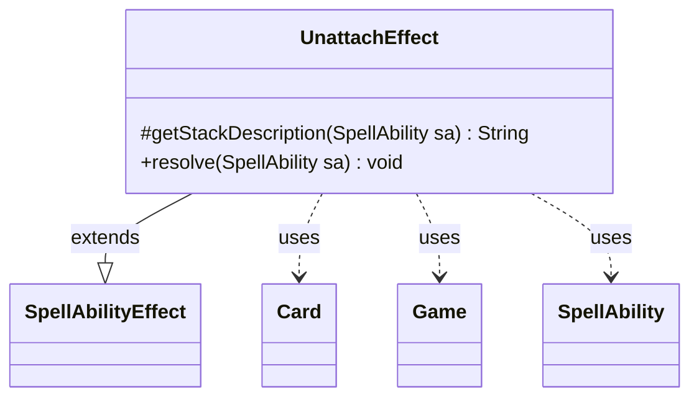

---
aliases:
  - UnattachEffect
tags:
  - java/class
  - module/forge-game
  - pkg/forge/game/ability/effects
fqn: forge.game.ability.effects.UnattachEffect
package: forge.game.ability.effects
module: forge-game
kind: Class
---

# UnattachEffect

**Package:** `forge.game.ability.effects` &nbsp; **Module:** `forge-game` &nbsp; **Kind:** Class



## Relationships
**Extends:**
- [[forge.game.ability.SpellAbilityEffect|SpellAbilityEffect]]
**Uses:**
- [[forge.game.Game|Game]]
- [[forge.game.card.Card|Card]]
- [[forge.game.spellability.SpellAbility|SpellAbility]]

## Design Description

UnattachEffect is a resolution handler for the "Unattach" spell ability, extending SpellAbilityEffect to plug into Forge's ability-factory framework. It overrides getStackDescription to render a human-readable stack entry ("Unattach " followed by the affected cards) and resolve to perform the actual game mutation. During resolution it iterates over the ability's defined or targeted Cards, querying the Game for each card's current state to guard against stale references—skipping cards no longer in play, replaced by last-known-information copies, or whose game timestamp has changed. For each still-valid attachment, it detaches the card from whatever entity it is attached to.

The design intent is defensive: rather than trusting the targets captured when the ability was cast, it revalidates each against live game state before mutating, ensuring the effect only acts on genuinely present, unchanged attachments.

## Source
`forge-game/src/main/java/forge/game/ability/effects/UnattachEffect.java`

```java
package forge.game.ability.effects;

import forge.game.Game;
import forge.game.ability.SpellAbilityEffect;
import forge.game.card.Card;
import forge.game.spellability.SpellAbility;
import forge.util.Lang;

public class UnattachEffect extends SpellAbilityEffect {
    /* (non-Javadoc)
     * @see forge.card.abilityfactory.SpellEffect#getStackDescription(java.util.Map, forge.card.spellability.SpellAbility)
     */
    @Override
    protected String getStackDescription(SpellAbility sa) {
        final StringBuilder sb = new StringBuilder();
        sb.append("Unattach ");
        sb.append(Lang.joinHomogenous(getDefinedCardsOrTargeted(sa)));
        return sb.toString();
    }

    /* (non-Javadoc)
     * @see forge.card.abilityfactory.SpellEffect#resolve(java.util.Map, forge.card.spellability.SpellAbility)
     */
    @Override
    public void resolve(SpellAbility sa) {
        final Game game = sa.getHostCard().getGame();
        for (final Card tgtC : getDefinedCardsOrTargeted(sa)) {
            if (!tgtC.isInPlay()) {
                continue;
            }
            // check if the object is still in game or if it was moved
            Card gameCard = game.getCardState(tgtC, null);
            // gameCard is LKI in that case, the card is not in game anymore
            // or the timestamp did change
            // this should check Self too
            if (gameCard == null || !tgtC.equalsWithGameTimestamp(gameCard)) {
                continue;
            }
            if (gameCard.isAttachment() && gameCard.isAttachedToEntity()) {
                gameCard.unattachFromEntity(gameCard.getEntityAttachedTo());
            }
        }
    }
}
```
