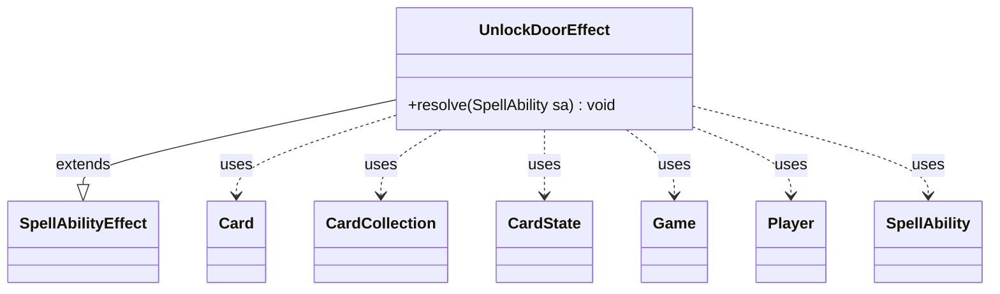

---
aliases:
  - UnlockDoorEffect
tags:
  - java/class
  - module/forge-game
  - pkg/forge/game/ability/effects
fqn: forge.game.ability.effects.UnlockDoorEffect
package: forge.game.ability.effects
module: forge-game
kind: Class
---

# UnlockDoorEffect

**Package:** `forge.game.ability.effects` &nbsp; **Module:** `forge-game` &nbsp; **Kind:** Class



## Relationships
**Extends:**
- [[forge.game.ability.SpellAbilityEffect|SpellAbilityEffect]]
**Uses:**
- [[forge.game.Game|Game]]
- [[forge.game.card.Card|Card]]
- [[forge.game.card.CardCollection|CardCollection]]
- [[forge.game.card.CardState|CardState]]
- [[forge.game.player.Player|Player]]
- [[forge.game.spellability.SpellAbility|SpellAbility]]

## Design Description

UnlockDoorEffect is a resolution handler for the "UnlockDoor" spell ability, extending `SpellAbilityEffect` to plug into Forge's ability-effect framework where each effect subclass overrides `resolve(SpellAbility)`. It manipulates the locked/unlocked state of Room cards (the door mechanic), operating on either a player-chosen battlefield card matching the `Choices` filter or the ability's pre-selected targets.

Its central design intent is a `Mode` switch that dispatches between three behaviors: `ThisDoor` unlocks the room corresponding to the activating ability's card state, `Unlock` prompts the player to pick among currently locked rooms, and `LockOrUnlock` branches on how many rooms are locked to offer the appropriate lock-or-unlock choice. It collaborates with `Card` and `CardState` to query and mutate room states, `Player`/its controller for interactive selection, `CardCollection`/`CardLists` for candidate filtering, and `Localizer` for user-facing prompts.

## Source
`forge-game/src/main/java/forge/game/ability/effects/UnlockDoorEffect.java`

```java
package forge.game.ability.effects;

import java.util.List;
import java.util.Map;
import java.util.stream.Collectors;

import com.google.common.collect.Lists;
import com.google.common.collect.Maps;

import forge.card.CardStateName;
import forge.game.Game;
import forge.game.ability.SpellAbilityEffect;
import forge.game.card.Card;
import forge.game.card.CardCollection;
import forge.game.card.CardLists;
import forge.game.card.CardState;
import forge.game.player.Player;
import forge.game.spellability.SpellAbility;
import forge.game.zone.ZoneType;
import forge.util.Localizer;

public class UnlockDoorEffect extends SpellAbilityEffect {

    @Override
    public void resolve(SpellAbility sa) {
        final Card source = sa.getHostCard();
        final Game game = source.getGame();
        final Player activator = sa.getActivatingPlayer();

        CardCollection list;

        if (sa.hasParam("Choices")) {
            Player chooser = activator;
            String title = sa.hasParam("ChoiceTitle") ? sa.getParam("ChoiceTitle") : Localizer.getInstance().getMessage("lblChoose") + " ";

            CardCollection choices = CardLists.getValidCards(game.getCardsIn(ZoneType.Battlefield), sa.getParam("Choices"), activator, source, sa);

            Card c = chooser.getController().chooseSingleEntityForEffect(choices, sa, title, Maps.newHashMap());
            if (c == null) {
                return;
            }
            list = new CardCollection(c);
        } else {
            list = getTargetCards(sa);
        }

        for (Card c : list) {
            Map<String, Object> params = Maps.newHashMap();
            params.put("Object", c);
            switch (sa.getParamOrDefault("Mode", "ThisDoor")) {          
            case "ThisDoor":
                c.unlockRoom(activator, sa.getCardStateName());
                break;
            case "Unlock":
                List<CardState> states = c.getLockedRooms().stream().map(c::getState).collect(Collectors.toList());

                // need to choose Room Name
                CardState chosen = activator.getController().chooseSingleCardState(sa, states, "Choose Room to unlock", params);
                if (chosen == null) {
                    continue;
                }
                c.unlockRoom(activator, chosen.getStateName());
                break;
            case "LockOrUnlock":
                switch (c.getLockedRooms().size()) {
                case 0:
                    // no locked, all unlocked, can only lock door
                    List<CardState> unlockStates = c.getUnlockedRooms().stream().map(c::getState).collect(Collectors.toList());
                    CardState chosenUnlock = activator.getController().chooseSingleCardState(sa, unlockStates, "Choose Room to lock", params);
                    if (chosenUnlock == null) {
                        continue;
                    }
                    c.lockRoom(activator, chosenUnlock.getStateName());
                    break;
                case 1:
                    // TODO check for Lock vs Unlock first?
                    List<CardState> bothStates = Lists.newArrayList();
                    bothStates.add(c.getState(CardStateName.LeftSplit));
                    bothStates.add(c.getState(CardStateName.RightSplit));
                    CardState chosenBoth = activator.getController().chooseSingleCardState(sa, bothStates, "Choose Room to lock or unlock", params);
                    if (chosenBoth == null) {
                        continue;
                    }
                    if (c.getLockedRooms().contains(chosenBoth.getStateName())) {
                        c.unlockRoom(activator, chosenBoth.getStateName());
                    } else {
                        c.lockRoom(activator, chosenBoth.getStateName());
                    }
                    break;
                case 2:
                    List<CardState> lockStates = c.getLockedRooms().stream().map(c::getState).collect(Collectors.toList());

                    // need to choose Room Name
                    CardState chosenLock = activator.getController().chooseSingleCardState(sa, lockStates, "Choose Room to unlock", params);
                    if (chosenLock == null) {
                        continue;
                    }
                    c.unlockRoom(activator, chosenLock.getStateName());
                    break;
                }
                break;
            }
        }
    }

}
```

## Python
`forge/game/ability/effects/UnlockDoorEffect.py`

```python
from forge.card.CardStateName import CardStateName
from forge.game.Game import Game
from forge.game.ability.SpellAbilityEffect import SpellAbilityEffect
from forge.game.card.Card import Card
from forge.game.card.CardCollection import CardCollection
from forge.game.card.CardLists import CardLists
from forge.game.card.CardState import CardState
from forge.game.player.Player import Player
from forge.game.spellability.SpellAbility import SpellAbility
from forge.game.zone.ZoneType import ZoneType
from forge.util.Localizer import Localizer


class UnlockDoorEffect(SpellAbilityEffect):

    def resolve(self, sa: SpellAbility) -> None:
        source = sa.getHostCard()
        game = source.getGame()
        activator = sa.getActivatingPlayer()

        list = None

        if sa.hasParam("Choices"):
            chooser = activator
            title = sa.getParam("ChoiceTitle") if sa.hasParam("ChoiceTitle") else Localizer.getInstance().getMessage("lblChoose") + " "

            choices = CardLists.getValidCards(game.getCardsIn(ZoneType.Battlefield), sa.getParam("Choices"), activator, source, sa)

            c = chooser.getController().chooseSingleEntityForEffect(choices, sa, title, {})
            if c is None:
                return
            list = CardCollection(c)
        else:
            list = self.getTargetCards(sa)

        for c in list:
            params: dict[str, object] = {}
            params["Object"] = c
            mode = sa.getParamOrDefault("Mode", "ThisDoor")
            if mode == "ThisDoor":
                c.unlockRoom(activator, sa.getCardStateName())
            elif mode == "Unlock":
                states = [c.getState(name) for name in c.getLockedRooms()]

                # need to choose Room Name
                chosen = activator.getController().chooseSingleCardState(sa, states, "Choose Room to unlock", params)
                if chosen is None:
                    continue
                c.unlockRoom(activator, chosen.getStateName())
            elif mode == "LockOrUnlock":
                locked_count = len(c.getLockedRooms())
                if locked_count == 0:
                    # no locked, all unlocked, can only lock door
                    unlockStates = [c.getState(name) for name in c.getUnlockedRooms()]
                    chosenUnlock = activator.getController().chooseSingleCardState(sa, unlockStates, "Choose Room to lock", params)
                    if chosenUnlock is None:
                        continue
                    c.lockRoom(activator, chosenUnlock.getStateName())
                elif locked_count == 1:
                    # TODO check for Lock vs Unlock first?
                    bothStates = []
                    bothStates.append(c.getState(CardStateName.LeftSplit))
                    bothStates.append(c.getState(CardStateName.RightSplit))
                    chosenBoth = activator.getController().chooseSingleCardState(sa, bothStates, "Choose Room to lock or unlock", params)
                    if chosenBoth is None:
                        continue
                    if chosenBoth.getStateName() in c.getLockedRooms():
                        c.unlockRoom(activator, chosenBoth.getStateName())
                    else:
                        c.lockRoom(activator, chosenBoth.getStateName())
                elif locked_count == 2:
                    lockStates = [c.getState(name) for name in c.getLockedRooms()]

                    # need to choose Room Name
                    chosenLock = activator.getController().chooseSingleCardState(sa, lockStates, "Choose Room to unlock", params)
                    if chosenLock is None:
                        continue
                    c.unlockRoom(activator, chosenLock.getStateName())
```
