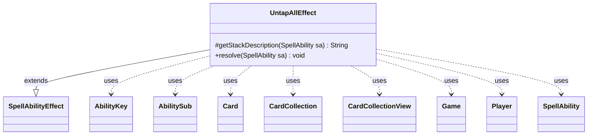

---
aliases:
  - UntapAllEffect
tags:
  - java/class
  - module/forge-game
  - pkg/forge/game/ability/effects
fqn: forge.game.ability.effects.UntapAllEffect
package: forge.game.ability.effects
module: forge-game
kind: Class
---

# UntapAllEffect

**Package:** `forge.game.ability.effects` &nbsp; **Module:** `forge-game` &nbsp; **Kind:** Class



## Relationships
**Extends:**
- [[forge.game.ability.SpellAbilityEffect|SpellAbilityEffect]]
**Uses:**
- [[forge.game.Game|Game]]
- [[forge.game.ability.AbilityKey|AbilityKey]]
- [[forge.game.card.Card|Card]]
- [[forge.game.card.CardCollection|CardCollection]]
- [[forge.game.card.CardCollectionView|CardCollectionView]]
- [[forge.game.player.Player|Player]]
- [[forge.game.spellability.AbilitySub|AbilitySub]]
- [[forge.game.spellability.SpellAbility|SpellAbility]]

## Design Description

UntapAllEffect implements the resolution logic for "untap all" spell abilities, translating a parsed `SpellAbility` into the concrete act of untapping a filtered set of battlefield cards. As a concrete subclass of `SpellAbilityEffect`, it overrides `getStackDescription` to supply player-facing text and `resolve` to perform the work, fitting Forge's effect-handler pattern where each ability keyword maps to one effect class.

The design favors data-driven flexibility: scope is chosen from targeting, `Defined`, or the whole battlefield, then narrowed via a `ValidCards` filter, while optional parameters (`ControllerUntaps`, `RememberUntapped`) adjust behavior without subclassing. Successfully untapped cards are accumulated per-untapping `Player` in a `Map<Player, CardCollection>`, which is passed as an `AbilityKey.Map` payload to fire a single `UntapAll` trigger—decoupling the mechanical untap from downstream triggered responses and collaborating loosely with `Game`, `Card`, and the trigger handler.

## Source
`forge-game/src/main/java/forge/game/ability/effects/UntapAllEffect.java`

```java
package forge.game.ability.effects;

import com.google.common.collect.Maps;
import forge.game.Game;
import forge.game.ability.AbilityKey;
import forge.game.ability.AbilityUtils;
import forge.game.ability.SpellAbilityEffect;
import forge.game.card.Card;
import forge.game.card.CardCollection;
import forge.game.card.CardCollectionView;
import forge.game.player.Player;
import forge.game.spellability.AbilitySub;
import forge.game.spellability.SpellAbility;
import forge.game.trigger.TriggerType;
import forge.game.zone.ZoneType;

import java.util.Map;

public class UntapAllEffect extends SpellAbilityEffect {
    @Override
    protected String getStackDescription(SpellAbility sa) {
        if (sa instanceof AbilitySub) {
            return "Untap all valid cards.";
        }
        return sa.getParam("SpellDescription");
    }

    @Override
    public void resolve(SpellAbility sa) {
        final Card card = sa.getHostCard();
        final Player activator = sa.getActivatingPlayer();
        final Game game = activator.getGame();
        Map<Player, CardCollection> untapMap = Maps.newHashMap();

        CardCollectionView list = !sa.usesTargeting() && !sa.hasParam("Defined") ?
                game.getCardsIn(ZoneType.Battlefield) :
                getDefinedPlayersOrTargeted(sa).getCardsIn(ZoneType.Battlefield);

        list = AbilityUtils.filterListByType(list, sa.getParamOrDefault("ValidCards", ""), sa);

        Player untapper = activator;

        for (Card c : list) {
            if (sa.hasParam("ControllerUntaps")) {
                untapper = c.getController();
            }
            if (c.untap())  {
                untapMap.computeIfAbsent(untapper, i -> new CardCollection()).add(c);
                if (sa.hasParam("RememberUntapped")) card.addRemembered(c);

            }
        }

        if (!untapMap.isEmpty()) {
            final Map<AbilityKey, Object> runParams = AbilityKey.newMap();
            runParams.put(AbilityKey.Map, untapMap);
            game.getTriggerHandler().runTrigger(TriggerType.UntapAll, runParams, false);
        }
    }
}
```
