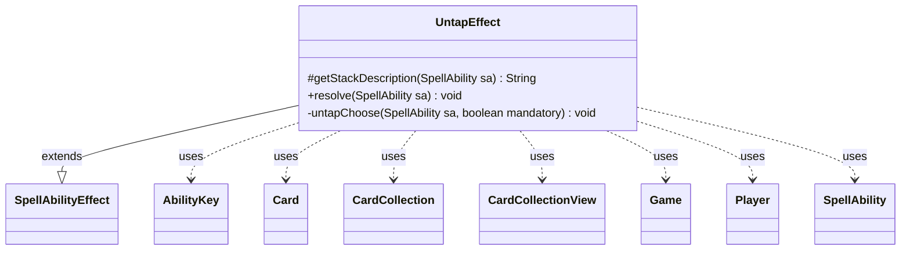

---
aliases:
  - UntapEffect
tags:
  - java/class
  - module/forge-game
  - pkg/forge/game/ability/effects
fqn: forge.game.ability.effects.UntapEffect
package: forge.game.ability.effects
module: forge-game
kind: Class
---

# UntapEffect

**Package:** `forge.game.ability.effects`   **Module:** `forge-game`   **Kind:** Class



## Relationships
**Extends:**
- [[forge.game.ability.SpellAbilityEffect|SpellAbilityEffect]]
**Uses:**
- [[forge.game.Game|Game]]
- [[forge.game.ability.AbilityKey|AbilityKey]]
- [[forge.game.card.Card|Card]]
- [[forge.game.card.CardCollection|CardCollection]]
- [[forge.game.card.CardCollectionView|CardCollectionView]]
- [[forge.game.player.Player|Player]]
- [[forge.game.spellability.SpellAbility|SpellAbility]]

## Design Description

UntapEffect is a concrete effect handler that implements the untapping of permanents as the resolution of a spell or ability. Extending `SpellAbilityEffect`, it overrides `getStackDescription` to render human-readable text and `resolve` to apply the effect, dispatching among three modes: untapping a fixed set of targeted cards, untapping "up to" a count, or untapping "exactly" a count. The latter two delegate to the private `untapChoose` helper, which gathers valid battlefield cards per defined player and prompts each controller to select cards.

The design carefully guards against stale state, skipping phased-out cards and verifying each target still matches its in-game counterpart by game timestamp before untapping. It collaborates with `Game`, `Player`, `Card`/`CardCollection`, and `SpellAbility` to access game state, and—except in the ETB case, which suppresses triggers—fires an `UntapAll` trigger via `AbilityKey`-keyed parameters so dependent triggered abilities respond.

## Source
`forge-game/src/main/java/forge/game/ability/effects/UntapEffect.java`

```java
package forge.game.ability.effects;

import com.google.common.collect.Maps;

import forge.game.Game;
import forge.game.ability.AbilityKey;
import forge.game.ability.AbilityUtils;
import forge.game.ability.SpellAbilityEffect;
import forge.game.card.*;
import forge.game.player.Player;
import forge.game.spellability.SpellAbility;
import forge.game.trigger.TriggerType;
import forge.game.zone.ZoneType;
import forge.util.Lang;
import forge.util.Localizer;

import java.util.Map;

public class UntapEffect extends SpellAbilityEffect {

    /* (non-Javadoc)
     * @see forge.card.abilityfactory.SpellEffect#getStackDescription(java.util.Map, forge.card.spellability.SpellAbility)
     */
    @Override
    protected String getStackDescription(SpellAbility sa) {
        // when getStackDesc is called, just build exactly what is happening
        final StringBuilder sb = new StringBuilder();

        sb.append("Untap ");

        if (sa.hasParam("UntapUpTo")) {
            sb.append("up to ").append(sa.getParam("Amount")).append(" ");
            sb.append(sa.getParam("UntapType")).append("s");
        } else {
            sb.append(Lang.joinHomogenous(getTargetCards(sa)));
        }
        sb.append(".");
        return sb.toString();
    }

    @Override
    public void resolve(SpellAbility sa) {
        final Player activator = sa.getActivatingPlayer();
        final boolean etb = sa.hasParam("ETB");
        final Game game = sa.getHostCard().getGame();

        if (sa.hasParam("UntapUpTo")) {
            untapChoose(sa, false);
        } else if (sa.hasParam("UntapExactly")) {
            untapChoose(sa, true);
        } else {
            final CardCollection affectedCards = getTargetCards(sa);
            affectedCards.addAll(CardUtil.getRadiance(sa));

            CardCollection untapped = new CardCollection();
            for (final Card tgtC : affectedCards) {
                if (tgtC.isPhasedOut()) {
                    continue;
                }
                if (tgtC.isInPlay()) {
                    // check if the object is still in game or if it was moved
                    Card gameCard = game.getCardState(tgtC, null);
                    // gameCard is LKI in that case, the card is not in game anymore
                    // or the timestamp did change
                    // this should check Self too
                    if (gameCard == null || !tgtC.equalsWithGameTimestamp(gameCard)) {
                        continue;
                    }
                    if (gameCard.untap()) untapped.add(gameCard);
                }
                if (etb) {
                    // do not fire triggers
                    tgtC.setTapped(false);
                }
            }
            if (!untapped.isEmpty() && !etb) {
                final Map<AbilityKey, Object> runParams = AbilityKey.newMap();
                final Map<Player, CardCollection> map = Maps.newHashMap();
                map.put(activator, untapped);
                runParams.put(AbilityKey.Map, map);
                activator.getGame().getTriggerHandler().runTrigger(TriggerType.UntapAll, runParams, false);
            }
        }
    }

    /**
     * <p>
     * Choose cards to untap.
     * </p>
     *
     * @param sa
     *            a {@link SpellAbility}.
     * @param mandatory
     *            whether the untapping is mandatory.
     */
    private static void untapChoose(final SpellAbility sa, final boolean mandatory) {
        final Map<Player, CardCollection> map = Maps.newHashMap();
        final int num = AbilityUtils.calculateAmount(sa.getHostCard(), sa.getParam("Amount"), sa);
        final String valid = sa.getParam("UntapType");

        for (final Player p : AbilityUtils.getDefinedPlayers(sa.getHostCard(), sa.getParam("Defined"), sa)) {
            if (!p.isInGame()) {
                continue;
            }

            CardCollectionView list = CardLists.getValidCards(p.getGame().getCardsIn(ZoneType.Battlefield),
                    valid, sa.getActivatingPlayer(), sa.getHostCard(), sa);
            list = CardLists.filter(list, c -> c.canUntap(null, false));

            CardCollection untapped = new CardCollection();
            final CardCollectionView selected = p.getController().chooseCardsForEffect(list, sa, Localizer.getInstance().getMessage("lblSelectCardToUntap"), mandatory ? num : 0, num, !mandatory, null);
            if (selected != null) {
                for (final Card c : selected) {
                    if (c.untap()) untapped.add(c);
                }
            }
            if (!untapped.isEmpty()) {
                map.put(p, untapped);
            }
        }
        if (!map.isEmpty()) {
            final Map<AbilityKey, Object> runParams = AbilityKey.newMap();
            runParams.put(AbilityKey.Map, map);
            sa.getActivatingPlayer().getGame().getTriggerHandler().runTrigger(TriggerType.UntapAll, runParams, false);
        }
    }

}
```

## Python
`forge/game/ability/effects/UntapEffect.py`

```python
from forge.game.Game import Game
from forge.game.ability.AbilityKey import AbilityKey
from forge.game.ability.AbilityUtils import AbilityUtils
from forge.game.ability.SpellAbilityEffect import SpellAbilityEffect
from forge.game.card.Card import Card
from forge.game.card.CardCollection import CardCollection
from forge.game.card.CardCollectionView import CardCollectionView
from forge.game.card.CardLists import CardLists
from forge.game.card.CardUtil import CardUtil
from forge.game.player.Player import Player
from forge.game.spellability.SpellAbility import SpellAbility
from forge.game.trigger.TriggerType import TriggerType
from forge.game.zone.ZoneType import ZoneType
from forge.util.Lang import Lang
from forge.util.Localizer import Localizer


class UntapEffect(SpellAbilityEffect):

    # (non-Javadoc)
    # @see forge.card.abilityfactory.SpellEffect#getStackDescription(java.util.Map, forge.card.spellability.SpellAbility)
    def getStackDescription(self, sa: SpellAbility) -> str:
        # when getStackDesc is called, just build exactly what is happening
        sb = []

        sb.append("Untap ")

        if sa.hasParam("UntapUpTo"):
            sb.append("up to ")
            sb.append(sa.getParam("Amount"))
            sb.append(" ")
            sb.append(sa.getParam("UntapType"))
            sb.append("s")
        else:
            sb.append(Lang.joinHomogenous(self.getTargetCards(sa)))
        sb.append(".")
        return "".join(sb)

    def resolve(self, sa: SpellAbility) -> None:
        activator = sa.getActivatingPlayer()
        etb = sa.hasParam("ETB")
        game = sa.getHostCard().getGame()

        if sa.hasParam("UntapUpTo"):
            UntapEffect.untapChoose(sa, False)
        elif sa.hasParam("UntapExactly"):
            UntapEffect.untapChoose(sa, True)
        else:
            affectedCards = self.getTargetCards(sa)
            affectedCards.addAll(CardUtil.getRadiance(sa))

            untapped = CardCollection()
            for tgtC in affectedCards:
                if tgtC.isPhasedOut():
                    continue
                if tgtC.isInPlay():
                    # check if the object is still in game or if it was moved
                    gameCard = game.getCardState(tgtC, None)
                    # gameCard is LKI in that case, the card is not in game anymore
                    # or the timestamp did change
                    # this should check Self too
                    if gameCard is None or not tgtC.equalsWithGameTimestamp(gameCard):
                        continue
                    if gameCard.untap():
                        untapped.add(gameCard)
                if etb:
                    # do not fire triggers
                    tgtC.setTapped(False)
            if not untapped.isEmpty() and not etb:
                runParams = AbilityKey.newMap()
                map = {}
                map[activator] = untapped
                runParams[AbilityKey.Map] = map
                activator.getGame().getTriggerHandler().runTrigger(TriggerType.UntapAll, runParams, False)

    @staticmethod
    def untapChoose(sa: SpellAbility, mandatory: bool) -> None:
        """
        Choose cards to untap.

        :param sa: a SpellAbility.
        :param mandatory: whether the untapping is mandatory.
        """
        map: dict[Player, CardCollection] = {}
        num = AbilityUtils.calculateAmount(sa.getHostCard(), sa.getParam("Amount"), sa)
        valid = sa.getParam("UntapType")

        for p in AbilityUtils.getDefinedPlayers(sa.getHostCard(), sa.getParam("Defined"), sa):
            if not p.isInGame():
                continue

            list = CardLists.getValidCards(p.getGame().getCardsIn(ZoneType.Battlefield),
                    valid, sa.getActivatingPlayer(), sa.getHostCard(), sa)
            list = CardLists.filter(list, lambda c: c.canUntap(None, False))

            untapped = CardCollection()
            selected = p.getController().chooseCardsForEffect(list, sa, Localizer.getInstance().getMessage("lblSelectCardToUntap"), num if mandatory else 0, num, not mandatory, None)
            if selected is not None:
                for c in selected:
                    if c.untap():
                        untapped.add(c)
            if not untapped.isEmpty():
                map[p] = untapped
        if map:
            runParams = AbilityKey.newMap()
            runParams[AbilityKey.Map] = map
            sa.getActivatingPlayer().getGame().getTriggerHandler().runTrigger(TriggerType.UntapAll, runParams, False)
```
