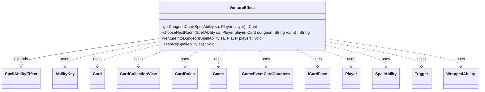

---
aliases:
  - VentureEffect
tags:
  - java/class
  - module/forge-game
  - pkg/forge/game/ability/effects
fqn: forge.game.ability.effects.VentureEffect
package: forge.game.ability.effects
module: forge-game
kind: Class
---

# VentureEffect

**Package:** `forge.game.ability.effects`   **Module:** `forge-game`   **Kind:** Class



## Relationships
**Extends:**
- [[forge.game.ability.SpellAbilityEffect|SpellAbilityEffect]]
**Uses:**
- [[forge.card.CardRules|CardRules]]
- [[forge.card.ICardFace|ICardFace]]
- [[forge.game.Game|Game]]
- [[forge.game.ability.AbilityKey|AbilityKey]]
- [[forge.game.card.Card|Card]]
- [[forge.game.card.CardCollectionView|CardCollectionView]]
- [[forge.game.event.GameEventCardCounters|GameEventCardCounters]]
- [[forge.game.player.Player|Player]]
- [[forge.game.spellability.SpellAbility|SpellAbility]]
- [[forge.game.trigger.Trigger|Trigger]]
- [[forge.game.trigger.WrappedAbility|WrappedAbility]]

## Design Description

VentureEffect implements the Magic: The Gathering "venture into the dungeon" mechanic as a resolvable spell/ability effect. Extending `SpellAbilityEffect`, it overrides `resolve` to advance each targeted, in-game player one room deeper into a dungeon. Its private helpers separate concerns: `getDungeonCard` locates the player's active dungeon in the command zone—completing a finished one and otherwise creating the chosen dungeon token via `CardFactory` and `StaticData`—while `chooseNextRoom` walks the dungeon's room `Trigger`s, wrapping branching options as `WrappedAbility` choices presented through the player's controller.

The design leans on Forge's broader systems rather than encapsulating dungeon state itself: rooms are modeled as triggered abilities, progression fires a `RoomEntered` trigger and a `GameEventCardCounters` event for UI feedback, and `StaticAbilityCantVenture` gates whether venturing is permitted. This keeps VentureEffect a thin orchestrator coordinating cards, players, triggers, and the game action layer to enact the mechanic.

## Source
`forge-game/src/main/java/forge/game/ability/effects/VentureEffect.java`

```java
package forge.game.ability.effects;

import java.util.ArrayList;
import java.util.List;
import java.util.Map;
import java.util.Objects;
import java.util.TreeMap;
import java.util.function.Predicate;
import java.util.stream.Collectors;

import com.google.common.collect.Lists;

import forge.StaticData;
import forge.card.CardRules;
import forge.card.GamePieceType;
import forge.card.ICardFace;
import forge.game.Game;
import forge.game.ability.AbilityKey;
import forge.game.ability.SpellAbilityEffect;
import forge.game.card.Card;
import forge.game.card.CardCollectionView;
import forge.game.card.CardFactory;
import forge.game.card.CounterType;
import forge.game.event.GameEventCardCounters;
import forge.game.player.Player;
import forge.game.spellability.SpellAbility;
import forge.game.staticability.StaticAbilityCantVenture;
import forge.game.trigger.Trigger;
import forge.game.trigger.TriggerType;
import forge.game.trigger.WrappedAbility;
import forge.game.zone.ZoneType;
import forge.util.Localizer;

public class VentureEffect extends SpellAbilityEffect {

    private Card getDungeonCard(SpellAbility sa, Player player) {
        final Game game = player.getGame();

        CardCollectionView commandCards = player.getCardsIn(ZoneType.Command);
        for (Card card : commandCards) {
            if (card.getType().isDungeon()) {
                if (!card.isInLastRoom()) {
                    return card;
                }
                // If the current dungeon is already in last room, complete it first.
                game.getAction().completeDungeon(player, card);
                break;
            }
        }

        Predicate<Map.Entry<String, CardRules>> filter;
        if (sa.hasParam("Dungeon")) {
            String dungeonType = sa.getParam("Dungeon");
            filter = e -> e.getValue().getType().hasSubtype(dungeonType);
        } else {
            // Create a new dungeon card chosen by player in command zone.
            filter = e -> e.getValue().isEnterableDungeon();
        }
        Map<ICardFace, String> mapping = StaticData.instance().getAllTokens().getRules().entrySet()
                .stream().filter(filter).collect(Collectors.toMap(e -> e.getValue().getMainPart(), Map.Entry::getKey, (a,b) -> a, TreeMap::new));
        String message = Localizer.getInstance().getMessage("lblChooseDungeon");
        ICardFace chosen = player.getController().chooseSingleCardFace(sa, Lists.newArrayList(mapping.keySet()), message);
        if (chosen == null) {
            return null;
        }
        String script = mapping.get(chosen);
        final Card host = sa.getHostCard();
        Card editionHost = sa.getOriginalHost();

        String edition = Objects.requireNonNullElse(editionHost, host).getSetCode();
        edition = Objects.requireNonNullElse(StaticData.instance().getCardEdition(edition).getTokenSet(script), edition);

        final Card dungeon = CardFactory.getCard(StaticData.instance().getAllTokens().getToken(script, edition), player, game);
        dungeon.setGamePieceType(GamePieceType.DUNGEON);

        game.getAction().moveToCommand(dungeon, sa);

        return dungeon;
    }

    private String chooseNextRoom(SpellAbility sa, Player player, Card dungeon, String room) {
        String nextRoomParam = "";
        for (final Trigger t : dungeon.getTriggers()) {
            SpellAbility roomSA = t.getOverridingAbility();
            if (roomSA.getParam("RoomName").equals(room)) {
                nextRoomParam = roomSA.getParam("NextRoomName");
                break;
            }
        }
        String [] nextRoomNames = nextRoomParam.split(",");
        if (nextRoomNames.length == 1) {
            return nextRoomNames[0];
        }

        List<SpellAbility> candidates = new ArrayList<>();
        for (String nextRoomName : nextRoomNames) {
            for (final Trigger t : dungeon.getTriggers()) {
                SpellAbility roomSA = t.getOverridingAbility();
                if (roomSA.getParam("RoomName").equals(nextRoomName)) {
                    candidates.add(new WrappedAbility(t, roomSA, player));
                    break;
                }
            }
        }
        final String title = Localizer.getInstance().getMessage("lblChooseRoom");
        SpellAbility chosen = player.getController().chooseSingleSpellForEffect(candidates, sa, title, null);
        return chosen.getParam("RoomName");
    }

    private void ventureIntoDungeon(SpellAbility sa, Player player) {
        if (StaticAbilityCantVenture.cantVenture(player)) {
            return;
        }

        final Game game = player.getGame();
        Card dungeon = getDungeonCard(sa, player);
        String room = dungeon.getCurrentRoom();

        String nextRoom;
        // Determine next room to venture into
        if (room == null || room.isEmpty()) {
            SpellAbility roomSA = dungeon.getTriggers().get(0).getOverridingAbility();
            nextRoom = roomSA.getParam("RoomName");
        } else {
            nextRoom = chooseNextRoom(sa, player, dungeon, room);
        }

        dungeon.setCurrentRoom(nextRoom);
        // TODO: Currently play the Add Counter sound, but maybe add soundeffect for marker?
        game.fireEvent(new GameEventCardCounters(dungeon, CounterType.getType("LEVEL"), 0, 1));

        final Map<AbilityKey, Object> runParams = AbilityKey.mapFromCard(dungeon);
        runParams.put(AbilityKey.RoomName, nextRoom);
        game.getTriggerHandler().runTrigger(TriggerType.RoomEntered, runParams, false);

        player.incrementVenturedThisTurn();
    }

    @Override
    public void resolve(SpellAbility sa) {
        for (final Player p : getTargetPlayers(sa)) {
            if (!p.isInGame()) {
                continue;
            }
            ventureIntoDungeon(sa, p);
        }
    }

}
```

## Python
`forge/game/ability/effects/VentureEffect.py`

```python
from typing import List, Map

from forge.StaticData import StaticData
from forge.card.CardRules import CardRules
from forge.card.GamePieceType import GamePieceType
from forge.card.ICardFace import ICardFace
from forge.game.Game import Game
from forge.game.ability.AbilityKey import AbilityKey
from forge.game.ability.SpellAbilityEffect import SpellAbilityEffect
from forge.game.card.Card import Card
from forge.game.card.CardCollectionView import CardCollectionView
from forge.game.card.CardFactory import CardFactory
from forge.game.card.CounterType import CounterType
from forge.game.event.GameEventCardCounters import GameEventCardCounters
from forge.game.player.Player import Player
from forge.game.spellability.SpellAbility import SpellAbility
from forge.game.staticability.StaticAbilityCantVenture import StaticAbilityCantVenture
from forge.game.trigger.Trigger import Trigger
from forge.game.trigger.TriggerType import TriggerType
from forge.game.trigger.WrappedAbility import WrappedAbility
from forge.game.zone.ZoneType import ZoneType
from forge.util.Localizer import Localizer


class VentureEffect(SpellAbilityEffect):

    def getDungeonCard(self, sa: SpellAbility, player: Player) -> Card:
        game = player.getGame()

        commandCards = player.getCardsIn(ZoneType.Command)
        for card in commandCards:
            if card.getType().isDungeon():
                if not card.isInLastRoom():
                    return card
                # If the current dungeon is already in last room, complete it first.
                game.getAction().completeDungeon(player, card)
                break

        if sa.hasParam("Dungeon"):
            dungeonType = sa.getParam("Dungeon")
            filter = lambda e: e[1].getType().hasSubtype(dungeonType)
        else:
            # Create a new dungeon card chosen by player in command zone.
            filter = lambda e: e[1].isEnterableDungeon()

        mapping: dict[ICardFace, str] = {}
        entries = StaticData.instance().getAllTokens().getRules().entrySet()
        for e in sorted(
            (entry for entry in entries if filter((entry.getKey(), entry.getValue()))),
            key=lambda entry: entry.getValue().getMainPart(),
        ):
            mainPart = e.getValue().getMainPart()
            if mainPart not in mapping:
                mapping[mainPart] = e.getKey()

        message = Localizer.getInstance().getMessage("lblChooseDungeon")
        chosen = player.getController().chooseSingleCardFace(sa, list(mapping.keys()), message)
        if chosen is None:
            return None
        script = mapping.get(chosen)
        host = sa.getHostCard()
        editionHost = sa.getOriginalHost()

        edition = (editionHost if editionHost is not None else host).getSetCode()
        tokenSet = StaticData.instance().getCardEdition(edition).getTokenSet(script)
        edition = tokenSet if tokenSet is not None else edition

        dungeon = CardFactory.getCard(StaticData.instance().getAllTokens().getToken(script, edition), player, game)
        dungeon.setGamePieceType(GamePieceType.DUNGEON)

        game.getAction().moveToCommand(dungeon, sa)

        return dungeon

    def chooseNextRoom(self, sa: SpellAbility, player: Player, dungeon: Card, room: str) -> str:
        nextRoomParam = ""
        for t in dungeon.getTriggers():
            roomSA = t.getOverridingAbility()
            if roomSA.getParam("RoomName") == room:
                nextRoomParam = roomSA.getParam("NextRoomName")
                break
        nextRoomNames = nextRoomParam.split(",")
        if len(nextRoomNames) == 1:
            return nextRoomNames[0]

        candidates: list[SpellAbility] = []
        for nextRoomName in nextRoomNames:
            for t in dungeon.getTriggers():
                roomSA = t.getOverridingAbility()
                if roomSA.getParam("RoomName") == nextRoomName:
                    candidates.append(WrappedAbility(t, roomSA, player))
                    break
        title = Localizer.getInstance().getMessage("lblChooseRoom")
        chosen = player.getController().chooseSingleSpellForEffect(candidates, sa, title, None)
        return chosen.getParam("RoomName")

    def ventureIntoDungeon(self, sa: SpellAbility, player: Player) -> None:
        if StaticAbilityCantVenture.cantVenture(player):
            return

        game = player.getGame()
        dungeon = self.getDungeonCard(sa, player)
        room = dungeon.getCurrentRoom()

        # Determine next room to venture into
        if room is None or room == "":
            roomSA = dungeon.getTriggers().get(0).getOverridingAbility()
            nextRoom = roomSA.getParam("RoomName")
        else:
            nextRoom = self.chooseNextRoom(sa, player, dungeon, room)

        dungeon.setCurrentRoom(nextRoom)
        # TODO: Currently play the Add Counter sound, but maybe add soundeffect for marker?
        game.fireEvent(GameEventCardCounters(dungeon, CounterType.getType("LEVEL"), 0, 1))

        runParams = AbilityKey.mapFromCard(dungeon)
        runParams[AbilityKey.RoomName] = nextRoom
        game.getTriggerHandler().runTrigger(TriggerType.RoomEntered, runParams, False)

        player.incrementVenturedThisTurn()

    def resolve(self, sa: SpellAbility) -> None:
        for p in self.getTargetPlayers(sa):
            if not p.isInGame():
                continue
            self.ventureIntoDungeon(sa, p)
```
