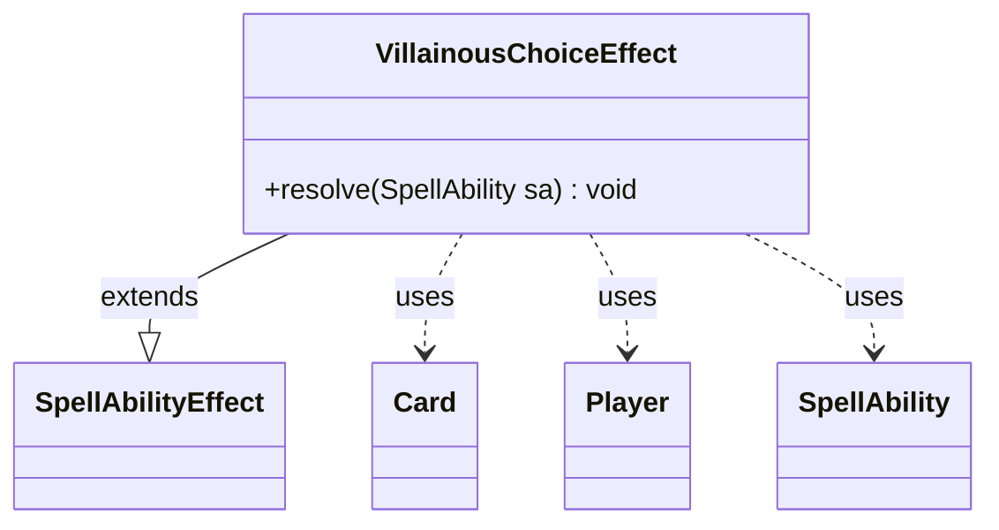

---
aliases:
  - VillainousChoiceEffect
tags:
  - java/class
  - module/forge-game
  - pkg/forge/game/ability/effects
fqn: forge.game.ability.effects.VillainousChoiceEffect
package: forge.game.ability.effects
module: forge-game
kind: Class
---

# VillainousChoiceEffect

**Package:** `forge.game.ability.effects`   **Module:** `forge-game`   **Kind:** Class



## Relationships
**Extends:**
- [[forge.game.ability.SpellAbilityEffect|SpellAbilityEffect]]
**Uses:**
- [[forge.game.card.Card|Card]]
- [[forge.game.player.Player|Player]]
- [[forge.game.spellability.SpellAbility|SpellAbility]]

## Design Description

VillainousChoiceEffect implements the resolution logic for "villainous choice" mechanics, where one or more players are each forced to select from a set of predefined alternatives and then suffer the consequences. As a concrete `SpellAbilityEffect` subclass, it overrides `resolve` to plug into Forge's ability-resolution framework, drawing its options from the host `SpellAbility`'s "Choices" additional-ability list and its prompt and amount from spell parameters.

For each defined or targeted `Player`, it consults the player's controller to choose abilities—looping once per the player's accumulated `getAdditionalVillainousChoices` count, since choices may repeat. Each chosen `SpellAbility` is resolved via `AbilityUtils`, with the host `Card` temporarily remembering the choosing player so downstream effects can reference who chose. The code notes a known limitation that the AI naively picks the first option rather than the least favorable one, signaling deliberately deferred decision-making sophistication.

## Source
`forge-game/src/main/java/forge/game/ability/effects/VillainousChoiceEffect.java`

```java
package forge.game.ability.effects;

import com.google.common.collect.ImmutableMap;
import com.google.common.collect.Lists;
import forge.game.ability.AbilityUtils;
import forge.game.ability.SpellAbilityEffect;
import forge.game.card.Card;
import forge.game.player.Player;
import forge.game.spellability.SpellAbility;

import java.util.List;

public class VillainousChoiceEffect extends SpellAbilityEffect {
    @Override
    public void resolve(SpellAbility sa) {
        final List<SpellAbility> abilities = Lists.newArrayList(sa.getAdditionalAbilityList("Choices"));
        final int amount = extractAmount(sa);
        String prompt = sa.getParamOrDefault("ChoicePrompt", "Villainous Choice by " + sa.getActivatingPlayer());
        Card source = sa.getHostCard();

        for (Player p : getDefinedPlayersOrTargeted(sa)) {
            int choiceAmount = p.getAdditionalVillainousChoices() + 1;

            // For the AI chooseSAForEffect really should take the least good ability. Currently it just takes the first
            List<SpellAbility> chosenSAs = Lists.newArrayList();
            for(int i = 0; i < choiceAmount; i++) {
                // This is a loop because you can choose the same abilities multiple times
                 chosenSAs.addAll(p.getController().chooseSpellAbilitiesForEffect(abilities, sa, prompt, amount, ImmutableMap.of()));
            }

            for (SpellAbility chosenSA : chosenSAs) {
                source.addRemembered(p);
                AbilityUtils.resolve(chosenSA);
                source.removeRemembered(p);
            }
        }
    }
}
```

## Python
`forge/game/ability/effects/VillainousChoiceEffect.py`

```python
from forge.game.ability.AbilityUtils import AbilityUtils
from forge.game.ability.SpellAbilityEffect import SpellAbilityEffect
from forge.game.card.Card import Card
from forge.game.player.Player import Player
from forge.game.spellability.SpellAbility import SpellAbility


class VillainousChoiceEffect(SpellAbilityEffect):
    def resolve(self, sa: SpellAbility) -> None:
        abilities: list[SpellAbility] = list(sa.getAdditionalAbilityList("Choices"))
        amount = self.extractAmount(sa)
        prompt = sa.getParamOrDefault("ChoicePrompt", "Villainous Choice by " + str(sa.getActivatingPlayer()))
        source: Card = sa.getHostCard()

        for p in self.getDefinedPlayersOrTargeted(sa):
            choiceAmount = p.getAdditionalVillainousChoices() + 1

            # For the AI chooseSAForEffect really should take the least good ability. Currently it just takes the first
            chosenSAs: list[SpellAbility] = []
            for i in range(choiceAmount):
                # This is a loop because you can choose the same abilities multiple times
                chosenSAs.extend(p.getController().chooseSpellAbilitiesForEffect(abilities, sa, prompt, amount, {}))

            for chosenSA in chosenSAs:
                source.addRemembered(p)
                AbilityUtils.resolve(chosenSA)
                source.removeRemembered(p)
```
