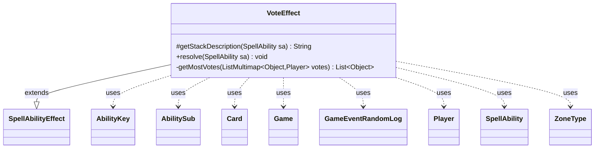

---
aliases:
  - VoteEffect
tags:
  - java/class
  - module/forge-game
  - pkg/forge/game/ability/effects
fqn: forge.game.ability.effects.VoteEffect
package: forge.game.ability.effects
module: forge-game
kind: Class
---

# VoteEffect

**Package:** `forge.game.ability.effects`   **Module:** `forge-game`   **Kind:** Class



## Relationships
**Extends:**
- [[forge.game.ability.SpellAbilityEffect|SpellAbilityEffect]]
**Uses:**
- [[forge.game.Game|Game]]
- [[forge.game.ability.AbilityKey|AbilityKey]]
- [[forge.game.card.Card|Card]]
- [[forge.game.event.GameEventRandomLog|GameEventRandomLog]]
- [[forge.game.player.Player|Player]]
- [[forge.game.spellability.AbilitySub|AbilitySub]]
- [[forge.game.spellability.SpellAbility|SpellAbility]]
- [[forge.game.zone.ZoneType|ZoneType]]

## Design Description

VoteEffect implements the resolution logic for vote-based card abilities within Forge's ability-effect framework, extending SpellAbilityEffect and overriding `getStackDescription` to summarize the vote and `resolve` to conduct it. It supports several vote subjects—predefined choices, valid cards in a zone, or players (including "vote for another player")—and orchestrates polling each targeted player in turn (starting from the activator), honoring additional and optional votes, secret ballots, and a delegated controller of the vote.

Tallying votes into a `ListMultimap<Object, Player>`, it broadcasts results, fires a `GameEventRandomLog`, and triggers `TriggerType.Vote`. The private `getMostVotes` helper determines the winning option(s), driving downstream behavior: per-vote sub-abilities, tie-handling, winner resolution, or stored vote counts. This data-driven, parameter-heavy design lets a single effect express Magic's diverse voting cards declaratively through `SpellAbility` parameters rather than bespoke code.

## Source
`forge-game/src/main/java/forge/game/ability/effects/VoteEffect.java`

```java
package forge.game.ability.effects;

import java.util.Collection;
import java.util.Collections;
import java.util.List;
import java.util.Map;

import forge.game.event.GameEventRandomLog;
import forge.util.Lang;
import org.apache.commons.lang3.StringUtils;

import com.google.common.collect.ArrayListMultimap;
import com.google.common.collect.ListMultimap;
import com.google.common.collect.Lists;
import com.google.common.collect.Maps;

import forge.game.Game;
import forge.game.ability.AbilityKey;
import forge.game.ability.AbilityUtils;
import forge.game.ability.SpellAbilityEffect;
import forge.game.card.Card;
import forge.game.card.CardLists;
import forge.game.player.Player;
import forge.game.spellability.AbilitySub;
import forge.game.spellability.SpellAbility;
import forge.game.trigger.TriggerType;
import forge.game.zone.ZoneType;
import forge.util.Localizer;

public class VoteEffect extends SpellAbilityEffect {

    /* (non-Javadoc)
     * @see forge.card.abilityfactory.SpellEffect#getStackDescription(java.util.Map, forge.card.spellability.SpellAbility)
     */
    @Override
    protected String getStackDescription(final SpellAbility sa) {
        final StringBuilder sb = new StringBuilder();
        sb.append(Lang.joinHomogenous(getDefinedPlayersOrTargeted(sa))).append(" vote ");
        if (sa.hasParam("Choices")) {
            sb.append("for ").append(StringUtils.join(sa.getAdditionalAbilityList("Choices"), " or "));
        } else if (sa.hasParam("VoteMessage")) {
            sb.append(sa.getParam("VoteMessage"));
        }
        sb.append(".");
        return sb.toString();
    }

    /* (non-Javadoc)
     * @see forge.card.abilityfactory.SpellEffect#resolve(java.util.Map, forge.card.spellability.SpellAbility)
     */
    @Override
    public void resolve(final SpellAbility sa) {
        final List<Player> tgtPlayers = getDefinedPlayersOrTargeted(sa);
        final List<Object> voteType = Lists.newArrayList();
        final Card host = sa.getHostCard();
        final Game game = host.getGame();
        final Player activator = sa.getActivatingPlayer();

        final boolean secret = sa.hasParam("Secretly");
        final boolean other = sa.hasParam("VotePlayer") && sa.getParam("VotePlayer").equals("Other");
        final StringBuilder record = new StringBuilder();

        if (sa.hasParam("Choices")) {
            voteType.addAll(sa.getAdditionalAbilityList("Choices"));
        } else if (sa.hasParam("VoteCard")) {
            ZoneType zone = sa.hasParam("Zone") ? ZoneType.smartValueOf(sa.getParam("Zone")) : ZoneType.Battlefield;
            voteType.addAll(CardLists.getValidCards(game.getCardsIn(zone), sa.getParam("VoteCard"), activator, host, sa));
        } else if (sa.hasParam("VotePlayer")) {
            String param = other ? "Player" : sa.getParam("VotePlayer");
            voteType.addAll(AbilityUtils.getDefinedPlayers(host, param, sa));
        }
        if (voteType.isEmpty()) {
            return;
        }

        // starting with the activator
        int aidx = tgtPlayers.indexOf(activator);
        if (aidx != -1) {
            Collections.rotate(tgtPlayers, -aidx);
        }

        ListMultimap<Object, Player> votes = ArrayListMultimap.create();
        Player voter = game.getControlVote();

        for (final Player p : tgtPlayers) {
            if (!p.isInGame()) {
                continue;
            }
            final List<Object> voteOpts = Lists.newArrayList(voteType);
            int voteAmount = p.getAdditionalVotesAmount() + 1;
            int optionalVotes = p.getAdditionalOptionalVotesAmount();
            Player realVoter = voter == null ? p : voter;

            if (other) {
                voteOpts.remove(realVoter);
                if (voteOpts.isEmpty()) continue;
            }

            Map<String, Object> params = Maps.newHashMap();
            params.put("Voter", realVoter);
            voteAmount += p.getController().chooseNumber(sa, Localizer.getInstance().getMessage("lblHowManyAdditionalVotesDoYouWant"), 0, optionalVotes, params);

            for (int i = 0; i < voteAmount; i++) {
                Object result = realVoter.getController().vote(sa, host + " " + Localizer.getInstance().getMessage("lblVote") + ":", voteOpts, votes, p, sa.hasParam("UpTo"));

                if (result != null) {
                    votes.put(result, p);
                    if (!secret) {
                        game.getAction().notifyOfValue(sa, p, result + "\r\n" +
                                Localizer.getInstance().getMessage("lblCurrentVote") + ":" + votes, p);
                    }
                    if (record.length() > 0) {
                        record.append("\r\n");
                    }
                    record.append(p).append(" ").append(Localizer.getInstance().getMessage("lblVotedFor", result));
                }
            }
        }

        final String voteResult = record.toString();
        if (secret) {
            game.getAction().notifyOfValue(sa, host, voteResult, null);
        }
        game.fireEvent(new GameEventRandomLog(voteResult));

        final Map<AbilityKey, Object> runParams = AbilityKey.newMap();
        runParams.put(AbilityKey.AllVotes, votes);
        game.getTriggerHandler().runTrigger(TriggerType.Vote, runParams, false);

        if (sa.hasParam("EachVote")) {
            for (Map.Entry<Object, Collection<Player>> e : votes.asMap().entrySet()) {
                final SpellAbility action = (SpellAbility)e.getKey();

                action.setActivatingPlayer(sa.getActivatingPlayer());
                ((AbilitySub) action).setParent(sa);

                for (Player p : e.getValue()) {
                    host.addRemembered(p);
                    AbilityUtils.resolve(action);
                    host.removeRemembered(p);
                }
            }
        } else {
            List<SpellAbility> subAbs = Lists.newArrayList();
            if (sa.hasParam("StoreVoteNum") && sa.hasParam("Choices")) {
                for (final Object type : voteType) {
                    SpellAbility subAb = (SpellAbility) type;
                    subAb.setSVar("VoteNum", "Number$" + votes.get(type).size());
                    subAbs.add((SpellAbility)type);
                }
            } else {
                final List<Object> mostVotes = getMostVotes(votes);
                if (sa.hasAdditionalAbility("VoteTiedAbility") && mostVotes.size() > 1) {
                    subAbs.add(sa.getAdditionalAbility("VoteTiedAbility"));
                } else if (sa.hasAdditionalAbility("VoteSubAbility")) {
                    host.addRemembered(mostVotes);
                    subAbs.add(sa.getAdditionalAbility("VoteSubAbility"));
                } else if (sa.hasParam("Choices")) {
                    for (Object type : mostVotes) {
                        subAbs.add((SpellAbility)type);
                    }
                }
            }
            if (sa.hasParam("StoreVoteNum") && !sa.hasParam("Choices")) {
                for (final Object type : voteType) {
                    sa.setSVar("VoteNum" + type, "Number$" + votes.get(type).size());
                }
            } else {
                for (final SpellAbility subAb : subAbs) {
                    subAb.setActivatingPlayer(sa.getActivatingPlayer());
                    ((AbilitySub) subAb).setParent(sa);
                    AbilityUtils.resolve(subAb);
                }
            }
            if (sa.hasParam("VoteSubAbility")) {
                host.clearRemembered();
            }
            if (sa.hasParam("RememberVotedObjects")) {
                host.addRemembered(votes.keySet());
            }
        }
    }

    private static List<Object> getMostVotes(final ListMultimap<Object, Player> votes) {
        final List<Object> most = Lists.newArrayList();
        int amount = 0;
        for (final Object voteType : votes.keySet()) {
            final int voteAmount = votes.get(voteType).size();
            if (voteAmount == amount) {
                most.add(voteType);
            } else if (voteAmount > amount) {
                amount = voteAmount;
                most.clear();
                most.add(voteType);
            }
        }
        return most;
    }
}
```

## Python
`forge/game/ability/effects/VoteEffect.py`

```python
from forge.game.ability.SpellAbilityEffect import SpellAbilityEffect
from forge.game.Game import Game
from forge.game.ability.AbilityKey import AbilityKey
from forge.game.ability.AbilityUtils import AbilityUtils
from forge.game.card.Card import Card
from forge.game.card.CardLists import CardLists
from forge.game.event.GameEventRandomLog import GameEventRandomLog
from forge.game.player.Player import Player
from forge.game.spellability.AbilitySub import AbilitySub
from forge.game.spellability.SpellAbility import SpellAbility
from forge.game.trigger.TriggerType import TriggerType
from forge.game.zone.ZoneType import ZoneType
from forge.util.Lang import Lang
from forge.util.Localizer import Localizer

from collections import defaultdict


class VoteEffect(SpellAbilityEffect):

    # (non-Javadoc)
    # @see forge.card.abilityfactory.SpellEffect#getStackDescription(java.util.Map, forge.card.spellability.SpellAbility)
    def getStackDescription(self, sa: SpellAbility) -> str:
        sb = []
        sb.append(Lang.joinHomogenous(self.getDefinedPlayersOrTargeted(sa)))
        sb.append(" vote ")
        if sa.hasParam("Choices"):
            sb.append("for ")
            sb.append(" or ".join(str(x) for x in sa.getAdditionalAbilityList("Choices")))
        elif sa.hasParam("VoteMessage"):
            sb.append(sa.getParam("VoteMessage"))
        sb.append(".")
        return "".join(sb)

    # (non-Javadoc)
    # @see forge.card.abilityfactory.SpellEffect#resolve(java.util.Map, forge.card.spellability.SpellAbility)
    def resolve(self, sa: SpellAbility) -> None:
        tgtPlayers = self.getDefinedPlayersOrTargeted(sa)
        voteType: list[object] = []
        host = sa.getHostCard()
        game = host.getGame()
        activator = sa.getActivatingPlayer()

        secret = sa.hasParam("Secretly")
        other = sa.hasParam("VotePlayer") and sa.getParam("VotePlayer") == "Other"
        record: list[str] = []

        if sa.hasParam("Choices"):
            voteType.extend(sa.getAdditionalAbilityList("Choices"))
        elif sa.hasParam("VoteCard"):
            zone = ZoneType.smartValueOf(sa.getParam("Zone")) if sa.hasParam("Zone") else ZoneType.Battlefield
            voteType.extend(CardLists.getValidCards(game.getCardsIn(zone), sa.getParam("VoteCard"), activator, host, sa))
        elif sa.hasParam("VotePlayer"):
            param = "Player" if other else sa.getParam("VotePlayer")
            voteType.extend(AbilityUtils.getDefinedPlayers(host, param, sa))
        if not voteType:
            return

        # starting with the activator
        aidx = tgtPlayers.index(activator) if activator in tgtPlayers else -1
        if aidx != -1:
            tgtPlayers[:] = tgtPlayers[aidx:] + tgtPlayers[:aidx]

        votes: dict[object, list[Player]] = defaultdict(list)
        voter = game.getControlVote()

        for p in tgtPlayers:
            if not p.isInGame():
                continue
            voteOpts = list(voteType)
            voteAmount = p.getAdditionalVotesAmount() + 1
            optionalVotes = p.getAdditionalOptionalVotesAmount()
            realVoter = p if voter is None else voter

            if other:
                if realVoter in voteOpts:
                    voteOpts.remove(realVoter)
                if not voteOpts:
                    continue

            params = {}
            params["Voter"] = realVoter
            voteAmount += p.getController().chooseNumber(sa, Localizer.getInstance().getMessage("lblHowManyAdditionalVotesDoYouWant"), 0, optionalVotes, params)

            for i in range(voteAmount):
                result = realVoter.getController().vote(sa, host + " " + Localizer.getInstance().getMessage("lblVote") + ":", voteOpts, votes, p, sa.hasParam("UpTo"))

                if result is not None:
                    votes[result].append(p)
                    if not secret:
                        game.getAction().notifyOfValue(sa, p, str(result) + "\r\n" +
                                Localizer.getInstance().getMessage("lblCurrentVote") + ":" + str(votes), p)
                    if len(record) > 0:
                        record.append("\r\n")
                    record.append(str(p))
                    record.append(" ")
                    record.append(Localizer.getInstance().getMessage("lblVotedFor", result))

        voteResult = "".join(record)
        if secret:
            game.getAction().notifyOfValue(sa, host, voteResult, None)
        game.fireEvent(GameEventRandomLog(voteResult))

        runParams = AbilityKey.newMap()
        runParams[AbilityKey.AllVotes] = votes
        game.getTriggerHandler().runTrigger(TriggerType.Vote, runParams, False)

        if sa.hasParam("EachVote"):
            for key, value in votes.items():
                action = key

                action.setActivatingPlayer(sa.getActivatingPlayer())
                action.setParent(sa)

                for p in value:
                    host.addRemembered(p)
                    AbilityUtils.resolve(action)
                    host.removeRemembered(p)
        else:
            subAbs: list[SpellAbility] = []
            if sa.hasParam("StoreVoteNum") and sa.hasParam("Choices"):
                for type in voteType:
                    subAb = type
                    subAb.setSVar("VoteNum", "Number$" + str(len(votes[type])))
                    subAbs.append(type)
            else:
                mostVotes = self.getMostVotes(votes)
                if sa.hasAdditionalAbility("VoteTiedAbility") and len(mostVotes) > 1:
                    subAbs.append(sa.getAdditionalAbility("VoteTiedAbility"))
                elif sa.hasAdditionalAbility("VoteSubAbility"):
                    host.addRemembered(mostVotes)
                    subAbs.append(sa.getAdditionalAbility("VoteSubAbility"))
                elif sa.hasParam("Choices"):
                    for type in mostVotes:
                        subAbs.append(type)
            if sa.hasParam("StoreVoteNum") and not sa.hasParam("Choices"):
                for type in voteType:
                    sa.setSVar("VoteNum" + str(type), "Number$" + str(len(votes[type])))
            else:
                for subAb in subAbs:
                    subAb.setActivatingPlayer(sa.getActivatingPlayer())
                    subAb.setParent(sa)
                    AbilityUtils.resolve(subAb)
            if sa.hasParam("VoteSubAbility"):
                host.clearRemembered()
            if sa.hasParam("RememberVotedObjects"):
                host.addRemembered(votes.keys())

    @staticmethod
    def getMostVotes(votes: dict[object, list[Player]]) -> list[object]:
        most: list[object] = []
        amount = 0
        for voteType in list(votes.keys()):
            voteAmount = len(votes[voteType])
            if voteAmount == amount:
                most.append(voteType)
            elif voteAmount > amount:
                amount = voteAmount
                most.clear()
                most.append(voteType)
        return most
```
