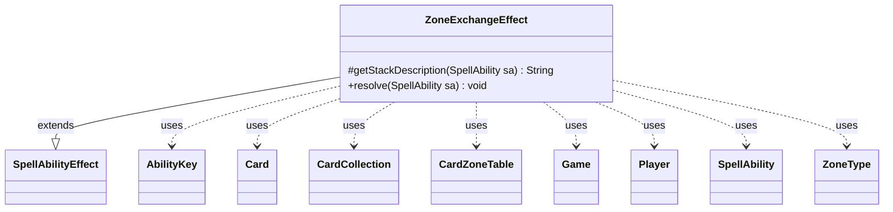

---
aliases:
  - ZoneExchangeEffect
tags:
  - java/class
  - module/forge-game
  - pkg/forge/game/ability/effects
fqn: forge.game.ability.effects.ZoneExchangeEffect
package: forge.game.ability.effects
module: forge-game
kind: Class
---

# ZoneExchangeEffect

**Package:** `forge.game.ability.effects` &nbsp; **Module:** `forge-game` &nbsp; **Kind:** Class



## Relationships
**Extends:**
- [[forge.game.ability.SpellAbilityEffect|SpellAbilityEffect]]
**Uses:**
- [[forge.game.Game|Game]]
- [[forge.game.ability.AbilityKey|AbilityKey]]
- [[forge.game.card.Card|Card]]
- [[forge.game.card.CardCollection|CardCollection]]
- [[forge.game.card.CardZoneTable|CardZoneTable]]
- [[forge.game.player.Player|Player]]
- [[forge.game.spellability.SpellAbility|SpellAbility]]
- [[forge.game.zone.ZoneType|ZoneType]]

## Design Description

ZoneExchangeEffect implements the resolution logic for a Magic ability that swaps two cards between game zones. As a concrete subclass of `SpellAbilityEffect`, it overrides `getStackDescription` to render the human-readable stack text and `resolve` to perform the exchange when the ability resolves. Driven by `SpellAbility` parameters (Type, ValidExchange, Zone1, Zone2, Object), it locates a host-owned card in the first zone, prompts the controlling player to choose a matching card in the second zone via `CardLists`/validity filtering, and moves each card to the other's zone through the game action layer.

Notable design intent: it guards every precondition with early returns (zone membership, ownership, type match, legal choice), specially handles Aura reattachment before the swap, and records the paired zone changes in a `CardZoneTable` so the engine fires all change-zone triggers atomically.

## Source
`forge-game/src/main/java/forge/game/ability/effects/ZoneExchangeEffect.java`

```java
package forge.game.ability.effects;

import java.util.Map;

import forge.game.Game;
import forge.game.ability.AbilityKey;
import forge.game.ability.AbilityUtils;
import forge.game.ability.SpellAbilityEffect;
import forge.game.card.Card;
import forge.game.card.CardCollection;
import forge.game.card.CardLists;
import forge.game.card.CardZoneTable;
import forge.game.player.Player;
import forge.game.spellability.SpellAbility;
import forge.game.zone.ZoneType;
import forge.util.Localizer;


public class ZoneExchangeEffect extends SpellAbilityEffect {
    @Override
    protected String getStackDescription(SpellAbility sa) {
        Card object1;
        if (sa.hasParam("Object")) {
            object1 = AbilityUtils.getDefinedCards(sa.getHostCard(), sa.getParam("Object"), sa).get(0);
        } else {
            object1 = sa.getHostCard();
        }
        return "Exchange a " + sa.getParam("Type") + " in " + sa.getParam("Zone2") + " with " + object1;
    }

    /* (non-Javadoc)
     * @see forge.card.abilityfactory.SpellEffect#resolve(java.util.Map, forge.card.spellability.SpellAbility)
     */
    @Override
    public void resolve(SpellAbility sa) {
        final Card source = sa.getHostCard();
        final Player p = sa.getActivatingPlayer();
        final Game game = p.getGame();
        final String type = sa.getParam("Type");
        final String valid = sa.getParam("ValidExchange");
        final ZoneType zone1 = sa.hasParam("Zone1") ? ZoneType.smartValueOf(sa.getParam("Zone1")) : ZoneType.Battlefield;
        final ZoneType zone2 = sa.hasParam("Zone2") ? ZoneType.smartValueOf(sa.getParam("Zone2")) : ZoneType.Hand;
        Card object1 = null;
        if (sa.hasParam("Object")) {
            object1 = AbilityUtils.getDefinedCards(source, sa.getParam("Object"), sa).get(0);
        } else {
            object1 = source;
        }

        if (object1 == null || !object1.isInZone(zone1) || !object1.getOwner().equals(p)) {
            // No original object, can't exchange.
            return;
        }

        CardCollection list = new CardCollection(p.getCardsIn(zone2));

        String filter;

        if (type != null) {
            // If Type was declared, both objects need to match the type
            if (!object1.getType().hasStringType(type)) {
                return;
            }
            filter = type;
        } else if (valid != null) {
            filter = valid;
        } else {
            filter = "Card";
        }

        list = CardLists.getValidCards(list, filter, p, source, sa);
        if (list.isEmpty())  {
            // Nothing to exchange the object?
            return;
        }

        Card object2 = p.getController().chooseSingleEntityForEffect(list, sa, Localizer.getInstance().getMessage("lblChooseaCard"), !sa.hasParam("Mandatory"), null);
        if (object2 == null || !object2.isInZone(zone2) || (type != null && !object2.getType().hasStringType(type))) {
            return;
        }
        // if the aura can't enchant, nothing happened.
        Card c = null;
        if (type != null && type.equals("Aura") && object1.getEnchantingCard() != null) {
            c = object1.getEnchantingCard();
            if (!c.canBeAttached(object2, sa)) {
                return;
            }
        }
        // Enchant first
        if (c != null) {
            object1.unattachFromEntity(c);
            object2.attachToEntity(c, sa);
        }

        Map<AbilityKey, Object> moveParams = AbilityKey.newMap();
        moveParams.put(AbilityKey.LastStateBattlefield, sa.getLastStateBattlefield());
        moveParams.put(AbilityKey.LastStateGraveyard, sa.getLastStateGraveyard());
        // Exchange Zone
        Card newObj1 = game.getAction().moveTo(zone2, object1, sa, moveParams);
        Card newObj2 = game.getAction().moveTo(zone1, object2, sa, moveParams);

        final CardZoneTable table = new CardZoneTable();
        table.put(zone1, newObj1.getZone().getZoneType(), newObj1);
        table.put(zone2, newObj2.getZone().getZoneType(), newObj2);
        table.triggerChangesZoneAll(game, sa);
    }
}
```

## Python
`forge/game/ability/effects/ZoneExchangeEffect.py`

```python
package: forge.game.ability.effects → module forge/game/ability/effects/ZoneExchangeEffect.py

Let me produce the Python port.

from typing import Map etc. Imports needed: Game, AbilityKey, AbilityUtils, SpellAbilityEffect, Card, CardCollection, CardLists, CardZoneTable, Player, SpellAbility, ZoneType, Localizer.

Relationships list FQNs. AbilityUtils, CardLists, Localizer aren't in relationships but in Java imports. AbilityUtils: forge.game.ability.AbilityUtils, CardLists: forge.game.card.CardLists, Localizer: forge.util.Localizer.
```
