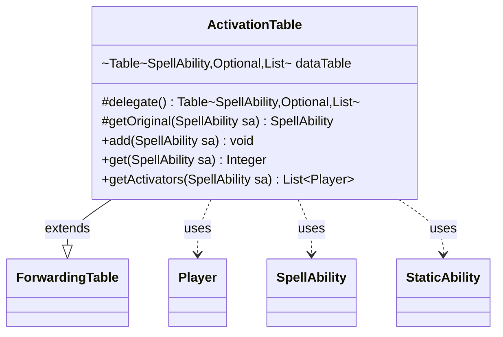

---
aliases:
  - ActivationTable
tags:
  - java/class
  - module/forge-game
  - pkg/forge/game/card
fqn: forge.game.card.ActivationTable
package: forge.game.card
module: forge-game
kind: Class
---

# ActivationTable

**Package:** `forge.game.card`   **Module:** `forge-game`   **Kind:** Class



## Relationships
**Uses:**
- [[forge.game.player.Player|Player]]
- [[forge.game.spellability.SpellAbility|SpellAbility]]
- [[forge.game.staticability.StaticAbility|StaticAbility]]

## Design Description

ActivationTable is a specialized tally that records which players have activated a given ability, keyed by the ability and the optional static ability that granted it. By extending Guava's `ForwardingTable` and delegating to an internal `HashBasedTable<SpellAbility, Optional<StaticAbility>, List<Player>>`, it inherits the full `Table` API while exposing a small, intent-revealing surface—`add`, `get`, and `getActivators`—tailored to activation counting.

Its central design concern is identity normalization: because trigger and copied spell abilities are duplicated at runtime, `getOriginal` resolves each `SpellAbility` back to its canonical root (via the trigger's overriding ability or the original ability) so that every activation maps to a stable key. Pairing that root with the grantor `StaticAbility` lets the table distinguish activations granted by different static effects, and storing per-key `List<Player>` collaborators preserves who activated so callers can both count and enumerate activators.

## Source
`forge-game/src/main/java/forge/game/card/ActivationTable.java`

```java
package forge.game.card;

import com.google.common.collect.ForwardingTable;
import com.google.common.collect.HashBasedTable;
import com.google.common.collect.Lists;
import com.google.common.collect.Table;
import forge.game.player.Player;
import forge.game.spellability.SpellAbility;
import forge.game.staticability.StaticAbility;

import java.util.List;
import java.util.Objects;
import java.util.Optional;

public class ActivationTable extends ForwardingTable<SpellAbility, Optional<StaticAbility>, List<Player>> {
    Table<SpellAbility, Optional<StaticAbility>, List<Player>> dataTable = HashBasedTable.create();

    @Override
    protected Table<SpellAbility, Optional<StaticAbility>, List<Player>> delegate() {
        return dataTable;
    }

    protected SpellAbility getOriginal(SpellAbility sa) {
        SpellAbility original = null;
        SpellAbility root = sa.getRootAbility();

        // because trigger spell abilities are copied, try to get original one
        if (root.isTrigger()) {
            original = root.getTrigger().getOverridingAbility();
        } else {
            original = Objects.requireNonNullElse(root.getOriginalAbility(), root);
        }
        return original;
    }

    public void add(SpellAbility sa) {
        SpellAbility root = sa.getRootAbility();
        SpellAbility original = getOriginal(sa);

        if (original != null) {
            Optional<StaticAbility> st = Optional.ofNullable(root.getGrantorStatic());

            List<Player> activators = get(original, st);
            if (activators == null) {
                activators = Lists.newArrayList();
            }
            activators.add(sa.getActivatingPlayer());
            delegate().put(original, st, activators);
        }
    }

    public Integer get(SpellAbility sa) {
        return getActivators(sa).size();
    }

    public List<Player> getActivators(SpellAbility sa) {
        SpellAbility root = sa.getRootAbility();
        SpellAbility original = getOriginal(sa);
        Optional<StaticAbility> st = Optional.ofNullable(root.getGrantorStatic());

        if (contains(original, st)) {
            return get(original, st);
        }
        return Lists.newArrayList();
    }
}
```

## Python
`forge/game/card/ActivationTable.py`

```python
package forge.game.card

from typing import Optional

from com.google.common.collect.ForwardingTable import ForwardingTable
from com.google.common.collect.HashBasedTable import HashBasedTable
from com.google.common.collect.Table import Table

from forge.game.player.Player import Player
from forge.game.spellability.SpellAbility import SpellAbility
from forge.game.staticability.StaticAbility import StaticAbility


class ActivationTable(ForwardingTable):
    def __init__(self):
        self.dataTable: Table = HashBasedTable.create()

    def delegate(self) -> Table:
        return self.dataTable

    def getOriginal(self, sa: SpellAbility) -> SpellAbility:
        original = None
        root = sa.getRootAbility()

        # because trigger spell abilities are copied, try to get original one
        if root.isTrigger():
            original = root.getTrigger().getOverridingAbility()
        else:
            original = root.getOriginalAbility() if root.getOriginalAbility() is not None else root
        return original

    def add(self, sa: SpellAbility) -> None:
        root = sa.getRootAbility()
        original = self.getOriginal(sa)

        if original is not None:
            st: Optional[StaticAbility] = Optional.ofNullable(root.getGrantorStatic())

            activators = self.get(original, st)
            if activators is None:
                activators = []
            activators.append(sa.getActivatingPlayer())
            self.delegate().put(original, st, activators)

    def get(self, sa: SpellAbility) -> int:
        return len(self.getActivators(sa))

    def getActivators(self, sa: SpellAbility) -> list[Player]:
        root = sa.getRootAbility()
        original = self.getOriginal(sa)
        st: Optional[StaticAbility] = Optional.ofNullable(root.getGrantorStatic())

        if self.contains(original, st):
            return self.get(original, st)
        return []
```
