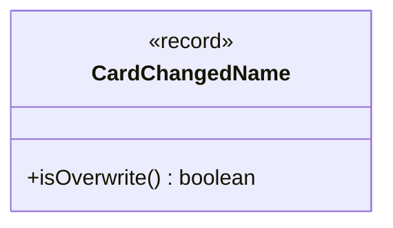

---
aliases:
  - CardChangedName
tags:
  - java/record
  - module/forge-game
  - pkg/forge/game/card
fqn: forge.game.card.Card.CardChangedName
package: forge.game.card
module: forge-game
kind: Record
---

# CardChangedName

**Package:** `forge.game.card`   **Module:** `forge-game`   **Kind:** Record



## Design Description

Forge represents Magic cards through the `Card` class, and `CardChangedName` is a private record nested within it that captures a single name-changing effect applied to a card. It holds the replacement `newName` and a flag, `addNonLegendaryCreatureNames`, indicating whether the effect also grants the names of all nonlegendary creatures—a distinction needed for certain MTG mechanics.

As a Java record, it is an immutable value object, well-suited to being stored among the layered effects that mutate a card's characteristics. Its sole method, `isOverwrite()`, reports whether the effect actually substitutes a name (when `newName` is non-null) versus merely augmenting the existing name set. Being `private` confines it to `Card`'s internal name-management logic, keeping this implementation detail encapsulated from the rest of the game model.

## Source
`forge-game/src/main/java/forge/game/card/Card.java` — declaration excerpt

```java
    private record CardChangedName(String newName, boolean addNonLegendaryCreatureNames) {
        public boolean isOverwrite() {
            return newName != null;
        }
    }
```
