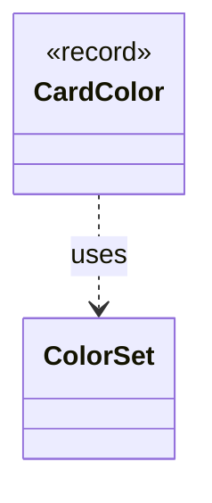

---
aliases:
  - CardColor
tags:
  - java/record
  - module/forge-game
  - pkg/forge/game/card
fqn: forge.game.card.Card.CardColor
package: forge.game.card
module: forge-game
kind: Record
---

# CardColor

**Package:** `forge.game.card`   **Module:** `forge-game`   **Kind:** Record



## Relationships
**Uses:**
- [[forge.card.ColorSet|ColorSet]]

## Design Description

A Java record nested privately within the `Card` class that pairs a `ColorSet` with a boolean flag indicating whether the color is additional (layered on top of a card's intrinsic color rather than replacing it). As a record, it is an immutable, value-based data carrier whose component accessors, equality, and hash semantics are compiler-generated, making it a lightweight key or entry suitable for tracking color-modifying effects within the card's state.

Being declared `private` inside `Card`, it serves purely as an internal implementation detail, encapsulating the association between a color value and its additive nature so the enclosing card can manage multiple color contributions cleanly. Its sole collaborator is `ColorSet`, the engine's standard representation of a Magic color identity, which `CardColor` wraps to give that color set contextual meaning within the card's color-determination logic.

## Source
`forge-game/src/main/java/forge/game/card/Card.java` — declaration excerpt

```java
    private record CardColor(ColorSet color, boolean additional) {

    }
```

## Python
`forge/game/card/Card/CardColor.py`

```python
from forge.card.ColorSet import ColorSet


class CardColor:
    def __init__(self, color: ColorSet, additional: bool):
        self.color = color
        self.additional = additional

    def color(self) -> ColorSet:
        return self.color

    def additional(self) -> bool:
        return self.additional

    def __eq__(self, other):
        if self is other:
            return True
        if not isinstance(other, CardColor):
            return False
        return self.color == other.color and self.additional == other.additional

    def __hash__(self):
        return hash((self.color, self.additional))

    def __repr__(self):
        return f"CardColor[color={self.color}, additional={self.additional}]"
```
