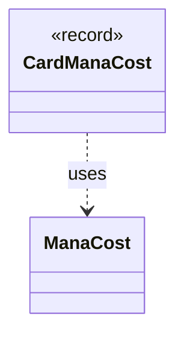

---
aliases:
  - CardManaCost
tags:
  - java/record
  - module/forge-game
  - pkg/forge/game/card
fqn: forge.game.card.Card.CardManaCost
package: forge.game.card
module: forge-game
kind: Record
---

# CardManaCost

**Package:** `forge.game.card`   **Module:** `forge-game`   **Kind:** Record



## Relationships
**Uses:**
- [[forge.card.mana.ManaCost|ManaCost]]

## Design Description

The `CardManaCost` is a private nested record within `Card` that pairs a `ManaCost` value with an `additional` boolean flag. As a record, it serves as an immutable, value-based data carrier—Forge uses it internally to bundle a card's mana cost together with the distinction of whether that cost is the card's base/primary cost or an additional cost applied on top of it.

By collaborating with `forge.card.mana.ManaCost`, the record delegates all mana representation and parsing concerns to that type, keeping itself a thin grouping construct. Its `private` scope confines it to `Card`'s implementation, signaling it is an internal helper rather than part of the public API, and its record form guarantees structural equality and concise accessors with no behavioral logic of its own.

## Source
`forge-game/src/main/java/forge/game/card/Card.java` — declaration excerpt

```java
    private record CardManaCost(ManaCost mana, boolean additional) {

    }
```
