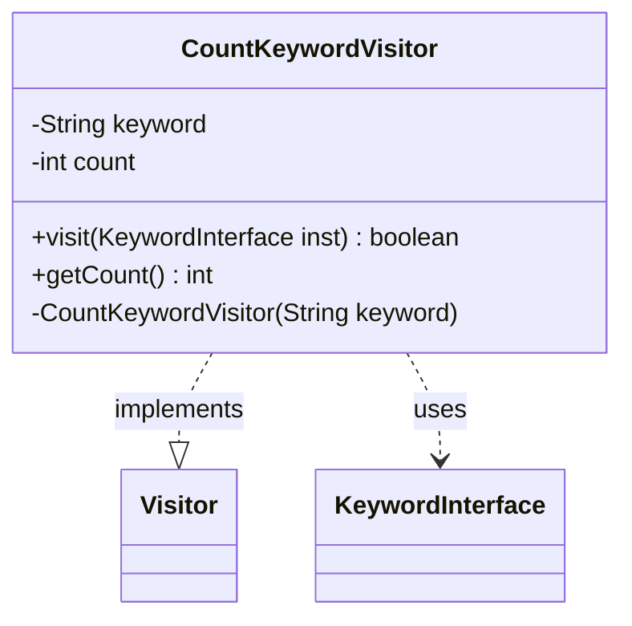

---
aliases:
  - CountKeywordVisitor
tags:
  - java/class
  - module/forge-game
  - pkg/forge/game/card
fqn: forge.game.card.Card.CountKeywordVisitor
package: forge.game.card
module: forge-game
kind: Class
---

# CountKeywordVisitor

**Package:** `forge.game.card`   **Module:** `forge-game`   **Kind:** Class



## Relationships
**Implements:**
- [[forge.util.Visitor|Visitor]]
**Uses:**
- [[forge.game.keyword.KeywordInterface|KeywordInterface]]

## Design Description

CountKeywordVisitor is a private static helper within `Card` that tallies how many times a specific keyword appears among a card's keyword instances. It implements `Visitor<KeywordInterface>`, allowing it to be passed to the card's keyword-traversal machinery: each `visit` call inspects a `KeywordInterface`, comparing its original keyword string against the target and incrementing an internal counter, then returns `true` to continue iteration. The accumulated total is retrieved afterward via `getCount`.

The design reflects the visitor pattern's separation of traversal from per-element logic, keeping the counting concern encapsulated and reusable across keyword collections. Its private constructor and `final` static scoping confine it strictly to `Card`'s internal use, while the mutable `count` field carries state across the visitor's stateless-looking callbacks—a deliberate, lightweight accumulator rather than a general-purpose utility.

## Source
`forge-game/src/main/java/forge/game/card/Card.java` — declaration excerpt

```java
    // Counts number of instances of a given keyword.
    private static final class CountKeywordVisitor implements Visitor<KeywordInterface> {
        private String keyword;
        private int count;

        private CountKeywordVisitor(String keyword) {
            this.keyword = keyword;
            this.count = 0;
        }

        @Override
        public boolean visit(KeywordInterface inst) {
            final String kw = inst.getOriginal();
            if (kw.equals(keyword)) {
                count++;
            }
            return true;
        }

        public int getCount() {
            return count;
        }
    }
```
