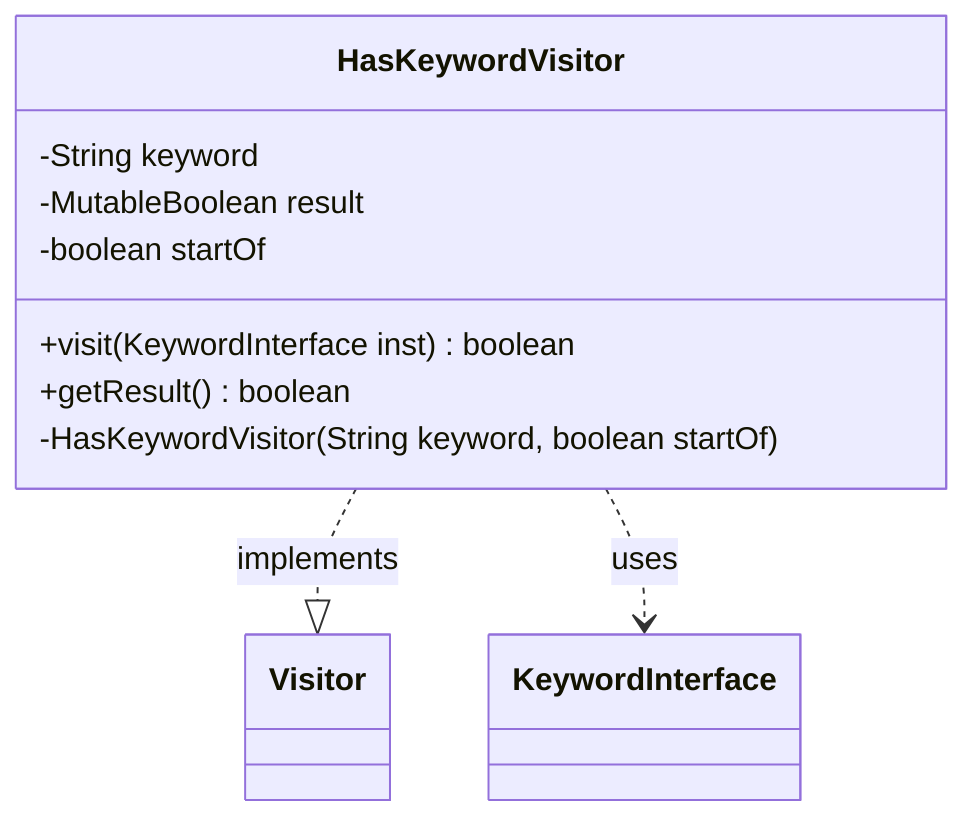

---
aliases:
  - HasKeywordVisitor
tags:
  - java/class
  - module/forge-game
  - pkg/forge/game/card
fqn: forge.game.card.Card.HasKeywordVisitor
package: forge.game.card
module: forge-game
kind: Class
---

# HasKeywordVisitor

**Package:** `forge.game.card`   **Module:** `forge-game`   **Kind:** Class



## Relationships
**Implements:**
- [[forge.util.Visitor|Visitor]]
**Uses:**
- [[forge.game.keyword.KeywordInterface|KeywordInterface]]

## Design Description

HasKeywordVisitor is a private static helper nested in `Card`, implementing `Visitor<KeywordInterface>` to perform a single-pass search for a named keyword across a card's keyword instances. Its `visit` callback inspects each `KeywordInterface`'s original text, matching either by equality or, when `startOf` is set, by prefix, and records a hit in a `MutableBoolean`. By returning `result.isFalse()`, it signals the traversal to continue only until a match is found, giving short-circuit behavior without exposing traversal state to callers.

The design keeps matching logic encapsulated and reusable: a small immutable-result holder accumulates the outcome while the visitor remains stateless beyond its query parameters, and `getResult()` exposes the final verdict. As a Visitor implementation, it decouples the keyword-search algorithm from `Card`'s internal keyword collection structure, letting `Card` apply the same traversal mechanism used elsewhere rather than duplicating iteration code.

## Source
`forge-game/src/main/java/forge/game/card/Card.java` — declaration excerpt

```java
    private static final class HasKeywordVisitor implements Visitor<KeywordInterface> {
        private String keyword;
        private final MutableBoolean result = new MutableBoolean(false);

        private boolean startOf;
        private HasKeywordVisitor(String keyword, boolean startOf) {
            this.keyword = keyword;
            this.startOf = startOf;
        }

        @Override
        public boolean visit(KeywordInterface inst) {
            final String kw = inst.getOriginal();
            if ((startOf && kw.startsWith(keyword)) || kw.equals(keyword)) {
                result.setTrue();
            }
            return result.isFalse();
        }
        public boolean getResult() {
            return result.isTrue();
        }
    }
```
