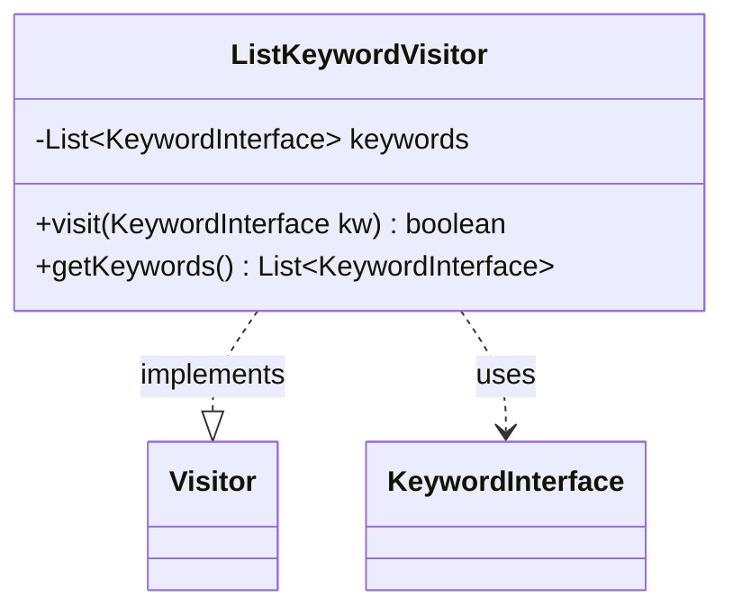

---
aliases:
  - ListKeywordVisitor
tags:
  - java/class
  - module/forge-game
  - pkg/forge/game/card
fqn: forge.game.card.Card.ListKeywordVisitor
package: forge.game.card
module: forge-game
kind: Class
---

# ListKeywordVisitor

**Package:** `forge.game.card`   **Module:** `forge-game`   **Kind:** Class



## Relationships
**Implements:**
- [[forge.util.Visitor|Visitor]]
**Uses:**
- [[forge.game.keyword.KeywordInterface|KeywordInterface]]

## Design Description

ListKeywordVisitor is a private static helper class nested within `Card` that implements the generic `Visitor<KeywordInterface>` interface to accumulate keywords during a traversal. Its sole responsibility is to collect every `KeywordInterface` it is offered into an internal list and expose that list to the caller once iteration completes.

As a concrete `Visitor`, it participates in the visitor pattern used to walk a card's keyword structure without exposing the underlying collection's representation. The `visit` method unconditionally appends each keyword and returns `true`, signaling that traversal should continue to the end so no keywords are skipped. By encapsulating accumulation behind the visitor contract and keeping the class private and static, the design cleanly separates the act of gathering keywords from the traversal mechanism while limiting its scope strictly to `Card`'s internal use.

## Source
`forge-game/src/main/java/forge/game/card/Card.java` — declaration excerpt

```java
    // Collects all the keywords into a list.
    private static final class ListKeywordVisitor implements Visitor<KeywordInterface> {
        private List<KeywordInterface> keywords = Lists.newArrayList();

        @Override
        public boolean visit(KeywordInterface kw) {
            keywords.add(kw);
            return true;
        }

        public List<KeywordInterface> getKeywords() {
            return keywords;
        }
    }
```
