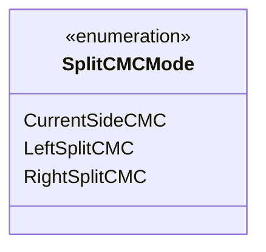

---
aliases:
  - SplitCMCMode
tags:
  - java/enum
  - module/forge-game
  - pkg/forge/game/card
fqn: forge.game.card.Card.SplitCMCMode
package: forge.game.card
module: forge-game
kind: Enum
---

# SplitCMCMode

**Package:** `forge.game.card`   **Module:** `forge-game`   **Kind:** Enum



## Design Description

SplitCMCMode is a small enumeration nested within the `Card` class that identifies which converted mana cost (CMC) value a caller wants when querying a card. Its three constants distinguish the three meaningful interpretations for split and multi-faced cards: `CurrentSideCMC` for the currently active face, and `LeftSplitCMC` / `RightSplitCMC` for the two halves of a split card. By modeling these as a type rather than passing flags or magic numbers, the design lets CMC-computing methods on `Card` accept an explicit, self-documenting request parameter, ensuring callers state their intent precisely and that split-card mana costs are handled consistently across the game engine.

## Source
`forge-game/src/main/java/forge/game/card/Card.java` — declaration excerpt

```java
    // Enumeration for CMC request types
    public enum SplitCMCMode {
        CurrentSideCMC,
        LeftSplitCMC,
        RightSplitCMC
    }
```

## Python
`forge/game/card/Card/SplitCMCMode.py`

```python
from enum import Enum


class SplitCMCMode(Enum):
    CurrentSideCMC = "CurrentSideCMC"
    LeftSplitCMC = "LeftSplitCMC"
    RightSplitCMC = "RightSplitCMC"
```
