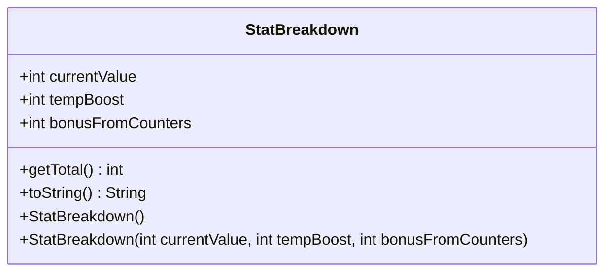

---
aliases:
  - StatBreakdown
tags:
  - java/class
  - module/forge-game
  - pkg/forge/game/card
fqn: forge.game.card.Card.StatBreakdown
package: forge.game.card
module: forge-game
kind: Class
---

# StatBreakdown

**Package:** `forge.game.card`   **Module:** `forge-game`   **Kind:** Class



## Design Description

StatBreakdown is a small, immutable value object nested within `Card` that decomposes a card's computed power or toughness into its three contributing parts: the printed/current value, temporary boosts, and bonuses granted by counters. By keeping these components separate rather than collapsing them into a single integer, it preserves visibility into *why* a stat has a given value, which aids display, debugging, and rule resolution.

Its design intent is clear from the `final` fields and the convenience constructors: instances are read-only snapshots, with a no-arg constructor yielding an all-zero breakdown and `getTotal()` summing the parts on demand. The `toString()` renders a compact `c:/tb:/bfc:` form via `TextUtil`, signalling a diagnostic role. As a passive data holder it collaborates with `Card`, which constructs and returns it from stat-calculation logic, but it holds no behavior beyond aggregation and formatting.

## Source
`forge-game/src/main/java/forge/game/card/Card.java` — declaration excerpt

```java
    public static class StatBreakdown {
        public final int currentValue;
        public final int tempBoost;
        public final int bonusFromCounters;
        public StatBreakdown() {
            this.currentValue = 0;
            this.tempBoost = 0;
            this.bonusFromCounters = 0;
        }
        public StatBreakdown(int currentValue, int tempBoost, int bonusFromCounters) {
            this.currentValue = currentValue;
            this.tempBoost = tempBoost;
            this.bonusFromCounters = bonusFromCounters;
        }
        public int getTotal() {
            return currentValue + tempBoost + bonusFromCounters;
        }
        @Override
        public String toString() {
            return TextUtil.concatWithSpace("c:"+ currentValue,"tb:"+ tempBoost,"bfc:"+ bonusFromCounters);
        }
    }
```

## Python
`forge/game/card/Card/StatBreakdown.py`

```python
from forge.util.TextUtil import TextUtil


class StatBreakdown:
    def __init__(self, currentValue: int = 0, tempBoost: int = 0, bonusFromCounters: int = 0):
        self.currentValue = currentValue
        self.tempBoost = tempBoost
        self.bonusFromCounters = bonusFromCounters

    def getTotal(self) -> int:
        return self.currentValue + self.tempBoost + self.bonusFromCounters

    def toString(self) -> str:
        return TextUtil.concatWithSpace("c:" + str(self.currentValue), "tb:" + str(self.tempBoost), "bfc:" + str(self.bonusFromCounters))

    def __str__(self) -> str:
        return self.toString()
```
