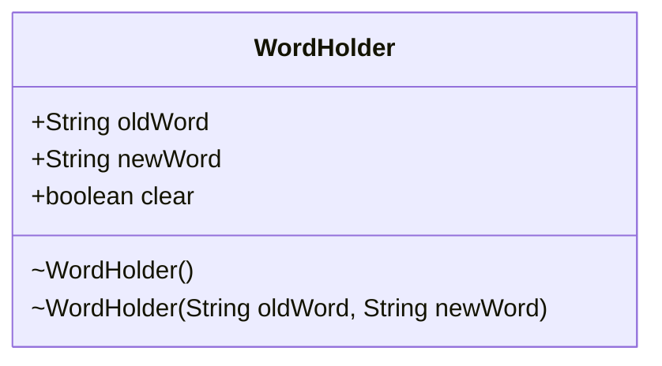

---
aliases:
  - WordHolder
tags:
  - java/class
  - module/forge-game
  - pkg/forge/game/card
fqn: forge.game.card.CardChangedWords.WordHolder
package: forge.game.card
module: forge-game
kind: Class
---

# WordHolder

**Package:** `forge.game.card`   **Module:** `forge-game`   **Kind:** Class



## Design Description

WordHolder is a lightweight value object nested within CardChangedWords, modeling a single text-substitution rule on a Magic card—replacing every occurrence of `oldWord` with `newWord` (for example, when an effect changes one creature type or keyword into another). The `clear` flag, set only by the no-argument constructor, marks a holder whose purpose is to wipe all prior word changes rather than record a substitution, letting callers distinguish a reset directive from an actual replacement pair.

Its design is deliberately minimal: package-private constructors confine creation to CardChangedWords, which owns and applies these holders, while the public mutable fields serve simple struct-style data carriage rather than encapsulated behavior. This keeps the type a passive record of intent, with all interpretation and ordering logic residing in the enclosing aggregator that collaborates with the broader card-text model.

## Source
`forge-game/src/main/java/forge/game/card/CardChangedWords.java` — declaration excerpt

```java
    class WordHolder {
        public String oldWord;
        public String newWord;

        public boolean clear = false;

        WordHolder() {
            this.clear = true;
        }
        WordHolder(String oldWord, String newWord) {
            this.oldWord = oldWord;
            this.newWord = newWord;
        }
    }
```

## Python
`forge/game/card/CardChangedWords/WordHolder.py`

```python
from forge.game.card.CardChangedWords import CardChangedWords


class WordHolder:
    oldWord: str
    newWord: str
    clear: bool

    def __init__(self, oldWord: str = None, newWord: str = None):
        if oldWord is None and newWord is None:
            self.clear = True
        else:
            self.clear = False
            self.oldWord = oldWord
            self.newWord = newWord
```
