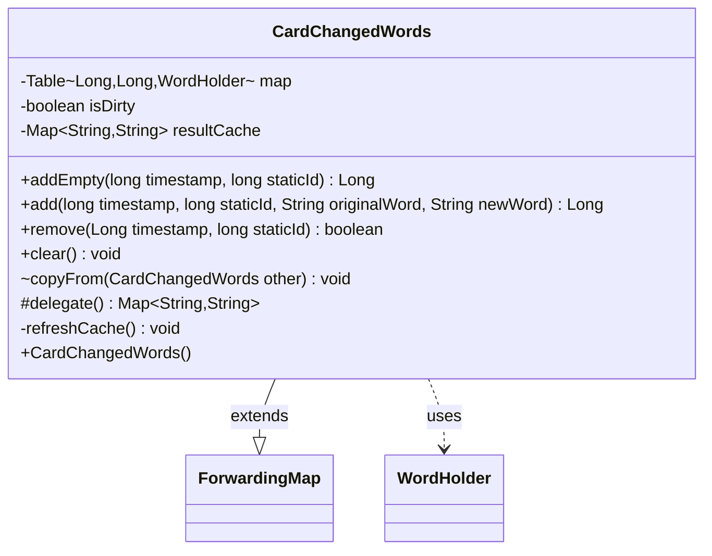

---
aliases:
  - CardChangedWords
tags:
  - java/class
  - module/forge-game
  - pkg/forge/game/card
fqn: forge.game.card.CardChangedWords
package: forge.game.card
module: forge-game
kind: Class
---

# CardChangedWords

**Package:** `forge.game.card`   **Module:** `forge-game`   **Kind:** Class



## Relationships
**Uses:**
- [[forge.game.card.CardChangedWords.WordHolder|WordHolder]]

## Design Description

`CardChangedWords` records timestamped word-substitution effects applied to a card (Magic's text-changing abilities, e.g. Volrath's Shapeshifter) and resolves them into a flat originalWord→newWord mapping. It extends Guava's `ForwardingMap<String,String>`, so it behaves as a read-only `Map` to consumers while internally storing each change in a `TreeBasedTable` keyed by timestamp and static-effect id, paired with a private `WordHolder` capturing the old/new words or a reset flag.

Its central design intent is lazy, ordered resolution: mutations merely set an `isDirty` flag, and `delegate()` triggers `refreshCache()` only when needed, replaying changes in timestamp order so chained substitutions (a→b then b→c yielding a→c) and clear-pairs compose correctly. The cached result avoids recomputation between edits. Helpers like `addEmpty`, `add`, `remove`, and the package-private `copyFrom` support layered effect bookkeeping and card-state copying.

## Source
`forge-game/src/main/java/forge/game/card/CardChangedWords.java`

```java
package forge.game.card;

import com.google.common.collect.ForwardingMap;
import com.google.common.collect.Maps;
import com.google.common.collect.Table;
import com.google.common.collect.TreeBasedTable;

import java.util.Map;

public final class CardChangedWords extends ForwardingMap<String, String> {

    class WordHolder {
        public String oldWord;
        public String newWord;

        public boolean clear = false;

        WordHolder() {
            this.clear = true;
        }
        WordHolder(String oldWord, String newWord) {
            this.oldWord = oldWord;
            this.newWord = newWord;
        }
    }

    private final Table<Long, Long, WordHolder> map = TreeBasedTable.create();

    private boolean isDirty = false;
    private Map<String, String> resultCache = Maps.newHashMap();

    public CardChangedWords() {
    }

    public Long addEmpty(final long timestamp, final long staticId) {
        final Long stamp = timestamp;
        map.put(stamp, staticId, new WordHolder()); // Table doesn't allow null value
        isDirty = true;
        return stamp;
    }

    public Long add(final long timestamp, final long staticId, final String originalWord, final String newWord) {
        final Long stamp = timestamp;
        map.put(stamp, staticId, new WordHolder(originalWord, newWord));
        isDirty = true;
        return stamp;
    }

    public boolean remove(final Long timestamp, final long staticId) {
        isDirty = true;
        return map.remove(timestamp, staticId) != null;
    }

    @Override
    public void clear() {
        super.clear();
        map.clear();
        isDirty = true;
    }

    void copyFrom(final CardChangedWords other) {
        map.clear();
        map.putAll(other.map);
        isDirty = true;
    }

    /**
     * Converts this object to a {@link Map}.
     *
     * @return a map of strings to strings, where each changed word in this
     * object is mapped to its corresponding replacement word.
     */
    @Override
    protected Map<String, String> delegate() {
        refreshCache();
        return resultCache;
    }

    private void refreshCache() {
        if (isDirty) {
            resultCache.clear();
            for (final WordHolder ccw : this.map.values()) {
                // is empty pair is for resetting the data, it is done for Volrath’s Shapeshifter
                if (ccw.clear) {
                    resultCache.clear();
                    continue;
                }

                // changes because a->b and b->c (resulting in a->c)
                final Map<String, String> toBeChanged = Maps.newHashMap();
                for (final Entry<String, String> e : resultCache.entrySet()) {
                    if (e.getValue().equals(ccw.oldWord)) {
                        toBeChanged.put(e.getKey(), ccw.newWord);
                    }
                }
                resultCache.putAll(toBeChanged);

                // the actual change (b->c)
                resultCache.put(ccw.oldWord, ccw.newWord);
            }

            isDirty = false;
        }
    }
}
```
