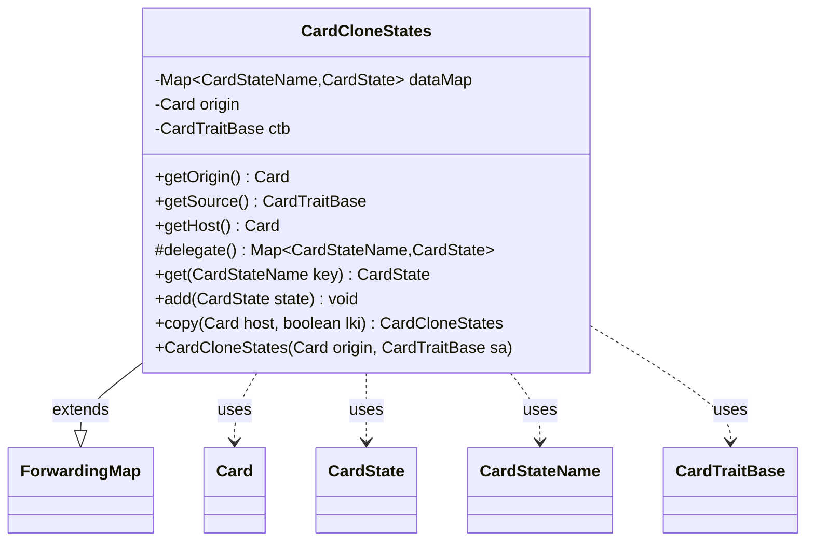

---
aliases:
  - CardCloneStates
tags:
  - java/class
  - module/forge-game
  - pkg/forge/game/card
fqn: forge.game.card.CardCloneStates
package: forge.game.card
module: forge-game
kind: Class
---

# CardCloneStates

**Package:** `forge.game.card`   **Module:** `forge-game`   **Kind:** Class



## Relationships
**Uses:**
- [[forge.card.CardStateName|CardStateName]]
- [[forge.game.CardTraitBase|CardTraitBase]]
- [[forge.game.card.Card|Card]]
- [[forge.game.card.CardState|CardState]]

## Design Description

CardCloneStates manages the set of alternate face/state representations a card takes on when it is cloned or copied, keyed by `CardStateName`. By extending Guava's `ForwardingMap<CardStateName, CardState>` and delegating to an internal `EnumMap`, it presents a standard map interface while layering on clone-specific behavior. It retains the cloning context — the `origin` Card and the originating `CardTraitBase` (whose host card it exposes via `getHost`) — so callers can trace where a clone came from.

Its key design intent is lazy, on-demand state synthesis: `get` derives any requested state from the `Original` state, copying it and stamping the correct state name so views render correctly, then caches the result. The `copy` method produces a deep, independent duplicate (supporting last-known-information snapshots via the `lki` flag) by copying each `CardState` onto a new host, keeping cloned cards isolated from one another.

## Source
`forge-game/src/main/java/forge/game/card/CardCloneStates.java`

```java
package forge.game.card;

import com.google.common.collect.ForwardingMap;
import com.google.common.collect.Maps;
import forge.card.CardStateName;
import forge.game.CardTraitBase;

import java.util.Map;

public class CardCloneStates extends ForwardingMap<CardStateName, CardState> {

    private Map<CardStateName, CardState> dataMap = Maps.newEnumMap(CardStateName.class);

    private Card origin;
    private CardTraitBase ctb;

    public CardCloneStates(Card origin, CardTraitBase sa) {
        super();
        this.origin = origin;
        this.ctb = sa;
    }

    public Card getOrigin() {
        return origin;
    }

    public CardTraitBase getSource() {
        return ctb;
    }
    
    public Card getHost() {
        return ctb.getHostCard();
    }

    @Override
    protected Map<CardStateName, CardState> delegate() {
        return dataMap;
    }

    public CardState get(CardStateName key) {
        if (dataMap.containsKey(key)) {
            return super.get(key);
        }
        CardState original = super.get(CardStateName.Original);
        // need to copy it so the view has the right state name
        CardState result = new CardState(original.getCard(), key);
        result.copyFrom(original, false);
        dataMap.put(key, result);
        return result;
    }

    public void add(CardState state) {
        put(state.getStateName(), state);
    }

    public CardCloneStates copy(final Card host, final boolean lki) {
        CardCloneStates result = new CardCloneStates(origin, ctb);
        for (Map.Entry<CardStateName, CardState> e : dataMap.entrySet()) {
            result.put(e.getKey(), e.getValue().copy(host, e.getKey(), lki));
        }
        return result;
    }
}
```

## Python
`forge/game/card/CardCloneStates.py`

```python
from forge.card.CardStateName import CardStateName
from forge.game.CardTraitBase import CardTraitBase
from forge.game.card.Card import Card
from forge.game.card.CardState import CardState

from com.google.common.collect.ForwardingMap import ForwardingMap


class CardCloneStates(ForwardingMap):

    def __init__(self, origin: Card, sa: CardTraitBase):
        super().__init__()
        self.dataMap: dict[CardStateName, CardState] = {}
        self.origin = origin
        self.ctb = sa

    def getOrigin(self) -> Card:
        return self.origin

    def getSource(self) -> CardTraitBase:
        return self.ctb

    def getHost(self) -> Card:
        return self.ctb.getHostCard()

    def delegate(self) -> dict[CardStateName, CardState]:
        return self.dataMap

    def get(self, key: CardStateName) -> CardState:
        if key in self.dataMap:
            return super().get(key)
        original = super().get(CardStateName.Original)
        # need to copy it so the view has the right state name
        result = CardState(original.getCard(), key)
        result.copyFrom(original, False)
        self.dataMap[key] = result
        return result

    def add(self, state: CardState) -> None:
        self.put(state.getStateName(), state)

    def copy(self, host: Card, lki: bool) -> "CardCloneStates":
        result = CardCloneStates(self.origin, self.ctb)
        for key, value in self.dataMap.items():
            result.put(key, value.copy(host, key, lki))
        return result
```
