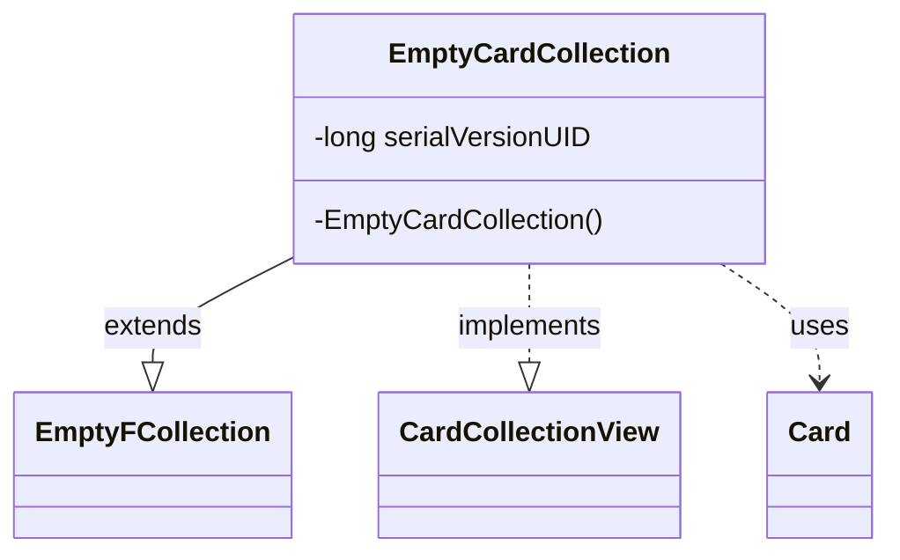

---
aliases:
  - EmptyCardCollection
tags:
  - java/class
  - module/forge-game
  - pkg/forge/game/card
fqn: forge.game.card.CardCollection.EmptyCardCollection
package: forge.game.card
module: forge-game
kind: Class
---

# EmptyCardCollection

**Package:** `forge.game.card`   **Module:** `forge-game`   **Kind:** Class



## Relationships
**Extends:**
- [[forge.util.collect.FCollection.EmptyFCollection|EmptyFCollection]]
**Implements:**
- [[forge.game.card.CardCollectionView|CardCollectionView]]
**Uses:**
- [[forge.game.card.Card|Card]]

## Design Description

An unmodifiable, empty implementation of `CardCollection` used as a shared, immutable sentinel for card lists that contain no cards. By extending `EmptyFCollection<Card>` it inherits the no-op, mutation-rejecting behavior of the generic empty collection, while implementing `CardCollectionView` so it satisfies the read-only view contract expected throughout the game's card-handling code wherever a `Card` collection is required.

The design intent is deliberate restriction: the class is declared `private final static` with a single private no-argument constructor, ensuring it cannot be subclassed, instantiated externally, or mutated. This makes it suitable as a reusable singleton-style placeholder returned in place of `null`, avoiding allocation of empty collections and eliminating null checks on the consuming side.

## Source
`forge-game/src/main/java/forge/game/card/CardCollection.java` — declaration excerpt

```java
    /**
     * An unmodifiable, empty {@link CardCollection}.
     */
    private final static class EmptyCardCollection extends EmptyFCollection<Card> implements CardCollectionView {
        private static final long serialVersionUID = -3218771134502034727L;

        private EmptyCardCollection() {
            super();
        }
    }
```
