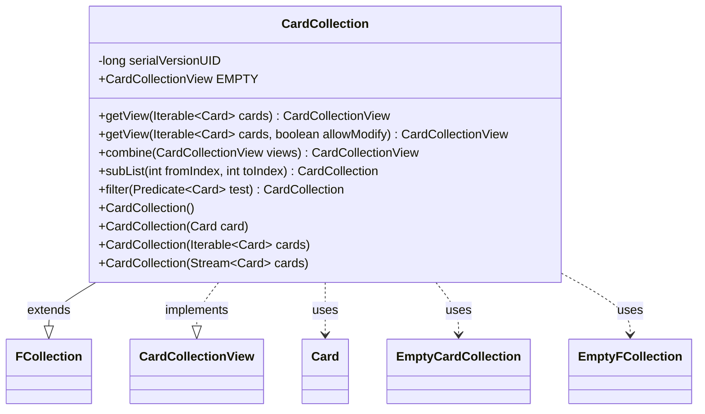

---
aliases:
  - CardCollection
tags:
  - java/class
  - module/forge-game
  - pkg/forge/game/card
fqn: forge.game.card.CardCollection
package: forge.game.card
module: forge-game
kind: Class
---

# CardCollection

**Package:** `forge.game.card` &nbsp; **Module:** `forge-game` &nbsp; **Kind:** Class



## Relationships
**Extends:**
- [[forge.util.collect.FCollection|FCollection]]
**Implements:**
- [[forge.game.card.CardCollectionView|CardCollectionView]]
**Uses:**
- [[forge.game.card.Card|Card]]
- [[forge.game.card.CardCollection.EmptyCardCollection|EmptyCardCollection]]
- [[forge.util.collect.FCollection.EmptyFCollection|EmptyFCollection]]

## Design Description

CardCollection is the engine's concrete, ordered collection of `Card` objects, extending the generic `FCollection<Card>` to inherit set-like storage with deterministic iteration order while implementing the read-only `CardCollectionView` interface that callers use to consume cards without mutating them. It thus serves as the standard mutable container that can be safely exposed as an immutable view.

Its design centers on view management and defensive copying: static `getView` factories return either the existing collection or a shallow copy depending on whether independent iteration is required, `combine` merges multiple views in order while avoiding allocation until a second non-empty source appears, and a singleton `EMPTY` instance (the private `EmptyCardCollection`) cheaply represents the no-cards case. Convenience constructors, `subList`, and `filter` consistently return new `CardCollection` instances, keeping the type self-propagating across transformations.

## Source
`forge-game/src/main/java/forge/game/card/CardCollection.java`

```java
package forge.game.card;

import forge.util.collect.FCollection;

import java.util.function.Predicate;
import java.util.stream.Stream;

public class CardCollection extends FCollection<Card> implements CardCollectionView {
    private static final long serialVersionUID = -8133537013727100275L;

    /**
     * An empty, immutable {@link CardCollectionView}.
     */
    public static final CardCollectionView EMPTY = new EmptyCardCollection();

    /**
     * Get the view corresponding to an {@link Iterable} of {@link Card}
     * objects.
     *
     * @param cards
     *            a collection.
     * @return an unmodifiable view of the collection.
     */
    public static CardCollectionView getView(final Iterable<Card> cards) {
        return getView(cards, false);
    }

    /**
     * Get the view corresponding to an {@link Iterable} of {@link Card}
     * objects.
     *
     * @param cards
     *            a collection.
     * @param allowModify
     *            whether to make a shallow copy of the collection to make the
     *            returned view independent from the original collection.
     * @return an unmodifiable view of the collection.
     */
    public static CardCollectionView getView(final Iterable<Card> cards, final boolean allowModify) {
        if (cards == null) {
            return EMPTY;
        }
        if (allowModify) { //create copy to allow modifying original set while iterating
            return new CardCollection(cards);
        }

        if (cards instanceof CardCollectionView) {
            return (CardCollectionView) cards;
        }
        return new CardCollection(cards);
    }

    /**
     * Combine multiple instances of {@link CardCollectionView} into a single
     * view. The returned value is a view of the collections at the moment this
     * method is called, and is not backed by those collections. The returned
     * collection does respect the order, both of the order in which the
     * collections are supplied, and of the elements of those collections.
     *
     * @param views
     *            an array of card collections.
     * @return the elements of the collections in {@code views} combined into a
     *         single collection.
     * @throws NullPointerException
     *             if {@code views} is {@code null}.
     */
    public static CardCollectionView combine(final CardCollectionView... views) {
        if (views == null) {
            throw new NullPointerException("The 'views' parameter was null when CardCollection.combine was called");
        }

        CardCollection newCol = null;
        CardCollectionView viewWithCards = null;
        for (final CardCollectionView v : views) {
            if (!v.isEmpty()) {
                if (viewWithCards == null) {
                    viewWithCards = v;
                } else if (newCol == null) { //if multiple views have cards, we need to create a new collection
                    newCol = new CardCollection(viewWithCards);
                    newCol.addAll(v);
                    viewWithCards = newCol;
                } else {
                    newCol.addAll(v);
                }
            }
        }
        if (viewWithCards == null) {
            viewWithCards = CardCollection.EMPTY;
        }
        return viewWithCards;
    }

    /**
     * Construct a new, empty {@link CardCollection}.
     */
    public CardCollection() {
        super();
    }

    /**
     * Construct a new {@link CardCollection} containing a single element.
     *
     * @param card
     *            the element contained by the new collection.
     */
    public CardCollection(final Card card) {
        super(card);
    }

    /**
     * Construct a new {@link CardCollection} from an iterable of {@link Card}
     * objects, respecting the order in which those objects appear.
     *
     * @param cards
     *            an {@link Iterable}.
     */
    public CardCollection(final Iterable<Card> cards) {
        super(cards);
    }

    public CardCollection(final Stream<Card> cards) {
        this(cards::iterator);
    }

    /**
     * {@inheritDoc}
     */
    @Override
    public CardCollection subList(final int fromIndex, final int toIndex) {
        return new CardCollection(super.subList(fromIndex, toIndex));
    }

    /**
     * Creates a new CardCollection containing the elements from this collection which match
     * the given predicate.
     */
    public CardCollection filter(Predicate<? super Card> test) {
        CardCollection out = new CardCollection();
        this.stream().filter(test).forEach(out::add);
        return out;
    }

    /**
     * An unmodifiable, empty {@link CardCollection}.
     */
    private final static class EmptyCardCollection extends EmptyFCollection<Card> implements CardCollectionView {
        private static final long serialVersionUID = -3218771134502034727L;

        private EmptyCardCollection() {
            super();
        }
    }
}
```
