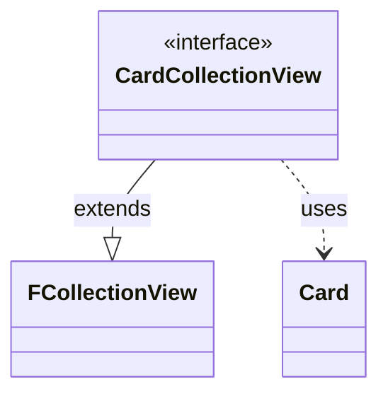

---
aliases:
  - CardCollectionView
tags:
  - java/interface
  - module/forge-game
  - pkg/forge/game/card
fqn: forge.game.card.CardCollectionView
package: forge.game.card
module: forge-game
kind: Interface
---

# CardCollectionView

**Package:** `forge.game.card`   **Module:** `forge-game`   **Kind:** Interface



## Relationships
**Extends:**
- [[forge.util.collect.FCollectionView|FCollectionView]]
**Uses:**
- [[forge.game.card.Card|Card]]

## Design Description

CardCollectionView is a domain-specific, read-only view interface for collections of `Card` objects within Forge's game model. It extends the generic `FCollectionView<Card>` from the utility layer, binding that reusable collection abstraction to the concrete `Card` type without adding new operations of its own. As a marker-style specialization, its purpose is primarily semantic and ergonomic: it gives card-holding APIs a single, named, type-safe return and parameter type rather than exposing the verbose generic form throughout the codebase.

The deliberate omission of mutating methods—inherited only through the view-oriented `FCollectionView` contract—signals an intent to hand out immutable, query-only access to card sets, keeping mutation confined to the underlying collection implementations while callers consume cards safely.

## Source
`forge-game/src/main/java/forge/game/card/CardCollectionView.java`

```java
package forge.game.card;

import forge.util.collect.FCollectionView;

//Simplified interface for card collection views
public interface CardCollectionView extends FCollectionView<Card> {
}
```

## Python
`forge/game/card/CardCollectionView.py`

````python
The port is straightforward. Here is the Python source:

```python
from forge.util.collect.FCollectionView import FCollectionView
from forge.game.card.Card import Card


# Simplified interface for card collection views
class CardCollectionView(FCollectionView[Card]):
    pass
````
