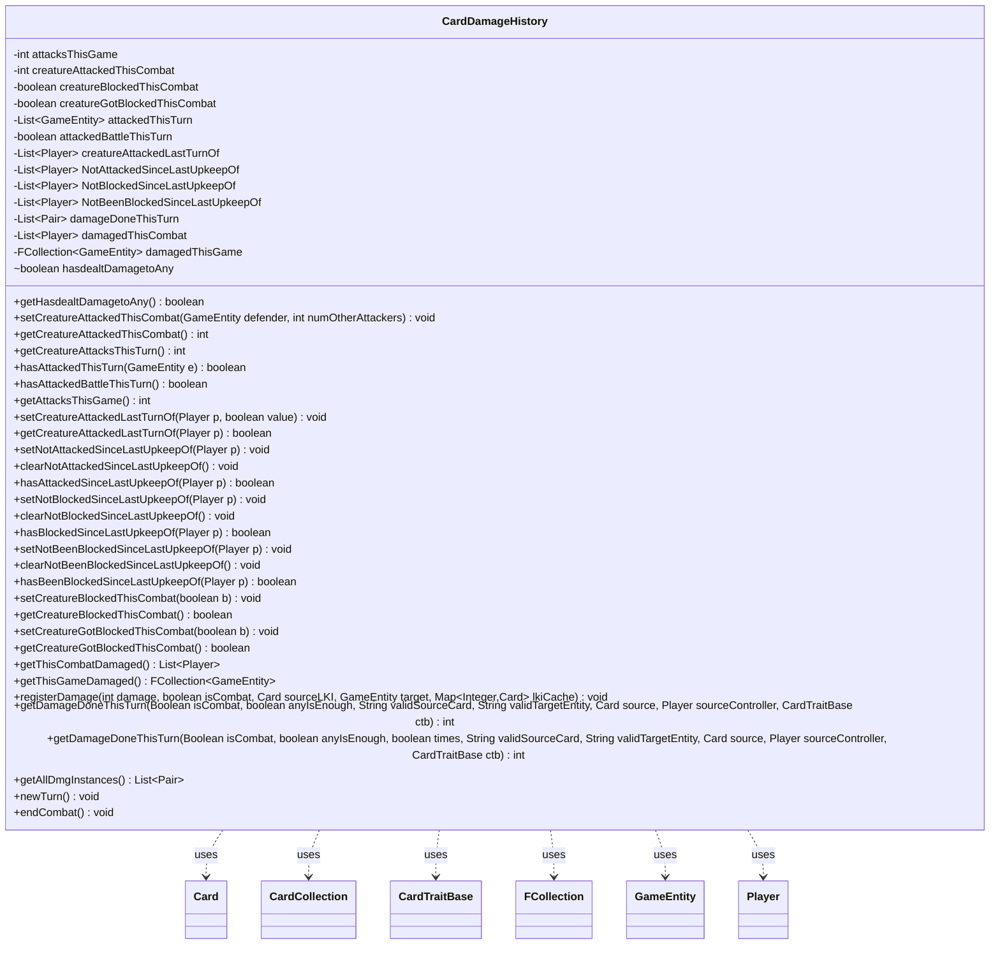

---
aliases:
  - CardDamageHistory
tags:
  - java/class
  - module/forge-game
  - pkg/forge/game/card
fqn: forge.game.card.CardDamageHistory
package: forge.game.card
module: forge-game
kind: Class
---

# CardDamageHistory

**Package:** `forge.game.card`   **Module:** `forge-game`   **Kind:** Class



## Relationships
**Uses:**
- [[forge.game.CardTraitBase|CardTraitBase]]
- [[forge.game.GameEntity|GameEntity]]
- [[forge.game.card.Card|Card]]
- [[forge.game.card.CardCollection|CardCollection]]
- [[forge.game.player.Player|Player]]
- [[forge.util.collect.FCollection|FCollection]]

## Design Description

CardDamageHistory is a mutable per-card bookkeeping record that tracks every combat- and damage-related event in a creature's life, scoped across three time horizons: the current combat, the current turn, and the whole game. It records how many times the card attacked, which `GameEntity` defenders it struck, whether it blocked or was blocked, and—keyed per `Player`—attack/block status since each opponent's last upkeep, supporting the many individual cards (Kytheon, The Fallen, Glen Elendra) whose abilities query this history.

Holding no reference to its owning `Card`, it acts as a pure state container manipulated by the combat and game systems. `registerDamage` is its hub, recording damage instances as `Pair<Integer,Boolean>`, propagating to the `GameEntity` target and the global damage log, while `newTurn` and `endCombat` reset the appropriate horizons—`newTurn` also dereferencing off-battlefield `Card`s to aid garbage collection on large board states.

## Source
`forge-game/src/main/java/forge/game/card/CardDamageHistory.java`

```java
package forge.game.card;

import com.google.common.collect.Lists;
import forge.game.CardTraitBase;
import forge.game.GameEntity;
import forge.game.player.Player;
import forge.game.zone.ZoneType;
import forge.util.collect.FCollection;
import org.apache.commons.lang3.tuple.Pair;

import java.util.List;
import java.util.Map;

/** 
 * TODO: Write javadoc for this type.
 *
 */
public class CardDamageHistory {

    private int attacksThisGame = 0;
    // amount only needed for Kytheon
    private int creatureAttackedThisCombat = 0;
    private boolean creatureBlockedThisCombat = false;
    private boolean creatureGotBlockedThisCombat = false;

    private List<GameEntity> attackedThisTurn = Lists.newArrayList();
    private boolean attackedBattleThisTurn = false;

    private final List<Player> creatureAttackedLastTurnOf = Lists.newArrayList();
    private final List<Player> NotAttackedSinceLastUpkeepOf = Lists.newArrayList();
    private final List<Player> NotBlockedSinceLastUpkeepOf = Lists.newArrayList();
    private final List<Player> NotBeenBlockedSinceLastUpkeepOf = Lists.newArrayList();

    private List<Pair<Integer, Boolean>> damageDoneThisTurn = Lists.newArrayList();

    // only needed for Glen Elendra (Plane)
    private final List<Player> damagedThisCombat = Lists.newArrayList();
    // only needed for The Fallen
    private final FCollection<GameEntity> damagedThisGame = new FCollection<>();
    boolean hasdealtDamagetoAny = false;

    public final boolean getHasdealtDamagetoAny() {
        return hasdealtDamagetoAny;
    }

    // used to see if an attacking creature with a triggering attack ability
    // triggered this phase:
    /**
     * <p>
     * Setter for the field <code>creatureAttackedThisCombat</code>.
     * </p>
     *
     */
    public final void setCreatureAttackedThisCombat(GameEntity defender, int numOtherAttackers) {
        this.creatureAttackedThisCombat = 1 + numOtherAttackers;

        if (defender != null) {
            this.attacksThisGame++;
            attackedThisTurn.add(defender);
            if (defender instanceof Card) {
                final Card def = (Card) defender;
                if (def.isBattle()) {
                    attackedBattleThisTurn = true;
                }
            }
        }
    }
    /**
     * <p>
     * Getter for the field <code>creatureAttackedThisCombat</code>.
     * </p>
     * 
     * @return a boolean.
     */
    public final int getCreatureAttackedThisCombat() {
        return this.creatureAttackedThisCombat;
    }
    /**
     * <p>
     * Getter for the field <code>attacksThisTurn</code>.
     * </p>
     * 
     * @return a int.
     */
    public final int getCreatureAttacksThisTurn() {
        return this.attackedThisTurn.size();
    }
    public final boolean hasAttackedThisTurn(GameEntity e) {
        return this.attackedThisTurn.contains(e);
    }
    public final boolean hasAttackedBattleThisTurn() {
        return this.attackedBattleThisTurn;
    }

    public final int getAttacksThisGame() {
        return this.attacksThisGame;
    }
    /**
     * <p>
     * Setter for the field <code>creatureAttackedLastTurn</code>.
     * </p>
     * 
     * @param value
     *            a boolean.
     */
    public final void setCreatureAttackedLastTurnOf(final Player p, boolean value) {
        if (value && !creatureAttackedLastTurnOf.contains(p)) {
            creatureAttackedLastTurnOf.add(p);
        }
        while (!value && creatureAttackedLastTurnOf.remove(p)) { } // remove should return false once no player is found in collection
    }
    /**
     * <p>
     * Getter for the field <code>creatureAttackedLastTurn</code>.
     * </p>
     * 
     * @return a boolean.
     */
    public final boolean getCreatureAttackedLastTurnOf(final Player p) {
        return creatureAttackedLastTurnOf.contains(p);
    }
    /**
     * <p>
     * Setter for the field <code>NotAttackedSinceLastUpkeepOf</code>.
     * </p>
     *
     */
    public final void setNotAttackedSinceLastUpkeepOf(final Player p) {
        NotAttackedSinceLastUpkeepOf.add(p);
    }

    public final void clearNotAttackedSinceLastUpkeepOf() {
        NotAttackedSinceLastUpkeepOf.clear();
    }
    /**
     * <p>
     * Getter for the field <code>NotAttackedSinceLastUpkeepOf</code>.
     * </p>
     * 
     * @return a boolean.
     */
    public final boolean hasAttackedSinceLastUpkeepOf(final Player p) {
        return !NotAttackedSinceLastUpkeepOf.contains(p);
    }

    public final void setNotBlockedSinceLastUpkeepOf(final Player p) {
        NotBlockedSinceLastUpkeepOf.add(p);
    }

    public final void clearNotBlockedSinceLastUpkeepOf() {
        NotBlockedSinceLastUpkeepOf.clear();
    }
    /**
     * <p>
     * Getter for the field <code>NotAttackedSinceLastUpkeepOf</code>.
     * </p>
     * 
     * @return a boolean.
     */
    public final boolean hasBlockedSinceLastUpkeepOf(final Player p) {
        return !NotBlockedSinceLastUpkeepOf.contains(p);
    }

    public final void setNotBeenBlockedSinceLastUpkeepOf(final Player p) {
        NotBeenBlockedSinceLastUpkeepOf.add(p);
    }

    public final void clearNotBeenBlockedSinceLastUpkeepOf() {
        NotBeenBlockedSinceLastUpkeepOf.clear();
    }
    /**
     * <p>
     * Getter for the field <code>NotAttackedSinceLastUpkeepOf</code>.
     * </p>
     * 
     * @return a boolean.
     */
    public final boolean hasBeenBlockedSinceLastUpkeepOf(final Player p) {
        return !NotBeenBlockedSinceLastUpkeepOf.contains(p);
    }
    /**
     * <p>
     * Setter for the field <code>creatureBlockedThisCombat</code>.
     * </p>
     * 
     * @param b
     *            a boolean.
     */
    public final void setCreatureBlockedThisCombat(final boolean b) {
        this.creatureBlockedThisCombat = b;
    }
    /**
     * <p>
     * Getter for the field <code>creatureBlockedThisCombat</code>.
     * </p>
     * 
     * @return a boolean.
     */
    public final boolean getCreatureBlockedThisCombat() {
        return this.creatureBlockedThisCombat;
    }
    /**
     * <p>
     * Setter for the field <code>creatureGotBlockedThisCombat</code>.
     * </p>
     * 
     * @param b
     *            a boolean.
     */
    public final void setCreatureGotBlockedThisCombat(final boolean b) {
        this.creatureGotBlockedThisCombat = b;
    }
    /**
     * <p>
     * Getter for the field <code>creatureGotBlockedThisCombat</code>.
     * </p>
     * 
     * @return a boolean.
     */
    public final boolean getCreatureGotBlockedThisCombat() {
        return this.creatureGotBlockedThisCombat;
    }

    public final List<Player> getThisCombatDamaged() {
        return damagedThisCombat;
    }
    public final FCollection<GameEntity> getThisGameDamaged() {
        return damagedThisGame;
    }

    public void registerDamage(int damage, boolean isCombat, Card sourceLKI, GameEntity target, Map<Integer, Card> lkiCache) {
        if (damage <= 0) {
            return;
        }
        damagedThisGame.add(target);
        hasdealtDamagetoAny = true;
        if (isCombat && target instanceof Player) {
            final Player pTgt = (Player) target;
            damagedThisCombat.add(pTgt);
            if (pTgt.getLastTurnNr() > 0 && !pTgt.getGame().getPhaseHandler().isPlayerTurn(pTgt)) {
                pTgt.setBeenDealtCombatDamageSinceLastTurn(true);
            }
        }
        Pair<Integer, Boolean> dmg = Pair.of(damage, isCombat);
        damageDoneThisTurn.add(dmg);
        target.receiveDamage(dmg);

        sourceLKI.getGame().addGlobalDamageHistory(this, dmg, sourceLKI.isLKI() ? sourceLKI : CardCopyService.getLKICopy(sourceLKI, lkiCache), CardCopyService.getLKICopy(target, lkiCache));
    }

    public int getDamageDoneThisTurn(Boolean isCombat, boolean anyIsEnough, String validSourceCard, String validTargetEntity, Card source, Player sourceController, CardTraitBase ctb) {
        return getDamageDoneThisTurn(isCombat, anyIsEnough, false, validSourceCard, validTargetEntity, source, sourceController, ctb);
    }
    public int getDamageDoneThisTurn(Boolean isCombat, boolean anyIsEnough, boolean times, String validSourceCard, String validTargetEntity, Card source, Player sourceController, CardTraitBase ctb) {
        int sum = 0;
        for (Pair<Integer, Boolean> damage : damageDoneThisTurn) {
            Pair<Card, GameEntity> sourceToTarget = sourceController.getGame().getDamageLKI(damage);

            if (isCombat != null && damage.getRight() != isCombat) {
                continue;
            }
            if (sourceToTarget != null) {
                if (validSourceCard != null && !sourceToTarget.getLeft().isValid(validSourceCard.split(","), sourceController, source == null ? sourceToTarget.getLeft() : source, ctb)) {
                    continue;
                }
                if (validTargetEntity != null && !sourceToTarget.getRight().isValid(validTargetEntity.split(","), sourceController, source, ctb)) {
                    continue;
                }
            }
            sum += times ? 1 : damage.getLeft();
            if (anyIsEnough) {
                break;
            }
        }
        return sum;
    }

    public List<Pair<Integer, Boolean>> getAllDmgInstances() {
        return damageDoneThisTurn;
    }

    public void newTurn() {
        attackedThisTurn.clear();
        attackedBattleThisTurn = false;
        damagedThisCombat.clear();
        damageDoneThisTurn.clear();

        // if card already LTB we can safely dereference (allows quite a few objects to be cleaned up earlier for bigger boardstates)
        CardCollection toRemove = new CardCollection();
        for (GameEntity e : damagedThisGame) {
            if (e instanceof Card) {
                if (((Card) e).getZone().getZoneType() != ZoneType.Battlefield) {
                    toRemove.add((Card)e);
                }
            }
        }
        damagedThisGame.removeAll(toRemove);
    }

    public void endCombat() {
        damagedThisCombat.clear();
        setCreatureAttackedThisCombat(null, -1);
        setCreatureBlockedThisCombat(false);
        setCreatureGotBlockedThisCombat(false);
    }
}
```

## Python
`forge/game/card/CardDamageHistory.py`

```python
from forge.game.CardTraitBase import CardTraitBase
from forge.game.GameEntity import GameEntity
from forge.game.card.Card import Card
from forge.game.card.CardCollection import CardCollection
from forge.game.card.CardCopyService import CardCopyService
from forge.game.player.Player import Player
from forge.game.zone.ZoneType import ZoneType
from forge.util.collect.FCollection import FCollection


# TODO: Write javadoc for this type.
class CardDamageHistory:

    def __init__(self):
        self.attacksThisGame = 0
        # amount only needed for Kytheon
        self.creatureAttackedThisCombat = 0
        self.creatureBlockedThisCombat = False
        self.creatureGotBlockedThisCombat = False

        self.attackedThisTurn: list[GameEntity] = []
        self.attackedBattleThisTurn = False

        self.creatureAttackedLastTurnOf: list[Player] = []
        self.NotAttackedSinceLastUpkeepOf: list[Player] = []
        self.NotBlockedSinceLastUpkeepOf: list[Player] = []
        self.NotBeenBlockedSinceLastUpkeepOf: list[Player] = []

        self.damageDoneThisTurn: list = []

        # only needed for Glen Elendra (Plane)
        self.damagedThisCombat: list[Player] = []
        # only needed for The Fallen
        self.damagedThisGame: FCollection[GameEntity] = FCollection()
        self.hasdealtDamagetoAny = False

    def getHasdealtDamagetoAny(self) -> bool:
        return self.hasdealtDamagetoAny

    # used to see if an attacking creature with a triggering attack ability
    # triggered this phase:
    def setCreatureAttackedThisCombat(self, defender: GameEntity, numOtherAttackers: int) -> None:
        self.creatureAttackedThisCombat = 1 + numOtherAttackers

        if defender is not None:
            self.attacksThisGame += 1
            self.attackedThisTurn.append(defender)
            if isinstance(defender, Card):
                de = defender
                if de.isBattle():
                    self.attackedBattleThisTurn = True

    def getCreatureAttackedThisCombat(self) -> int:
        return self.creatureAttackedThisCombat

    def getCreatureAttacksThisTurn(self) -> int:
        return len(self.attackedThisTurn)

    def hasAttackedThisTurn(self, e: GameEntity) -> bool:
        return e in self.attackedThisTurn

    def hasAttackedBattleThisTurn(self) -> bool:
        return self.attackedBattleThisTurn

    def getAttacksThisGame(self) -> int:
        return self.attacksThisGame

    def setCreatureAttackedLastTurnOf(self, p: Player, value: bool) -> None:
        if value and p not in self.creatureAttackedLastTurnOf:
            self.creatureAttackedLastTurnOf.append(p)
        # remove should return false once no player is found in collection
        while not value and p in self.creatureAttackedLastTurnOf:
            self.creatureAttackedLastTurnOf.remove(p)

    def getCreatureAttackedLastTurnOf(self, p: Player) -> bool:
        return p in self.creatureAttackedLastTurnOf

    def setNotAttackedSinceLastUpkeepOf(self, p: Player) -> None:
        self.NotAttackedSinceLastUpkeepOf.append(p)

    def clearNotAttackedSinceLastUpkeepOf(self) -> None:
        self.NotAttackedSinceLastUpkeepOf.clear()

    def hasAttackedSinceLastUpkeepOf(self, p: Player) -> bool:
        return p not in self.NotAttackedSinceLastUpkeepOf

    def setNotBlockedSinceLastUpkeepOf(self, p: Player) -> None:
        self.NotBlockedSinceLastUpkeepOf.append(p)

    def clearNotBlockedSinceLastUpkeepOf(self) -> None:
        self.NotBlockedSinceLastUpkeepOf.clear()

    def hasBlockedSinceLastUpkeepOf(self, p: Player) -> bool:
        return p not in self.NotBlockedSinceLastUpkeepOf

    def setNotBeenBlockedSinceLastUpkeepOf(self, p: Player) -> None:
        self.NotBeenBlockedSinceLastUpkeepOf.append(p)

    def clearNotBeenBlockedSinceLastUpkeepOf(self) -> None:
        self.NotBeenBlockedSinceLastUpkeepOf.clear()

    def hasBeenBlockedSinceLastUpkeepOf(self, p: Player) -> bool:
        return p not in self.NotBeenBlockedSinceLastUpkeepOf

    def setCreatureBlockedThisCombat(self, b: bool) -> None:
        self.creatureBlockedThisCombat = b

    def getCreatureBlockedThisCombat(self) -> bool:
        return self.creatureBlockedThisCombat

    def setCreatureGotBlockedThisCombat(self, b: bool) -> None:
        self.creatureGotBlockedThisCombat = b

    def getCreatureGotBlockedThisCombat(self) -> bool:
        return self.creatureGotBlockedThisCombat

    def getThisCombatDamaged(self) -> list[Player]:
        return self.damagedThisCombat

    def getThisGameDamaged(self) -> FCollection[GameEntity]:
        return self.damagedThisGame

    def registerDamage(self, damage: int, isCombat: bool, sourceLKI: Card, target: GameEntity, lkiCache: dict[int, Card]) -> None:
        if damage <= 0:
            return
        self.damagedThisGame.add(target)
        self.hasdealtDamagetoAny = True
        if isCombat and isinstance(target, Player):
            pTgt = target
            self.damagedThisCombat.append(pTgt)
            if pTgt.getLastTurnNr() > 0 and not pTgt.getGame().getPhaseHandler().isPlayerTurn(pTgt):
                pTgt.setBeenDealtCombatDamageSinceLastTurn(True)
        dmg = (damage, isCombat)
        self.damageDoneThisTurn.append(dmg)
        target.receiveDamage(dmg)

        sourceLKI.getGame().addGlobalDamageHistory(self, dmg, sourceLKI if sourceLKI.isLKI() else CardCopyService.getLKICopy(sourceLKI, lkiCache), CardCopyService.getLKICopy(target, lkiCache))

    def getDamageDoneThisTurn(self, isCombat, anyIsEnough, *args):
        if len(args) == 6:
            validSourceCard, validTargetEntity, source, sourceController, ctb = args[1], args[2], args[3], args[4], args[5]
            times = args[0]
            return self._getDamageDoneThisTurn(isCombat, anyIsEnough, times, validSourceCard, validTargetEntity, source, sourceController, ctb)
        validSourceCard, validTargetEntity, source, sourceController, ctb = args[0], args[1], args[2], args[3], args[4]
        return self._getDamageDoneThisTurn(isCombat, anyIsEnough, False, validSourceCard, validTargetEntity, source, sourceController, ctb)

    def _getDamageDoneThisTurn(self, isCombat, anyIsEnough: bool, times: bool, validSourceCard: str, validTargetEntity: str, source: Card, sourceController: Player, ctb: CardTraitBase) -> int:
        sum = 0
        for damage in self.damageDoneThisTurn:
            sourceToTarget = sourceController.getGame().getDamageLKI(damage)

            if isCombat is not None and damage[1] != isCombat:
                continue
            if sourceToTarget is not None:
                if validSourceCard is not None and not sourceToTarget[0].isValid(validSourceCard.split(","), sourceController, sourceToTarget[0] if source is None else source, ctb):
                    continue
                if validTargetEntity is not None and not sourceToTarget[1].isValid(validTargetEntity.split(","), sourceController, source, ctb):
                    continue
            sum += 1 if times else damage[0]
            if anyIsEnough:
                break
        return sum

    def getAllDmgInstances(self) -> list:
        return self.damageDoneThisTurn

    def newTurn(self) -> None:
        self.attackedThisTurn.clear()
        self.attackedBattleThisTurn = False
        self.damagedThisCombat.clear()
        self.damageDoneThisTurn.clear()

        # if card already LTB we can safely dereference (allows quite a few objects to be cleaned up earlier for bigger boardstates)
        toRemove = CardCollection()
        for e in self.damagedThisGame:
            if isinstance(e, Card):
                if e.getZone().getZoneType() != ZoneType.Battlefield:
                    toRemove.add(e)
        self.damagedThisGame.removeAll(toRemove)

    def endCombat(self) -> None:
        self.damagedThisCombat.clear()
        self.setCreatureAttackedThisCombat(None, -1)
        self.setCreatureBlockedThisCombat(False)
        self.setCreatureGotBlockedThisCombat(False)
```
