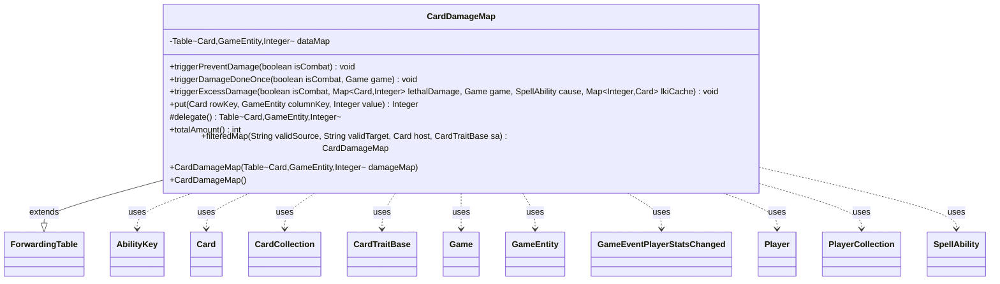

---
aliases:
  - CardDamageMap
tags:
  - java/class
  - module/forge-game
  - pkg/forge/game/card
fqn: forge.game.card.CardDamageMap
package: forge.game.card
module: forge-game
kind: Class
---

# CardDamageMap

**Package:** `forge.game.card` &nbsp; **Module:** `forge-game` &nbsp; **Kind:** Class



## Relationships
**Uses:**
- [[forge.game.CardTraitBase|CardTraitBase]]
- [[forge.game.Game|Game]]
- [[forge.game.GameEntity|GameEntity]]
- [[forge.game.ability.AbilityKey|AbilityKey]]
- [[forge.game.card.Card|Card]]
- [[forge.game.card.CardCollection|CardCollection]]
- [[forge.game.event.GameEventPlayerStatsChanged|GameEventPlayerStatsChanged]]
- [[forge.game.player.Player|Player]]
- [[forge.game.player.PlayerCollection|PlayerCollection]]
- [[forge.game.spellability.SpellAbility|SpellAbility]]

## Design Description

CardDamageMap is a specialized accumulator that records how much damage each source `Card` deals to each `GameEntity` target during a damage event. It extends Guava's `ForwardingTable<Card, GameEntity, Integer>`, backing itself with a `HashBasedTable` and overriding `put` so repeated entries for the same source/target pair sum rather than replace—reflecting that damage assignments accrue. Its `delegate()` exposes the underlying table to the forwarding machinery, while `totalAmount` and `filteredMap` offer aggregate queries and source/target filtering via `GameObjectPredicates`.

Its primary responsibility, however, is firing the rules triggers that follow damage resolution: `triggerPreventDamage`, `triggerDamageDoneOnce`, and `triggerExcessDamage` walk the table's row and column views, build `AbilityKey` parameter maps, and dispatch them through the game's `TriggerHandler` (DamageDoneOnce, ExcessDamage, etc.). It thus acts as the bridge between raw damage bookkeeping and Forge's event/trigger system, collaborating with `Game`, `Player`, `SpellAbility`, and `CardTraitBase` to honor effects keyed on dealt or excess damage.

## Source
`forge-game/src/main/java/forge/game/card/CardDamageMap.java`

```java
/**
 *
 */
package forge.game.card;

import com.google.common.collect.ForwardingTable;
import com.google.common.collect.HashBasedTable;
import com.google.common.collect.Maps;
import com.google.common.collect.Table;
import forge.game.CardTraitBase;
import forge.game.Game;
import forge.game.GameEntity;
import forge.game.GameObjectPredicates;
import forge.game.ability.AbilityKey;
import forge.game.event.GameEventPlayerStatsChanged;
import forge.game.player.Player;
import forge.game.player.PlayerCollection;
import forge.game.spellability.SpellAbility;
import forge.game.trigger.TriggerType;

import java.util.Map;
import java.util.Map.Entry;
import java.util.Set;
import java.util.stream.Collectors;

public class CardDamageMap extends ForwardingTable<Card, GameEntity, Integer> {
    private Table<Card, GameEntity, Integer> dataMap = HashBasedTable.create();

    public CardDamageMap(Table<Card, GameEntity, Integer> damageMap) {
        putAll(damageMap);
    }

    public CardDamageMap() {
    }

    public void triggerPreventDamage(boolean isCombat) {
        for (Map.Entry<GameEntity, Map<Card, Integer>> e : columnMap().entrySet()) {
            int sum = 0;
            for (final int i : e.getValue().values()) {
                sum += i;
            }
            if (sum > 0) {
                final GameEntity ge = e.getKey();
                final Map<AbilityKey, Object> runParams = AbilityKey.newMap();
                runParams.put(AbilityKey.DamageTarget, ge);
                runParams.put(AbilityKey.DamageAmount, sum);
                runParams.put(AbilityKey.IsCombatDamage, isCombat);

                ge.getGame().getTriggerHandler().runTrigger(TriggerType.DamagePreventedOnce, runParams, false);

                ge.getView().updatePreventNextDamage(ge);
                if (ge instanceof Player) {
                    ge.getGame().fireEvent(new GameEventPlayerStatsChanged((Player) ge, false));
                }
            }
        }
    }

    public void triggerDamageDoneOnce(boolean isCombat, final Game game) {
        // Source -> Targets
        for (Map.Entry<Card, Map<GameEntity, Integer>> e : rowMap().entrySet()) {
            final Card sourceLKI = e.getKey();
            int sum = 0;
            for (final Integer i : e.getValue().values()) {
                sum += i;
            }
            if (sum > 0) {
                final Map<AbilityKey, Object> runParams = AbilityKey.newMap();
                runParams.put(AbilityKey.DamageSource, sourceLKI);
                runParams.put(AbilityKey.DamageMap, Maps.newHashMap(e.getValue()));
                runParams.put(AbilityKey.IsCombatDamage, isCombat);

                game.getTriggerHandler().runTrigger(TriggerType.DamageDealtOnce, runParams, false);
            }
        }

        // Targets -> Source
        for (Map.Entry<GameEntity, Map<Card, Integer>> e : columnMap().entrySet()) {
            int sum = 0;
            // controller list
            PlayerCollection controllers = new PlayerCollection();
            for (Entry<Card, Integer> ec : e.getValue().entrySet()) {
                sum += ec.getValue();
                controllers.add(ec.getKey().getController());
            }
            if (sum > 0) {
                final GameEntity ge = e.getKey();
                final Map<AbilityKey, Object> runParams = AbilityKey.newMap();
                runParams.put(AbilityKey.DamageTarget, ge);
                runParams.put(AbilityKey.DamageMap, Maps.newHashMap(e.getValue()));
                runParams.put(AbilityKey.IsCombatDamage, isCombat);

                game.getTriggerHandler().runTrigger(TriggerType.DamageDoneOnce, runParams, false);
            }
            for (Player p : controllers) {
                final GameEntity ge = e.getKey();
                final Map<AbilityKey, Object> runParams = AbilityKey.newMap();
                runParams.put(AbilityKey.DamageTarget, ge);
                runParams.put(AbilityKey.DamageSource, p);
                runParams.put(AbilityKey.IsCombatDamage, isCombat);

                game.getTriggerHandler().runTrigger(TriggerType.DamageDoneOnceByController, runParams, false);
            }
        }

        final Map<AbilityKey, Object> runParams = AbilityKey.newMap();
        runParams.put(AbilityKey.DamageMap, new CardDamageMap(this));
        runParams.put(AbilityKey.IsCombatDamage, isCombat);
        game.getTriggerHandler().runTrigger(TriggerType.DamageAll, runParams, false);
    }

    public void triggerExcessDamage(boolean isCombat, Map<Card, Integer> lethalDamage, final Game game, final SpellAbility cause, final Map<Integer, Card> lkiCache) {
        int storedExcess = 0;

        CardCollection damagedList = new CardCollection();
        for (Entry<Card, Integer> damaged : lethalDamage.entrySet()) {
            int sum = 0;
            for (Integer i : this.column(damaged.getKey()).values()) {
                sum += i;
            }
            if (sum == 0) {
                continue;
            }

            int excess = sum - (damaged.getKey().hasBeenDealtDeathtouchDamage() ? 1 : damaged.getValue());

            // also update the DamageHistory, but overwrite previous excess outcomes
            // because Rith, Liberated Primeval cares about who controlled it at this moment
            lkiCache.get(damaged.getKey().getId()).setHasBeenDealtExcessDamageThisTurn(excess > 0);

            if (excess <= 0) {
                continue;
            }

            if (cause != null && cause.hasParam("ExcessSVar")
                    && (!cause.hasParam("ExcessSVarCondition") || damaged.getKey().isValid(cause.getParam("ExcessSVarCondition"), cause.getActivatingPlayer(), cause.getHostCard(), cause))) {
                storedExcess += excess;
            }

            damaged.getKey().setHasBeenDealtExcessDamageThisTurn(true);
            damaged.getKey().logExcessDamage(excess);

            final Map<AbilityKey, Object> runParams = AbilityKey.newMap();
            runParams.put(AbilityKey.DamageTarget, damaged.getKey());
            runParams.put(AbilityKey.DamageAmount, excess);
            runParams.put(AbilityKey.IsCombatDamage, isCombat);
            game.getTriggerHandler().runTrigger(TriggerType.ExcessDamage, runParams, false);

            damagedList.add(damaged.getKey());
        }

        if (cause != null && cause.hasParam("ExcessSVar")) {
            cause.setSVar(cause.getParam("ExcessSVar"), Integer.toString(storedExcess));
        }

        if (!damagedList.isEmpty()) {
            final Map<AbilityKey, Object> runParams = AbilityKey.newMap();
            runParams.put(AbilityKey.DamageTargets, damagedList);
            runParams.put(AbilityKey.IsCombatDamage, isCombat);
            game.getTriggerHandler().runTrigger(TriggerType.ExcessDamageAll, runParams, false);
        }
    }

    /**
     * special put logic, sum the values
     */
    @Override
    public Integer put(Card rowKey, GameEntity columnKey, Integer value) {
        Integer old = contains(rowKey, columnKey) ? get(rowKey, columnKey) : 0;
        return dataMap.put(rowKey, columnKey, value + old);
    }

    @Override
    protected Table<Card, GameEntity, Integer> delegate() {
        return dataMap;
    }

    public int totalAmount() {
        int result = 0;
        for (int i : values()) {
            result += i;
        }
        return result;
    }

    public CardDamageMap filteredMap(String validSource, String validTarget, Card host, CardTraitBase sa) {
        CardDamageMap result = new CardDamageMap();
        Set<Card> filteredSource = null;
        Set<GameEntity> filteredTarget = null;
        if (validSource != null) {
            filteredSource = rowKeySet().stream().filter(GameObjectPredicates.restriction(validSource.split(","), host.getController(), host, sa)).collect(Collectors.toSet());
        }
        if (validTarget != null) {
            filteredTarget = columnKeySet().stream().filter(GameObjectPredicates.restriction(validTarget.split(","), host.getController(), host, sa)).collect(Collectors.toSet());
        }

        for (Table.Cell<Card, GameEntity, Integer> c : cellSet()) {
            if (filteredSource != null && !filteredSource.contains(c.getRowKey())) {
                continue;
            }
            if (filteredTarget != null && !filteredTarget.contains(c.getColumnKey())) {
                continue;
            }

            result.put(c.getRowKey(), c.getColumnKey(), c.getValue());
        }

        return result;
    }

}
```
