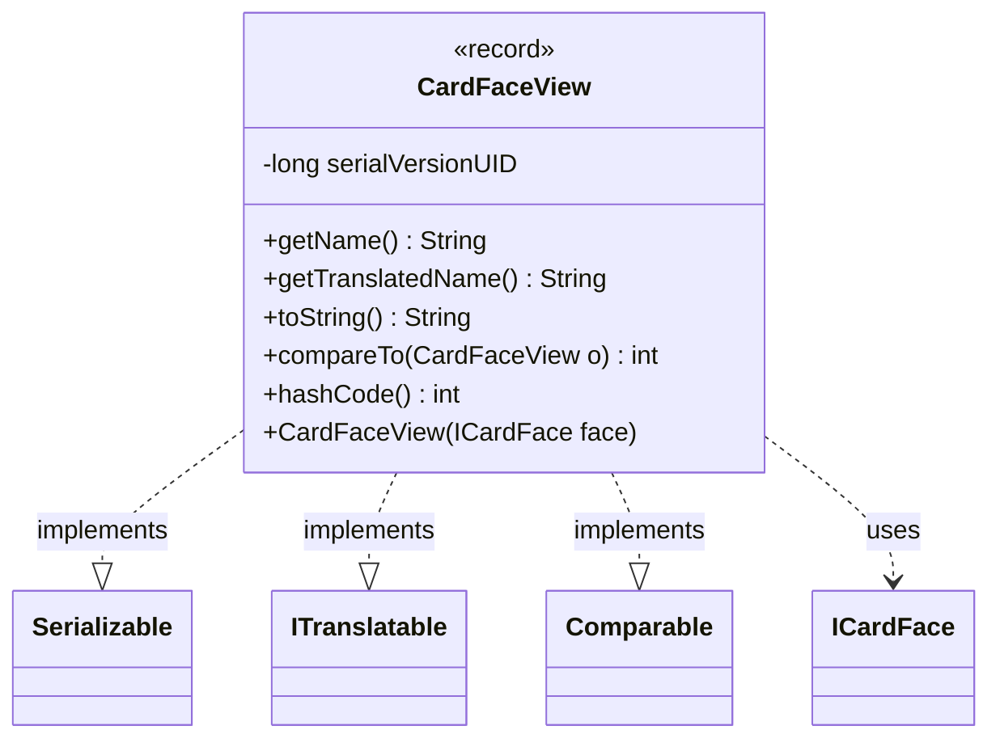

---
aliases:
  - CardFaceView
tags:
  - java/record
  - module/forge-game
  - pkg/forge/game/card
fqn: forge.game.card.CardFaceView
package: forge.game.card
module: forge-game
kind: Record
---

# CardFaceView

**Package:** `forge.game.card` &nbsp; **Module:** `forge-game` &nbsp; **Kind:** Record



## Relationships
**Implements:**
- [[forge.util.ITranslatable|ITranslatable]]
**Uses:**
- [[forge.card.ICardFace|ICardFace]]

## Design Description

CardFaceView is an immutable record that provides a lightweight, serializable view of a card face, capturing only its raw `name` and `displayName` as a stable value object decoupled from the mutable `ICardFace` model. A convenience constructor adapts any `ICardFace` into this projection, supporting use as a snapshot or transport representation.

By implementing `ITranslatable`, it exposes both the canonical name and a localized form via `CardTranslation`, integrating with Forge's translation system. As a `Comparable`, it orders faces alphabetically by name, and its `hashCode` and `toString` are deliberately name-based, treating the face name as the identifying key. Implementing `Serializable` reflects its intended use across persistence or transfer boundaries.

## Source
`forge-game/src/main/java/forge/game/card/CardFaceView.java`

```java
package forge.game.card;

import java.io.Serializable;

import forge.card.ICardFace;
import forge.util.CardTranslation;
import forge.util.ITranslatable;

public record CardFaceView(String name, String displayName) implements Serializable, ITranslatable, Comparable<CardFaceView> {
    private static final long serialVersionUID = 1874016432028306386L;

    public CardFaceView(ICardFace face) {
        this(face.getName(), face.getDisplayName());
    }

    @Override
    public String getName() {
        return this.name;
    }
    @Override
    public String getTranslatedName() {
        return CardTranslation.getTranslatedName(this.displayName);
    }
    @Override
    public String toString() {
        return name;
    }

    @Override
    public int compareTo(CardFaceView o) {
        return this.getName().compareTo(o.getName());
    }

    @Override
    public int hashCode() {
        return this.name.hashCode();
    }
}
```

## Python
`forge/game/card/CardFaceView.py`

```python
from functools import total_ordering

from forge.card.ICardFace import ICardFace
from forge.util.CardTranslation import CardTranslation
from forge.util.ITranslatable import ITranslatable


@total_ordering
class CardFaceView(ITranslatable):
    serialVersionUID = 1874016432028306386

    def __init__(self, name, displayName=None):
        if isinstance(name, ICardFace) and displayName is None:
            face = name
            self.name = face.getName()
            self.displayName = face.getDisplayName()
        else:
            self.name = name
            self.displayName = displayName

    def getName(self):
        return self.name

    def getTranslatedName(self):
        return CardTranslation.getTranslatedName(self.displayName)

    def __str__(self):
        return self.name

    def compareTo(self, o):
        a = self.getName()
        b = o.getName()
        return (a > b) - (a < b)

    def __lt__(self, o):
        return self.compareTo(o) < 0

    def __eq__(self, o):
        if not isinstance(o, CardFaceView):
            return NotImplemented
        return self.name == o.name and self.displayName == o.displayName

    def __hash__(self):
        return hash(self.name)
```
