---
aliases:
  - CardFactory
tags:
  - java/class
  - module/forge-game
  - pkg/forge/game/card
fqn: forge.game.card.CardFactory
package: forge.game.card
module: forge-game
kind: Class
---

# CardFactory

**Package:** `forge.game.card` &nbsp; **Module:** `forge-game` &nbsp; **Kind:** Class

```mermaid
classDiagram
    class CardFactory {
        -copySpellHost(SpellAbility sourceSA, SpellAbility targetSA, Player controller) Card
        +copySpellAbilityAndPossiblyHost(SpellAbility sourceSA, SpellAbility targetSA, Player controller) SpellAbility
        +getCard(IPaperCard cp, Player owner, Game game) Card
        +getCard(IPaperCard cp, Player owner, int cardId, Game game) Card
        -buildAbilities(Card card) void
        -buildBattleAbilities(Card card) void
        -readCard(IPaperCard paperCard, int cardId, Game game) Card
        -readCardFace(Card c, ICardFace face) void
        +copySpellAbility(SpellAbility from, SpellAbility to, Card host, Player p, boolean lki, boolean keepTextChanges) void
        +getCopiedTriggeredAbility(WrappedAbility sa, Card newHost, Player controller) SpellAbility
        +getCloneStates(Card in, Card out, CardTraitBase cause) CardCloneStates
        +getMutatedCloneStates(Card card, CardTraitBase sa) CardCloneStates
    }
    CardFactory ..> AbilitySub : uses
    CardFactory ..> Card : uses
    CardFactory ..> CardCloneStates : uses
    CardFactory ..> CardRules : uses
    CardFactory ..> CardSplitType : uses
    CardFactory ..> CardState : uses
    CardFactory ..> CardStateName : uses
    CardFactory ..> CardTraitBase : uses
    CardFactory ..> CardType : uses
    CardFactory ..> ColorSet : uses
    CardFactory ..> Cost : uses
    CardFactory ..> Game : uses
    CardFactory ..> ICardFace : uses
    CardFactory ..> IPaperCard : uses
    CardFactory ..> KeywordInterface : uses
    CardFactory ..> ManaCost : uses
    CardFactory ..> Player : uses
    CardFactory ..> ReplacementEffect : uses
    CardFactory ..> Spell : uses
    CardFactory ..> SpellAbility : uses
    CardFactory ..> SpellAbilityCondition : uses
    CardFactory ..> SpellAbilityRestriction : uses
    CardFactory ..> StaticAbility : uses
    CardFactory ..> Trigger : uses
    CardFactory ..> WrappedAbility : uses
```



## Relationships
**Uses:**
- [[forge.card.CardRules|CardRules]]
- [[forge.card.CardSplitType|CardSplitType]]
- [[forge.card.CardStateName|CardStateName]]
- [[forge.card.CardType|CardType]]
- [[forge.card.ColorSet|ColorSet]]
- [[forge.card.ICardFace|ICardFace]]
- [[forge.card.mana.ManaCost|ManaCost]]
- [[forge.game.CardTraitBase|CardTraitBase]]
- [[forge.game.Game|Game]]
- [[forge.game.card.Card|Card]]
- [[forge.game.card.CardCloneStates|CardCloneStates]]
- [[forge.game.card.CardState|CardState]]
- [[forge.game.cost.Cost|Cost]]
- [[forge.game.keyword.KeywordInterface|KeywordInterface]]
- [[forge.game.player.Player|Player]]
- [[forge.game.replacement.ReplacementEffect|ReplacementEffect]]
- [[forge.game.spellability.AbilitySub|AbilitySub]]
- [[forge.game.spellability.Spell|Spell]]
- [[forge.game.spellability.SpellAbility|SpellAbility]]
- [[forge.game.spellability.SpellAbilityCondition|SpellAbilityCondition]]
- [[forge.game.spellability.SpellAbilityRestriction|SpellAbilityRestriction]]
- [[forge.game.staticability.StaticAbility|StaticAbility]]
- [[forge.game.trigger.Trigger|Trigger]]
- [[forge.game.trigger.WrappedAbility|WrappedAbility]]
- [[forge.item.IPaperCard|IPaperCard]]

## Design Description

CardFactory is a stateless static factory and utility class responsible for instantiating in-game `Card` objects from paper-card definitions and for duplicating spells, abilities, and card states. Its core entry points (`getCard`/`readCard`/`readCardFace`) translate an `IPaperCard`'s `CardRules` and `ICardFace` data into a fully realized `Card`, populating each `CardState` with name, mana cost, types, colors, power/toughness, keywords, triggers, replacement effects, and static abilities, while handling the many layout variants (split, flip, transform, meld, specialize, battle).

Although named a "Factory," it holds no instance state and exposes only static methods, delegating ability wiring to `CardFactoryUtil` and `AbilityFactory`. A second responsibility is copy semantics: `copySpellAbilityAndPossiblyHost`, `copySpellAbility`, and `getCloneStates`/`getMutatedCloneStates` implement MTG's rules-driven copy and clone effects, interpreting `CardTraitBase` parameters (AddTypes, SetColor, AddKeywords, etc.) to produce modified `CardCloneStates`. It thus centralizes the bridge between static card data and live game entities.

## Source
`forge-game/src/main/java/forge/game/card/CardFactory.java`

```java
/*
 * Forge: Play Magic: the Gathering.
 * Copyright (C) 2011  Forge Team
 *
 * This program is free software: you can redistribute it and/or modify
 * it under the terms of the GNU General Public License as published by
 * the Free Software Foundation, either version 3 of the License, or
 * (at your option) any later version.
 *
 * This program is distributed in the hope that it will be useful,
 * but WITHOUT ANY WARRANTY; without even the implied warranty of
 * MERCHANTABILITY or FITNESS FOR A PARTICULAR PURPOSE.  See the
 * GNU General Public License for more details.
 *
 * You should have received a copy of the GNU General Public License
 * along with this program.  If not, see <http://www.gnu.org/licenses/>.
 */
package forge.game.card;

import com.google.common.collect.Lists;

import forge.ImageKeys;
import forge.StaticData;
import forge.card.*;
import forge.card.mana.ManaCost;
import forge.game.CardTraitBase;
import forge.game.Game;
import forge.game.ability.AbilityFactory;
import forge.game.ability.AbilityUtils;
import forge.game.ability.ApiType;
import forge.game.cost.Cost;
import forge.game.keyword.Keyword;
import forge.game.keyword.KeywordInterface;
import forge.game.player.Player;
import forge.game.replacement.ReplacementEffect;
import forge.game.replacement.ReplacementHandler;
import forge.game.spellability.*;
import forge.game.staticability.StaticAbility;
import forge.game.trigger.Trigger;
import forge.game.trigger.TriggerHandler;
import forge.game.trigger.WrappedAbility;
import forge.item.IPaperCard;
import forge.util.CardTranslation;
import forge.util.TextUtil;

import java.util.Arrays;
import java.util.List;
import java.util.Map;
import java.util.Map.Entry;
import java.util.stream.Collectors;

/**
 * <p>
 * AbstractCardFactory class.
 * </p>
 *
 * TODO The map field contains Card instances that have not gone through
 * getCard2, and thus lack abilities. However, when a new Card is requested via
 * getCard, it is this map's values that serve as the templates for the values
 * it returns. This class has another field, allCards, which is another copy of
 * the card database. These cards have abilities attached to them, and are owned
 * by the human player by default. <b>It would be better memory-wise if we had
 * only one or the other.</b> We may experiment in the future with using
 * allCard-type values for the map instead of the less complete ones that exist
 * there today.
 *
 * @author Forge
 * @version $Id$
 */
public class CardFactory {
    /**
     * <p>
     * copySpellHost.
     * Helper function for copySpellAbilityAndPossiblyHost.
     * creates a copy of the card hosting the ability we want to copy.
     * Updates various attributes of the card that the copy needs,
     * which wouldn't ordinarily get set during a simple Card.copy() call.
     * </p>
     * */
    private static Card copySpellHost(final SpellAbility sourceSA, final SpellAbility targetSA, Player controller) {
        final Card source = sourceSA.getHostCard();
        final Card original = targetSA.getHostCard();
        final Game game = source.getGame();
        int id = game.nextCardId();

        // need to create a physical card first, i need the original card faces
        final Card copy = getCard(original.getPaperCard(), controller, id, game);

        copy.setStates(getCloneStates(original, copy, sourceSA));
        // force update the now set State
        if (original.isTransformable()) {
            copy.setState(original.isTransformed() ? CardStateName.Backside : CardStateName.Original, true, true);
            // 707.8a If an effect creates a token that is a copy of a transforming permanent or a transforming double-faced card not on the battlefield,
            // the resulting token is a transforming token that has both a front face and a back face.
            // The characteristics of each face are determined by the copiable values of the same face of the permanent it is a copy of, as modified by any other copy effects that apply to that permanent.
            // If the token is a copy of a transforming permanent with its back face up, the token enters the battlefield with its back face up.
            // This rule does not apply to tokens that are created with their own set of characteristics and enter the battlefield as a copy of a transforming permanent due to a replacement effect.
            copy.setBackSide(original.isBackSide());
        } else {
            copy.setState(copy.getCurrentStateName(), true, true);
        }

        copy.setGamePieceType(GamePieceType.COPIED_SPELL);
        copy.setCopiedPermanent(original);

        copy.setXManaCostPaidByColor(original.getXManaCostPaidByColor());
        copy.setPromisedGift(original.getPromisedGift());

        if (targetSA.isBestow()) {
            copy.animateBestow();
        }

        if (sourceSA.hasParam("RememberNewCard")) {
            source.addRemembered(copy);
        }

        return copy;
    }

    /**
     * <p>
     * copySpellAbilityAndPossiblyHost.
     * creates a copy of the Spell/ability `sa`, and puts it on the stack.
     * if sa is a spell, that spell's host is also copied.
     * </p>
     */
    public final static SpellAbility copySpellAbilityAndPossiblyHost(final SpellAbility sourceSA, final SpellAbility targetSA, final Player controller) {
        //it is only necessary to copy the host card if the SpellAbility is a spell, not an ability
        final Card c = targetSA.isSpell() && !sourceSA.hasParam("UseOriginalHost") ?
            copySpellHost(sourceSA, targetSA, controller) : targetSA.getHostCard();

        final SpellAbility copySA;
        if (targetSA.isTrigger() && targetSA.isWrapper()) {
            copySA = getCopiedTriggeredAbility((WrappedAbility)targetSA, c, controller);
        } else {
            copySA = targetSA.copy(c, controller, false);
            // need to copy keyword
            if (targetSA.getKeyword() != null) {
                KeywordInterface kw = targetSA.getKeyword().copy(c, false);
                copySA.setKeyword(kw);
                // need to add the keyword to so static doesn't make new keyword
                c.addKeywordForStaticAbility(kw);
            }
        }

        copySA.setCopied(true);
        // 707.10b
        if (targetSA.isAbility()) {
            copySA.setOriginalAbility(targetSA);
        }

        if (copySA instanceof Spell) {
            Spell spell = (Spell) copySA;
            // Copied spell is not cast face down
            spell.setCastFaceDown(false);
            c.setCastSA(copySA);
        }

        // mana is not copied
        copySA.clearManaPaid();
        //remove all costs
        if (!copySA.isTrigger()) {
            copySA.setPayCosts(new Cost("", targetSA.isAbility()));
        }

        return copySA;
    }

    public static Card getCard(final IPaperCard cp, final Player owner, final Game game) {
        return getCard(cp, owner, owner == null ? -1 : owner.getGame().nextCardId(), game);
    }
    public static Card getCard(final IPaperCard cp, final Player owner, final int cardId, final Game game) {
        final Card c = readCard(cp, cardId, game);
        c.setOwner(owner);
        buildAbilities(c);

        c.setSetCode(cp.getEdition());
        c.setRarity(cp.getRarity());

        // Would like to move this away from in-game entities
        String originalPicture = cp.getImageKey(false);
        c.setImageKey(originalPicture);

        if(cp.isToken())
            c.setGamePieceType(GamePieceType.TOKEN);
        else
            c.setGamePieceType(c.getRules().getType().getGamePieceType());

        if (c.hasAlternateState()) {
            if (c.isFlipCard()) {
                c.setState(CardStateName.Flipped, false);
                // set the imagekey altstate to false since the rotated image is handled by graphics renderer
                // setting this to true will download the original image with different name.
                c.setImageKey(cp.getImageKey(false));
            }
            else if (c.isDoubleFaced()) {
                c.setState(cp.getRules().getSplitType().getChangedStateName(), false);
                c.setImageKey(cp.getImageKey(true));
            }
            else if (c.isSplitCard()) {
                c.setState(CardStateName.LeftSplit, false);
                c.setImageKey(originalPicture);
                c.setSetCode(cp.getEdition());
                c.setRarity(cp.getRarity());
                c.setState(CardStateName.RightSplit, false);
                c.setImageKey(originalPicture);
            } else if (c.hasState(CardStateName.Secondary)) {
                c.setState(CardStateName.Secondary, false);
                c.setImageKey(originalPicture);
            } else if (c.hasState(CardStateName.PreparedSpell)) {
                c.setState(CardStateName.PreparedSpell, false);
                c.setImageKey(originalPicture);
            } else if (c.canSpecialize()) {
                c.setState(CardStateName.SpecializeW, false);
                c.setImageKey(cp.getImageKey(false) + ImageKeys.SPECFACE_W);
                c.setSetCode(cp.getEdition());
                c.setRarity(cp.getRarity());
                c.setState(CardStateName.SpecializeU, false);
                c.setImageKey(cp.getImageKey(false) + ImageKeys.SPECFACE_U);
                c.setSetCode(cp.getEdition());
                c.setRarity(cp.getRarity());
                c.setState(CardStateName.SpecializeB, false);
                c.setImageKey(cp.getImageKey(false) + ImageKeys.SPECFACE_B);
                c.setSetCode(cp.getEdition());
                c.setRarity(cp.getRarity());
                c.setState(CardStateName.SpecializeR, false);
                c.setImageKey(cp.getImageKey(false) + ImageKeys.SPECFACE_R);
                c.setSetCode(cp.getEdition());
                c.setRarity(cp.getRarity());
                c.setState(CardStateName.SpecializeG, false);
                c.setImageKey(cp.getImageKey(false) + ImageKeys.SPECFACE_G);
                c.setSetCode(cp.getEdition());
                c.setRarity(cp.getRarity());
            }

            c.setSetCode(cp.getEdition());
            c.setRarity(cp.getRarity());
            c.setState(CardStateName.Original, false);
        }

        return c;
    }

    private static void buildAbilities(final Card card) {
        for (final CardStateName state : card.getStates()) {
            if (card.isDoubleFaced() && state == CardStateName.FaceDown) {
                continue; // Ignore FaceDown for DFC since they have none.
            }
            card.setState(state, false);

            // ******************************************************************
            // ************** Link to different CardFactories *******************
            if (state != CardStateName.Original) {
                CardFactoryUtil.setupKeywordedAbilities(card);
            }
        }

        card.setState(CardStateName.Original, false);
        // need to update keyword cache for original spell
        if (card.isSplitCard()) {
            card.updateKeywordsCache();
        }

        buildBattleAbilities(card);
        CardFactoryUtil.setupKeywordedAbilities(card); // Should happen AFTER setting left/right split abilities to set Fuse ability to both sides
        card.updateStateForView();
    }

    private static void buildBattleAbilities(Card card) {
        if (!card.isBattle()) {
            return;
        }
        // # The following commands should be pulled out into the codebase
        //K:etbCounter:DEFENSE:3

        if (card.getType().hasSubtype("Siege")) {
            CardFactoryUtil.setupSiegeAbilities(card);
        }
        else if (card.getType().getBattleTypes().isEmpty()) {
            //Probably a custom card? Check if it already has an RE for designating a protector.
            if(card.getReplacementEffects().stream().anyMatch((re) -> re.hasParam("BattleProtector")))
                return;
            //Battles with no battle type enter protected by their controller.
            String abProtector = "DB$ ChoosePlayer | Choices$ You | Protect$ True | DontNotify$ True";
            String reText = "Event$ Moved | ValidCard$ Card.Self | Destination$ Battlefield | ReplacementResult$ Updated"
                    + " | BattleProtector$ True | Description$ (As this Battle enters, its controller becomes its protector.)";
            ReplacementEffect re = ReplacementHandler.parseReplacement(reText, card, true);
            re.setOverridingAbility(AbilityFactory.getAbility(abProtector, card));
            card.addReplacementEffect(re);
        }
    }

    private static Card readCard(final IPaperCard paperCard, int cardId, Game game) {
        final Card card = new Card(cardId, paperCard, game);
        CardRules rules = paperCard.getRules();
        card.updateRulesView();

        // 1. The states we may have:
        CardSplitType st = rules.getSplitType();
        if (st == CardSplitType.Split) {
            card.addAlternateState(CardStateName.LeftSplit, false);
            card.setState(CardStateName.LeftSplit, false);
        }

        readCardFace(card, rules.getMainPart());

        if (st == CardSplitType.Specialize) {
            for (Map.Entry<CardStateName, ICardFace> e : rules.getSpecializeParts().entrySet()) {
                card.addAlternateState(e.getKey(), false);
                card.setState(e.getKey(), false);
                if (e.getValue() != null) {
                    readCardFace(card, e.getValue());
                }
            }
        } else if (st != CardSplitType.None) {
            card.addAlternateState(st.getChangedStateName(), false);
            card.setState(st.getChangedStateName(), false);
            if (rules.getOtherPart() != null) {
                readCardFace(card, rules.getOtherPart());
            } else if (!rules.getMeldWith().isEmpty()) {
                readCardFace(card, StaticData.instance().getCommonCards().getRulesOrElseUnsupported(rules.getMeldWith()).getOtherPart());
            }
        }

        if (card.isInAlternateState()) {
            card.setState(CardStateName.Original, false);
        }

        if (st == CardSplitType.Split) {
            card.setName(rules.getName());

            // Combined mana cost
            card.setManaCost(rules.getManaCost());

            // Combined card color
            card.setColor(rules.getColor());
            card.setType(new CardType(rules.getType()));

            // Combined text based on Oracle text -  might not be necessary
            String combinedText = String.format("(%s) %s\r\n\r\n(%s) %s", rules.getMainPart().getName(), rules.getMainPart().getOracleText(), rules.getOtherPart().getName(), rules.getOtherPart().getOracleText());
            card.getState(CardStateName.Original).setOracleText(combinedText);
        }
        return card;
    }

    private static void readCardFace(Card c, ICardFace face) {
        String variantName = null;
        //If it's a functional variant card, switch to that first.
        if(face.hasFunctionalVariants()) {
            variantName = c.getPaperCard().getFunctionalVariant();
            if (!IPaperCard.NO_FUNCTIONAL_VARIANT.equals(variantName)) {
                ICardFace variant = face.getFunctionalVariant(variantName);
                if (variant != null) {
                    face = variant;
                    c.getCurrentState().setFunctionalVariantName(variantName);
                }
                else
                    System.err.printf("Tried to apply unknown or unsupported variant - Card: \"%s\"; Variant: %s\n", face.getName(), variantName);
            }
        }

        // Set name for Sentry reports to be identifiable
        c.setName(face.getName());

        c.getCurrentState().setFlavorName(face.getFlavorName());

        if (face.getDraftActions() != null) {
            face.getDraftActions().forEach(c::addDraftAction);
        }

        c.setManaCost(face.getManaCost());
        c.setText(face.getNonAbilityText());

        c.getCurrentState().setOracleText(face.getOracleText());

        // Super and 'middle' types should use enums.
        c.setType(new CardType(face.getType()));

        c.setColor(face.getColor());

        if (face.getIntPower() != Integer.MAX_VALUE) {
            c.setBasePower(face.getIntPower());
            c.setBasePowerString(face.getPower());
        }
        if (face.getIntToughness() != Integer.MAX_VALUE) {
            c.setBaseToughness(face.getIntToughness());
            c.setBaseToughnessString(face.getToughness());
        }

        c.getCurrentState().setBaseLoyalty(face.getInitialLoyalty());
        c.getCurrentState().setBaseDefense(face.getDefense());

        c.setAttractionLights(face.getAttractionLights());

        // Negative card Id's are for view purposes only
        if (c.getId() >= 0) {
            // Build English oracle and translated oracle mapping
            CardTranslation.buildOracleMapping(face.getName(), face.getOracleText(), variantName);

            for (Entry<String, String> v : face.getVariables())
                c.setSVar(v.getKey(), v.getValue());
            for (String r : face.getReplacements())
                c.addReplacementEffect(ReplacementHandler.parseReplacement(r, c, true, c.getCurrentState()));
            for (String s : face.getStaticAbilities())
                c.addStaticAbility(s);
            for (String t : face.getTriggers())
                c.addTrigger(TriggerHandler.parseTrigger(t, c, true, c.getCurrentState()));

            CardFactoryUtil.addAbilityFactoryAbilities(c, face.getAbilities());

            // keywords not before variables and spells
            c.addIntrinsicKeywords(face.getKeywords(), false);
        }
    }

    public static void copySpellAbility(SpellAbility from, SpellAbility to, final Card host, final Player p, final boolean lki, final boolean keepTextChanges) {
        if (from.usesTargeting()) {
            to.setTargetRestrictions(from.getTargetRestrictions());
        }
        to.setDescription(from.getOriginalDescription());
        to.setStackDescription(from.getOriginalStackDescription());

        if (from.getSubAbility() != null) {
            to.setSubAbility((AbilitySub) from.getSubAbility().copy(host, p, lki, keepTextChanges));
        }
        for (Map.Entry<String, SpellAbility> e : from.getAdditionalAbilities().entrySet()) {
            to.setAdditionalAbility(e.getKey(), e.getValue().copy(host, p, lki, keepTextChanges));
        }
        for (Map.Entry<String, List<AbilitySub>> e : from.getAdditionalAbilityLists().entrySet()) {
            to.setAdditionalAbilityList(e.getKey(), e.getValue().stream().map(input -> (AbilitySub) input.copy(host, p, lki, keepTextChanges)).collect(Collectors.toList()));
        }
        if (from.getRestrictions() != null) {
            to.setRestrictions((SpellAbilityRestriction) from.getRestrictions().copy());
        }
        if (from.getConditions() != null) {
            to.setConditions((SpellAbilityCondition) from.getConditions().copy());
        }

        // do this after other abilities are copied
        if (p != null) {
            to.setActivatingPlayer(p);
        }
    }

    /**
     * Copy triggered ability
     *
     * return a wrapped ability
     */
    public static SpellAbility getCopiedTriggeredAbility(final WrappedAbility sa, final Card newHost, final Player controller) {
        if (!sa.isTrigger()) {
            return null;
        }

        return new WrappedAbility(sa.getTrigger(), sa.getWrappedAbility().copy(newHost, controller, false), sa.getDecider());
    }

    public static CardCloneStates getCloneStates(final Card in, final Card out, final CardTraitBase cause) {
        final Card host = cause.getHostCard();
        final Map<String,String> origSVars = host.getSVars();
        final List<String> types = Lists.newArrayList();
        final List<String> keywords = Lists.newArrayList();
        boolean KWifNew = false;
        final List<String> removeKeywords = Lists.newArrayList();
        List<String> creatureTypes = null;
        final CardCloneStates result = new CardCloneStates(in, cause);

        final String newName = cause.getParam("NewName");
        ManaCost manaCost = null;
        ColorSet colors = null;

        if (cause.hasParam("AddTypes")) {
            types.addAll(Arrays.asList(cause.getParam("AddTypes").split(" & ")));
        }

        if (cause.hasParam("SetCreatureTypes")) {
            creatureTypes = List.of(cause.getParam("SetCreatureTypes").split(" "));
        }

        if (cause.hasParam("AddKeywords")) {
            String kwString = cause.getParam("AddKeywords");
            if (kwString.startsWith("IfNew ")) {
                KWifNew = true;
                kwString = kwString.substring(6);
            }
            keywords.addAll(Arrays.asList(kwString.split(" & ")));
        }

        if (cause.hasParam("RemoveKeywords")) {
            removeKeywords.addAll(Arrays.asList(cause.getParam("RemoveKeywords").split(" & ")));
        }

        if (cause.hasParam("AddColors")) {
            colors = ColorSet.fromNames(cause.getParam("AddColors").split(","));
        }

        if (cause.hasParam("SetColor")) {
            colors = ColorSet.fromNames(cause.getParam("SetColor").split(","));
        }

        if (cause.hasParam("SetManaCost")) {
            manaCost = new ManaCost(cause.getParam("SetManaCost"));
            if (cause.hasParam("SetColorByManaCost")) {
                colors = ColorSet.fromManaCost(manaCost);
            }
        }

        // TODO handle Volrath's Shapeshifter

        if (in.isFaceDown()) {
            // if something is cloning a facedown card, it only clones the
            // facedown state into original
            result.add(in.getFaceDownState().copy(out, CardStateName.Original, cause));
        } else if (in.isFlipCard()) {
            // if something is cloning a flip card, copy both original and
            // flipped state
            result.add(in.getState(CardStateName.Original).copy(out, cause));
            result.add(in.getState(CardStateName.Flipped).copy(out, cause));
        } else if (in.hasState(CardStateName.Secondary)) {
            result.add(in.getState(CardStateName.Original).copy(out, cause));
            result.add(in.getState(CardStateName.Secondary).copy(out, cause));
        } else if (in.hasState(CardStateName.PreparedSpell)) {
            result.add(in.getState(CardStateName.Original).copy(out, cause));
            result.add(in.getState(CardStateName.PreparedSpell).copy(out, cause));
        } else if (in.isTransformable() && cause instanceof SpellAbility sa && (
                ApiType.CopyPermanent.equals(sa.getApi()) ||
                ApiType.CopySpellAbility.equals(sa.getApi()) ||
                ApiType.ReplaceToken.equals(sa.getApi()))) {
            // CopyPermanent can copy token
            result.add(in.getState(CardStateName.Original).copy(out, cause));
            result.add(in.getState(CardStateName.Backside).copy(out, cause));
        } else if (in.isSplitCard()) {
            // for split cards, copy all three states

            result.add(in.getState(CardStateName.Original).copy(out, cause));
            result.add(in.getState(CardStateName.LeftSplit).copy(out, cause));
            result.add(in.getState(CardStateName.RightSplit).copy(out, cause));
            if (in.isPermanent()) {
                result.add(in.getState(CardStateName.EmptyRoom).copy(out, cause));
            }
        } else {
            // in all other cases just copy the current state to original
            result.add(in.getState(in.getCurrentStateName()).copy(out, CardStateName.Original, cause));
        }

        // update all states, both for flip cards
        for (Map.Entry<CardStateName, CardState> e : result.entrySet()) {
            final CardState originalState = out.getState(e.getKey());
            final CardState state = e.getValue();

            // has Embalm Condition for extra changes of Vizier of Many Faces
            if (cause.hasParam("Embalm") && !out.isEmbalmed()) {
                continue;
            }

            // update the names for the states
            if (cause.hasParam("KeepName")) {
                state.setName(originalState.getName());
            } else if (newName != null) {
                // convert NICKNAME descriptions?
                state.setName(newName);
            }

            if (cause.hasParam("AddColors")) {
                state.addColor(colors);
            }

            if (cause.hasParam("SetColor") || cause.hasParam("SetColorByManaCost")) {
                state.setColor(colors);
            }

            if (cause.hasParam("NonLegendary")) {
                state.removeType(CardType.Supertype.Legendary);
            }

            if (cause.hasParam("RemoveCardTypes")) {
                state.removeCardTypes(cause.hasParam("RemoveSubTypes"));
            }

            state.addType(types);

            if (creatureTypes != null) {
                state.setCreatureTypes(creatureTypes);
            }

            List<String> finalizedKWs = keywords;
            if (KWifNew) {
                finalizedKWs = keywords.stream().filter(k -> !state.hasIntrinsicKeyword(Keyword.getInstance(k).getKeyword())).collect(Collectors.toList());
            }
            state.addIntrinsicKeywords(finalizedKWs);
            for (String kw : removeKeywords) {
                state.removeIntrinsicKeyword(kw);
            }

            // CR 208.3 A noncreature object not on the battlefield has power or toughness only if it has a power and toughness printed on it.
            // currently only LKI can be trusted?
            if ((cause.hasParam("SetPower") || cause.hasParam("SetToughness")) &&
                (state.getType().isCreature() || (originalState != null && in.getOriginalState(originalState.getStateName()).getBasePowerString() != null))) {
                if (cause.hasParam("SetPower")) {
                    state.setBasePower(AbilityUtils.calculateAmount(host, cause.getParam("SetPower"), cause));
                }
                if (cause.hasParam("SetToughness")) {
                    state.setBaseToughness(AbilityUtils.calculateAmount(host, cause.getParam("SetToughness"), cause));
                }
            }

            if (state.getType().isPlaneswalker() && cause.hasParam("SetLoyalty")) {
                state.setBaseLoyalty(String.valueOf(AbilityUtils.calculateAmount(host, cause.getParam("SetLoyalty"), cause)));
            }

            if (cause.hasParam("RemoveCost")) {
                state.setManaCost(ManaCost.NO_COST);
            }

            if (cause.hasParam("SetManaCost")) {
                state.setManaCost(manaCost);
            }

            // SVars to add to clone
            if (cause.hasParam("AddSVars")) {
                final String str = cause.getParam("AddSVars");
                for (final String s : str.split(",")) {
                    if (origSVars.containsKey(s)) {
                        final String actualsVar = origSVars.get(s);
                        state.setSVar(s, actualsVar);
                    }
                }
            }

            // triggers to add to clone
            if (cause.hasParam("AddTriggers")) {
                for (final String s : cause.getParam("AddTriggers").split(",")) {
                    if (origSVars.containsKey(s)) {
                        final String actualTrigger = origSVars.get(s);
                        final Trigger parsedTrigger = TriggerHandler.parseTrigger(actualTrigger, out, true, state);
                        state.addTrigger(parsedTrigger);
                    }
                }
            }

            // abilities to add to clone
            if (cause.hasParam("AddAbilities") || cause.hasParam("GainTextAbilities")) {
                final String str = cause.getParamOrDefault("GainTextAbilities", cause.getParam("AddAbilities"));
                for (final String s : str.split(",")) {
                    if (origSVars.containsKey(s)) {
                        final String actualAbility = origSVars.get(s);
                        final SpellAbility grantedAbility = AbilityFactory.getAbility(actualAbility, out);
                        grantedAbility.setIntrinsic(true);
                        state.addSpellAbility(grantedAbility);
                    }
                }
            }

            // static abilities to add to clone
            if (cause.hasParam("AddStaticAbilities")) {
                final String str = cause.getParam("AddStaticAbilities");
                for (final String s : str.split(",")) {
                    if (origSVars.containsKey(s)) {
                        final String actualStatic = origSVars.get(s);
                        state.addStaticAbility(StaticAbility.create(actualStatic, out, cause.getCardState(), true));
                    }
                }
            }

            if (cause.hasParam("GainThisAbility") && cause instanceof SpellAbility sa) {
                SpellAbility root = sa.getRootAbility();

                // Aurora Shifter
                if (root.isTrigger() && root.getTrigger().getSpawningAbility() != null) {
                    root = root.getTrigger().getSpawningAbility();
                }

                if (root.isTrigger()) {
                    state.addTrigger(root.getTrigger().copy(out, false));
                } else if (root.isReplacementAbility()) {
                    state.addReplacementEffect(root.getReplacementEffect().copy(out, false));
                } else {
                    state.addSpellAbility(root.copy(out, false));
                }
            }

            // Special Rules for Embalm and Eternalize
            if (cause.isEmbalm() && cause.isIntrinsic()) {
                String name = "embalm_" + TextUtil.fastReplace(
                        TextUtil.fastReplace(host.getName(), ",", ""),
                        " ", "_").toLowerCase();
                state.setImageKey(StaticData.instance().getOtherImageKey(name, host.getSetCode()));
            }

            if (cause.isEternalize() && cause.isIntrinsic()) {
                String name = "eternalize_" + TextUtil.fastReplace(
                    TextUtil.fastReplace(host.getName(), ",", ""),
                        " ", "_").toLowerCase();
                state.setImageKey(StaticData.instance().getOtherImageKey(name, host.getSetCode()));
            }

            if (cause.isKeyword(Keyword.OFFSPRING) && cause.isIntrinsic()) {
                String name = "offspring_" + TextUtil.fastReplace(
                        TextUtil.fastReplace(host.getName(), ",", ""),
                        " ", "_").toLowerCase();
                state.setImageKey(StaticData.instance().getOtherImageKey(name, host.getSetCode()));
            }

            if (cause.isKeyword(Keyword.SQUAD) && cause.isIntrinsic()) {
                String name = "squad_" + TextUtil.fastReplace(
                        TextUtil.fastReplace(host.getName(), ",", ""),
                        " ", "_").toLowerCase();
                state.setImageKey(StaticData.instance().getOtherImageKey(name, host.getSetCode()));
            }

            if (cause.hasParam("GainTextOf") && originalState != null) {
                state.setSetCode(originalState.getSetCode());
                state.setRarity(originalState.getRarity());
                state.setImageKey(originalState.getImageKey());
            }

            // remove some characteristic static abilities
            for (StaticAbility sta : state.getStaticAbilities()) {
                if (!sta.isCharacteristicDefining()) {
                    continue;
                }

                if (cause.hasParam("SetPower") && sta.hasParam("SetPower"))
                    state.removeStaticAbility(sta);

                if (cause.hasParam("SetToughness") && sta.hasParam("SetToughness"))
                    state.removeStaticAbility(sta);

                // currently only Changeling and similar should be affected by that
                // other cards using AddType$ ChosenType should not
                if (cause.hasParam("SetCreatureTypes") && sta.hasParam("AddAllCreatureTypes")) {
                    state.removeStaticAbility(sta);
                }
                if ((cause.hasParam("SetColor") || cause.hasParam("SetColorByManaCost")) && sta.hasParam("SetColor")) {
                    state.removeStaticAbility(sta);
                }
            }

            // remove some keywords
            if (cause.hasParam("SetCreatureTypes")) {
                state.removeIntrinsicKeyword(Keyword.CHANGELING);
            }
            if (cause.hasParam("SetColor") || cause.hasParam("SetColorByManaCost")) {
                state.removeIntrinsicKeyword(Keyword.DEVOID);
            }
        }
        return result;
    }

    public static CardCloneStates getMutatedCloneStates(final Card card, final CardTraitBase sa) {
        final Card top = card.getTopMergedCard();
        final CardStateName state = top.getCurrentStateName();
        CardState ret;
        if (top.isCloned()) {
            ret = top.getState(state).copy(card, sa);
        } else {
            ret = top.getOriginalState(state).copy(card, sa);
        }

        boolean first = true;
        for (final Card c : card.getMergedCards()) {
            if (first) {
                first = false;
                continue;
            }
            ret.addAbilitiesFrom(c.getCurrentState(), false);
        }

        final CardCloneStates result = new CardCloneStates(top, sa);
        result.put(state, ret);

        // For face down, flipped, transformed, melded or MDFC card, also copy the original state to avoid crash
        if (state != CardStateName.Original) {
            result.add(top.getState(CardStateName.Original).copy(card, sa));
        }

        return result;
    }

}
```

## Python
`forge/game/card/CardFactory.py`

```python
from com.google.common.collect.Lists import Lists

from forge.ImageKeys import ImageKeys
from forge.StaticData import StaticData
from forge.card.CardRules import CardRules
from forge.card.CardSplitType import CardSplitType
from forge.card.CardStateName import CardStateName
from forge.card.CardType import CardType
from forge.card.ColorSet import ColorSet
from forge.card.ICardFace import ICardFace
from forge.card.mana.ManaCost import ManaCost
from forge.game.CardTraitBase import CardTraitBase
from forge.game.Game import Game
from forge.game.ability.AbilityFactory import AbilityFactory
from forge.game.ability.AbilityUtils import AbilityUtils
from forge.game.ability.ApiType import ApiType
from forge.game.cost.Cost import Cost
from forge.game.keyword.Keyword import Keyword
from forge.game.keyword.KeywordInterface import KeywordInterface
from forge.game.player.Player import Player
from forge.game.replacement.ReplacementEffect import ReplacementEffect
from forge.game.replacement.ReplacementHandler import ReplacementHandler
from forge.game.spellability.AbilitySub import AbilitySub
from forge.game.spellability.Spell import Spell
from forge.game.spellability.SpellAbility import SpellAbility
from forge.game.spellability.SpellAbilityCondition import SpellAbilityCondition
from forge.game.spellability.SpellAbilityRestriction import SpellAbilityRestriction
from forge.game.staticability.StaticAbility import StaticAbility
from forge.game.trigger.Trigger import Trigger
from forge.game.trigger.TriggerHandler import TriggerHandler
from forge.game.trigger.WrappedAbility import WrappedAbility
from forge.item.IPaperCard import IPaperCard
from forge.util.CardTranslation import CardTranslation
from forge.util.TextUtil import TextUtil


class CardFactory:
    """
    AbstractCardFactory class.

    TODO The map field contains Card instances that have not gone through
    getCard2, and thus lack abilities. However, when a new Card is requested via
    getCard, it is this map's values that serve as the templates for the values
    it returns. This class has another field, allCards, which is another copy of
    the card database. These cards have abilities attached to them, and are owned
    by the human player by default. It would be better memory-wise if we had
    only one or the other. We may experiment in the future with using
    allCard-type values for the map instead of the less complete ones that exist
    there today.
    """

    @staticmethod
    def copySpellHost(sourceSA, targetSA, controller):
        """
        copySpellHost.
        Helper function for copySpellAbilityAndPossiblyHost.
        creates a copy of the card hosting the ability we want to copy.
        Updates various attributes of the card that the copy needs,
        which wouldn't ordinarily get set during a simple Card.copy() call.
        """
        source = sourceSA.getHostCard()
        original = targetSA.getHostCard()
        game = source.getGame()
        id = game.nextCardId()

        # need to create a physical card first, i need the original card faces
        copy = CardFactory.getCard(original.getPaperCard(), controller, id, game)

        copy.setStates(CardFactory.getCloneStates(original, copy, sourceSA))
        # force update the now set State
        if original.isTransformable():
            copy.setState(CardStateName.Backside if original.isTransformed() else CardStateName.Original, True, True)
            # 707.8a If an effect creates a token that is a copy of a transforming permanent or a transforming double-faced card not on the battlefield,
            # the resulting token is a transforming token that has both a front face and a back face.
            # The characteristics of each face are determined by the copiable values of the same face of the permanent it is a copy of, as modified by any other copy effects that apply to that permanent.
            # If the token is a copy of a transforming permanent with its back face up, the token enters the battlefield with its back face up.
            # This rule does not apply to tokens that are created with their own set of characteristics and enter the battlefield as a copy of a transforming permanent due to a replacement effect.
            copy.setBackSide(original.isBackSide())
        else:
            copy.setState(copy.getCurrentStateName(), True, True)

        copy.setGamePieceType(GamePieceType.COPIED_SPELL)
        copy.setCopiedPermanent(original)

        copy.setXManaCostPaidByColor(original.getXManaCostPaidByColor())
        copy.setPromisedGift(original.getPromisedGift())

        if targetSA.isBestow():
            copy.animateBestow()

        if sourceSA.hasParam("RememberNewCard"):
            source.addRemembered(copy)

        return copy

    @staticmethod
    def copySpellAbilityAndPossiblyHost(sourceSA, targetSA, controller):
        """
        copySpellAbilityAndPossiblyHost.
        creates a copy of the Spell/ability `sa`, and puts it on the stack.
        if sa is a spell, that spell's host is also copied.
        """
        # it is only necessary to copy the host card if the SpellAbility is a spell, not an ability
        c = CardFactory.copySpellHost(sourceSA, targetSA, controller) \
            if targetSA.isSpell() and not sourceSA.hasParam("UseOriginalHost") else targetSA.getHostCard()

        if targetSA.isTrigger() and targetSA.isWrapper():
            copySA = CardFactory.getCopiedTriggeredAbility(targetSA, c, controller)
        else:
            copySA = targetSA.copy(c, controller, False)
            # need to copy keyword
            if targetSA.getKeyword() is not None:
                kw = targetSA.getKeyword().copy(c, False)
                copySA.setKeyword(kw)
                # need to add the keyword to so static doesn't make new keyword
                c.addKeywordForStaticAbility(kw)

        copySA.setCopied(True)
        # 707.10b
        if targetSA.isAbility():
            copySA.setOriginalAbility(targetSA)

        if isinstance(copySA, Spell):
            spell = copySA
            # Copied spell is not cast face down
            spell.setCastFaceDown(False)
            c.setCastSA(copySA)

        # mana is not copied
        copySA.clearManaPaid()
        # remove all costs
        if not copySA.isTrigger():
            copySA.setPayCosts(Cost("", targetSA.isAbility()))

        return copySA

    @staticmethod
    def getCard(cp, owner, *args):
        if len(args) == 1:
            game = args[0]
            return CardFactory.getCard(cp, owner, -1 if owner is None else owner.getGame().nextCardId(), game)
        cardId, game = args
        c = CardFactory.readCard(cp, cardId, game)
        c.setOwner(owner)
        CardFactory.buildAbilities(c)

        c.setSetCode(cp.getEdition())
        c.setRarity(cp.getRarity())

        # Would like to move this away from in-game entities
        originalPicture = cp.getImageKey(False)
        c.setImageKey(originalPicture)

        if cp.isToken():
            c.setGamePieceType(GamePieceType.TOKEN)
        else:
            c.setGamePieceType(c.getRules().getType().getGamePieceType())

        if c.hasAlternateState():
            if c.isFlipCard():
                c.setState(CardStateName.Flipped, False)
                # set the imagekey altstate to false since the rotated image is handled by graphics renderer
                # setting this to true will download the original image with different name.
                c.setImageKey(cp.getImageKey(False))
            elif c.isDoubleFaced():
                c.setState(cp.getRules().getSplitType().getChangedStateName(), False)
                c.setImageKey(cp.getImageKey(True))
            elif c.isSplitCard():
                c.setState(CardStateName.LeftSplit, False)
                c.setImageKey(originalPicture)
                c.setSetCode(cp.getEdition())
                c.setRarity(cp.getRarity())
                c.setState(CardStateName.RightSplit, False)
                c.setImageKey(originalPicture)
            elif c.hasState(CardStateName.Secondary):
                c.setState(CardStateName.Secondary, False)
                c.setImageKey(originalPicture)
            elif c.hasState(CardStateName.PreparedSpell):
                c.setState(CardStateName.PreparedSpell, False)
                c.setImageKey(originalPicture)
            elif c.canSpecialize():
                c.setState(CardStateName.SpecializeW, False)
                c.setImageKey(cp.getImageKey(False) + ImageKeys.SPECFACE_W)
                c.setSetCode(cp.getEdition())
                c.setRarity(cp.getRarity())
                c.setState(CardStateName.SpecializeU, False)
                c.setImageKey(cp.getImageKey(False) + ImageKeys.SPECFACE_U)
                c.setSetCode(cp.getEdition())
                c.setRarity(cp.getRarity())
                c.setState(CardStateName.SpecializeB, False)
                c.setImageKey(cp.getImageKey(False) + ImageKeys.SPECFACE_B)
                c.setSetCode(cp.getEdition())
                c.setRarity(cp.getRarity())
                c.setState(CardStateName.SpecializeR, False)
                c.setImageKey(cp.getImageKey(False) + ImageKeys.SPECFACE_R)
                c.setSetCode(cp.getEdition())
                c.setRarity(cp.getRarity())
                c.setState(CardStateName.SpecializeG, False)
                c.setImageKey(cp.getImageKey(False) + ImageKeys.SPECFACE_G)
                c.setSetCode(cp.getEdition())
                c.setRarity(cp.getRarity())

            c.setSetCode(cp.getEdition())
            c.setRarity(cp.getRarity())
            c.setState(CardStateName.Original, False)

        return c

    @staticmethod
    def buildAbilities(card):
        for state in card.getStates():
            if card.isDoubleFaced() and state == CardStateName.FaceDown:
                continue  # Ignore FaceDown for DFC since they have none.
            card.setState(state, False)

            # ******************************************************************
            # ************** Link to different CardFactories *******************
            if state != CardStateName.Original:
                CardFactoryUtil.setupKeywordedAbilities(card)

        card.setState(CardStateName.Original, False)
        # need to update keyword cache for original spell
        if card.isSplitCard():
            card.updateKeywordsCache()

        CardFactory.buildBattleAbilities(card)
        CardFactoryUtil.setupKeywordedAbilities(card)  # Should happen AFTER setting left/right split abilities to set Fuse ability to both sides
        card.updateStateForView()

    @staticmethod
    def buildBattleAbilities(card):
        if not card.isBattle():
            return
        # # The following commands should be pulled out into the codebase
        # K:etbCounter:DEFENSE:3

        if card.getType().hasSubtype("Siege"):
            CardFactoryUtil.setupSiegeAbilities(card)
        elif card.getType().getBattleTypes().isEmpty():
            # Probably a custom card? Check if it already has an RE for designating a protector.
            if any(re.hasParam("BattleProtector") for re in card.getReplacementEffects()):
                return
            # Battles with no battle type enter protected by their controller.
            abProtector = "DB$ ChoosePlayer | Choices$ You | Protect$ True | DontNotify$ True"
            reText = "Event$ Moved | ValidCard$ Card.Self | Destination$ Battlefield | ReplacementResult$ Updated" \
                + " | BattleProtector$ True | Description$ (As this Battle enters, its controller becomes its protector.)"
            re = ReplacementHandler.parseReplacement(reText, card, True)
            re.setOverridingAbility(AbilityFactory.getAbility(abProtector, card))
            card.addReplacementEffect(re)

    @staticmethod
    def readCard(paperCard, cardId, game):
        card = Card(cardId, paperCard, game)
        rules = paperCard.getRules()
        card.updateRulesView()

        # 1. The states we may have:
        st = rules.getSplitType()
        if st == CardSplitType.Split:
            card.addAlternateState(CardStateName.LeftSplit, False)
            card.setState(CardStateName.LeftSplit, False)

        CardFactory.readCardFace(card, rules.getMainPart())

        if st == CardSplitType.Specialize:
            for e in rules.getSpecializeParts().entrySet():
                card.addAlternateState(e.getKey(), False)
                card.setState(e.getKey(), False)
                if e.getValue() is not None:
                    CardFactory.readCardFace(card, e.getValue())
        elif st != CardSplitType.None_:
            card.addAlternateState(st.getChangedStateName(), False)
            card.setState(st.getChangedStateName(), False)
            if rules.getOtherPart() is not None:
                CardFactory.readCardFace(card, rules.getOtherPart())
            elif not rules.getMeldWith().isEmpty():
                CardFactory.readCardFace(card, StaticData.instance().getCommonCards().getRulesOrElseUnsupported(rules.getMeldWith()).getOtherPart())

        if card.isInAlternateState():
            card.setState(CardStateName.Original, False)

        if st == CardSplitType.Split:
            card.setName(rules.getName())

            # Combined mana cost
            card.setManaCost(rules.getManaCost())

            # Combined card color
            card.setColor(rules.getColor())
            card.setType(CardType(rules.getType()))

            # Combined text based on Oracle text -  might not be necessary
            combinedText = "(%s) %s\r\n\r\n(%s) %s" % (rules.getMainPart().getName(), rules.getMainPart().getOracleText(), rules.getOtherPart().getName(), rules.getOtherPart().getOracleText())
            card.getState(CardStateName.Original).setOracleText(combinedText)
        return card

    @staticmethod
    def readCardFace(c, face):
        variantName = None
        # If it's a functional variant card, switch to that first.
        if face.hasFunctionalVariants():
            variantName = c.getPaperCard().getFunctionalVariant()
            if not IPaperCard.NO_FUNCTIONAL_VARIANT == variantName:
                variant = face.getFunctionalVariant(variantName)
                if variant is not None:
                    face = variant
                    c.getCurrentState().setFunctionalVariantName(variantName)
                else:
                    import sys
                    sys.stderr.write("Tried to apply unknown or unsupported variant - Card: \"%s\"; Variant: %s\n" % (face.getName(), variantName))

        # Set name for Sentry reports to be identifiable
        c.setName(face.getName())

        c.getCurrentState().setFlavorName(face.getFlavorName())

        if face.getDraftActions() is not None:
            for action in face.getDraftActions():
                c.addDraftAction(action)

        c.setManaCost(face.getManaCost())
        c.setText(face.getNonAbilityText())

        c.getCurrentState().setOracleText(face.getOracleText())

        # Super and 'middle' types should use enums.
        c.setType(CardType(face.getType()))

        c.setColor(face.getColor())

        if face.getIntPower() != Integer.MAX_VALUE:
            c.setBasePower(face.getIntPower())
            c.setBasePowerString(face.getPower())
        if face.getIntToughness() != Integer.MAX_VALUE:
            c.setBaseToughness(face.getIntToughness())
            c.setBaseToughnessString(face.getToughness())

        c.getCurrentState().setBaseLoyalty(face.getInitialLoyalty())
        c.getCurrentState().setBaseDefense(face.getDefense())

        c.setAttractionLights(face.getAttractionLights())

        # Negative card Id's are for view purposes only
        if c.getId() >= 0:
            # Build English oracle and translated oracle mapping
            CardTranslation.buildOracleMapping(face.getName(), face.getOracleText(), variantName)

            for v in face.getVariables():
                c.setSVar(v.getKey(), v.getValue())
            for r in face.getReplacements():
                c.addReplacementEffect(ReplacementHandler.parseReplacement(r, c, True, c.getCurrentState()))
            for s in face.getStaticAbilities():
                c.addStaticAbility(s)
            for t in face.getTriggers():
                c.addTrigger(TriggerHandler.parseTrigger(t, c, True, c.getCurrentState()))

            CardFactoryUtil.addAbilityFactoryAbilities(c, face.getAbilities())

            # keywords not before variables and spells
            c.addIntrinsicKeywords(face.getKeywords(), False)

    @staticmethod
    def copySpellAbility(from_, to, host, p, lki, keepTextChanges):
        if from_.usesTargeting():
            to.setTargetRestrictions(from_.getTargetRestrictions())
        to.setDescription(from_.getOriginalDescription())
        to.setStackDescription(from_.getOriginalStackDescription())

        if from_.getSubAbility() is not None:
            to.setSubAbility(from_.getSubAbility().copy(host, p, lki, keepTextChanges))
        for e in from_.getAdditionalAbilities().entrySet():
            to.setAdditionalAbility(e.getKey(), e.getValue().copy(host, p, lki, keepTextChanges))
        for e in from_.getAdditionalAbilityLists().entrySet():
            to.setAdditionalAbilityList(e.getKey(), [input.copy(host, p, lki, keepTextChanges) for input in e.getValue()])
        if from_.getRestrictions() is not None:
            to.setRestrictions(from_.getRestrictions().copy())
        if from_.getConditions() is not None:
            to.setConditions(from_.getConditions().copy())

        # do this after other abilities are copied
        if p is not None:
            to.setActivatingPlayer(p)

    @staticmethod
    def getCopiedTriggeredAbility(sa, newHost, controller):
        """
        Copy triggered ability

        return a wrapped ability
        """
        if not sa.isTrigger():
            return None

        return WrappedAbility(sa.getTrigger(), sa.getWrappedAbility().copy(newHost, controller, False), sa.getDecider())

    @staticmethod
    def getCloneStates(in_, out, cause):
        host = cause.getHostCard()
        origSVars = host.getSVars()
        types = Lists.newArrayList()
        keywords = Lists.newArrayList()
        KWifNew = False
        removeKeywords = Lists.newArrayList()
        creatureTypes = None
        result = CardCloneStates(in_, cause)

        newName = cause.getParam("NewName")
        manaCost = None
        colors = None

        if cause.hasParam("AddTypes"):
            types.addAll(cause.getParam("AddTypes").split(" & "))

        if cause.hasParam("SetCreatureTypes"):
            creatureTypes = list(cause.getParam("SetCreatureTypes").split(" "))

        if cause.hasParam("AddKeywords"):
            kwString = cause.getParam("AddKeywords")
            if kwString.startswith("IfNew "):
                KWifNew = True
                kwString = kwString[6:]
            keywords.addAll(kwString.split(" & "))

        if cause.hasParam("RemoveKeywords"):
            removeKeywords.addAll(cause.getParam("RemoveKeywords").split(" & "))

        if cause.hasParam("AddColors"):
            colors = ColorSet.fromNames(cause.getParam("AddColors").split(","))

        if cause.hasParam("SetColor"):
            colors = ColorSet.fromNames(cause.getParam("SetColor").split(","))

        if cause.hasParam("SetManaCost"):
            manaCost = ManaCost(cause.getParam("SetManaCost"))
            if cause.hasParam("SetColorByManaCost"):
                colors = ColorSet.fromManaCost(manaCost)

        # TODO handle Volrath's Shapeshifter

        if in_.isFaceDown():
            # if something is cloning a facedown card, it only clones the
            # facedown state into original
            result.add(in_.getFaceDownState().copy(out, CardStateName.Original, cause))
        elif in_.isFlipCard():
            # if something is cloning a flip card, copy both original and
            # flipped state
            result.add(in_.getState(CardStateName.Original).copy(out, cause))
            result.add(in_.getState(CardStateName.Flipped).copy(out, cause))
        elif in_.hasState(CardStateName.Secondary):
            result.add(in_.getState(CardStateName.Original).copy(out, cause))
            result.add(in_.getState(CardStateName.Secondary).copy(out, cause))
        elif in_.hasState(CardStateName.PreparedSpell):
            result.add(in_.getState(CardStateName.Original).copy(out, cause))
            result.add(in_.getState(CardStateName.PreparedSpell).copy(out, cause))
        elif in_.isTransformable() and isinstance(cause, SpellAbility) and (
                ApiType.CopyPermanent == cause.getApi() or
                ApiType.CopySpellAbility == cause.getApi() or
                ApiType.ReplaceToken == cause.getApi()):
            # CopyPermanent can copy token
            result.add(in_.getState(CardStateName.Original).copy(out, cause))
            result.add(in_.getState(CardStateName.Backside).copy(out, cause))
        elif in_.isSplitCard():
            # for split cards, copy all three states

            result.add(in_.getState(CardStateName.Original).copy(out, cause))
            result.add(in_.getState(CardStateName.LeftSplit).copy(out, cause))
            result.add(in_.getState(CardStateName.RightSplit).copy(out, cause))
            if in_.isPermanent():
                result.add(in_.getState(CardStateName.EmptyRoom).copy(out, cause))
        else:
            # in all other cases just copy the current state to original
            result.add(in_.getState(in_.getCurrentStateName()).copy(out, CardStateName.Original, cause))

        # update all states, both for flip cards
        for e in result.entrySet():
            originalState = out.getState(e.getKey())
            state = e.getValue()

            # has Embalm Condition for extra changes of Vizier of Many Faces
            if cause.hasParam("Embalm") and not out.isEmbalmed():
                continue

            # update the names for the states
            if cause.hasParam("KeepName"):
                state.setName(originalState.getName())
            elif newName is not None:
                # convert NICKNAME descriptions?
                state.setName(newName)

            if cause.hasParam("AddColors"):
                state.addColor(colors)

            if cause.hasParam("SetColor") or cause.hasParam("SetColorByManaCost"):
                state.setColor(colors)

            if cause.hasParam("NonLegendary"):
                state.removeType(CardType.Supertype.Legendary)

            if cause.hasParam("RemoveCardTypes"):
                state.removeCardTypes(cause.hasParam("RemoveSubTypes"))

            state.addType(types)

            if creatureTypes is not None:
                state.setCreatureTypes(creatureTypes)

            finalizedKWs = keywords
            if KWifNew:
                finalizedKWs = [k for k in keywords if not state.hasIntrinsicKeyword(Keyword.getInstance(k).getKeyword())]
            state.addIntrinsicKeywords(finalizedKWs)
            for kw in removeKeywords:
                state.removeIntrinsicKeyword(kw)

            # CR 208.3 A noncreature object not on the battlefield has power or toughness only if it has a power and toughness printed on it.
            # currently only LKI can be trusted?
            if (cause.hasParam("SetPower") or cause.hasParam("SetToughness")) and \
               (state.getType().isCreature() or (originalState is not None and in_.getOriginalState(originalState.getStateName()).getBasePowerString() is not None)):
                if cause.hasParam("SetPower"):
                    state.setBasePower(AbilityUtils.calculateAmount(host, cause.getParam("SetPower"), cause))
                if cause.hasParam("SetToughness"):
                    state.setBaseToughness(AbilityUtils.calculateAmount(host, cause.getParam("SetToughness"), cause))

            if state.getType().isPlaneswalker() and cause.hasParam("SetLoyalty"):
                state.setBaseLoyalty(str(AbilityUtils.calculateAmount(host, cause.getParam("SetLoyalty"), cause)))

            if cause.hasParam("RemoveCost"):
                state.setManaCost(ManaCost.NO_COST)

            if cause.hasParam("SetManaCost"):
                state.setManaCost(manaCost)

            # SVars to add to clone
            if cause.hasParam("AddSVars"):
                str_ = cause.getParam("AddSVars")
                for s in str_.split(","):
                    if s in origSVars:
                        actualsVar = origSVars.get(s)
                        state.setSVar(s, actualsVar)

            # triggers to add to clone
            if cause.hasParam("AddTriggers"):
                for s in cause.getParam("AddTriggers").split(","):
                    if s in origSVars:
                        actualTrigger = origSVars.get(s)
                        parsedTrigger = TriggerHandler.parseTrigger(actualTrigger, out, True, state)
                        state.addTrigger(parsedTrigger)

            # abilities to add to clone
            if cause.hasParam("AddAbilities") or cause.hasParam("GainTextAbilities"):
                str_ = cause.getParamOrDefault("GainTextAbilities", cause.getParam("AddAbilities"))
                for s in str_.split(","):
                    if s in origSVars:
                        actualAbility = origSVars.get(s)
                        grantedAbility = AbilityFactory.getAbility(actualAbility, out)
                        grantedAbility.setIntrinsic(True)
                        state.addSpellAbility(grantedAbility)

            # static abilities to add to clone
            if cause.hasParam("AddStaticAbilities"):
                str_ = cause.getParam("AddStaticAbilities")
                for s in str_.split(","):
                    if s in origSVars:
                        actualStatic = origSVars.get(s)
                        state.addStaticAbility(StaticAbility.create(actualStatic, out, cause.getCardState(), True))

            if cause.hasParam("GainThisAbility") and isinstance(cause, SpellAbility):
                root = cause.getRootAbility()

                # Aurora Shifter
                if root.isTrigger() and root.getTrigger().getSpawningAbility() is not None:
                    root = root.getTrigger().getSpawningAbility()

                if root.isTrigger():
                    state.addTrigger(root.getTrigger().copy(out, False))
                elif root.isReplacementAbility():
                    state.addReplacementEffect(root.getReplacementEffect().copy(out, False))
                else:
                    state.addSpellAbility(root.copy(out, False))

            # Special Rules for Embalm and Eternalize
            if cause.isEmbalm() and cause.isIntrinsic():
                name = "embalm_" + TextUtil.fastReplace(
                    TextUtil.fastReplace(host.getName(), ",", ""),
                    " ", "_").lower()
                state.setImageKey(StaticData.instance().getOtherImageKey(name, host.getSetCode()))

            if cause.isEternalize() and cause.isIntrinsic():
                name = "eternalize_" + TextUtil.fastReplace(
                    TextUtil.fastReplace(host.getName(), ",", ""),
                    " ", "_").lower()
                state.setImageKey(StaticData.instance().getOtherImageKey(name, host.getSetCode()))

            if cause.isKeyword(Keyword.OFFSPRING) and cause.isIntrinsic():
                name = "offspring_" + TextUtil.fastReplace(
                    TextUtil.fastReplace(host.getName(), ",", ""),
                    " ", "_").lower()
                state.setImageKey(StaticData.instance().getOtherImageKey(name, host.getSetCode()))

            if cause.isKeyword(Keyword.SQUAD) and cause.isIntrinsic():
                name = "squad_" + TextUtil.fastReplace(
                    TextUtil.fastReplace(host.getName(), ",", ""),
                    " ", "_").lower()
                state.setImageKey(StaticData.instance().getOtherImageKey(name, host.getSetCode()))

            if cause.hasParam("GainTextOf") and originalState is not None:
                state.setSetCode(originalState.getSetCode())
                state.setRarity(originalState.getRarity())
                state.setImageKey(originalState.getImageKey())

            # remove some characteristic static abilities
            for sta in state.getStaticAbilities():
                if not sta.isCharacteristicDefining():
                    continue

                if cause.hasParam("SetPower") and sta.hasParam("SetPower"):
                    state.removeStaticAbility(sta)

                if cause.hasParam("SetToughness") and sta.hasParam("SetToughness"):
                    state.removeStaticAbility(sta)

                # currently only Changeling and similar should be affected by that
                # other cards using AddType$ ChosenType should not
                if cause.hasParam("SetCreatureTypes") and sta.hasParam("AddAllCreatureTypes"):
                    state.removeStaticAbility(sta)
                if (cause.hasParam("SetColor") or cause.hasParam("SetColorByManaCost")) and sta.hasParam("SetColor"):
                    state.removeStaticAbility(sta)

            # remove some keywords
            if cause.hasParam("SetCreatureTypes"):
                state.removeIntrinsicKeyword(Keyword.CHANGELING)
            if cause.hasParam("SetColor") or cause.hasParam("SetColorByManaCost"):
                state.removeIntrinsicKeyword(Keyword.DEVOID)
        return result

    @staticmethod
    def getMutatedCloneStates(card, sa):
        top = card.getTopMergedCard()
        state = top.getCurrentStateName()
        if top.isCloned():
            ret = top.getState(state).copy(card, sa)
        else:
            ret = top.getOriginalState(state).copy(card, sa)

        first = True
        for c in card.getMergedCards():
            if first:
                first = False
                continue
            ret.addAbilitiesFrom(c.getCurrentState(), False)

        result = CardCloneStates(top, sa)
        result.put(state, ret)

        # For face down, flipped, transformed, melded or MDFC card, also copy the original state to avoid crash
        if state != CardStateName.Original:
            result.add(top.getState(CardStateName.Original).copy(card, sa))

        return result
```
