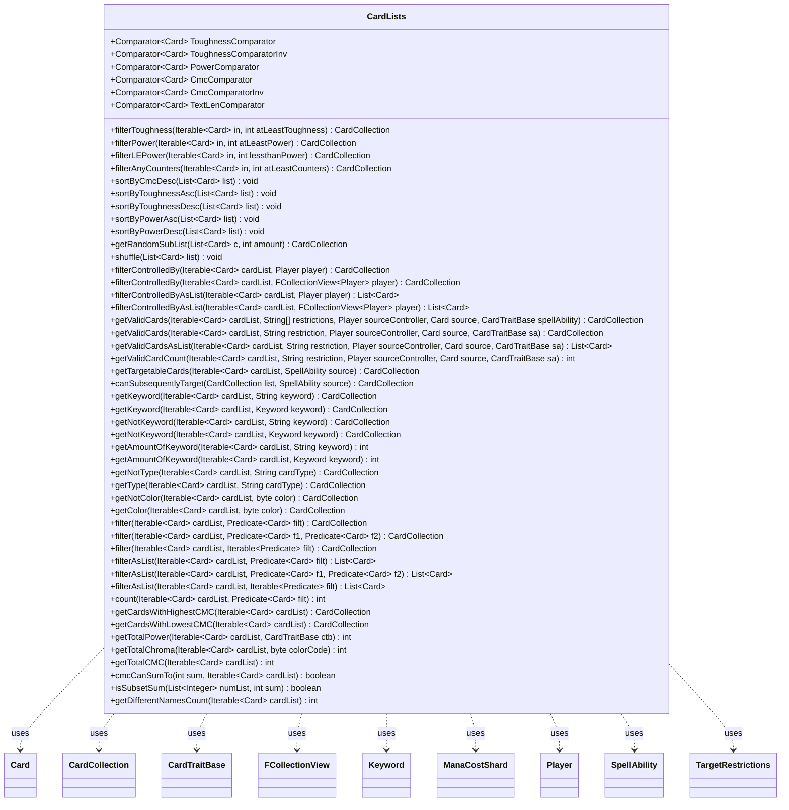

---
aliases:
  - CardLists
tags:
  - java/class
  - module/forge-game
  - pkg/forge/game/card
fqn: forge.game.card.CardLists
package: forge.game.card
module: forge-game
kind: Class
---

# CardLists

**Package:** `forge.game.card` &nbsp; **Module:** `forge-game` &nbsp; **Kind:** Class



## Relationships
**Uses:**
- [[forge.card.mana.ManaCostShard|ManaCostShard]]
- [[forge.game.CardTraitBase|CardTraitBase]]
- [[forge.game.card.Card|Card]]
- [[forge.game.card.CardCollection|CardCollection]]
- [[forge.game.keyword.Keyword|Keyword]]
- [[forge.game.player.Player|Player]]
- [[forge.game.spellability.SpellAbility|SpellAbility]]
- [[forge.game.spellability.TargetRestrictions|TargetRestrictions]]
- [[forge.util.collect.FCollectionView|FCollectionView]]

## Design Description

CardLists is a stateless utility class providing static helpers for querying, filtering, sorting, and aggregating collections of `Card` objects. It centralizes the common list operations the game engine needs—filtering by power/toughness, controller, color, type, keyword, or game-rule validity; ranking via reusable `Comparator<Card>` constants; computing aggregates such as total power, CMC, and chroma; and answering combinatorial questions like subset-sum over mana values.

Rather than subclassing any collection type, it operates on `Iterable<Card>` inputs and typically returns `CardCollection` (or plain `List<Card>` variants for cases needing duplicates), delegating predicate construction to `CardPredicates` and collaborating with engine types like `Player`, `SpellAbility`, `CardTraitBase`, `Keyword`, and `TargetRestrictions`. The design intent is a single, reusable filtering vocabulary—built atop generic `Predicate<Card>` composition—so callers across the engine express card selection declaratively instead of hand-writing loops.

## Source
`forge-game/src/main/java/forge/game/card/CardLists.java`

```java
/*
 * Forge: Play Magic: the Gathering.
 * Copyright (C) 2011  Forge Team
 *
 * This program is free software: you can redistribute it and/or modify
 * it under the terms of the GNU General Public License as published by
 * the Free Software Foundation, either version 3 of the License, or
 * (at your option) any later version.
 * 
 * This program is distributed in the hope that it will be useful,
 * but WITHOUT ANY WARRANTY; without even the implied warranty of
 * MERCHANTABILITY or FITNESS FOR A PARTICULAR PURPOSE.  See the
 * GNU General Public License for more details.
 * 
 * You should have received a copy of the GNU General Public License
 * along with this program.  If not, see <http://www.gnu.org/licenses/>.
 */
package forge.game.card;

import com.google.common.collect.Lists;
import forge.card.mana.ManaCostShard;
import forge.game.CardTraitBase;
import forge.game.keyword.Keyword;
import forge.game.player.Player;
import forge.game.spellability.SpellAbility;
import forge.game.spellability.TargetRestrictions;
import forge.game.staticability.StaticAbilityTapPowerValue;
import forge.util.IterableUtil;
import forge.util.MyRandom;
import forge.util.StreamUtil;
import forge.util.collect.FCollectionView;

import java.util.ArrayList;
import java.util.Collections;
import java.util.Comparator;
import java.util.List;
import java.util.Map;
import java.util.function.Predicate;
import java.util.stream.Collector;
import java.util.stream.Collectors;

/**
 * <p>
 * CardListUtil class.
 * </p>
 * 
 * @author Forge
 * @version $Id$
 */
public class CardLists {
    /**
     * <p>
     * filterToughness.
     * </p>
     *
     * @param atLeastToughness
     *            a int.
     * @return a CardCollection
     */
    public static CardCollection filterToughness(final Iterable<Card> in, final int atLeastToughness) {
        return CardLists.filter(in, c -> c.getNetToughness() <= atLeastToughness);
    }

    public static CardCollection filterPower(final Iterable<Card> in, final int atLeastPower) {
        return CardLists.filter(in, c -> c.getNetPower() >= atLeastPower);
    }

    public static CardCollection filterLEPower(final Iterable<Card> in, final int lessthanPower) {
        return CardLists.filter(in, c -> c.getNetPower() <= lessthanPower);
    }

    public static CardCollection filterAnyCounters(final Iterable<Card> in, final int atLeastCounters) {
        return CardLists.filter(in, c -> c.getNumAllCounters() >= atLeastCounters);
    }

    public static final Comparator<Card> ToughnessComparator = Comparator.comparingInt(Card::getNetToughness);
    public static final Comparator<Card> ToughnessComparatorInv = Comparator.comparingInt(Card::getNetToughness).reversed();
    public static final Comparator<Card> PowerComparator = Comparator.comparingInt(Card::getNetCombatDamage);
    public static final Comparator<Card> CmcComparator = Comparator.comparingInt(Card::getCMC);
    public static final Comparator<Card> CmcComparatorInv = Comparator.<Card>comparingInt(Card::getCMC).reversed();

    public static final Comparator<Card> TextLenComparator = Comparator.comparingInt(a -> a.getView().getText().length());

    /**
     * <p>
     * Sorts a CardCollection from highest converted mana cost to lowest.
     * </p>
     * 
     * @param list
     */
    public static void sortByCmcDesc(final List<Card> list) {
        list.sort(CmcComparatorInv);
    }

    /**
     * <p>
     * sortByToughnessAsc
     * </p>
     * 
     * @param list
     */
    public static void sortByToughnessAsc(final List<Card> list) {
        list.sort(ToughnessComparator);
    }

    /**
     * <p>
     * sortByToughnessDesc
     * </p>
     * 
     * @param list
     */
    public static void sortByToughnessDesc(final List<Card> list) {
        list.sort(ToughnessComparatorInv);
    }

    /**
     * <p>
     * sortAttackLowFirst.
     * </p>
     * 
     * @param list
     */
    public static void sortByPowerAsc(final List<Card> list) {
        list.sort(PowerComparator);
    }

    // the higher the attack the better
    /**
     * <p>
     * sortAttack.
     * </p>
     * 
     * @param list
     */
    public static void sortByPowerDesc(final List<Card> list) {
        list.sort(Collections.reverseOrder(PowerComparator));
    }

    /**
     * 
     * Given a CardCollection c, return a CardCollection that contains a random amount of cards from c.
     * 
     * @param c
     *            CardList
     * @param amount
     *            int
     * @return CardList
     */
    public static CardCollection getRandomSubList(final List<Card> c, final int amount) {
        if (c.size() < amount) {
            return null;
        }

        final CardCollection cs = new CardCollection(c);
        final CardCollection subList = new CardCollection();
        while (subList.size() < amount) {
            CardLists.shuffle(cs);
            subList.add(cs.remove(0));
        }
        return subList;
    }

    public static void shuffle(List<Card> list) {
        Collections.shuffle(list, MyRandom.getRandom());
    }

    public static CardCollection filterControlledBy(Iterable<Card> cardList, Player player) {
        return CardLists.filter(cardList, CardPredicates.isController(player));
    }

    public static CardCollection filterControlledBy(Iterable<Card> cardList, FCollectionView<Player> player) {
        return CardLists.filter(cardList, CardPredicates.isControlledByAnyOf(player));
    }

    public static List<Card> filterControlledByAsList(Iterable<Card> cardList, Player player) {
        return CardLists.filterAsList(cardList, CardPredicates.isController(player));
    }

    public static List<Card> filterControlledByAsList(Iterable<Card> cardList, FCollectionView<Player> player) {
        return CardLists.filterAsList(cardList, CardPredicates.isControlledByAnyOf(player));
    }

    public static CardCollection getValidCards(Iterable<Card> cardList, String[] restrictions, Player sourceController, Card source, CardTraitBase spellAbility) {
        return CardLists.filter(cardList, CardPredicates.restriction(restrictions, sourceController, source, spellAbility));
    }

    public static CardCollection getValidCards(Iterable<Card> cardList, String restriction, Player sourceController, Card source, CardTraitBase sa) {
        return CardLists.filter(cardList, CardPredicates.restriction(restriction.split(","), sourceController, source, sa));
    }

    public static List<Card> getValidCardsAsList(Iterable<Card> cardList, String restriction, Player sourceController, Card source, CardTraitBase sa) {
        return CardLists.filterAsList(cardList, CardPredicates.restriction(restriction.split(","), sourceController, source, sa));
    }

    public static int getValidCardCount(Iterable<Card> cardList, String restriction, Player sourceController, Card source, CardTraitBase sa) {
        return CardLists.count(cardList, CardPredicates.restriction(restriction.split(","), sourceController, source, sa));
    }

    public static CardCollection getTargetableCards(Iterable<Card> cardList, SpellAbility source) {
        final CardCollection result = CardLists.filter(cardList, CardPredicates.isTargetableBy(source));
        // Filter more cards that can only be detected along with other candidates
        if (source.getTargets().isEmpty() && source.usesTargeting() && source.getMinTargets() >= 2) {
            CardCollection removeList = new CardCollection();
            TargetRestrictions tr = source.getTargetRestrictions();
            for (final Card card : result) {
                if (tr.isSameController()) {
                    boolean found = false;
                    for (final Card card2 : result) {
                        if (card != card2 && card.getController() == card2.getController()) {
                            found = true;
                            break;
                        }
                    }
                    if (!found) {
                        removeList.add(card);
                    }
                }

                if (tr.isWithoutSameCreatureType()) {
                    boolean found = false;
                    for (final Card card2 : result) {
                        if (card != card2 && !card.sharesCreatureTypeWith(card2)) {
                            found = true;
                            break;
                        }
                    }
                    if (!found) {
                        removeList.add(card);
                    }
                }

                if (tr.isWithSameCreatureType()) {
                    boolean found = false;
                    for (final Card card2 : result) {
                        if (card != card2 && card.sharesCreatureTypeWith(card2)) {
                            found = true;
                            break;
                        }
                    }
                    if (!found) {
                        removeList.add(card);
                    }
                }

                if (tr.isWithSameCardType()) {
                    boolean found = false;
                    for (final Card card2 : result) {
                        if (card != card2 && card.sharesCardTypeWith(card2)) {
                            found = true;
                            break;
                        }
                    }
                    if (!found) {
                        removeList.add(card);
                    }
                }
            }
            result.removeAll(removeList);
        }
        return result;
    }

    public static CardCollection canSubsequentlyTarget(CardCollection list, SpellAbility source) {
        if (source.getTargets().isEmpty()) {
            return list;
        }

        return CardLists.filter(list, source::canTarget);
    }

    public static CardCollection getKeyword(Iterable<Card> cardList, final String keyword) {
        return CardLists.filter(cardList, CardPredicates.hasKeyword(keyword));
    }

    public static CardCollection getKeyword(Iterable<Card> cardList, final Keyword keyword) {
        return CardLists.filter(cardList, CardPredicates.hasKeyword(keyword));
    }

    public static CardCollection getNotKeyword(Iterable<Card> cardList, String keyword) {
        return CardLists.filter(cardList, CardPredicates.hasKeyword(keyword).negate());
    }

    public static CardCollection getNotKeyword(Iterable<Card> cardList, final Keyword keyword) {
        return CardLists.filter(cardList, CardPredicates.hasKeyword(keyword).negate());
    }

    public static int getAmountOfKeyword(final Iterable<Card> cardList, final String keyword) {
        int nKeyword = 0;
        for (final Card c : cardList) {
            nKeyword += c.getAmountOfKeyword(keyword);
        }
        return nKeyword;
    }
    public static int getAmountOfKeyword(final Iterable<Card> cardList, final Keyword keyword) {
        int nKeyword = 0;
        for (final Card c : cardList) {
            nKeyword += c.getAmountOfKeyword(keyword);
        }
        return nKeyword;
    }
    // cardType is like "Land" or "Goblin", returns a new CardCollection that is a
    // subset of current CardList
    public static CardCollection getNotType(Iterable<Card> cardList, String cardType) {
        return CardLists.filter(cardList, CardPredicates.isType(cardType).negate());
    }

    public static CardCollection getType(Iterable<Card> cardList, String cardType) {
        return CardLists.filter(cardList, CardPredicates.isType(cardType));
    }

    public static CardCollection getNotColor(Iterable<Card> cardList, byte color) {
        return CardLists.filter(cardList, CardPredicates.isColor(color).negate());
    }

    public static CardCollection getColor(Iterable<Card> cardList, byte color) {
        return CardLists.filter(cardList, CardPredicates.isColor(color));
    }

    /**
     * Create a new list of cards by applying a filter to this one.
     * 
     * @param filt
     *            determines which cards are present in the resulting list
     * 
     * @return a subset of this CardCollection whose items meet the filtering
     *         criteria; may be empty, but never null.
     */
    public static CardCollection filter(Iterable<Card> cardList, Predicate<Card> filt) {
        return new CardCollection(IterableUtil.filter(cardList, filt));
    }

    public static CardCollection filter(Iterable<Card> cardList, Predicate<Card> f1, Predicate<Card> f2) {
        return new CardCollection(IterableUtil.filter(cardList, f1.and(f2)));
    }

    public static CardCollection filter(Iterable<Card> cardList, Iterable<Predicate<Card>> filt) {
        return new CardCollection(IterableUtil.filter(cardList, IterableUtil.and(filt)));
    }

    /**
     * Create a new list of cards by applying a filter to this one.
     * (this version of filter returns an ArrayList which may contain duplicate elements, used
     * by methods that count spells cast this turn/last turn through their card object representations)
     * 
     * @param filt
     *            determines which cards are present in the resulting list
     * 
     * @return an ArrayList subset of this CardCollection whose items meet the filtering
     *         criteria; may be empty, but never null.
     */
    public static List<Card> filterAsList(Iterable<Card> cardList, Predicate<Card> filt) {
        return Lists.newArrayList(IterableUtil.filter(cardList, filt));
    }

    public static List<Card> filterAsList(Iterable<Card> cardList, Predicate<Card> f1, Predicate<Card> f2) {
        return Lists.newArrayList(IterableUtil.filter(cardList, f1.and(f2)));
    }

    public static List<Card> filterAsList(Iterable<Card> cardList, Iterable<Predicate<Card>> filt) {
        return Lists.newArrayList(IterableUtil.filter(cardList, IterableUtil.and(filt)));
    }

    public static int count(Iterable<Card> cardList, Predicate<Card> filt) {
        if (cardList == null) { return 0; }

        int count = 0;
        for (Card c : cardList) {
            if (filt.test(c)) {
                count++;
            }
        }
        return count;
    }

    /**
     * Given a CardCollection cardList, return a CardCollection that are tied for having the highest CMC.
     * 
     * @param cardList          the Card List to be filtered.
     * @return the list of Cards sharing the highest CMC.
     */
    public static CardCollection getCardsWithHighestCMC(Iterable<Card> cardList) {
        final CardCollection tiedForHighest = new CardCollection();
        int highest = 0;
        for (final Card crd : cardList) {
            // do not check for Split Card anymore
            int curCmc = crd.getCMC();

            if (curCmc > highest) {
                highest = curCmc;
                tiedForHighest.clear();
            }
            if (curCmc >= highest) {
                tiedForHighest.add(crd);
            }
        }
        return tiedForHighest;
    }

    /**
     * Given a CardCollection cardList, return a CardCollection that are tied for having the lowest CMC.
     * 
     * @param cardList          the Card List to be filtered.
     * @return the list of Cards sharing the lowest CMC.
     */
    public static CardCollection getCardsWithLowestCMC(Iterable<Card> cardList) {
        final CardCollection tiedForLowest = new CardCollection();
        int lowest = 25;
        for (final Card crd : cardList) {
            // do not check for Split Card anymore
            int curCmc = crd.getCMC();

            if (curCmc < lowest) {
                lowest = curCmc;
                tiedForLowest.clear();
            }
            if (curCmc <= lowest) {
                tiedForLowest.add(crd);
            }
        }
        return tiedForLowest;
    }

    /**
     * Given a list of cards, return their combined power
     * 
     * @param cardList the list of creature cards for which to sum the power
     */
    public static int getTotalPower(Iterable<Card> cardList, CardTraitBase ctb) {
        int total = 0;
        for (final Card crd : cardList) {
            if (StaticAbilityTapPowerValue.withToughness(crd, ctb)) {
                total += Math.max(0, crd.getNetToughness());
            } else {
                int m = StaticAbilityTapPowerValue.getMod(crd, ctb);
                total += Math.max(0, crd.getNetPower() + m);
            }
        }
        return total;
    }

    public static int getTotalChroma(Iterable<Card> cardList, byte colorCode) {
        int colorOcurrencices = 0;
        for (Card c0 : cardList) {
            for (ManaCostShard sh : c0.getManaCost()) {
                if (sh.isColor(colorCode))
                    colorOcurrencices++;
            }
        }
        return colorOcurrencices;
    }

    /**
     * Given a list of cards, return their combined mana value
     *
     * @param cardList the list of cards for which to sum the mana value
     */
    public static int getTotalCMC(Iterable<Card> cardList) {
        int total = 0;
        for (final Card crd : cardList) {
            total += Math.max(0, crd.getCMC());
        }
        return total;
    }

    public static boolean cmcCanSumTo(int sum, Iterable<Card> cardList) {
        List<Integer> numList = Lists.newArrayList();
        for (final Card c : cardList) {
            int num = c.getCMC();
            if (num == sum) return true;
            else if (num < sum) numList.add(num);
        }
        if (numList.isEmpty()) return false;
        numList.sort(null);

        return isSubsetSum(numList, sum);
    }

    public static boolean isSubsetSum(List<Integer> numList, int sum) {
        if (sum == 0) return true;
        int size = numList.size();
        if (size == 0) return false;

        Integer last = numList.get(size - 1);
        numList.remove(last);
        // If last element is greater than sum, then ignore it
        if (last > sum) {
            return isSubsetSum(numList, sum);
        }

        // Else, check if sum can be obtained by:
        // (a) excluding the last element
        // (b) including the last element
        return isSubsetSum(numList, sum) || isSubsetSum(numList, sum - last);
    }

    public static int getDifferentNamesCount(Iterable<Card> cardList) {
        // first part the ones with SpyKit, and already collect them via
        Map<Boolean, List<Card>> parted = StreamUtil.stream(cardList).collect(Collectors
                .partitioningBy(Card::hasNonLegendaryCreatureNames, Collector.of(ArrayList::new, (list, c) -> {
                    if (!c.hasNoName() && list.stream().noneMatch(c2 -> c.sharesNameWith(c2))) {
                        list.add(c);
                    }
                }, (l1, l2) -> {
                    l1.addAll(l2);
                    return l1;
                })));
        List<Card> preList = parted.get(Boolean.FALSE);

        // then try to apply the SpyKit ones
        for (Card c : parted.get(Boolean.TRUE)) {
            if (preList.stream().noneMatch(c2 -> c.sharesNameWith(c2))) {
                preList.add(c);
            }
        }
        return preList.size();
    }
}
```
