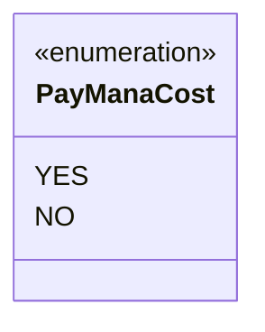

---
aliases:
  - PayManaCost
tags:
  - java/enum
  - module/forge-game
  - pkg/forge/game/card
fqn: forge.game.card.CardPlayOption.PayManaCost
package: forge.game.card
module: forge-game
kind: Enum
---

# PayManaCost

**Package:** `forge.game.card`   **Module:** `forge-game`   **Kind:** Enum



## Design Description

The `CardPlayOption.PayManaCost` enum is a small, nested type within `CardPlayOption` that models a binary decision about whether a card's mana cost is required when it is played under a given option. Its two constants, `YES` and `NO`, encode the two mutually exclusive states, replacing a raw boolean with a self-documenting, type-safe alternative whose Javadoc clarifies the intent of each value.

As a member enum scoped to `CardPlayOption`, it serves purely as a configuration flag for its enclosing class, which uses it to distinguish play options that demand mana payment from those that waive it. The design favors readability and explicitness at call sites: passing `PayManaCost.YES` or `PayManaCost.NO` communicates intent far more clearly than a positional boolean, and the closed enumeration leaves room to extend the set of payment modes if future play rules require it.

## Source
`forge-game/src/main/java/forge/game/card/CardPlayOption.java` — declaration excerpt

```java
    public enum PayManaCost {
        /** Indicates the mana cost must be paid. */
        YES,
        /** Indicates the mana cost may not be paid. */
        NO
    }
```

## Python
`forge/game/card/CardPlayOption/PayManaCost.py`

```python
from forge.game.card.CardPlayOption import CardPlayOption
from enum import Enum


class PayManaCost(Enum):
    """Indicates whether the mana cost must be paid for a card play option."""

    # Indicates the mana cost must be paid.
    YES = "YES"
    # Indicates the mana cost may not be paid.
    NO = "NO"
```
