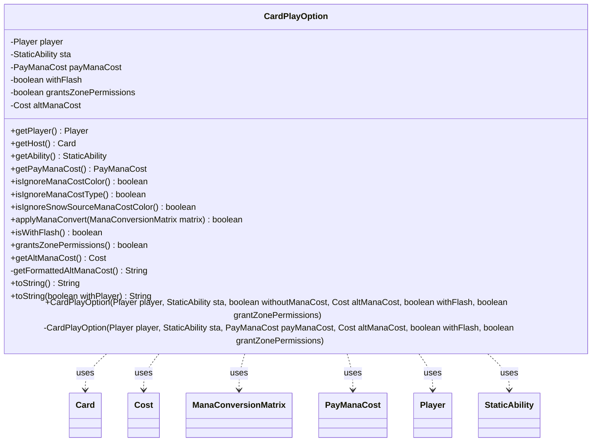

---
aliases:
  - CardPlayOption
tags:
  - java/class
  - module/forge-game
  - pkg/forge/game/card
fqn: forge.game.card.CardPlayOption
package: forge.game.card
module: forge-game
kind: Class
---

# CardPlayOption

**Package:** `forge.game.card` &nbsp; **Module:** `forge-game` &nbsp; **Kind:** Class



## Relationships
**Uses:**
- [[forge.game.card.Card|Card]]
- [[forge.game.card.CardPlayOption.PayManaCost|PayManaCost]]
- [[forge.game.cost.Cost|Cost]]
- [[forge.game.mana.ManaConversionMatrix|ManaConversionMatrix]]
- [[forge.game.player.Player|Player]]
- [[forge.game.staticability.StaticAbility|StaticAbility]]

## Design Description

CardPlayOption is an immutable, final value object in the `forge.game.card` package that captures a single permission for a player to play a particular card under non-standard conditions—typically granted by a "may play" StaticAbility. It records who may play (Player), the granting ability (StaticAbility), whether the normal mana cost must be paid (the PayManaCost enum), an optional alternative Cost, and flags for granting flash timing and zone-access permissions.

Acting as a lightweight collaborator rather than part of any inheritance hierarchy, it derives semantics on demand from its StaticAbility—resolving the host Card via `getHost()` and inspecting parameters such as `MayPlayIgnoreColor`/`MayPlayIgnoreType` to drive mana-cost relaxations, including mutating a ManaConversionMatrix in `applyManaConvert`. The dual constructors translate a boolean "without mana cost" into the clearer PayManaCost enum, and the `toString` methods build human-readable descriptions of the play option, reflecting an intent to keep play-permission logic centralized and self-describing.

## Source
`forge-game/src/main/java/forge/game/card/CardPlayOption.java`

```java
package forge.game.card;

import forge.card.MagicColor;
import forge.game.ability.AbilityUtils;
import forge.game.cost.Cost;
import forge.game.mana.ManaConversionMatrix;
import forge.game.player.Player;
import forge.game.staticability.StaticAbility;
import org.apache.commons.lang3.StringUtils;

public final class CardPlayOption {
    public enum PayManaCost {
        /** Indicates the mana cost must be paid. */
        YES,
        /** Indicates the mana cost may not be paid. */
        NO
    }

    private final Player player;
    private final StaticAbility sta;
    private final PayManaCost payManaCost;
    private final boolean withFlash;
    private final boolean grantsZonePermissions;
    private final Cost altManaCost;

    public CardPlayOption(final Player player, final StaticAbility sta, final boolean withoutManaCost, final Cost altManaCost, final boolean withFlash, final boolean grantZonePermissions) {
        this(player, sta, withoutManaCost ? PayManaCost.NO : PayManaCost.YES, altManaCost, withFlash, grantZonePermissions);
    }
    private CardPlayOption(final Player player, final StaticAbility sta, final PayManaCost payManaCost, final Cost altManaCost, final boolean withFlash,
                           final boolean grantZonePermissions) {
        this.player = player;
        this.sta = sta;
        this.payManaCost = payManaCost;
        this.withFlash = withFlash;
        this.grantsZonePermissions = grantZonePermissions;
        this.altManaCost = altManaCost;
    }


    public Player getPlayer() {
        return player;
    }

    public Card getHost() {
        return sta.getHostCard();
    }

    public StaticAbility getAbility() {
        return sta;
    }

    public PayManaCost getPayManaCost() {
        return payManaCost;
    }

    public boolean isIgnoreManaCostColor() {
        return sta.hasParam("MayPlayIgnoreColor");
    }

    public boolean isIgnoreManaCostType() {
        return sta.hasParam("MayPlayIgnoreType");
    }

    public boolean isIgnoreSnowSourceManaCostColor() {
        return sta.hasParam("MayPlaySnowIgnoreColor");
    }

    public boolean applyManaConvert(ManaConversionMatrix matrix) {
        if (isIgnoreManaCostType()) {
            AbilityUtils.applyManaColorConversion(matrix, MagicColor.Constant.ANY_TYPE_CONVERSION);
            return true;
        } else if (isIgnoreManaCostColor()) {
            AbilityUtils.applyManaColorConversion(matrix, MagicColor.Constant.ANY_COLOR_CONVERSION);
            return true;
        }
        return false;
    }

    public boolean isWithFlash() {
    	return withFlash;
    }

    public boolean grantsZonePermissions() { return grantsZonePermissions; }

    public Cost getAltManaCost() { return altManaCost; }

    private String getFormattedAltManaCost() {
        return altManaCost.toSimpleString();
    }

    @Override
    public String toString() {
        return toString(true);
    }

    public String toString(final boolean withPlayer) {
        StringBuilder sb = new StringBuilder(withPlayer ? this.player.toString() : StringUtils.EMPTY);

        switch (getPayManaCost()) {
            case YES:
                if (altManaCost != null) {
                    String insteadCost = getFormattedAltManaCost();
                    insteadCost = insteadCost.replace("Pay ","");
                    sb.append(" (by paying ").append(insteadCost).append(" instead of paying its mana cost");
                    if (isWithFlash()) {
                        sb.append(" and as though it has flash");
                    }
                    sb.append(")");
                }
                if (isIgnoreManaCostType()) {
                    sb.append(" (may spend mana as though it were mana of any type to cast it)");
                } else if (isIgnoreManaCostColor()) {
                    sb.append(" (may spend mana as though it were mana of any color to cast it)");
                }
                if (sta.hasParam("RaiseCost")) {
                    String desc = sta.getParam("Description");
                    sb.append(" (").append(desc, desc.indexOf("by ") + desc.indexOf("pay "), desc.indexOf(".")).append(")");
                }
                break;
            case NO:
                sb.append(" (without paying its mana cost");
                if (isWithFlash()) {
                    sb.append(" and as though it has flash");
                }
                sb.append(")");
        }

        return sb.toString();
    }

}
```
