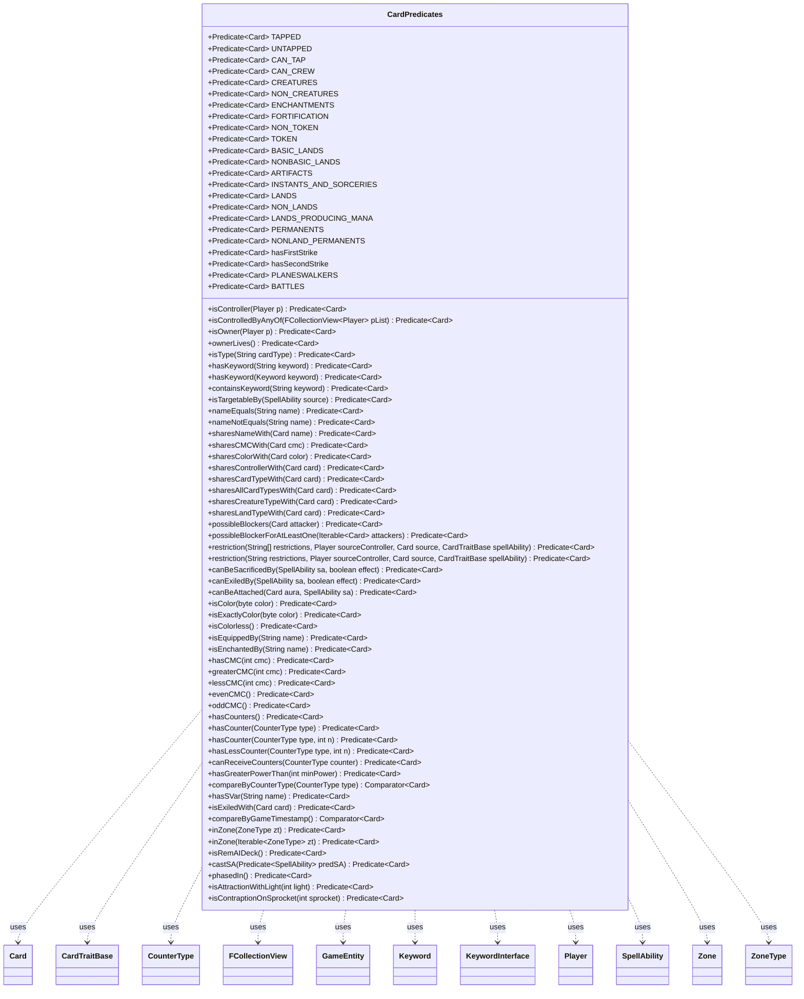

---
aliases:
  - CardPredicates
tags:
  - java/class
  - module/forge-game
  - pkg/forge/game/card
fqn: forge.game.card.CardPredicates
package: forge.game.card
module: forge-game
kind: Class
---

# CardPredicates

**Package:** `forge.game.card` &nbsp; **Module:** `forge-game` &nbsp; **Kind:** Class



## Relationships
**Uses:**
- [[forge.game.CardTraitBase|CardTraitBase]]
- [[forge.game.GameEntity|GameEntity]]
- [[forge.game.card.Card|Card]]
- [[forge.game.card.CounterType|CounterType]]
- [[forge.game.keyword.Keyword|Keyword]]
- [[forge.game.keyword.KeywordInterface|KeywordInterface]]
- [[forge.game.player.Player|Player]]
- [[forge.game.spellability.SpellAbility|SpellAbility]]
- [[forge.game.zone.Zone|Zone]]
- [[forge.game.zone.ZoneType|ZoneType]]
- [[forge.util.collect.FCollectionView|FCollectionView]]

## Design Description

CardPredicates is a final utility class that serves as a centralized factory for `Predicate<Card>` (and a few `Comparator<Card>`) instances used to filter and sort collections of cards throughout the game engine. It exposes a large set of stateless predicates, both as reusable constants for fixed conditions (TAPPED, CREATURES, LANDS, PLANESWALKERS) and as static factory methods that close over parameters to build dynamic tests (isController, isType, hasCounter, inZone, sharesColorWith).

By delegating each test to methods on `Card` and collaborators such as `Player`, `CounterType`, `SpellAbility`, `ZoneType`, and `CombatUtil`, the class keeps query logic concise and composable while leaving domain behavior in the model types. Its private-by-convention design — a `final` class of only static members returning lambdas and method references — reflects the intent to provide a side-effect-free, declarative vocabulary for card queries that integrates cleanly with Java's functional `Predicate`/`Comparator` APIs and Forge's `FCollectionView` collections.

## Source
`forge-game/src/main/java/forge/game/card/CardPredicates.java`

```java
/*
 * Forge: Play Magic: the Gathering.
 * Copyright (C) 2011  Forge Team
 *
 * This program is free software: you can redistribute it and/or modify
 * it under the terms of the GNU General Public License as published by
 * the Free Software Foundation, either version 3 of the License, or
 * (at your option) any later version.
 *
 * This program is distributed in the hope that it will be useful,
 * but WITHOUT ANY WARRANTY; without even the implied warranty of
 * MERCHANTABILITY or FITNESS FOR A PARTICULAR PURPOSE.  See the
 * GNU General Public License for more details.
 *
 * You should have received a copy of the GNU General Public License
 * along with this program.  If not, see <http://www.gnu.org/licenses/>.
 */
package forge.game.card;

import forge.game.CardTraitBase;
import forge.game.GameEntity;
import forge.game.combat.CombatUtil;
import forge.game.keyword.Keyword;
import forge.game.keyword.KeywordInterface;
import forge.game.player.Player;
import forge.game.spellability.SpellAbility;
import forge.game.zone.Zone;
import forge.game.zone.ZoneType;
import forge.util.IterableUtil;
import forge.util.PredicateString;
import forge.util.collect.FCollectionView;

import java.util.Comparator;
import java.util.function.Predicate;


/**
 * <p>
 * Predicate<Card> interface.
 * </p>
 *
 * @author Forge
 * @version $Id$
 */
public final class CardPredicates {

    public static Predicate<Card> isController(final Player p) {
        return c -> c.getController().equals(p);
    }
    public static Predicate<Card> isControlledByAnyOf(final FCollectionView<Player> pList) {
        return c -> pList.contains(c.getController());
    }
    public static Predicate<Card> isOwner(final Player p) {
        return c -> p.equals(c.getOwner());
    }

    public static Predicate<Card> ownerLives() {
        return c -> c.getOwner().isInGame();
    }

    public static Predicate<Card> isType(final String cardType) {
        return c -> c.getType().hasStringType(cardType);
    }

    public static Predicate<Card> hasKeyword(final String keyword) {
        return c -> c.hasKeyword(keyword);
    }

    public static Predicate<Card> hasKeyword(final Keyword keyword) {
        return c -> c.hasKeyword(keyword);
    }

    public static Predicate<Card> containsKeyword(final String keyword) {
        return c -> {
            if (IterableUtil.any(c.getHiddenExtrinsicKeywords(), PredicateString.contains(keyword))) {
                return true;
            }

            for (KeywordInterface k : c.getKeywords()) {
                if (k.getOriginal().contains(keyword)) {
                    return true;
                }
            }
            return false;
        };
    }

    public static Predicate<Card> isTargetableBy(final SpellAbility source) {
        return source::canTarget;
    }

    public static Predicate<Card> nameEquals(final String name) {
        return c -> c.getName().equals(name);
    }
    public static Predicate<Card> nameNotEquals(final String name) {
        return c -> !c.getName().equals(name);
    }

    public static Predicate<Card> sharesNameWith(final Card name) {
        return c -> c.sharesNameWith(name);
    }

    public static Predicate<Card> sharesCMCWith(final Card cmc) {
        return c -> c.sharesCMCWith(cmc);
    }

    public static Predicate<Card> sharesColorWith(final Card color) {
        return c -> c.sharesColorWith(color);
    }

    public static Predicate<Card> sharesControllerWith(final Card card) {
        return c -> c.sharesControllerWith(card);
    }

    public static Predicate<Card> sharesCardTypeWith(final Card card) {
        return c -> c.sharesCardTypeWith(card);
    }

    public static Predicate<Card> sharesAllCardTypesWith(final Card card) {
        return c -> c.sharesAllCardTypesWith(card);
    }

    public static Predicate<Card> sharesCreatureTypeWith(final Card card) {
        return c -> c.sharesCreatureTypeWith(card);
    }

    public static Predicate<Card> sharesLandTypeWith(final Card card) {
        return c -> c.sharesLandTypeWith(card);
    }

    public static Predicate<Card> possibleBlockers(final Card attacker) {
        return c -> CombatUtil.canBlock(attacker, c);
    }

    public static Predicate<Card> possibleBlockerForAtLeastOne(final Iterable<Card> attackers) {
        return c -> c.isCreature() && CombatUtil.canBlockAtLeastOne(c, attackers);
    }

    public static Predicate<Card> restriction(final String[] restrictions, final Player sourceController, final Card source, final CardTraitBase spellAbility) {
        return c -> c != null && c.isValid(restrictions, sourceController, source, spellAbility);
    }

    public static Predicate<Card> restriction(final String restrictions, final Player sourceController, final Card source, final CardTraitBase spellAbility) {
        return c -> c != null && c.isValid(restrictions, sourceController, source, spellAbility);
    }

    public static Predicate<Card> canBeSacrificedBy(final SpellAbility sa, final boolean effect) {
        return c -> c.canBeSacrificedBy(sa, effect);
    }

    public static Predicate<Card> canExiledBy(final SpellAbility sa, final boolean effect) {
        return c -> c.canExiledBy(sa, effect);
    }

    public static Predicate<Card> canBeAttached(final Card aura, final SpellAbility sa) {
        return c -> c.canBeAttached(aura, sa);
    }

    public static Predicate<Card> isColor(final byte color) {
        return c -> c.getColor().hasAnyColor(color);
    } // getColor()

    public static Predicate<Card> isExactlyColor(final byte color) {
        return c -> c.getColor().hasExactlyColor(color);
    }

    public static Predicate<Card> isColorless() {
        return c -> c.getColor().isColorless();
    }

    public static Predicate<Card> isEquippedBy(final String name) {
        return c -> c.isEquippedBy(name);
    }

    public static Predicate<Card> isEnchantedBy(final String name) {
        return c -> c.isEnchantedBy(name);
    }

    public static Predicate<Card> hasCMC(final int cmc) {
        return c -> c.sharesCMCWith(cmc);
    }

    public static Predicate<Card> greaterCMC(final int cmc) {
        return c -> {
            // do not check for Split card anymore
            return c.getCMC() >= cmc;
        };
    }

    public static Predicate<Card> lessCMC(final int cmc) {
        return c -> {
            // do not check for Split card anymore
            return c.getCMC() <= cmc;
        };
    }

    public static Predicate<Card> evenCMC() {
        return c -> c.getCMC() % 2 == 0;
    }

    public static Predicate<Card> oddCMC() {
        return c -> c.getCMC() % 2 == 1;
    }

    public static Predicate<Card> hasCounters() {
        return GameEntity::hasCounters;
    }

    public static Predicate<Card> hasCounter(final CounterType type) {
        return hasCounter(type, 1);
    }

    public static Predicate<Card> hasCounter(final CounterType type, final int n) {
        return c -> c.getCounters(type) >= n;
    }

    public static Predicate<Card> hasLessCounter(final CounterType type, final int n) {
        return c -> {
            int x = c.getCounters(type);
            return x > 0 && x <= n;
        };
    }

    public static Predicate<Card> canReceiveCounters(final CounterType counter) {
        return c -> c.canReceiveCounters(counter);
    }

    public static Predicate<Card> hasGreaterPowerThan(final int minPower) {
        return c -> c.getNetPower() > minPower;
    }

    public static Comparator<Card> compareByCounterType(final CounterType type) {
        return Comparator.comparingInt(arg0 -> arg0.getCounters(type));
    }

    public static Predicate<Card> hasSVar(final String name) {
        return c -> c.hasSVar(name);
    }

    public static Predicate<Card> isExiledWith(final Card card) {
        return c -> card.equals(c.getExiledWith());
    }

    public static Comparator<Card> compareByGameTimestamp() {
        return Comparator.comparingLong(Card::getGameTimestamp);
    }

    public static Predicate<Card> inZone(final ZoneType zt) {
        return c -> {
            Zone z = c.getLastKnownZone();
            return z != null && z.is(zt);
        };
    }

    public static Predicate<Card> inZone(final Iterable<ZoneType> zt) {
        return c -> {
            Zone z = c.getLastKnownZone();
            if (z != null) {
                for (ZoneType t : zt) {
                    if (z.is(t)) {
                        return true;
                    }
                }
            }
            return false;
        };
    }

    public static Predicate<Card> isRemAIDeck() {
        return c -> c.getRules() != null && c.getRules().getAiHints().getRemAIDecks();
    }

    public static Predicate<Card> castSA(final Predicate<SpellAbility> predSA) {
        return c -> {
            if (c.getCastSA() == null) {
                return false;
            }
            return predSA.test(c.getCastSA());
        };
    }

    public static Predicate<Card> phasedIn() {
        return c -> !c.isPhasedOut();
    }

    public static Predicate<Card> isAttractionWithLight(int light) {
        return c -> c.isAttraction() && c.getAttractionLights().contains(light);
    }

    public static Predicate<Card> isContraptionOnSprocket(int sprocket) {
        return c -> c.getSprocket() == sprocket && c.isContraption();
    }

    public static final Predicate<Card> TAPPED = Card::isTapped;
    public static final Predicate<Card> UNTAPPED = Card::isUntapped;
    public static final Predicate<Card> CAN_TAP = Card::canTap;
    public static final Predicate<Card> CAN_CREW = Card::canCrew;
    public static final Predicate<Card> CREATURES = Card::isCreature;
    public static final Predicate<Card> NON_CREATURES = c -> !c.isCreature();
    public static final Predicate<Card> ENCHANTMENTS = Card::isEnchantment;
    public static final Predicate<Card> FORTIFICATION = Card::isFortification;
    public static final Predicate<Card> NON_TOKEN = c -> !(c.isToken() || c.isTokenCard());
    public static final Predicate<Card> TOKEN = c -> c.isToken() || c.isTokenCard();
    public static final Predicate<Card> BASIC_LANDS = c -> {
        // the isBasicLand() check here may be sufficient...
        return c.isLand() && c.isBasicLand();
    };
    public static final Predicate<Card> NONBASIC_LANDS = c -> c.isLand() && !c.isBasicLand();

    public static final Predicate<Card> ARTIFACTS = Card::isArtifact;
    public static final Predicate<Card> INSTANTS_AND_SORCERIES = Card::isInstantOrSorcery;

    public static final Predicate<Card> LANDS = Card::isLand;
    public static final Predicate<Card> NON_LANDS = c -> !c.isLand();
    public static final Predicate<Card> LANDS_PRODUCING_MANA = c -> c.isBasicLand() || (c.isLand() && !c.getManaAbilities().isEmpty());
    public static final Predicate<Card> PERMANENTS = Card::isPermanent;
    public static final Predicate<Card> NONLAND_PERMANENTS = c -> c.isPermanent() && !c.isLand();
    public static final Predicate<Card> hasFirstStrike = c -> c.isCreature() && (c.hasFirstStrike() || c.hasDoubleStrike());
    public static final Predicate<Card> hasSecondStrike = c -> c.isCreature() && (!c.hasFirstStrike() || c.hasDoubleStrike());
    public static final Predicate<Card> PLANESWALKERS = Card::isPlaneswalker;
    public static final Predicate<Card> BATTLES = Card::isBattle;
}
```
